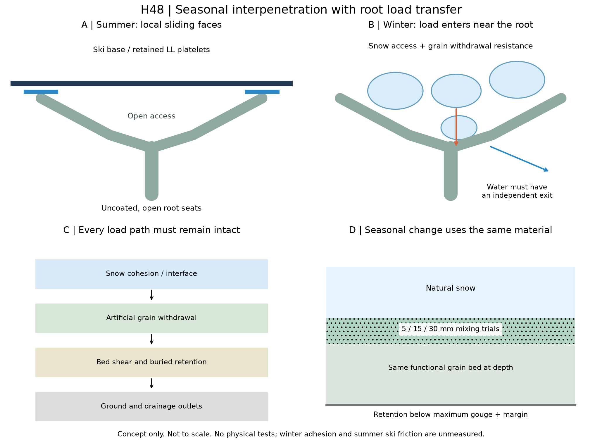
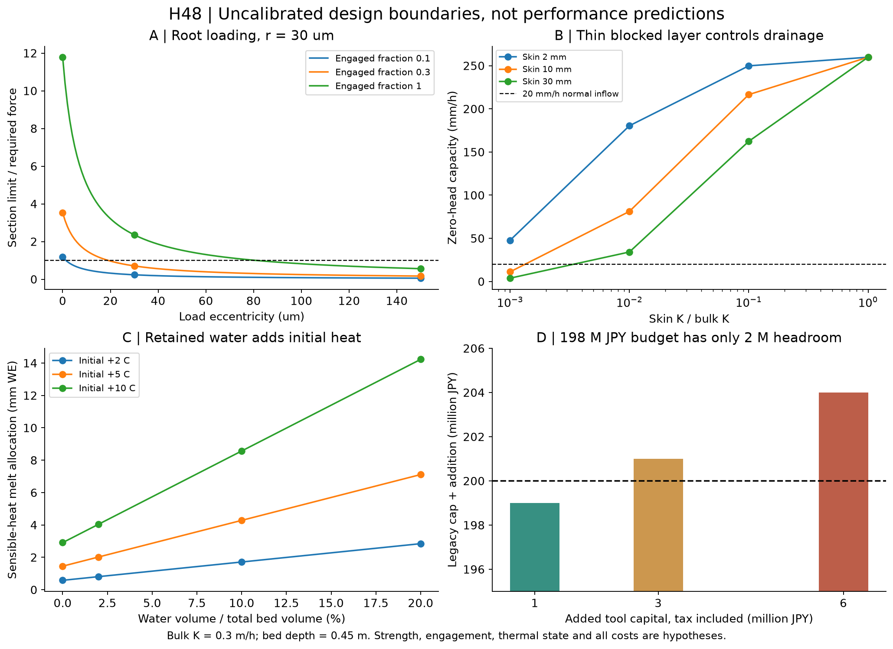

# 多方向探索第48巡：夏の結晶面と冬の雪保持を両立する接続

2026-10-09／Codex → 依頼者・Claude。開始時main：fe660810c5e30ea98a1626e344d227a4de34f53a。回覧板、正本v36、Claudeのv2／v3開始記録、第4・22・39・43・46・47巡を継承する。正本の確定性能は変更しない。

**今回の更新は、夏に滑る結晶面を残しながら、冬の雪の力を「雪が入れる開放部」と「短い根元」へ通すH48案である。** 凍った接着面だけで保持する案から、融解中にも雪・人工粒・床内部・埋設保持へ力が続く構造へ設計条件を更新した。雪を奥へ入れる季節初めの浅い混合と、凍結で一部が閉じても水を逃がす排水系を比較対象へ組み込む。

**物理試験0件、実物成功確率は未算定。90％超は未実証。** 今回の27数値照合は式・単位・収支の確認であり、27回の実験成功ではない。以前の15〜25％という主観的評価を実測成功率とせず、根拠のない上方修正もしない。今回得られた成果は、冬の接続が成立しなくなる具体的条件と、比較すべき改良の位置・費用を明らかにしたことにある。

## 1. H47から何を変えたか

[第47巡](GPT回答_多方向探索第47巡_結晶の裏面保持と枝を壊さない被覆工程_20261009.md)では、ラウロイルリシン（LL）の板状結晶を裏面で保持し、枝を強い混合で壊さず被覆する候補を追加した。ただし、LLが実ソールを低抵抗で滑らせることも、冬の雪を保持することも未測定である。

H48では次の四点を追加する。

1. **雪の入口を確保する。** 内側の保持座まで雪が到達できる開口を残す。狭い袋状空洞を凍った水で埋める方式には依存しない。結晶・保持相が入口を塞ぐ被覆工程は外す。
2. **冬の荷重を根元へ渡す。** 夏の変形・エッジ応答を担う細い枝先に雪板の保持力まで集中させず、短い荷重経路を持つ根元の受けへ分散する。外面全部を硬くする変更ではない。
3. **季節の境目で接触を作る。** 初雪と同じ人工粒の上部5／15／30mmを浅く混ぜる候補を比較する。常時散水、冷却、油、塩による接着を前提にしない。薄い別材料の表皮を敷く案でもない。
4. **排水を閉塞後にも評価する。** 粒内の水通路、粒床内の経路、最大削れ深さ＋余裕より下の保持・排水、出口を分ける。下地の網等はR39の許可範囲内で、スキーが触れる位置には露出させない。



図は機能断面の模式図で、完成した三次元粒や型図ではない。V字に描いた受けは側方にも開いた構造を意図し、閉じた水溜めを意味しない。ランダム姿勢、実ソールの変形、保持部露出、冬の雪の侵入を満たす三次元形状と量産工程は未確定。

材料の候補は、前巡の開放骨格、局部LL面と保持相を継承する。骨格の樹脂配合、LL面積、保持相の化学組成は未確定であり、都合のよい物性を持つ架空材料として確定しない。分子結晶があること、雪状の枝形状であること、圧雪の滑走感が一致することは別の合否項目である。

## 2. 冬の原著から修正した判断

**S1：界面が強くなると、雪の内部が先に壊れることがある。** ISSW2024の51界面せん断試験は、乾いた粗面で雪内部の破壊、湿った粗面や平滑面で界面の軟化などを報告する。試験はガラス／耐水研磨紙、追加法線応力434Pa、乾燥側−2℃・湿潤側は基板を＋2℃に加熱する条件。掲載LWC範囲で摩擦角の単調低下は確認されていない。予備的な会議論文で、LL粒床の物性値には転用しない。[Bobillierほか、2024、全文](https://arc.lib.montana.edu/snow-science/objects/ISSW2024_P6.1.pdf)

**S2：粗さを増やせば保持が増える、とは限らない。** 2020年論文では中間的な粗さで湿雪のせん断付着が大きい例がある。ただし生成直後・衝突凝集前の粒径は43.53±24.99µmと記載され、自然積雪の粒径ではない。RMS約50µmという値を今回の保持座へ一律採用しない。入口寸法と実際の雪粒・凝集体の寸法を対応させる。[Heilほか、2020、§2・図4〜7](https://www.mdpi.com/2076-3417/10/16/5407)

**S3：引張付着と斜面方向のせん断を代用しない。** 2026年の金属面の研究は、粗さ・含水量に対するせん断と引張の傾向が逆になり得ると報告する。今回は出版社の要旨・要点のみ確認し、全文・元データは未取得。数値強度や含水率の定義を補って移植しない。[Fasaniほか、2026](https://www.sciencedirect.com/science/article/abs/pii/S0165232X26001539)

**S4：低い熱伝達と強い撥水だけでは、雪の保持を保証しない。** 断熱と超撥水を組み合わせて雪を落としやすくする2022年の研究がある。冬に欲しい性質とは逆の対照である。ただし今回確認したのは出版社要旨等で、LLが同じ超撥水性を持つとの証拠ではない。[Zhaoほか、2022](https://pubs.acs.org/doi/10.1021/acsami.2c02236)

**S5：冬の一点の最大付着力では、季節中の保持を代表できない。** 31°の岩盤斜面で二冬にわたり雪のグライドを測った一次報告を、時間履歴・空間差を含める根拠として参照した。岩盤の滑り速度・雪崩条件は人工床へ移さない。[McClungほか、1994](https://www.cambridge.org/core/journals/annals-of-glaciology/article/characteristics-of-snow-gliding-on-rock/0260E810D0730D3E30043C7931454D6A)

S1の8mmで停止する測定説明と、10mm超の残留応答に触れる記述は、同一手順だったと補完しない。LWCも論文間で分母・計測法を確認するまで共通軸へ重ねない。本報告の体積含水率は「床全容積中の水容積」であり、雪の質量含水率ではない。出典の取得範囲・PDFハッシュは[sources.json](冬季接続と融雪排水検証_20261009/sources.json)に残した。

## 3. 雪が入らない保持座を数えない

幅bの入口へ直径dの剛体球が入る最小限の幾何比較を行った。b>dなら幾何上の余裕があるだけで、実際の侵入・捕捉を保証しない。b=dは余裕ゼロとして合格にしない。

| 入口の仮寸法 | 比較用の雪球0.1mm | 0.3mm | 0.6mm | 1〜2mm |
|---|---:|---:|---:|---:|
| 0.15mm | 余裕あり | 通らない | 通らない | 通らない |
| 0.35mm | 余裕あり | 余裕あり | 通らない | 通らない |
| 0.60mm | 余裕あり | 余裕あり | 余裕ゼロ | 通らない |

これらは**仮の比較寸法**であり、現地雪の粒度分布ではない。0.6mm入口は外径0.6mm粒の内部穴としては成立しない寸法比較も含み、最終形状の寸法指定ではない。実雪は球ではなく、凝集・破砕・焼結し、入口も動く。初雪の軽い混合で雪が根元へ届くか、融解して初めて届くのかを区別する。後者だけなら、未凍結・融解中の保持を説明できない。

H48は小穴を一律に大きくするのではなく、根元へ側方からも入れる開放形を比較する。大きく開くほど材料が抜けやすくなる問題は、別の受け面と粒間の連結で検証する。[第4巡](GPT回答_多方向探索第4巡_冬の固着と雨の排水を両立する構造_20261007.md)の内部保持座に対し、今回この「到達できる割合」を明示的に追加した。

## 4. 雪の付着面と粒の根元をつなぐ力の予算

雪厚Hを斜面に垂直として、駆動せん断Dと法線応力Nを

D＝ρgH sinβ、N＝ρgH cosβ

とする。第4巡と同じ例で、β＝30°、ρ＝450kg/m³、H＝1m、仮の力比1.5、摩擦係数μ＝0.2を置く。μはLLや今回の床の測定値ではない。

追加保持の必要予算c＝max(0, 1.5D−μ(N−u))。

u＝0ならD＝2.207kPa、N＝3.823kPa、c＝**2.546kPa**。u＝1／2kPaならc＝2.746／2.946kPa。u≥Nでは接触を失うため、この式による判定を無効にする。雪崩の設計安全率や動的荷重を規定した計算ではない。

### 4.1 実際に荷重を受ける粒だけで割る

粒外径d＝0.6mm、投影占有率γ＝0.3、保持へ参加する割合pと仮定する。

n＝γp/(πd²/4)、1粒の必要力F＝c/n。

| p（実測なし） | 有効粒数／m² | 1粒に必要な追加保持 |
|---|---:|---:|
| 0.1 | 約106,103 | 24.00mN |
| 0.3 | 約318,310 | 8.00mN |
| 1.0 | 約1,061,033 | 2.40mN |

γは粒の投影占有、pは荷重参加で、LL被覆率、真の氷接合面積、材料体積率とは異なる。混合深さを増やしても、直列に並ぶ弱い面の強度を層数倍にできるわけではない。このnは一つの代表的な荷重移行面の仮予算である。

### 4.2 枝先を太くする前に、力の位置を変える

円断面の半径r、断面軸に平行な力Fが中心からe偏って働く簡単な弾性断面模型を使う。

σmax＝F/(πr²)＋4Fe/(πr³)。

仮の許容応力10MPa、r＝30µm、p＝0.3のF＝8.00mNに対し、許される偏心eは**約19.01µm以下**となる。e＝0／30／150µmの断面力上限は28.27／5.65／1.35mN。枝先側へ力が移ると予算不足になる。

これは短い片持ち梁を無理に細長い梁として扱った値ではなく、軸力＋曲げモーメントの断面比較である。それでも座の局部応力集中、横荷重、座屈、粒の姿勢、荷重の集中・繰返し、湿潤低温の時間依存強度は未評価。10MPaは材料の保証値ではなく、根元形状の変更で倍率どおり強くなったとはしない。

**次の改良点は、保持座の力を根元中心の近くへ流すこと。** 夏の柔らかい枝・短いエッジ解放経路と、冬の静的保持経路を同じ長い腕に兼任させない。一方、根元に硬い受けを増やした結果、夏にエッジが引っ掛かる・戻らないなら不採用にする。

### 4.3 根元だけ合格しても床は合格しない

力は、雪内部 → 雪／人工粒 → 人工粒の根元 → 粒の抜け・粒床せん断 → 埋設保持・地盤へ続く。直列のどこかが切れれば滑る。界面の真の荷重移行面積率を別変数αとすれば、局所に必要な平均せん断は少なくともc/α。α＝0.1という仮定でも25.46kPaであり、文献の凍結氷柱の最大付着力で代用しない。

埋設ネットがあっても、その上の粒床がすべて抜けるなら解決しない。人工床自重を含む床内・底面の駆動力も別に求める必要がある。この報告は最上部の雪荷重の予算を数値化したもので、全斜面の安定計算を完了したものではない。

## 5. 凍結した薄層が排水を支配する反例

今回の改良で水が消えるわけではない。融雪・雨が内部へ入った後に、薄い低透水層ができる場合を、層状Darcy模型で調べた。

床厚L＝0.45m、通常層K＝0.3m/hは仮入力。低透水層厚δとその係数Kskinに対し、

Keff＝L/[δ/Kskin＋(L−δ)/K]。

斜面法線方向へ流れ、出口は大気圧で自由排水、飽和状態を仮定する。湛水頭ゼロの能力はq0＝Keff cos30°。入力qは斜面面積あたりの法線流入で、水平雨量そのものではない。

| 厚さ10mm層のKskin/K | 床全体Keff | 湛水頭ゼロの排水能力 |
|---|---:|---:|
| 1 | 0.300m/h | 259.8mm/h |
| 0.1 | 0.250m/h | 216.5mm/h |
| 0.01 | 0.09375m/h | 81.2mm/h |
| 0.001 | 0.01293m/h | **11.2mm/h** |
| 0 | 0 | 0 |

Kが1/1000になった10mm層に、法線流入20mm/hを通そうとすると、定常式上の必要上部水頭は**約306mm**になる。これは現地で306mm溜まる予測でも、界面水圧u＝ρghを代入してよいという意味でもない。そこへ達する前に横へ流れる、流路が変わる、雪を浸す、侵食する可能性をこの模型は解いていない。完全閉塞時の水頭は有限値として返さない。

この反例から、透水性のよい乾いた床の値だけで冬を合格にしない。複数の排水区画・出口を独立に点検できる構成を比較し、一経路閉塞時の実流量と水位を確認する。ただし出口を二つ付けても、上部に連続した氷層ができれば共通の閉塞となる。バイパスの入口位置、勾配、粒の捕捉、地盤の凍結条件まで必要で、未設計の管を置いたことにして費用をゼロにしない。

## 6. 水を保持する案は、初冬の蓄熱でも比較する

H44〜45の保水接点は夏の候補として残すが、床に水を大量に残すと冬の初期熱収支も変わる。床厚0.45m、乾燥かさ密度120kg/m³、固体比熱1,800J/(kg·K)という仮条件で、床全体が初め＋10℃にある場合を比較した。水の比熱4,200J/(kg·K)、融解潜熱334,000J/kgを丸めて用いる。

初期の正の顕熱を全部雪へ渡す単純な配分上限は、

E＝L(ρbulk cs＋θρw cw)ΔT、融解水当量＝E/Lf。

| 床全容積中の水θ | 水重量／m² | 顕熱の水当量換算 |
|---|---:|---:|
| 0% | 0kg | 2.91mm |
| 2% | 9kg | 4.04mm |
| 10% | 45kg | 8.57mm |
| 20% | 90kg | 14.23mm |

これは雪の厚さmmではなく、水当量である。また**自然地盤より何mm余計に融ける、という比較結果ではない**。地中熱、日射、対流、熱伝導速度、再凍結の潜熱、実際の初期温度分布を含んでいない。＋10℃は初雪時の実測温度でもない。

設計への反映は、夏用の水を冬前に排出できる接点を優先比較し、残る水を在庫として計量すること。断熱による融雪抑制と雪保持は別に扱い、雪をわざと融かして接着させる設計へ逃げない。「余計に融かさない」の合否は、自然地盤の対照区と同じ気象・初期雪条件での熱流・融雪量から判断する。



図の曲線と棒は、未校正の入力に対する計算である。図Aの比1超も断面力予算を満たすだけで、雪・粒床・夏の滑走が合格した割合ではない。

## 7. 季節初めの浅い混合と費用の境界

人工粒の仕様は全使用深さで同じとし、冬だけ別の硬いマットを露出させない。初雪と人工粒の接触を作るための浅い混合を、既存の整地機の工具設定でできるか比較する。初雪が少なく下地露出を招く状態は対象外。作業の深さ・回数は現物試験で決める。

| 仮の混合深さ | 比較区2,000m²の処理帯容積 | その帯内の乾燥人工粒量 | 1km×20mなら |
|---|---:|---:|---:|
| 5mm | 10m³ | 1.2t | 100m³・12t |
| 15mm | 30m³ | 3.6t | 300m³・36t |
| 30mm | 60m³ | 7.2t | 600m³・72t |

「処理帯内の量」であり、全量を山麓から運び上げる量ではない。それでも60分内に加工できると未測定の速度を置かない。通常の昼整地、初冬の接続作り、台風後の回収再生は別の負荷である。前巡の被覆保持が、混合・振動・締固めで失われないことも必要。

[既存の2億円案](GPT回答_2億円上限の整地設備再設計_20261005.md)は、**税込1億9,800万円という未見積りの発注枠**である。1km×20mの設備・限定土木等の構想で、材料・工場・全面造成は別。上の2,000m²材料比較から設備価格を面積比例で割ってはいない。

| 追加工具等の仮投資・税込 | 旧枠との合計 | 2億円を超える額 | 追加年額の仮比較 |
|---|---:|---:|---:|
| 100万円 | 1億9,900万円 | 0 | 約44.9万円/年 |
| 300万円 | 2億100万円 | 100万円 | 約74.7万円/年 |
| 600万円 | 2億400万円 | 400万円 | 約119.4万円/年 |

追加年額＝投資×資本回収係数0.149029＋運用30万円/年。10年・8％・残価0の現金支出比較で、全て仮定。旧設備報告の5％条件とは区別する。価格見積り、需要、保険・金利、税の還付は評価していない。

**余白200万円を超える追加を、予備費とは別の無償機能として積み上げない。** まず工具設定変更だけの案、交換工具案、別工程案を比較し、必要な排水・回収・冬の保持を含む総枠を組み直す。専用冷却設備・恒常的な散水を加えて条件を満たしたことにはしない。

材料108tの比較区と、1kmコースの材料1,080tも混同しない。第47巡のLLと保持相の材料・被覆費は別途残る。人工降雪＋従来整地との採算比較では、同じ面積・日数・滑走品質・保守水準で年額を揃える必要があり、本表だけで最安とは結論しない。

## 8. 一方向に固定しないための分岐判定

| 比較経路 | 今回の扱い | 採否が変わる具体的証拠 |
|---|---|---|
| 全面粗面化 | 主案にしない | 雪保持が増えても50℃の実ソール摩擦・エッジ解放・摩耗が悪化するか |
| 全面強撥水化 | 冬保持の保証から外す | 実際のLL面の濡れ、乾雪・湿雪のせん断が測定されるか |
| 凍結接着だけ | 単独の保持経路にしない | 融解中にも必要力と排水を満たすか |
| 温度応答・水和接点 | 第22巡の独立候補として維持 | 天然水・無添加・汚れ・乾燥履歴で可逆に動き、冬の弱層を作らないか |
| 開放根元＋浅い季節混合H48 | 次の比較候補 | 雪が融解なしで届き、粒が抜けず、夏の枝・結晶面を壊さないか |
| 埋設保持・区画排水 | R39範囲の構造候補 | 局所閉塞と粒床内部破壊を含めても力・水の経路が残るか |

H48が入口・抜け・夏の摩擦で失敗した場合は、根元寸法を無限に微調整しない。乾式結晶面、保水接点、機械的粒間接続のどこが制約かを切り分け、骨格と接触相の別組合せへ戻す。自然／生分解／化粧品用途という名称は人体・環境の無害証明にせず、摩耗粉、溶出、皮膚接触、吸入、排水生態影響の確認を残す。

雨・台風で山麓へ移動した粒も、上へ戻しただけでH48を回復したことにはならない。入口の泥詰まり、粒度・結晶面の損失、枝の破断、接続力、排水、摩耗粉の回収を確認し、洗浄・再生・交換の収支へ戻す。60分という通常整地の閉鎖時間を、無条件の台風復旧時間にしない。

## 9. Claudeへの具体的な独立検証依頼

1. S1・S2を条件込みで再読し、「雪内部破壊」「界面ピーク」「滑り後の残留」「粒の引抜き」を区別する。S3の全文・データを合法に取得できるなら、含水率の定義と法線荷重を記録する。未取得値は埋めない。
2. H47の被覆工程を保ったまま、雪の入口を塞がず根元へ力が入る三次元の反例・代案を示す。19.01µmは完成形状の公差ではなく、仮の応力条件からの偏心予算である。
3. nF＝cの配分に対し、ランダム姿勢と雪の入口寸法からpを独立に求める。pを目標へ合わせる操作をしない。最上部が強くなっても下の粒が抜ける反例を優先する。
4. 厚さ10mm・透水係数比0.001の反例を再計算し、未凍結の迂回路が本当に独立か検証する。定常水頭をそのまま現地界面水圧・復旧時間へ変換しない。
5. 初冬の顕熱模型を、自然地盤を含む過渡熱収支へ進める場合、同じ気象・初期温度・雪・土条件で比較する。水の在庫をゼロにして夏の保水性能だけ残すような不整合を避ける。
6. 既存整地機の一工程で浅い季節混合を行う案と、別工具案を比較し、品質・処理量・追加費・通常60分枠を分ける。2億円案に残る200万円を二重に使わない。
7. v3の全結果・元コード・入力がある場合はGitHubへ掲載し、今回の反証を取り込めるか回答する。新候補の独立試験結果がない場合、成功率を上げず「何を測れば候補を落とせるか」を返す。

返答・採否理由・反例はこの倉庫のGPT往復へ保存し、回覧板を更新する。公開直前にもmainを確認する。開始時点で第47巡後のClaudeによる新しい研究結果はなかった。v3の開始記載は確認済みだが、現在の実行プロセス・完了結果・本報告の受領・同意は未確認。

## 10. 次の物理比較へ渡す判定仕様（未実施）

同じ骨格・密度・摩耗履歴で、無被覆の開放粒、H47の局部結晶面、H48の開放根元を比較する。まずクーポンで実ソールの乾燥／濡れ／再乾燥・50℃の摩擦と摩耗を測り、冬の候補化と切り離さず判断する。

冬の比較は、乾雪、未凍結湿雪、凍結後、融解中、反復凍結融解後を分ける。薄い固定クーポンだけでなく、粒床を含む試料で、力–変位、滑り後残留、雪内破壊面、粒の抜け量、圧力・水位・出口流量を同時記録する。最大値だけでなく時間依存と繰返しを評価する。試験の法線荷重は現地積雪範囲に対応させる。現時点で実施設備・供給試料・日程は未確定。

根元案が夏のエッジの入り・支持・解放・停止再始動・振動の比較を損なうなら落とす。300mmの削れ後も同じ機能を戻す条件、雨後の回収・再整地、人体・環境適合を一緒に評価する。今回の冬の模型から総合成功確率90％超を算出することはしない。

## 11. 再計算・保存内容

[入力](冬季接続と融雪排水検証_20261009/inputs.json)、[計算](冬季接続と融雪排水検証_20261009/calculate.py)、[結果](冬季接続と融雪排水検証_20261009/results.json)、[27数値照合](冬季接続と融雪排水検証_20261009/validation.json)、[図生成](冬季接続と融雪排水検証_20261009/draw.py)、[出典](冬季接続と融雪排水検証_20261009/sources.json)、[探索分岐](冬季接続と融雪排水検証_20261009/exploration.json)、[文書検証](冬季接続と融雪排水検証_20261009/document-checks.json)、[保存照合用一覧](冬季接続と融雪排水検証_20261009/publication-manifest.json)。

荷重4、粒保持27、入口15、排水45、顕熱12、混合量3、費用3条件。これらは未測定入力の感度計算で、実験回数・成功標本数ではない。Python標準ライブラリでcalculate.pyを実行できる。図はmatplotlibを使う自作図で、文献図は転載していない。

本文だけで検討できるよう、計算入力と計算本体を以下へ同梱した。原著PDFは出典リンク・ハッシュを残し、転載しない。GitHubの固定コミットから全成果を読み戻して照合後、作業クローン・ローカル研究ファイル・Git履歴を削除する。接続案内と保護対象の利用設定は残す。

## 付録A：入力

```json
{
  "status": "uncalibrated_design_sensitivity",
  "physical_tests": 0,
  "success_probability": null,
  "base_commit": "fe660810c5e30ea98a1626e344d227a4de34f53a",
  "gravity_m_s2": 9.81,
  "slope_deg": 30,
  "load": {
    "snow_density_kg_m3": 450,
    "snow_depth_normal_m": 1,
    "load_factor": 1.5,
    "friction_hypothesis": 0.2,
    "pore_pressure_Pa": [
      0,
      1000,
      2000,
      4000
    ]
  },
  "engagement": {
    "particle_diameter_m": 0.0006,
    "projected_coverage": 0.3,
    "active_fractions": [
      0.1,
      0.3,
      1
    ],
    "neck_radii_m": [
      0.00002,
      0.00003,
      0.00004
    ],
    "eccentricities_m": [
      0,
      0.00003,
      0.00015
    ],
    "allowable_normal_stress_hypothesis_Pa": 10000000
  },
  "entry": {
    "opening_m": [
      0.00015,
      0.00035,
      0.0006
    ],
    "snow_sphere_m": [
      0.0001,
      0.0003,
      0.0006,
      0.001,
      0.002
    ]
  },
  "drainage": {
    "bed_depth_normal_m": 0.45,
    "bulk_conductivity_m_h": 0.3,
    "skin_depths_m": [
      0.002,
      0.01,
      0.03
    ],
    "skin_to_bulk_K": [
      1,
      0.1,
      0.01,
      0.001,
      0
    ],
    "normal_inflow_m_h": [
      0.005,
      0.02,
      0.05
    ]
  },
  "heat": {
    "area_slope_m2": 2000,
    "dry_bulk_density_kg_m3": 120,
    "bed_depth_normal_m": 0.45,
    "solid_heat_capacity_hypothesis_J_kgK": 1800,
    "water_density_kg_m3": 1000,
    "water_heat_capacity_J_kgK": 4200,
    "water_volume_fractions": [
      0,
      0.02,
      0.1,
      0.2
    ],
    "initial_above_zero_K": [
      2,
      5,
      10
    ],
    "latent_heat_J_kg": 334000
  },
  "preparation": {
    "area_slope_m2": 2000,
    "mix_depths_m": [
      0.005,
      0.015,
      0.03
    ],
    "dry_bulk_density_kg_m3": 120,
    "added_tool_cost_including_tax_JPY": [
      1000000,
      3000000,
      6000000
    ],
    "added_annual_operating_hypothesis_JPY": 300000,
    "existing_equipment_budget_including_tax_JPY": 198000000,
    "ceiling_including_tax_JPY": 200000000,
    "years": 10,
    "discount_rate": 0.08
  },
  "scope": "2000m2 material comparison; legacy198M equipment cap refers1000mx20m and not area-scaled; all prices hypotheses, no quote"
}
```

## 付録B：計算本体

```python
"""H48: uncalibrated winter interface, series drainage, sensible heat and cost budgets.
Run: python -X utf8 calculate.py. Only standard library; inputs/outputs SI unless labelled.
No measured success probability is estimated.
"""
import json, math
from pathlib import Path
from itertools import product
P=Path(__file__).resolve().parent
x=json.loads((P/'inputs.json').read_text(encoding='utf-8'))
g=x['gravity_m_s2']; b=math.radians(x['slope_deg']); l=x['load']
D=l['snow_density_kg_m3']*g*l['snow_depth_normal_m']*math.sin(b)
N=l['snow_density_kg_m3']*g*l['snow_depth_normal_m']*math.cos(b)
loads=[]
for u in l['pore_pressure_Pa']:
 c=max(0,l['load_factor']*D-l['friction_hypothesis']*(N-u)) if u<N else None
 loads.append(dict(u_Pa=u,driving_Pa=D,normal_Pa=N,additional_resistance_budget_Pa=c,contact_model_valid=u<N))
c0=loads[0]['additional_resistance_budget_Pa']
e=x['engagement']; area=math.pi*e['particle_diameter_m']**2/4
eng=[]
for p,r,offset in product(e['active_fractions'],e['neck_radii_m'],e['eccentricities_m']):
 n=e['projected_coverage']*p/area; force=c0/n
 A=math.pi*r*r; limit=e['allowable_normal_stress_hypothesis_Pa']
 # Axial force with an eccentric line of action: sigma=F/A+F*e*r/I.
 # Not a transverse short-cantilever formula; arbitrary loading requires a 3D model.
 Fmax=limit*A/(1+4*offset/r)
 maxoffset=(limit*A/force-1)*r/4 if force<=limit*A else None
 eng.append(dict(active_fraction=p,neck_radius_m=r,eccentricity_m=offset,engaged_count_m2=n,required_force_N=force,section_force_limit_N=Fmax,force_ratio=Fmax/force,max_eccentricity_m=maxoffset))
entry=[dict(opening_m=o,sphere_m=d,ratio=o/d,rigid_sphere_has_clearance=o>d,boundary_contact=o==d) for o,d in product(x['entry']['opening_m'],x['entry']['snow_sphere_m'])]
h=x['drainage']; L=h['bed_depth_normal_m']; K=h['bulk_conductivity_m_h']; drains=[]
for z,ratio,q in product(h['skin_depths_m'],h['skin_to_bulk_K'],h['normal_inflow_m_h']):
 eff=L/(z/(K*ratio)+(L-z)/K) if ratio>0 else 0
 cap=eff*math.cos(b)
 # Required surface head above a saturated bed with atmospheric, freely draining outlet.
 # A diagnostic head demand, NOT predicted field pore pressure or time to ponding.
 head=max(0,L*(q/eff-math.cos(b))) if eff>0 else None
 drains.append(dict(skin_depth_m=z,skin_K_ratio=ratio,inflow_normal_m_h=q,effective_K_m_h=eff,zero_head_capacity_m_h=cap,head_demand_m=head,unblocked_fraction_of_K=eff/K))
hh=x['heat']; heat=[]
for v,T in product(hh['water_volume_fractions'],hh['initial_above_zero_K']):
 ms=hh['dry_bulk_density_kg_m3']*hh['bed_depth_normal_m']; mw=hh['water_density_kg_m3']*hh['bed_depth_normal_m']*v
 E=(ms*hh['solid_heat_capacity_hypothesis_J_kgK']+mw*hh['water_heat_capacity_J_kgK'])*T
 # All initial positive sensible heat transferred to snow is a one-reservoir upper allocation.
 # No ground flux, solar input, exchange, freeze latent heat, or natural-ground comparison.
 melt=E/hh['latent_heat_J_kg']
 heat.append(dict(water_volume_fraction=v,initial_temperature_above_zero_K=T,solid_kg_m2=ms,water_kg_m2=mw,sensible_J_m2=E,potential_melt_kg_m2=melt,potential_water_equivalent_mm=melt))
c=x['preparation']; crf=c['discount_rate']*(1+c['discount_rate'])**c['years']/((1+c['discount_rate'])**c['years']-1)
mix=[dict(depth_m=z,volume_m3=z*c['area_slope_m2'],dry_material_in_mixed_zone_kg=z*c['area_slope_m2']*c['dry_bulk_density_kg_m3']) for z in c['mix_depths_m']]
cost=[]
for extra in c['added_tool_cost_including_tax_JPY']:
 total=c['existing_equipment_budget_including_tax_JPY']+extra
 cost.append(dict(additional_capital_including_tax_JPY=extra,capital_plus_legacy_cap_JPY=total,excess_above_ceiling_JPY=max(0,total-c['ceiling_including_tax_JPY']),additional_annual_cash_equivalent_JPY=crf*extra+c['added_annual_operating_hypothesis_JPY']))
checks=[]
def check(name,condition):
 checks.append(dict(name=name,passed=bool(condition)))
 if not condition: raise AssertionError(name)
def near(a,b): return math.isclose(a,b,rel_tol=1e-10,abs_tol=1e-10)
check('driving_equals_half_weight_at30deg',near(D,450*9.81/2))
check('load_budget_closes',near(c0+l['friction_hypothesis']*N,l['load_factor']*D))
check('pore_pressure_weakens_friction',loads[2]['additional_resistance_budget_Pa']>loads[1]['additional_resistance_budget_Pa']>c0)
check('contact_loss_not_certified',loads[-1]['additional_resistance_budget_Pa'] is None)
check('engagement_area_force_closes',all(near(v['required_force_N']*v['engaged_count_m2'],c0) for v in eng))
check('axial_eccentric_section_reconstructs_stress',all(near(v['section_force_limit_N']/(math.pi*v['neck_radius_m']**2)*(1+4*v['eccentricity_m']/v['neck_radius_m']),e['allowable_normal_stress_hypothesis_Pa']) for v in eng))
check('eccentricity_bound_reconstructs_required_force',all(v['max_eccentricity_m'] is None or near(v['required_force_N']/(math.pi*v['neck_radius_m']**2)*(1+4*v['max_eccentricity_m']/v['neck_radius_m']),e['allowable_normal_stress_hypothesis_Pa']) for v in eng))
check('fullengagement_force_tenth_of_pointone',near(eng[0]['required_force_N'],10*eng[18]['required_force_N']))
check('zeroeccentricity_area_scaling',near(eng[6]['section_force_limit_N']/eng[0]['section_force_limit_N'],4))
check('larger_offset_reduces_section_limit',eng[0]['section_force_limit_N']>eng[1]['section_force_limit_N']>eng[2]['section_force_limit_N'])
check('spherefit_uses_strictclearance',all(v['rigid_sphere_has_clearance']==(v['opening_m']>v['sphere_m']) for v in entry))
check('entry_equal_is_not_clearance',sum(v['boundary_contact'] for v in entry)==1)
check('unobstructed_layer_reduces_to_bulkK',all(near(v['effective_K_m_h'],K) for v in drains if v['skin_K_ratio']==1))
check('sealed_layer_has_zero_capacity',all(v['zero_head_capacity_m_h']==0 and v['head_demand_m'] is None for v in drains if v['skin_K_ratio']==0))
check('series_conductivity_bounded',all(K*v['skin_K_ratio']<=v['effective_K_m_h']+1e-12<=K+1e-12 for v in drains))
check('series_darcy_head_closes',all(v['head_demand_m']==0 or near(v['effective_K_m_h']*(math.cos(b)+v['head_demand_m']/L),v['inflow_normal_m_h']) for v in drains if v['head_demand_m'] is not None))
check('clogged10mm_example',near(next(v['effective_K_m_h'] for v in drains if v['skin_depth_m']==.01 and v['skin_K_ratio']==.001),.45/(.01/.0003+.44/.3)))
check('dry_bed_mass_is54kgm2',all(near(v['solid_kg_m2'],54) for v in heat))
check('sensible_energy_latent_conversion_closes',all(near(v['potential_melt_kg_m2']*hh['latent_heat_J_kg'],v['sensible_J_m2']) for v in heat))
check('20percent_water_is90kgm2',all(near(v['water_kg_m2'],90) for v in heat if v['water_volume_fraction']==.2))
check('sensible_energy_proportional_to_deltaT',near(heat[2]['sensible_J_m2']/heat[0]['sensible_J_m2'],5))
check('mix_volume_conserved',all(near(v['volume_m3'],v['depth_m']*c['area_slope_m2']) for v in mix))
check('mix_mass_conserved',all(near(v['dry_material_in_mixed_zone_kg'],v['volume_m3']*120) for v in mix))
check('capital_recovery_discounted_sum',near(crf*sum((1+c['discount_rate'])**(-j) for j in range(1,c['years']+1)),1))
check('legacy_budget_headroom_is2M',c['ceiling_including_tax_JPY']-c['existing_equipment_budget_including_tax_JPY']==2000000)
check('cost_grid_excesses', [v['excess_above_ceiling_JPY'] for v in cost]==[0,1000000,4000000])
check('no_invented_probability',x['physical_tests']==0 and x['success_probability'] is None)
result=dict(status=x['status'],physical_tests=0,success_probability=None,loads=loads,engagement=eng,entry=entry,drainage=drains,heat=heat,mixing=mix,cost=cost,capital_recovery_factor=crf,counts=dict(loads=len(loads),engagement=len(eng),entry=len(entry),drainage=len(drains),heat=len(heat),mixing=len(mix),cost=len(cost)))
for fn,v in [('results.json',result),('validation.json',dict(checks=checks,count=len(checks),all_passed=True,scope='Algebra and bookkeeping only; no material or snow validation'))]:
 (P/fn).write_text(json.dumps(v,ensure_ascii=False,indent=2,allow_nan=False)+'\n',encoding='utf-8',newline='\n')
print(json.dumps(dict(checks=len(checks),counts=result['counts'],additional_budget_Pa=c0,representative_engagement=[v for v in eng if v['active_fraction']==.3 and v['neck_radius_m']==.00003],drain_10mm_0p001=[v for v in drains if v['skin_depth_m']==.01 and v['skin_K_ratio']==.001],heat_at10K=[v for v in heat if v['initial_temperature_above_zero_K']==10],cost=cost),ensure_ascii=False))
```
