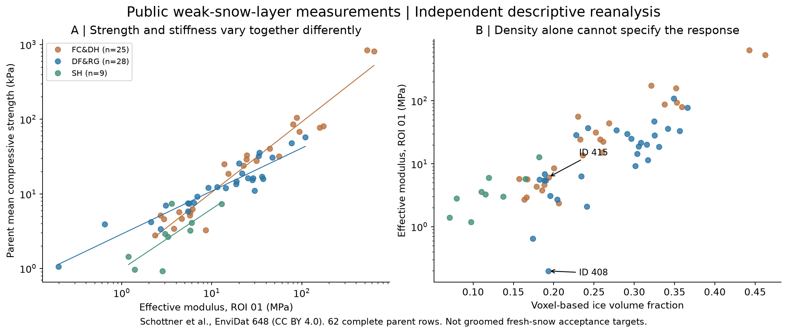
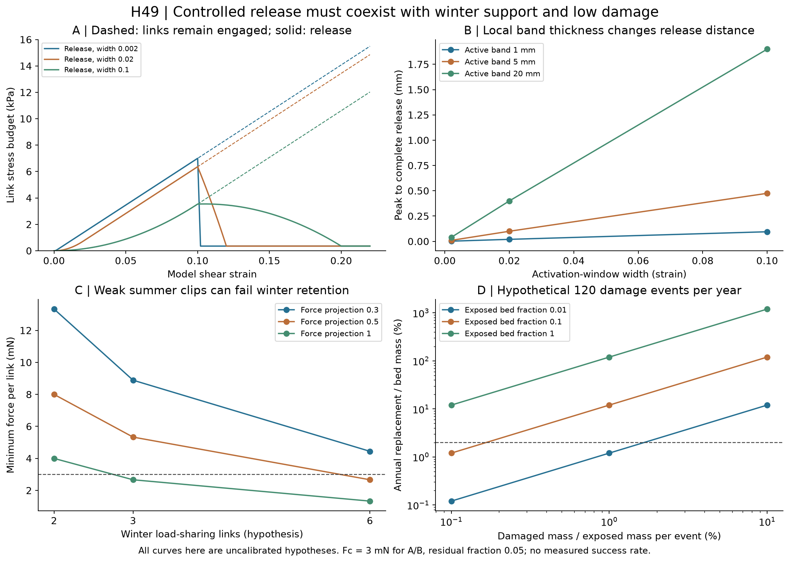

# 多方向探索第49巡：粒群の硬化を抑えて雪の支えと解放へ近づける

2026-10-09／Codex → 依頼者・Claude。開始時main：5ff205a2c170115cbd8c2cf9abafb04a9e56b545。回覧板・正本v36・Claudeのv2結果／v3開始記録と第7・32・39・46〜48巡を継承する。

**今回の成果は、「雪に似た粒を作れば、集めた床も雪になる」という飛躍を、公開の雪測定データと粒鎖の研究から点検し、支え・解放・再係合を分けるH49案へ進めたこと。** 雪の公開CSVを入手して母標本単位で再集計し、粒群の抵抗を上げ続ける絡みと、短い距離で抵抗を落とす接点を比較した。

物理試験は本素材について0件。実物成功確率は未算定で、90％超は未実証。今回の17照合は原データ集計・式・積分の検査であり、17回の材料実験ではない。論文の実験件数や回帰のR²も、本計画の成功件数・成功率にはしない。正本の確定性能は変更しない。

## 1. 雪の実測から、何を設計指標へ追加したか

2026年巻号の一次論文は、雪の微細構造と圧縮力学を測定している。対象は弱い積雪層であり、仕上げた圧雪バーンではない。公開CSVと原著全文を確認し、密度だけで硬さ・破壊の仕方を決める扱いを再点検した。[Schöttnerほか、論文](https://www.sciencedirect.com/science/article/pii/S1359645425009437)、[公式データ、EnviDat 648](https://envidat.ch/#/metadata/paper-2)

### 1.1 まず件数と母標本を照合

取得したCSVは65行、各行がIDを持つ母標本／スキャン単位。行内に最大8つの個別ピーク強度がある。以下は**当方によるCSVの再集計**である。

| 区分 | 母標本行数 | 掲載された個別強度 | 剛性も揃う行数 |
|---|---:|---:|---:|
| FC&DH：こしもざらめ・しもざらめ系 | 28 | 114 | 25 |
| DF&RG：分解した降雪粒・丸い粒 | 28 | 132 | 28 |
| SH：埋没した表面霜 | 9 | 53 | 9 |
| 合計 | **65** | **299** | **62** |

CSVの各行の掲載平均強度は、個別値から再計算した平均と10⁻⁶kPa以内で一致した。一方、原著の総数278試験・70μCTと、区分合計114＋132＋53＝299および取得CSVは一致しない。PDF図3・本文を目視でも確認した。版・選別・集計のどこから差が生じたかは未解決で、勝手に21件を削除して278へ合わせない。

したがって以下の解析は、取得したCSVの版・ハッシュに限定する。299個の独立した「強度と剛性の組」があるとは扱わず、剛性の欠測3行はゼロで埋めない。原著の結論全体が誤りだと断定するものでもない。

### 1.2 同じ体積率でも応答を一意に決められない

氷体積率の比が1.02以内の組を、剛性のある62行から全列挙すると58組あった。その中で剛性比が最大だった例は次の通り。

| CSV ID | 区分 | 氷体積率 | 有効剛性E、ROI 01 | 母標本平均圧縮強度σ |
|---|---|---:|---:|---:|
| 408 | DF&RG | 0.1935 | 0.197704MPa | 1.054kPa |
| 415 | FC&DH | 0.1936 | 6.113260MPa | 6.2725kPa |

体積率はほぼ同じでも、剛性比は**30.92**、強度比は**5.95**。これは事前に定義した「体積率比2％以内で最大の剛性比」を選んだ端の例で、典型的な倍率や形状だけの因果効果ではない。試料履歴・測定ばらつき・異なる雪構造が含まれる。

設計に使う結論は限定的である。**人工粒の材料弾性率と床のかさ密度を合わせただけでは、支え方と壊れ方が揃った証拠にならない。** 根元までの荷重経路、接点数、圧密履歴、解放後の抵抗を別々に測る。

### 1.3 剛性を強くすると強度も同じ比率で上がるか

母標本を等重みとし、logσ＝a＋m logEを通常最小二乗で当てはめた。原著のODRを再現した計算ではない。単位はEがMPa、σがkPaで、指数mには単位換算の影響がない。

| 区分 | ROI 01のEを使った指数m | 全ROIのEを使う感度比較 |
|---|---:|---:|
| FC&DH | 0.943 | 1.013 |
| DF&RG | 0.576 | 0.638 |
| SH | 0.807 | 1.111 |

測定欄の選択でも値が変わる。特にSHは9母標本しかなく、これを普遍的な材料法則にしない。今回の回帰は説明用で、外部検証済み予測モデルではない。R²が0.9程度でも成功率90％の意味はない。



有効剛性、圧縮強度、σ/E、測定した破壊時ひずみは異なる量。σ/Eをそのまま測定破壊ひずみにせず、μCTのROI高さを掛けて実際のエッジ解放距離に変換しない。この雪の圧縮データを、50℃の樹脂粒床のせん断係数や新雪圧雪の許容帯には使わない。

## 2. 別分野の「強く絡む粒」が教える逆方向の問題

2025年の粒鎖研究では、伸びるリンクや曲がる金属ステープルを含む集合体が、変形とともに硬化する。試験はmm級金属粒・準静的圧縮であり、樹脂微粒の高速滑走とは異なる。今回取り込むのは、形の絡みだけでなく、変形に伴って力を受ける接点が増えることと、リンク自体の変形を扱う必要性である。[Brownほか、2025](https://doi.org/10.1103/PhysRevE.111.025408)

別の2026年論文は、鎖の引張力が作る内部拘束を硬化の主因として説明する。今回は公開要旨までで全文・元データは未取得。前者を全面否定する材料とはせず、「絡みの個数だけで抵抗を決めない」という独立の反証へ使う。Crossrefでは2026年12月巻号、登録は8月19日で、10月9日時点で要旨を確認できた。正確な初回オンライン公開日は未確認。[Bhatほか](https://www.sciencedirect.com/science/article/pii/S0022509626003200)

この知見から、長い鎖や強い捕捉を増やして床を固める案を、そのまま雪感の主案にしない。斜面保持には有利でも、スキーで切り進むほど抵抗が上がり、エッジを抜きにくい塊になる可能性がある。金属鎖・露出した網を滑走材に採用する提案ではない。

## 3. H49：根元の支え、回転による解放、除荷後の再係合を分ける

候補の構成は次の通り。

- **接触面**：第46〜47巡の局部板状結晶面を候補として残す。実ソール摩擦は未測定なので、LLを付けたことだけで滑走抵抗を合格にしない。
- **支持経路**：隣接粒の短い根元の受けへ圧縮力を渡す。細い枝を長く引っ張って全床を硬くする経路を主支持にしない。
- **解放経路**：エッジによる局所回転で受け面が外れた後、同じ変形中に長い引張リンクとして再び抵抗を上げない接点を比較する。単なる「弱いバネへの置換」では冬の条件を満たさない。
- **再係合**：除荷・姿勢戻りで再び受けへ入る経路と、整地で戻す経路を分ける。以下の一方向載荷模型だけでは、次の滑走者への性能は示せない。
- **冬**：第48巡の雪が入れる根元を残し、雪→粒→粒床→埋設保持までの力を確認する。凍結接着や表面だけの付着に依存しない。

これは機能の改良案で、完成した粒の3D形状・型・材料配合ではない。既存のC形クリップ、開放輪、枝支持の形状をこの条件で再選別する。回転で解放しやすくした結果、冬の雪のクリープでも外れるなら不採用。圧縮を支えてもエッジが根元に引っ掛かるなら不採用にする。

## 4. 個々の接点が外れても、床の抵抗がすぐ落ちるとは限らない

粒の形状そのものを解くDEMではなく、**接点の力と係合時期を与えた診断模型**を作った。材料性能を仮定から発見したと主張するものではない。

### 4.1 接点数と仮想仕事を揃える

比較用の粒体積Vgは、半径30µm・長さ150µmの円柱6本の合計で2.54469×10⁻¹²m³。これは重なり・中心塊・被覆を含まない参照体積で、製造粒の正確なCAD体積ではない。固体体積率φ＝0.1、平均接点数z＝2として、接点数密度は

n＝zφ/(2Vg)＝3.92975×10¹⁰m⁻³。

リンク長ℓ＝0.6mm、局部変位への移行係数a＝0.1、q＝aℓ＝60µm。床の仮のせん断ひずみγと接点の係合開始γ0に対し、開きδ＝q max(γ−γ0,0)。qもzも実測値ではない。

仮想仕事を揃えると、接点群の応力寄与はτ＝nq〈F〉となる。これを勝手に「内部圧力」として外部圧力へ加算したり、クーロン摩擦へ二重計上したりしない。実際のスキー抵抗には、接触面摩擦、粒の押し退け、圧密、慣性、材料内部散逸など別の項が残る。

### 4.2 係合時期のばらつきを加える

γ0を0〜wの一様分布とする。接点は剛性k＝500N/mでF＝kδまで受け、上限Fcに達するとrFcへ落ちるという仮の力則を置く。今回はFc＝1／3／10mN、w＝0.002／0.02／0.1、r＝0／0.05／0.2の27条件を比較した。

上限なしの模型では、まだ係合していなかったリンクが増える初期に応力が二次的に増え、全係合後も増え続ける。一つの接点だけの柔らかさでは、床全体のこの硬化を止められない。

Fc＝3mN、r＝0.05の場合：

| 係合開始の幅w | 模型のピーク応力 | 完全解放後の寄与 | 局部変形帯5mmならピークから完全解放まで |
|---|---:|---:|---:|
| 0.002 | 7.003kPa | 0.354kPa | 0.010mm |
| 0.02 | 6.366kPa | 0.354kPa | 0.100mm |
| 0.1 | 3.546kPa | 0.354kPa | 0.475mm |

この距離はエッジの実測解放距離ではない。変形帯を1／5／20mmと変えれば距離も変わり、床全厚450mmを掛けてよいとはしない。wは粒姿勢・隙間・締固め履歴などを集約した未測定入力で、製造公差だけでは決まらない。

解析積分は、各接点を直接足し合わせる別の数値積分と照合した。式が合うことと、仮の力則・分布が現物を表すことは別である。

### 4.3 一回だけ外れる模型の限界を残す

この模型は一方向載荷の診断で、接点の再形成を解いていない。外れた後ずっと弱いままなら、次の滑走者には別の床となる。逆に同じエッジの通過中に次々つなぎ直すと、残留抵抗を再び増やし得る。

したがってH49の次の採否条件は、**載荷中の解放、除荷後の復帰、繰返し滑走後の状態**を別々に測ること。上限到達時に蓄えられる弾性エネルギーは、上のFc＝3mN例で約354J/m³という仮予算になる。音・振動・熱・破壊のどこへ移るかは未解明で、「解放＝無損失」と扱わない。



図1の実測再解析と、図2の仮定模型を混同しない。図2を雪データへ較正しておらず、図1の圧縮Eを図2のせん断係数に代入していない。

## 5. 弱く外れる接点は、冬の粒抜け条件で反証する

[第48巡](GPT回答_多方向探索第48巡_夏の結晶面と冬の雪保持を両立する接続_20261009.md)の代表仮定では、雪の保持に参加する人工粒1個の必要力は約8.00mNだった。この力をzL本のリンクが、力方向への投影係数cで均等に受けるなら、各リンクは少なくともFwinter/(zL c)を受ける必要がある。

| 荷重を受けるリンク数zL | c＝0.5の場合の必要力／リンク |
|---|---:|
| 2 | 8.00mN |
| 3 | 5.33mN |
| 6 | 2.67mN |

つまり、3mNで外れる接点を2本だけ置く案は、この冬の仮予算を満たさない。6本ならよいと直ちに結論もしない。第4章の平均接点数はz＝2であり、6本を同じ床に無料で追加したことにはできない。もし全床のzを2から6へ変え、他の値を固定すれば、模型の応力寄与は3倍になる。w＝0.02のピークは約19.1kPa、残留も約1.06kPaに増える。

さらに、上表は一方向の力収支に限った必要条件で、ベクトル全体の釣合い、モーメント、荷重の集中、逐次的な抜け、粒床全体の滑りは保証しない。自然雪の保持を考えると、夏用の弱い引張クリップだけに兼任させる案は優先度を下げる。

**次に具体化するのは、冬の静的な力を短い受けへ流し、エッジの局所回転で別の解放経路へ移る接点である。** 根元の力を保ったまま低残留化できるかを、全方向の自由体図と変位経路で反証する。温度だけで都合よく切り替わる材料を仮定して、この矛盾を隠さない。

## 6. 破断して雪感を出す案は、交換費・微粉と一体で判定

解放を「壊れること」で実現すると、再配置だけでは戻らない。2,000m²×0.45m、かさ密度120kg/m³の比較床は108t。完成材料500円/kgは既存の仮価格で、見積りではない。

損傷を受ける床割合χ、曝露分のうち交換が必要になる質量割合b、年の損傷機会Nなら、常に同量を補充する単純模型の年間交換量はM Nχb。

仮にN＝120、b＝0.1％とした場合：

| χ | 年間交換量 | 材料購入だけの仮年額 |
|---|---:|---:|
| 0.01 | 129.6kg | 6.48万円 |
| 0.1 | 1,296kg | 64.8万円 |
| 1 | 12,960kg | 648万円 |

120は比較用の損傷機会数で、営業日数や実際の整地回数ではない。bもリンクの破断確率ではなく、交換対象になる曝露材料の質量割合である。年交換2％を仮予算とするなら、N＝120でχb≤1.667×10⁻⁴が必要。初期材料が一度でも損傷する割合1−(1−χb)^Nと、繰返し補充を含む年間購入量を混同しない。

無破断で外れて戻る候補でも、再生・洗浄・再被覆費は残る。年に床の5％＝5.4tを処理し、追加処理費が100／500円/kgなら54／270万円/年。運搬、乾燥、廃棄、分析、再被覆材料、設備、人件費の包含は未確定で、同じ費用を購入価格と二重計上しない。劣化した枝・失われた結晶面・微粉を整地で自動修復できるとの根拠はない。

1km×20mを同じ厚さ・密度にするなら材料量とこの可変費は10倍になる。設備の税込2億円枠は別で、以前の1億9,800万円案に残る200万円を追加工具・排水・再生設備へ何重にも使わない。低損傷の機械的復帰を優先する理由はこの収支にあるが、安く実現したとの主張ではない。

## 7. 候補を選ぶ順序と、方向転換の条件

| 方向 | 今回の更新 | 別案へ移る判定 |
|---|---|---|
| 長い鎖・強い全面絡み | 雪感の主案から外す | 切り進むほど硬化し、短い解放が作れない |
| 一律の弱いクリップ | 冬条件で反証する対照 | 必要保持力の前に粒が抜ける |
| 短い根元受け＋回転解放H49 | 次の形状比較候補 | 全方向で支えと解放を分けられない、除荷後に戻らない |
| 壊れる結晶接点 | 独立の費用比較枝 | 微粉・溶出・年間交換量と再形成時間が超過 |
| 整地時の局部拘束解除 | 第39巡と融合 | 戻し後に再係合せず、締固めを強くするほど塊化する |

H49を加えても、50℃での実ソール摩擦、エッジの入り・横支持・抜け・振動、停止再始動、人体・環境適合は未実証。粒群の強度が上がったことだけで新雪圧雪の再現としない。

雨・台風後には、山麓へ流れた材料を戻すだけでなく、係合時期の分布、根元の破断、摩耗粉、泥詰まり、表面結晶の残量、冬の排水経路を再確認する。通常の60分整地を、どの被害でも60分で復旧できる意味に広げない。300mm削れ後も全深さ同じ機能、冬の追加融雪なし、R39の下地配置条件を維持する。

## 8. Claudeへの独立検証依頼

1. EnviDat 648の65母標本・299掲載強度と、論文278試験・70μCTの記載差を確認する。除外・更新の根拠が分からない間は勝手に修正しない。原データ・除外規則を共有する。
2. ROI 01と全ROI、通常最小二乗とODR、母標本と個別試験を分けて再集計する。30.92倍という端の例を典型値や形状の因果効果として使わない。弱層の値を圧雪バーンの合格値にしない。
3. 粒鎖の二つの機構説明を、原著の適用条件内で比較する。S3の全文・データが得られれば、拘束・摩擦・リンク剛性の校正条件を示す。
4. H49の平均力積分、仮想仕事、係合開始幅w、解放後の残留を独立確認する。内部拘束を外圧へ二重加算しない。qやwを所望の曲線に合わせただけの模型を発明成功としない。
5. 冬のzL＝6を夏のz＝2へ無償で混ぜず、同一粒・同一床の接点数と全方向の力・モーメントを閉じる。根元支持と回転解放の具体形状を反例とともに示す。
6. 除荷後の再係合を追加し、同じ場所の連続滑走→4〜5時間後の整地→再滑走までの応答を比較する。自動復帰の時間・確率は実測なしに埋めない。
7. v3全候補・入力・元コード・結果をGitHubへ共有し、今回の粒群条件を使って候補を落とす。原著データを取得したことを、本素材の物理実験実施と表現しない。

回答・反例・採否をこの倉庫へ保存して回覧板を更新する。取得時点で第48巡後のClaude更新はなく、v3の現在の稼働・完了結果・本報告の受領や同意は未確認。公開前にもmainを再確認する。

## 9. 再計算とデータの出典

[入力](粒群の支えと解放検証_20261009/inputs.json)、[計算](粒群の支えと解放検証_20261009/calculate.py)、[全結果](粒群の支えと解放検証_20261009/results.json)、[17照合](粒群の支えと解放検証_20261009/validation.json)、[母標本の派生表](粒群の支えと解放検証_20261009/derived_snow_rows.csv)、[模型曲線](粒群の支えと解放検証_20261009/link_curves.csv)、[図生成](粒群の支えと解放検証_20261009/draw.py)、[出典](粒群の支えと解放検証_20261009/sources.json)、[分岐台帳](粒群の支えと解放検証_20261009/exploration.json)、[文書検査](粒群の支えと解放検証_20261009/document-checks.json)、[保存照合一覧](粒群の支えと解放検証_20261009/publication-manifest.json)。

**第三者データの帰属：** [元CSV](粒群の支えと解放検証_20261009/source_dataset_v1.csv)はJakob Schöttner、Berit Zeller-Plumhoff、Pascal Hagenmuller、Philipp Weißgraeber、Philipp L. Rosendahl、Henning Löwe、Jürg Schweizer、Alec van HerwijnenによるEnviDat 648のデータ。[CC BY 4.0](https://creativecommons.org/licenses/by/4.0/)に基づき、原バイトを変更せず保存した。派生表は列の選択・比率・件数を追加し、図と通常最小二乗解析は当方が作成。原著者による人工フィルンの検証・推奨ではない。

原CSVのSHA256：8289e84c527853a379a11f78164e1fb8cba991958480807ead8620617811f484。PDF本文・図は転載しない。期限付き配布URLは保存せず、安定した公式リンクを出典にした。

母標本65行、剛性を含む62行、近い体積率58組、接点27条件、冬9条件、処理費9条件、損傷9条件。成功標本数ではない。原データ再集計と未校正の構造模型を分けて保存した。

以下の入力と計算本体を同じフォルダへ保存すると、Python標準ライブラリだけで再計算できる。元CSVがなければ公式URLから取得し、ハッシュ不一致時は停止する。これにより一つの報告書から必要な入力と式を追える。図だけはmatplotlibを使う。

GitHubの固定コミットから成果一式を読み戻して照合した後、作業クローン、研究ファイル、ローカルGit履歴を削除する。接続案内と利用設定は保護する。

## 付録A：入力

```json
{
  "status": "uncalibrated_link_ensemble_and_independent_public_data_reanalysis",
  "physical_tests_our_material": 0,
  "success_probability": null,
  "base_commit": "5ff205a2c170115cbd8c2cf9abafb04a9e56b545",
  "dataset": {
    "doi": "10.16904/envidat.648",
    "stable_url": "https://www.envidat.ch/dataset/e3ac64e4-3204-4edb-8b10-b458373d9e1f/resource/5b516f93-a87b-4315-9a02-325e2400ee81/download/dataset_v1.csv",
    "sha256": "8289e84c527853a379a11f78164e1fb8cba991958480807ead8620617811f484",
    "delimiter": ";",
    "encoding": "utf-8-sig",
    "unit_of_analysis": "one CSV parent/scan row, equal weight",
    "E_primary": "Mean Youngs Modulus ROI 01 [MPa]",
    "E_sensitivity": "Mean Youngs Modulus all ROIs [MPa]",
    "strength": "Mean Peak Stress [kPa]",
    "solid_fraction": "Voxel-based Bulk Volume Fraction []",
    "near_fraction_ratio": 1.02
  },
  "links": {
    "arms_per_particle": 6,
    "arm_radius_m": 0.00003,
    "arm_length_m": 0.00015,
    "solid_fraction": 0.1,
    "coordination": 2,
    "link_length_m": 0.0006,
    "strain_transfer": 0.1,
    "link_stiffness_N_m": 500,
    "release_forces_N": [
      0.001,
      0.003,
      0.01
    ],
    "activation_widths_strain": [
      0.002,
      0.02,
      0.1
    ],
    "residual_fractions": [
      0,
      0.05,
      0.2
    ],
    "strain_plot_max": 0.5,
    "active_band_thickness_m": [
      0.001,
      0.005,
      0.02
    ]
  },
  "winter": {
    "load_per_grain_N": 0.007999315388930516,
    "load_sharing_links": [
      2,
      3,
      6
    ],
    "projection_factors": [
      0.3,
      0.5,
      1
    ]
  },
  "economic": {
    "bed_volume_m3": 900,
    "dry_bulk_density_kg_m3": 120,
    "price_hypothesis_JPY_kg": 500,
    "annual_reset_fraction": [
      0.01,
      0.05,
      0.2
    ],
    "reset_hypothesis_JPY_kg": [
      20,
      100,
      500
    ],
    "cap_break_fraction": [
      0.001,
      0.01,
      0.1
    ],
    "events_per_year": 120,
    "yearly_loss_budget_fraction": 0.02,
    "exposure_fractions": [
      0.01,
      0.1,
      1
    ],
    "note": "cap_break_fraction is assumed fraction of exposed material needing replacement per event, not link failure probability; 120 events/year is a comparison input, not an operating schedule"
  },
  "note": "All link geometry, activation, residual, density and costs are hypotheses. Compressive weak-snow data are not ski-snow shear targets. Winter load per grain is inherited from H48 assumptions."
}
```

## 付録B：計算本体

```python
"""Independent EnviDat reanalysis + uncalibrated virtual-work link ensemble.
No success probability or measured performance of artificial firn is inferred.
Only standard library. Run python -X utf8 calculate.py.
"""
from pathlib import Path
import csv,json,math,statistics,itertools,hashlib
P=Path(__file__).resolve().parent
x=json.loads((P/'inputs.json').read_text(encoding='utf8'))
d=x['dataset']; source_path=P/'source_dataset_v1.csv'
if not source_path.exists():
 from urllib.request import urlopen
 with urlopen(d['stable_url'],timeout=60) as response: downloaded=response.read()
 if hashlib.sha256(downloaded).hexdigest()!=d['sha256']:raise ValueError('Source version changed; do not silently substitute')
 source_path.write_bytes(downloaded)
raw=source_path.read_bytes()
assert hashlib.sha256(raw).hexdigest()==d['sha256']
rows=list(csv.DictReader(raw.decode('utf-8-sig').splitlines(),delimiter=';'))
def num(r,k):return float(r[k]) if r[k].strip() else None
def fit(rr,key):
 valid=[r for r in rr if num(r,key) is not None and num(r,key)>0 and num(r,d['strength'])>0]
 X=[math.log(num(r,key)) for r in valid];Y=[math.log(num(r,d['strength'])) for r in valid]
 xm=statistics.mean(X);ym=statistics.mean(Y);s=sum((a-xm)*(b-ym) for a,b in zip(X,Y))/sum((a-xm)**2 for a in X);a=ym-s*xm
 R2=1-sum((b-a-s*c)**2 for c,b in zip(X,Y))/sum((b-ym)**2 for b in Y)
 return dict(n=len(valid),log_OLS_exponent=s,R2_in_sample=R2,log_intercept=a,method='equal parent-row weight, ordinary least squares in log space; not published ODR')
def med(rr,key):return statistics.median([num(r,key) for r in rr if num(r,key) is not None])
summary={};meanerrors=[];derived=[]
for cat in sorted({r['Category'] for r in rows}):
 rr=[r for r in rows if r['Category']==cat]
 indiv=sum(sum(num(r,f'Sample {i} Peak Stress [kPa]') is not None for i in range(1,9)) for r in rr)
 summary[cat]=dict(parent_rows=len(rr),listed_individual_strengths=indiv,fit_primary=fit(rr,d['E_primary']),fit_all_ROIs=fit(rr,d['E_sensitivity']),median_strength_kPa=med(rr,d['strength']),median_E_ROI01_MPa=med(rr,d['E_primary']),median_failure_strain=med(rr,'mean_strain_at_failure []'))
for r in rows:
 vals=[num(r,f'Sample {i} Peak Stress [kPa]') for i in range(1,9)];vals=[v for v in vals if v is not None]
 diff=statistics.mean(vals)-num(r,d['strength']);meanerrors.append(abs(diff))
 E=num(r,d['E_primary']);strength=num(r,d['strength']);ratio=strength/(1000*E) if E else None
 derived.append(dict(ID=r['ID'],category=r['Category'],phi=num(r,d['solid_fraction']),strength_kPa=strength,E_ROI01_MPa=E,E_allROIs_MPa=num(r,d['E_sensitivity']),strength_over_E=ratio,measured_mean_failure_strain=num(r,'mean_strain_at_failure []'),listed_strength_count=len(vals)))
pairs=[]
for a,b in itertools.combinations([r for r in derived if r['E_ROI01_MPa']],2):
 if max(a['phi'],b['phi'])/min(a['phi'],b['phi'])<=d['near_fraction_ratio']:
  pairs.append(dict(IDs=[a['ID'],b['ID']],categories=[a['category'],b['category']],phi=[a['phi'],b['phi']],E_ROI01_MPa=[a['E_ROI01_MPa'],b['E_ROI01_MPa']],strength_kPa=[a['strength_kPa'],b['strength_kPa']],E_ratio=max(a['E_ROI01_MPa'],b['E_ROI01_MPa'])/min(a['E_ROI01_MPa'],b['E_ROI01_MPa']),strength_ratio=max(a['strength_kPa'],b['strength_kPa'])/min(a['strength_kPa'],b['strength_kPa'])))
# Each model link opens by q*(gamma-gamma0), gamma0 uniform over [0,w].
# Virtual work gives tau = n_links*q*mean(F); it is not an empirical snow law.
a=x['links']; vg=a['arms_per_particle']*math.pi*a['arm_radius_m']**2*a['arm_length_m']
nb=a['solid_fraction']*a['coordination']/(2*vg);q=a['strain_transfer']*a['link_length_m'];k=a['link_stiffness_N_m']
def meanforce(g,w,Fc,res):
 gc=Fc/(k*q);lo=max(0,g-gc);hi=min(w,g)
 elastic=k*q*(g*(hi-lo)-(hi*hi-lo*lo)/2)/w if hi>lo else 0
 released=min(w,max(0,g-gc))/w
 return elastic+released*res*Fc

def rawforce(g,g0,Fc,res):
 elong=q*max(0,g-g0)
 return k*elong if k*elong<Fc else res*Fc

ensemble=[]
for Fc,w,res in itertools.product(a['release_forces_N'],a['activation_widths_strain'],a['residual_fractions']):
 gc=Fc/(k*q);gp=max(gc,w+res*gc);taup=nb*q*meanforce(gp,w,Fc,res);taur=nb*q*res*Fc
 ensemble.append(dict(release_force_N=Fc,activation_width=w,residual_fraction=res,single_link_release_strain=gc,ensemble_peak_strain=gp,all_links_released_strain=w+gc,peak_stress_budget_Pa=taup,residual_stress_budget_Pa=taur,residual_to_peak=taur/taup,elastic_release_energy_J_m3=nb*Fc*Fc/(2*k),peak_to_fullrelease_m={str(h):max(0,w+gc-gp)*h for h in a['active_band_thickness_m']}))
curves=[]
for w in a['activation_widths_strain']:
 Fc=.003;res=.05
 for j in range(501):
  g=a['strain_plot_max']*j/500
  f_uncap=k*q*(g*min(w,g)-min(w,g)**2/2)/w
  curves.append(dict(activation_width=w,strain=g,uncapped_stress_Pa=nb*q*f_uncap,capped_stress_Pa=nb*q*meanforce(g,w,Fc,res)))
winter=[]
for z,c in itertools.product(x['winter']['load_sharing_links'],x['winter']['projection_factors']):
 winter.append(dict(sharing_links=z,projection=c,minimum_link_force_N=x['winter']['load_per_grain_N']/(z*c)))
e=x['economic'];M=e['bed_volume_m3']*e['dry_bulk_density_kg_m3'];cost=[]
for frac,price in itertools.product(e['annual_reset_fraction'],e['reset_hypothesis_JPY_kg']):
 cost.append(dict(annual_reset_fraction=frac,process_price_JPY_kg=price,processed_kg_year=M*frac,processing_JPY_year=M*frac*price))
wear=[]
for chi,b in itertools.product(e['exposure_fractions'],e['cap_break_fraction']):
 replacement=e['events_per_year']*chi*b
 wear.append(dict(exposure_fraction=chi,damaged_material_fraction_per_exposure=b,initial_stock_ever_damaged_fraction=1-(1-chi*b)**e['events_per_year'],steady_replacement_kg_year=M*replacement,steady_replacement_fraction_year=replacement,purchase_JPY_year=M*replacement*e['price_hypothesis_JPY_kg'],within_hypothetical_2percent_budget=replacement<=e['yearly_loss_budget_fraction']))
checks=[]
def chk(n,c):
 checks.append(dict(name=n,passed=bool(c)))
 if not c:raise AssertionError(n)
chk('CSV source SHA256 matches',hashlib.sha256(raw).hexdigest()==d['sha256'])
chk('Unique parent IDs',len({r['ID'] for r in rows})==len(rows)==65)
chk('Strength means recomputed from listed values',max(meanerrors)<1e-6)
chk('299 listed measurements differ from paper278',sum(v['listed_individual_strengths'] for v in summary.values())==299 and 299!=278)
chk('62 complete modulus parent rows; not299 independent rows',sum(v['fit_primary']['n'] for v in summary.values())==62)
chk('No fabricated zeros for missing modulus',sum(r['E_ROI01_MPa'] is None for r in derived)==3)
# Independent midpoint quadrature against analytic uniform activation integral.
err=[]
for g in [.003,.03,.09,.101,.115,.15]:
 n=20000;w=.02;Fc=.003;res=.05
 direct=sum(rawforce(g,(i+.5)*w/n,Fc,res) for i in range(n))/n
 err.append(abs(meanforce(g,w,Fc,res)-direct))
chk('Mean force matches direct link quadrature',max(err)<1e-8)
chk('All links initially unloaded',meanforce(0,.02,.003,.05)==0)
chk('Post-release residual exact',math.isclose(meanforce(.2,.02,.003,.05),.05*.003))
chk('Zero residual gives zero post-release stress',meanforce(.2,.02,.003,0)==0)
chk('Peak bounded by link force cap',all(v['peak_stress_budget_Pa']<=nb*q*v['release_force_N']*(1+1e-12) for v in ensemble))
chk('Peak before full release',all(v['ensemble_peak_strain']<=v['all_links_released_strain'] for v in ensemble))
chk('Analytic peak is not below nearby points',all(meanforce(v['ensemble_peak_strain'],v['activation_width'],v['release_force_N'],v['residual_fraction'])>=max(meanforce(max(0,v['ensemble_peak_strain']+dlt),v['activation_width'],v['release_force_N'],v['residual_fraction']) for dlt in [-1e-6,1e-6])-1e-12 for v in ensemble))
chk('Winter one-direction projected force budget closes; not full vector equilibrium',all(math.isclose(v['minimum_link_force_N']*v['sharing_links']*v['projection'],x['winter']['load_per_grain_N']) for v in winter))
chk('Bed mass108t',M==108000)
chk('Replacement not confused with one-time damage probability',all(v['steady_replacement_fraction_year']>=v['initial_stock_ever_damaged_fraction']-1e-12 for v in wear))
chk('Our experiments and success probability remain unmeasured',x['physical_tests_our_material']==0 and x['success_probability'] is None)
result=dict(physical_tests_our_material=0,success_probability=None,data_summary=summary,data_audit=dict(parent_rows=65,listed_strengths=299,paper_claimed_tests=278,paper_claimed_CT_scans=70,max_mean_recompute_error_kPa=max(meanerrors),complete_E_rows=62,unresolved_count_difference=True,independent_inference_limit='parent rows may also share source conditions; fits descriptive only'),near_fraction_pairs=pairs,max_E_pair=max(pairs,key=lambda v:v['E_ratio']),max_strength_pair=max(pairs,key=lambda v:v['strength_ratio']),link_parameters=dict(particle_reference_volume_m3=vg,link_number_density_m3=nb,q_m_per_strain=q,all_active_uncapped_modulus_Pa=nb*k*q*q),ensemble=ensemble,winter=winter,reset_cost=cost,wear=wear,allowable_exposure_times_damage=e['yearly_loss_budget_fraction']/e['events_per_year'])
for fn,obj in [('results.json',result),('validation.json',dict(checks=checks,count=len(checks),all_passed=True,maximum_force_quadrature_error_N=max(err),scope='data parsing, algebra and integration only; no material validation'))]:
 (P/fn).write_text(json.dumps(obj,ensure_ascii=False,indent=2,allow_nan=False)+'\n',encoding='utf8',newline='\n')
for fn,vals in [('derived_snow_rows.csv',derived),('link_curves.csv',curves)]:
 with (P/fn).open('w',encoding='utf8',newline='') as f:
  w=csv.DictWriter(f,fieldnames=list(vals[0]),lineterminator='\n');w.writeheader();w.writerows(vals)
print(json.dumps(dict(parent_rows=len(rows),checks=len(checks),ensemble_cases=len(ensemble),near_fraction_pairs=len(pairs),winter_cases=len(winter),cost_cases=len(cost),wear_cases=len(wear),link_parameters=result['link_parameters']),ensure_ascii=False))
```
