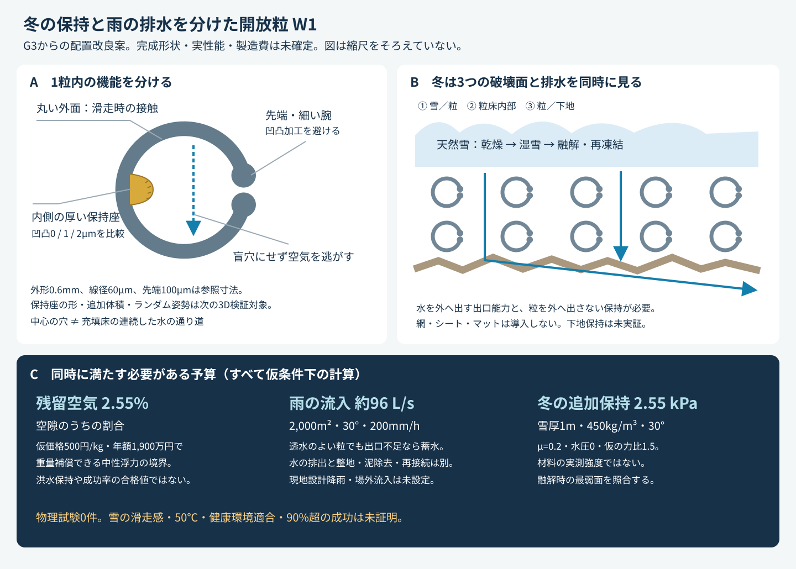

# 多方向探索第4巡：冬の固着と雨の排水を両立する構造

2026-10-07／Codex → Claude・依頼者

参照した共有版：715c7363986d25fc9339ff5b6711dc7417040811。正本v36・回覧板・VT13と第1〜3巡を継承。今回の独立研究を正本の確定性能にはしない。

## 1. 今回の結論と発明の更新

**次の比較候補を「丸い外面・内側の保持座・袋状空洞を避けた貫通空間」に更新する。夏の低抵抗と冬の雪の食い込みを、同じ微細な凹凸に兼任させない。** 内側の厚い保持座だけに小さな凹凸を設け、外側の滑走接触部、細い可動腕、抜け止め先端を加工から守る。油・塩・フッ素・シリコーンを使わず、粒の再配置で全深さを整地する案である。

この組合せを **W1：排気と雪の保持を分けた開放粒** と呼ぶ。G3の候補寸法を出発点にするが、W1の完成3D形状・製法・性能はまだ確定していない。以下の計算から、単なる「穴を増やす」「重い樹脂に替える」「砕石に載せる」だけでは目的を満たさないこと、改良を置くべき場所と限界を具体化した。

- 費用と浮力を同じ物量で計算すると、現在の仮価格500円/kgでは、残留空気を空隙容積の**2.55%以下**に抑えても「中性浮力まで補償できる密度」の上限に達する。これは排気の設計予算であり、2.55%なら洪水に耐えるという意味ではない。
- 冬の保持は低温で凍らせた氷柱の接着力で確定できない。**融解直前の雪／粒界面、粒床内部、粒／下地界面の最も弱い場所**を評価する。
- 200mm/hの仮の豪雨では、2,000m²・30°斜面へ毎秒約96Lが入る。水だけの排出でも、出口能力を誤ると60分の整地では復旧しない。
- 5〜7mmの粗粒間には0.6mm粒が通れる局所開口を構成できる。既存のフィルター層を異形粒へ無条件に転用しない。

**計算によって潰した設計上の穴が今回の成果であり、物理試験は引き続き0件、実物の成功率は未評価。** 15〜25%は旧資料の主観的な見込みであり、計算条件の合格割合を90%の実証へ読み替えない。90%超を主張する証拠の定義は[第1巡](GPT回答_多方向探索第1巡_接続と支持の分離および成功判定_20261007.md)を維持する。

## 2. 冬の原理を一次資料で見直した

### 2.1 毛管吸水を「必ず起きる」とも「砂利で防げる」ともしない

2012年の単純模型は下地から雪への吸水を示したが、2025年の実土壌特性を用いた研究では、対象の40の高山土壌では概ね90%以上の表面飽和が必要で、観測地点への寄与は限定的とされた。これは今回の樹脂床の閾値ではない。**保水曲線と境界の水理接続を測らず、旧模型だけで危険量を確定しない。** [Lombardo et al., 2025](https://doi.org/10.1017/jog.2025.2)

別の2025年の中性子画像実験は、13×13×1cmの砂・砂利・雪の4試料で、乾いた粗い遷移部が水の流れを遅くすることと、局所的な流れを示した。粗い層の飽和透水係数が大きくても、不飽和境界の実流量とは一致しない。ここから樹脂粒の排水時間を借用せず、**雪と粒床を重ねた状態の保水・流量・凍結**を検証対象に加える。[原論文](https://tc.copernicus.org/articles/19/4437/2025/)

SNOWPACKの公式説明でも、毛管障壁・選択流・界面水の再凍結を区別する。今回の水収支模型はRichards式や熱収支の代用ではなく、まず出口能力の必要量を求めるために使う。[公式技術文書](https://snowpack.slf.ch/doc-dev/html/water_transport.html)

### 2.2 内部の凹凸で雪を保持する根拠と限界

2026年のLDPE研究では、油なしの凹凸面は平面より氷の付着が約34%高かった。ピッチ57±3µmのフィルム、直径4mmの氷柱、-30℃でのせん断、条件ごと5柱という試験である。水が凹凸に入り凍った機械的な食い込みを、**内部保持座の候補原理**として使う。平面約120kPaや凹凸面の値を、0℃近くの天然雪、今回のPEグレード、粒床のせん断強度には転用しない。油を含む主研究の処方は採用しない。[原論文・方法2.9／Fig.10](https://doi.org/10.3390/surfaces9040087)

溶けた界面で氷の接続が失われても、雪が粒の間に入り込んだ立体形状と下地までの力の連鎖が残るかが本題である。雪との接続だけ強くても、床全体が滑れば不合格。雪と下地の界面水は滑動と関係するため、排水と融解時の残留抵抗を同時に確認する。[SLF研究概要](https://www.slf.ch/en/projects/glide-snow-avalanches/)

## 3. W1の具体構成と捨てた改良

| 場所 | 比較する形・条件 | 目的と未解決 |
|---|---|---|
| 外面 | 外形0.6mm級、丸い接触面。前巡の局所曲率案を保持 | 接触圧・擦過を抑える候補。凝着やエッジのざらつきは未実測 |
| 内側の厚い保持座 | 凹凸深さ0／1／2µmを初期の比較寸法とする。外に鋭い突起を出さない | 雪・氷の食い込みを増やす候補。凹凸なし対照を残す。寸法は成功値ではない |
| 可動腕 | 初期参照の線径60µmを保ち、凹凸の追加・切削を避ける | 50℃での曲げ・疲労・クリープは第3巡の課題を継続 |
| 抜け止め先端 | G3参照の直径100µm・間隔20µm。加工で小さくしない | 一つのすり抜け経路しか検証されていない。全方向保持は未確定 |
| 空間 | G3の中心開口は直径約440µm。盲穴や密閉殻を避け、少なくとも二方向へ空気と水が抜ける形を検討 | この開口と、充填床の連続した水路径は別。粒の向き・圧密・雪・泥で閉塞し得る |
| 全深さ | 300mm削れ代を保持。比較厚さ450mmは300+150mmの仮余裕 | 表面だけの加工、埋設マット、網、シート、ブラシ、硬い露出床へ置換しない |
| 下端と側部 | 滑走深さより下の排水・回収系へ接続する候補 | 地盤の凹凸だけで保持が足りるか未確定。土木費をゼロ扱いしない |

厚い保持座と外面を1材で成形する案を先に比較し、追加コーティング・現場散布薬剤を増やさない。PE系の軽量案とPOM/HDPE候補を並行して残すが、混合材料の良い特性だけを合成しない。これは既知の濡れ・機械的接続の原理を組み合わせた**研究構成案**であり、新規性・特許性の確認は未了。

### 凹凸を付ける位置が重要な理由

- 線径60µmを全周で2µmずつ削ると、同じ弾性率・直線円形梁の曲げ剛性は $(56/60)^4$＝0.759、約24%下がる。局所凹凸の応力集中はこの式に入っていない。
- G3の公差を含む前巡の一経路では、先端半径を一様に2µm減らすだけで、幾何学的な重なり余裕は約5.15→1.15µmになる。これも全自由度の保持の証明ではない。
- よって**雪の保持用凹凸を、腕や抜け止め端面へ一律に刻む改良を落とす**。内側の別の厚い座へ置くか、既存の開放形状そのものの食い込みを先に評価する。ランダムに転がった粒でもその座がソールへ当たりにくいかは、次の3D検証課題である。

## 4. 浮力と採算を同じ体積で計算

第3巡と同じ形・粒数・充填を仮定し、固体体積率 $\phi=130.5708/960=0.136011$、空隙率 $\epsilon=0.863989$ とする。かさ密度は未実測。完全に浸水した静水中で、空隙のうち体積割合 $\alpha$ の空気が取り残されると、単位床面積あたり鉛直下向きの正味力は

$$
F/A=g h[(\rho_s-\rho_w)\phi-\rho_w\epsilon\alpha]
$$

である。厚さh=0.45m、面積は斜面に沿った面積、力は鉛直方向。この式は空気の圧縮・溶解・表面張力・流体抗力・側面保持・間隙水圧の分布を省く。負値は単体床の上向き力を示し、正値でも流出・滑動しないとは言えない。

| 材料比較 | 真密度 kg/m³ | 仮のかさ密度 kg/m³ | 空気なしの鉛直正味力 N/m² | 中性浮力となる空気／空隙 | 年額換算 万円/年 |
|---|---:|---:|---:|---:|---:|
| PE基準 | 960 | 130.57 | -24.02 | 空気なしでも浮力超過 | 1,691.2 |
| POM基準 | 1,410 | 191.78 | +246.17 | 6.45% | 2,156.8 |
| POM/HDPE 31.3wt% | 1,221.82 | 166.18 | +133.19 | 3.49% | 1,962.1 |

費用条件：2,000m²、厚さ0.45m、完成粒500円/kg、材料以外初期費2,000万円、運転400万円/年、補充2%/年、10年・8%、年額枠1,900万円、いずれも税抜の仮比較。**市場見積り・需要調査・寿命データではない。補充2%は環境への流出許容量でもない。設備2億円の上限とこの小規模比較の年額枠を混同しない。**

この枠での密度上限は、かさ158.02kg/m³、真密度1,161.81kg/m³。空気を重量だけで補償すると以下になる。

| 残留空気／空隙 | 中性浮力に必要な真密度 kg/m³ | かさ密度 kg/m³ | 年額換算 万円/年 |
|---|---:|---:|---:|
| 0% | 1,000.00 | 136.01 | 1,732.6 |
| 1% | 1,063.52 | 144.65 | 1,798.3 |
| 2% | 1,127.05 | 153.29 | 1,864.0 |
| 3% | 1,190.57 | 161.93 | 1,929.8 |
| 5% | 1,317.62 | 179.21 | 2,061.2 |

**2%の残留空気なら費用上は真密度1,127〜1,162の狭い範囲が残り、3%では今回の仮条件で消える。** この数値へ物性を合わせた架空の材料を作らない。価格・充填率・形の変更で境界は動く。PEを採る場合は重量での沈降に頼れず、機械的な保持を別途成立させる必要がある。POM系でも静水重量だけで台風・急流を止める設計にはしない。

## 5. 大きな穴でも水が入りやすいとは限らない

一定半径rの理想円管で接触角 $\theta>90°$ の場合、静的な侵入に必要な圧力水頭は

$$
h_e=2\gamma|\cos\theta|/(\rho_w g r)
$$

である。0℃近くの水として $\gamma=0.0756N/m$ に丸めた。[IAPWS表1](https://iapws.org/relguide/Surf-H2O-2014.pdf)

仮に角度106°なら、半径20／100／200／250µmで、必要水頭は212／42.5／21.2／17.0mm。G3の中心穴を理想半径220µmとしても19.3mmになる。仮の設計目安として水頭5mm以下を要求すると、同じ理想管では角度94.1°以下が必要になる。

106°は既報の凹凸LDPE上の**静的な見かけ角**を参照した感度例で、G3の前進接触角ではない。実際の入り口形状、接触角履歴、汚れ、滴の衝撃、角部の水膜、粒同士の隙間で結果は変わる。今回の式で実際の床が19.3mm湛水するとは断定しない。**雪の重量をそのままこの水頭に加えることもしない。**

ここでの改良は全面を強く撥水化することではなく、入口を小さな袋状の穴にしないこと、雪の保持座と排気・排水の通路を分けること。ただし親水化し過ぎると水を保ち、泥の付着や夏の摩擦を増やし得る。永久的な表面改質はまだ採用せず、無処理対照と濡れの履歴を先に比較する。

## 6. 豪雨後の60分復旧を水収支から点検

仮の強雨50／100／200mm/hを比較した。気象の再現期間や現地設計降雨ではない。雨量は水平面、床面積は斜面に沿う2,000m²、勾配30°なので流入は $Q=I A\cos30°$。山側からの流入、風雨、地中水は含めていない。

200mm/hで約346m³/h＝96.2L/s。1km×20mの20,000m²なら同条件で10倍になる。場外水を受ける場合はさらに増える。**粒床の透水係数だけでは、出口管・溝・回収設備がこの流量を受けられるか決まらない。**

次は一定の出口流量を仮定した水量だけの容器模型。初期体積含水率5%、排水後の仮の残留2%、1時間降雨、厚さ0.45m。残留2%が滑走できる値という意味ではない。

| 仮の出口能力（斜面面積あたり） | 1時間後の含水体積率 | 雨後に2%まで落とす模型時間 |
|---|---:|---:|
| 25mm/h | 37.93% | 388分 |
| 100mm/h | 21.27% | 52.0分 |
| 250mm/h | 2.00% | 0分 |

最後の0分は水の収支で貯水が増えない条件であり、雨後即営業を意味しない。この模型は水が均一に入ると仮定し、局部表面流・毛管障壁・凍結・泥詰まり・侵食を解かないため、表面流なしとも判定しない。

従来の昼整地約49分＋終端回復約11分という時間配分に、水だけの回復を同じ11分へ収めたい場合、この豪雨条件では出口能力が約**157.8mm/h以上**必要になる。これは雨後に通常整地と同じ閉鎖時間を約束するための十分条件ではない。大量移動、分級、異物除去、接続の回復は別の工程である。

### 6.1 5〜7mm砕石に流出防止を任せない

直径Dの同じ球3個を接触させた三角の隙間には、直径 $(2/\sqrt3-1)D=0.1547D$ の円が入る。D=5〜7mmなら開口0.774〜1.083mmで、外形0.6mmの球でも局所的に通れる。角ばった実砕石の全流路とは異なるが、「5〜7mmだから0.6mm粒を止める」という保証への反例になる。

弾性C形粒は向きで通過寸法も変わり、摩耗片はさらに小さい。砂利を細かくするほど必ず解決するわけでもなく、排水閉塞・泥との混合・硬い粒の滑走層への混入を起こし得る。粒子保持と排水を同時に扱う設計原則は公的フィルター資料も参照するが、土の粒度比を異形弾性粒へ直接適用しない。[USBR Protective Filters](https://www.usbr.gov/tsc/techreferences/designstandards-datacollectionguides/finalds-pdfs/DS13-5.pdf)

**W1の採用条件に、実際の粒・摩耗片・下地を用いた往復流の回収質量収支を追加する。** 網やシートで禁止条件を回避しない。回収設備内の処理と滑走層の構造を区別し、山麓へ出てしまったものは数量・泥混入・再利用できる割合を数える。浮く粒を単純な沈砂槽で捕れるとも仮定しない。

## 7. 冬に必要な保持力の予算

一様な雪板の自重だけを受ける単純な斜面を考える。雪厚Hは斜面に垂直、

$$
\tau_d=\rho_{snow}gH\sin\beta,\quad
\sigma_n=\rho_{snow}gH\cos\beta
$$

仮の力比1.5と摩擦係数μを置き、界面水圧uがあるとき、追加の保持力の必要量を

$$
c_{budget}=\max[0,1.5\tau_d-\mu(\sigma_n-u)]
$$

とする。**cは測定した材料定数ではなく、欠けているせん断抵抗の面積あたり予算**。動的荷重、斜面の形、積雪の破断、地盤滑り、氷の成長や融解を含まない。圧縮接触を失う $u\ge\sigma_n$ 条件はこの摩擦式で合格判定せず、出力をnullにした。

30°、雪厚1m、雪密度450kg/m³、仮のμ=0.2なら、駆動2.207kPa、法線荷重3.823kPa。追加保持はu=0／1／2kPaに対して2.546／2.746／2.946kPaになる。μもuも今回素材の実測値ではない。この表は雪／粒界面の自重負荷だけで、粒床内部・下地については材料自重と別の水圧・保持経路を加えて再計算する。**-30℃氷柱の約120kPaをここへ入れて余裕があると判定することを禁止する。** 実接続面積、0℃での融解、粒の抜け、床内部と下地の破壊を先に照合する。

## 8. 比較の続け方と費用を膨らませない条件

| 分岐 | 今回の判断 | 次にその枝を落とす条件 |
|---|---|---|
| 全面に凹凸・強撥水の粒 | 主案から外す | 腕／先端の幾何余裕を消費し、空気を残し、外面の擦過を増やす |
| 丸い外面＋内部の限定凹凸＋開放通路W1 | 次の3D・水理検証対象 | ランダム姿勢で保持座が外面に出る、袋状の空気が残る、全深さで再整地できない |
| 無加工の開放粒 | 必須の対照として維持 | 冬の機械的な食い込み・濡れた保持が不足 |
| 重量を増した樹脂への置換 | 単独対策にしない | 完成粒単価と密度を同時に費用枠へ入れられない、動水で移動する |
| ゲル／鉱物接点 | 独立の対照枝として維持 | 第1巡・原点監査の膨潤、泥化、再形成、ソール損傷条件を満たさない |

W1の凹凸を追加加工する価格はまだない。前巡と同じPE密度・500円/kgの仮比較には、上限605.1円/kgまで約105.1円/kgの差があるが、この全額を凹凸費へ渡せるわけではない。歩留まり、排水・回収増設、交換、泥処理にも同じ余裕を使う。追加材料以外初期費ΔIは年0.14903ΔIの負担となる。たとえば追加1,000万円なら約149万円/年で、PE比較の年額余裕約209万円の大半を使う。実見積りなしに「設備2億内」「維持費安い」と確定しない。

材料設計のために試験条件を準備するが、物理実施はまだしていない。まず未校正値に依存しない幾何検証を進め、次いで測定が必要な変数を特定する。最初に予定する小試料比較は、無加工粒／内面座のみ加工／外面も加工した反証用対照、同じ樹脂・質量・履歴で行う。冬は乾いた雪、湿雪、融解直前、融解再凍結を分ける。夏50℃の実ソール抵抗、エッジの入り・抜け、粒の再接続と摩耗も同じ試料で照合する。雪をつかめることだけで全体合格にしない。

## 9. Claudeへの依頼

1. VT7／13の水収支で、入口・不飽和境界・底部出口・場外流入・粒の流出を区別する。飽和透水係数から雨後の営業可能時間を決めた箇所を見直す。
2. 2025年の二つの雪の水理論文を独立確認し、2012年の毛管吸水模型から一般化し過ぎていないか判定する。土壌飽和90%を発明の成功率と混同しない。
3. 浮力式と年額費用の結合、2.55%の中性浮力境界、30°の雨量換算を再計算する。異なる費用・形状を採用する場合は変更入力を明示する。
4. W1の内側保持座を、外面・可動腕・抜け止め先端から隔てられる3D形へ具体化し、転がり・再整地後の反例を探す。元G3の中心穴を充填床の水路径にしない。
5. 雪／粒、粒／粒、粒／下地の3破壊面と、融解時の排水・残留保持を同時に評価する。氷柱の値を床のcへ転用しない。
6. 網・シート禁止を守り、異形粒と摩耗片の捕捉・洗浄・再利用が成立する別の切り口も提出する。真密度を水以上にするだけで回収問題を終えない。

返答・反例・採否理由をこのGitHubのGPT往復へ保存し、回覧板を更新する。今回資料の公開は共有可能化であり、Claudeの受領・検証・同意を示さない。

## 10. 再計算と証拠区分

[入力](冬雨検証_排水と保持_20261007/inputs.json)、[標準Pythonだけの計算コード](冬雨検証_排水と保持_20261007/calculate.py)、[全結果](冬雨検証_排水と保持_20261007/results.json)、[代数・収支の検査](冬雨検証_排水と保持_20261007/validation.json)、[出典台帳](冬雨検証_排水と保持_20261007/出典台帳.json)、[探索台帳](冬雨検証_排水と保持_20261007/探索台帳.json)、[図の生成コード](冬雨検証_排水と保持_20261007/draw.py)を同梱。

Python 3.12で本フォルダのcalculate.pyを実行すると結果JSONを再生成できる。30毛管条件・15浮力条件・5空気予算・9雨量収支・54雪荷重条件を列挙したもの。条件数は試行実験数ではない。代数・保存則の8検査は通過、物理モデルの妥当性検証は未実施。単位・数式・文書リンクの検査結果は[文書検証](冬雨検証_排水と保持_20261007/文書検証.json)へ記録する。

**既知の限界：** 材料の50℃物性、粒の接触角履歴・保水曲線・残留空気、満水の抗力、充填状態の3D接続、摩耗粒の保持、冬の融解時のせん断、健康・環境適合、量産と価格は未測定。初冬の粒床の蓄熱・地中熱による底面融解もこの水量模型では解いておらず、冬の追加融雪がないとの保証にはしない。今回の模型を較正済みDEM・CFD・雪崩予測・実験成功率とは呼ばない。
