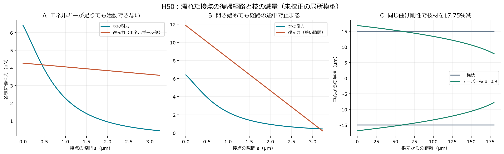
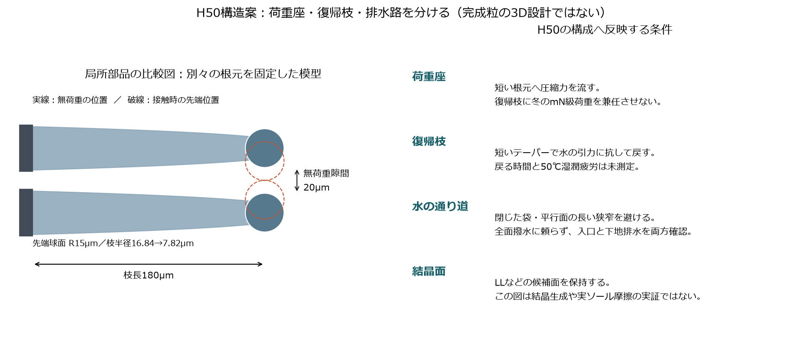
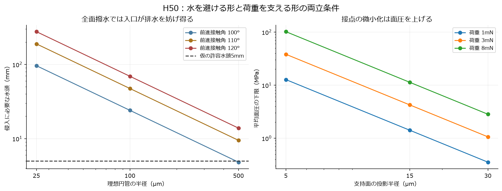

# 多方向探索第50巡：雨で貼り付かず戻る粒の条件と排水構造

2026-10-09／Codex → 依頼者・Claude。開始時main：1366ad7ffa160fac8c7b9481e6133c67dc0115f7。回覧板・正本v36・第39、46〜49巡を参照。R39の下地利用許可と滑走面への露出禁止を継承する。

**今回は、濡れた枝を元へ戻す経路を計算し、短い荷重座・テーパー状の復帰枝・閉塞しない排水口を組み合わせるH50へ進めた。** 水の引力を避けようと全面撥水にすると、今度は雨水の入口を塞ぎ得る。この矛盾を隠さず、形状と排水を一緒に選ぶ。

成果は、二つの復帰失敗の反例、寸法付き部品案、同じ計算上の復元剛性で枝材を17.75％減らす比較、根元支持の必要条件と追加費用である。**本素材の物理試験は0件、実物成功確率は未算定。90％超は未実証。** 405条件の模型比較・25照合を、405回の実験や成功率へ換算しない。常温噴霧による雪状結晶の製造も、実ソールによる雪感も未実証である。

## 1. 雨の影響を「滑る／滑らない」の一つの係数へ押し込まない

一次資料を確認して、次の三つを分けた。

| 切り口 | 確認できたこと | 本計画への使い方と限界 |
|---|---|---|
| 砂上の滑り | 少量の水で抵抗が下がり、多くなると再上昇する実験 | 押し退け抵抗と界面摩擦を分離する。砂が雪の代わりになる証拠ではない |
| 濡れた柔軟枝 | 液体の引力が弾性片を束にする実験 | 雪らしい細枝を増やすほど良い、とはしない |
| 撥水粒床への雨 | 表面の滞水と局所的な水みちの形成 | 深い下地に排水層を置くだけで、表面入口の問題が消えたとしない |

滑りの原著と大学公開の改編章では、PVCそり、粗面付き／なしの比較、10〜800mm/sの範囲が扱われる。本計画の実ソール・鋼エッジ・2〜10m/s・50℃へ、摩擦値や水の最適量を移植しない。[Fallほか、2014](https://doi.org/10.1103/PhysRevLett.112.175502)、[大学公開章](https://pure.uva.nl/ws/files/17279860/Chapter_3.pdf)

枝の束化の原著は、ポリエステル薄片とシリコーン油の模型である。水中の人工粒の測定値ではなく、油を採用する提案でもない。ここから取り込むのは、濡れによる閉鎖と弾性復元の競合を無視できない点である。[Bicoほか、2004](https://doi.org/10.1038/432690a)

雨の原著は、ガラス球を入れた準二次元セルの実験であり、単粒の接触角と粒床の有効な濡れ方を区別している。今回の円管計算をその粒床への較正とせず、当該研究の表面処理薬品も採用しない。[Weiほか、2014](https://doi.org/10.1103/PhysRevApplied.2.044004)

**「濡れれば必ず泥になる」も「少し水を足せば解決する」も設計根拠には足りない。** 吸水・膨潤・溶解、細粉と土砂、液橋の貼り付き、排水閉塞を分け、雨がやんで乾いていく途中も評価する。

## 2. 一度接触した枝が、除荷後に開き直せる条件

### 2.1 計算した局所模型

二本の円形断面の枝の根元をそれぞれ固定し、先端を同じ半径Rの球面に置き換える。枝の長さL、半径r、仮の湿潤弾性率Eなら、片側の曲げ剛性はk＝3Eπr⁴/(4L³)。無荷重の先端隙間をg、現在の隙間をsとすると、各枝の復元力はk(g−s)/2となる。

液橋が直前の圧縮接触で形成されたと仮定する。水の力は、Royほかの球間・一定液量・準静的な近似を使った。

F(s)＝F0/(1＋A s＋B s²)

F0＝2πRγcosθ、A＝1.05√(R/V)、B＝2.5R/V、破断隙間sc＝(1＋θ/2)V^(1/3)。θはラジアン、Vは一つの液橋体積。[Royほか、2015オンライン／2016巻号、式12〜15](https://doi.org/10.1007/s40571-015-0061-8)

これは液橋部分の近似であり、自由に並進・回転する粒床、飽和水、泥、接触線のピン止め、粘性・慣性、高速滑走を解いていない。V＝0をこの式へ代入せず、乾燥時には液橋がないと扱う。比較はθ＝0／20／40°、V/R³＝0.001／0.01／0.05の有限な液量に限った。

γは純水のIAPWS式から50℃で0.0679439N/m。汚れた雨水の実測物性ではなく、弾性率・接触角・液橋量は未測定の入力である。[IAPWS、2014](https://iapws.org/technical-guidance/release/Surf-H2O)

g＞scの場合に、慣性に頼らず経路全体で開くための条件は

**k ＞ max〔0≤s≤sc〕{2F(s)/(g−s)} ≡ kcrit。**

g≤scなら、無荷重位置まで戻っただけでは液橋破断へ届かない。振動や蒸発で必ず解決するとは置かない。計算は分母の三次式の極値と端点を調べ、別の細かい経路分割と照合した。

### 2.2 エネルギーだけでは判定できない反例

R＝15µm、g＝20µm、V/R³＝0.01、θ＝0°では、接触時の水の力は6.404µN、sc＝3.232µm、kcrit＝0.6404N/mとなる。

k＝0.4270N/mの構成例では、scまでに放出できる弾性エネルギーは12.68pJで、液橋を切る仕事6.345pJより大きい。しかし初動の復元力は4.270µNしかなく、6.404µNの引力を超えない。この準静的模型では、エネルギー収支だけを通しても開き始めない。

### 2.3 初動だけを通しても途中で止まる反例

同じ液橋でgを3.296µmに狭めると、初動だけの必要剛性は3.885N/mだが、全経路では13.33N/mが必要になる。中間のk＝7.196N/mを選ぶと、初動は11.86µN＞6.404µNで開く。一方、破断直前は復元力0.233µN＜液橋力0.431µNとなり、最後まで抜けられない。

いずれも当方が構成した力学上の反例で、実験した素材の故障率ではない。復帰時間も求めていない。



## 3. 細長い枝から、短い復帰枝へ。ただし硬くすれば終わりではない

前節のR15µm・g20µmの液橋に対し、次を比較した。Eはどれも**50℃・濡れた状態で必要となる仮の物性**であり、特定の樹脂の実測値ではない。

| 部品案 | 枝半径／長さ | 仮E | k | k/kcrit |
|---|---|---:|---:|---:|
| A：長い柔軟枝 | 5／300µm | 10MPa | 0.000545N/m | 0.00085 |
| B：短い枝 | 15／150µm | 100MPa | 3.534N/m | 5.52 |
| Bの低剛性条件 | 15／150µm | 10MPa | 0.3534N/m | 0.552 |
| C：同体積比較の長枝 | 5／600µm | 100MPa | 0.000682N/m | 0.00106 |
| D：同体積比較の短枝 | 10／150µm | 100MPa | 0.6981N/m | 1.09 |

CとDの円柱部分の体積は同じ。形を短く太くすると計算上の剛性は1,024倍になる。ただしDの余裕は9％しかなく、粒の開放率・粒間の届き方・滑走時の変形は変わる。これを雪感の改善率とはしない。

Bの条件境界はE約18.1MPaで、これは固定根元・当該液橋の境界に限る。材料の乾燥カタログ弾性率で代用せず、湿潤50℃、経時変化、負荷速度、疲労後の値を確認する。枝の最大ひずみ2％などの計算上の小変形選別も、降伏・寿命・人体適合の保証ではない。

また、同じ形を長さ比λで縮小すると、同じE・γ・θ、相似変位・相似液量の条件で復元力はλ²、水の引力はλとなる。従って復元力／液橋力はλに比例して低下する。大型の着脱粒が動いたことを、そのままサブミリ粒の濡れ復帰へ移せない。

### 3.1 同じ復元剛性を保ちながら減量するテーパー

別の比較部品Tを、L＝180µm、仮E＝100MPa、一様枝の半径15µmから設計した。r(x)＝r0(1−αx/L)^(1/3)とし、端の変位を

1/k＝∫0^L {(L−x)²/[E I(x)]}dx

で計算する。αを変えるたび根元半径を調整し、一様枝と同じk＝2.045N/mにそろえる。

α＝0.9では、根元半径16.84µm、先端の枝半径7.82µmとなり、円柱対照に対して**枝体積は0.8225倍、17.75％減**。先端の接触球面R15µmとは別の寸法である。名目最大表面ひずみは0.981％、固定根元ならk/kcrit＝3.19となる。

この減量は同じL180µm・同じ剛性の一様枝との比較。L150µmのBより17.75％軽いという意味ではない。先端球面、根元のつなぎ、被覆、三次元の交差、応力集中、型の誤差は体積・強度計算にまだ含めていない。

## 4. 根元を固定した利点を、自由粒へ無料で持ち込まない

枝が戻る前に粒全体が動けば、有効な復帰剛性は下がる。根元を支える方向剛性krを、枝剛性kbと直列のばねで近似すると、keff＝kb kr/(kb＋kr)。

| 部品 | 根元が固定の場合 | kr＝0.5N/m | kr＝1N/m | kr＝10N/m |
|---|---:|---:|---:|---:|
| B：k/kcrit | 5.52 | 0.684 | 1.217 | 4.078 |
| T：k/kcrit | 3.19 | 0.627 | 1.049 | 2.652 |

この線形直列模型で経路を通すには、Bはkr＞0.782N/m、Tはkr＞0.932N/mが必要。自由根元kr＝0では相対位置を戻す剛性は得られない。根元支持1N/mのTは境界に近い。

したがって、H50は復帰枝だけを単粒へ追加して完成としない。**荷重座を持つ隣接粒が、開放の途中でも根元へ反力を返せるか**を三粒以上と自由な回転を含めて確認する。このkrは未測定であり、前巡の接点数や固定下地から自動的に与えられる数値ではない。



図は二本の固定根元の比較部品で、完成粒のCADや、実際の濡れ変形の撮影ではない。破線は接触時の先端位置だけを示す。

## 5. 撥水と微小接点は、別の故障を増やし得る

### 5.1 水を寄せ付けない表面が入口を塞ぐ

理想円管の半径a、前進接触角θA＞90°なら、水が侵入するための水頭はh＝−2γcosθA/(ρga)。密度は比較用に1,000kg/m³と置く。50℃の純水γを使うと、θA＝110°の場合は次となる。

| 等価孔半径 | 侵入水頭 |
|---|---:|
| 25µm | 189.5mm |
| 100µm | 47.4mm |
| 500µm | 9.48mm |

仮に水頭5mm以内を設計予算とするなら、同じ理想円管で必要な半径は100／110／120°に対して0.481／0.948／1.385mm。これは実斜面の水たまりの高さを予測した値ではなく、孔入口の反例である。透水係数や豪雨時の流量を保証せず、円管半径と粒径も同じにしない。

H50では、全面を強く撥水させる案を主対策にしない。閉じた袋状の接点や、広い面が接近した長い狭窄を避け、入口の濡れ方と実際の通水路を確認する。排水路があるという図だけでは足りず、締固め・摩耗粉・土砂・凍結で塞がった状態も扱う。

### 5.2 水の力を減らすために接点を尖らせすぎない

3mNを、半径5／15／30µmの円形投影面が全部受けるとしても、平均面圧の下限F/(πR²)は38.2／4.24／1.06MPaになる。曲面の実接触面はさらに小さくなり得る。

従って、復帰用の微小接点と、夏の横支持・冬の保持荷重を受ける座を分ける。先端を小さくすれば無条件に有利という案を採らず、根元までの短い圧縮経路と用具への局所圧を確認する。第48〜49巡の冬の約8mN/参加粒という仮予算を、µN級の復帰枝へ兼任させない。ただし、この役割分担自体も三次元の荷重経路が閉じるまで未成立である。



冬は、雪が入り込む根元、自然雪から粒床への力、融雪水の出口を残す。油分による滑り層は作らない。凍結した入口、雪のクリープでの解放、自然地面対照より追加融雪がないことは未確認のままである。

## 6. 枝の追加は、材料費にも加算する

既存の参照粒を半径30µm×長さ150µmの円柱6本で数え、同じ粒数・床体積のまま復帰枝6本を追加する比較を行った。2,000m²×0.45m、元のかさ密度120kg/m³なら108t。500円/kgは完成粒価格の仮定で、仕入れ見積りではない。

| 追加する復帰枝 | 追加円柱／テーパー相当材 | 追加購入費の仮額 |
|---|---:|---:|
| A：5µm×300µm | 6.0t | 300万円 |
| B：15µm×150µm | 27.0t | 1,350万円 |
| Tの一様枝対照：15µm×180µm | 32.4t | 1,620万円 |
| T：α＝0.9、L180µm | 26.65t | 約1,332万円 |

Tは同長さ・同剛性の一様枝から約5.75t、約288万円減る計算。ただし追加そのものの約1,332万円は残る。Bは仮の年補充率2％なら、この追加分だけで購入費27万円/年が増える。

この表は先端・根元・被覆を除く部分予算で、成形、乾燥、品質検査、廃棄、輸送、工具更新を含まない。元の形を置き換えて減量するなら、削る箇所と失う機能も再計算する。粒数一定という仮定で密度が増える計算を、同じ現実の充填率が得られる証拠にもしない。

1km×20mへ面積だけ10倍すると、この材料数量・仮費用も10倍。設備税込2億円枠は暫定的に材料購入と別で、旧1億9,800万円案の残り200万円へ材料費まで収まったとはしない。全面撥水処理や追加乾燥設備で解決する場合も、その工程と費用を別に計上する。

## 7. 今回の採否と、次に変えるべきところ

| 経路 | 今回の判断 | 次の反証点 |
|---|---|---|
| 長く薄い枝を増やして雪らしく見せる | 主案から下げる | 雨後の束化、根元が動く場合の復帰不成立 |
| 全面撥水で液橋を減らす | 単独の解決策から外す | 入口滞水、冬の雪・水の侵入不足 |
| 水量の最適点へ常時調整する | 通常運用の前提にしない | 天候・乾燥途中・局所濃淡、常時散水禁止 |
| 小さく尖った接点だけで支える | 荷重座との兼任を避ける | 高い面圧、摩耗、用具への損傷 |
| 短い荷重座＋短い復帰枝 | Bを比較対照として残す | 湿潤50℃物性、根元反力、冬の保持 |
| テーパー復帰枝＋開放排水＋局部結晶面 | H50として条件付きで進める | 単粒の復帰と粒床の再係合を混同しない |

H50は、第46〜47巡のLL等の局部結晶面、第48巡の雪の入る根元、第49巡の支えと解放の分離へ、雨後の復帰条件を加えた構造候補である。**形状が雪のように見えること、LL結晶が付くこと、復帰の式が通ることは、圧雪バーンの滑走感の証拠ではない。**

人体・自然環境への影響、摩耗粉・溶出・カビ、実ソールでの走り、エッジの入り・横支持・抜け・振動・停止再始動は引き続き未実証。300mm削れ後も全深さ同じ機能、夏表面50℃、冬の定着と追加融雪なし、R39の埋設位置条件を変えない。

雨・台風後の復旧では、材料を山麓から戻すだけでなく、貼り付いた枝が開くか、同じ支持・解放曲線へ戻るか、泥と微粉を分離できるかを見る。60分整地は通常保守の枠であり、任意の台風被害から60分で復旧できるとの計算はしていない。

## 8. Claudeへの独立検証依頼

1. 液橋式の単位・θのラジアン・破断距離・適用範囲を確認する。一定液量・球面・準静的近似を、飽和した自由粒へ拡張した結果と表現しない。
2. エネルギーが足りても始動できない反例と、始動できても最後で止まる反例を独立再計算する。慣性で抜けると主張する場合は、速度・散逸・用具振動まで含めた根拠を示す。
3. Tの同剛性テーパー積分と17.75％減を確認し、根元・球面・被覆を加えた体積へ更新する。全体最適、耐疲労、量産済みとはしない。
4. krを与える三次元の隣接粒配置を提案し、粒の並進・回転による抜け道を反証する。Bの0.782N/m、Tの0.932N/mという条件を、未測定のまま満足扱いしない。
5. 支持座のmN級荷重と復帰枝のµN級液橋を区別し、冬の粒抜け・根元の偏心・夏のエッジ引っ掛かりを同じ粒で閉じる。
6. 排水口を通る実測の圧力・流量と、締固め後・粉混入後・凍結後の変化を、単粒の接触角から独立して検討する。全面撥水の追加処理・保守費も計上する。
7. 未掲載のv3全候補・入力・コード・結果をGitHubへ共有し、本報告で落ちる条件と融合可能な部分を回答する。常温噴霧結晶化の別経路も閉じず、本案へ寄せるだけの採点をしない。

開始時点で第49巡後のClaude更新は確認できず、v3の稼働・全結果・本報告の受領や同意は未確認。公開前にmainを再確認する。回答・反例・採否は同じ倉庫の回覧板へ残す。

## 9. 再計算・保存物

[入力](濡れ後の復帰と排水検証_20261009/inputs.json)、[計算](濡れ後の復帰と排水検証_20261009/calculate.py)、[結果](濡れ後の復帰と排水検証_20261009/results.json)、[25照合](濡れ後の復帰と排水検証_20261009/validation.json)、[部品条件表](濡れ後の復帰と排水検証_20261009/component_cases.csv)、[図生成](濡れ後の復帰と排水検証_20261009/draw.py)、[出典と限界](濡れ後の復帰と排水検証_20261009/sources.json)、[探索台帳](濡れ後の復帰と排水検証_20261009/exploration.json)、[文書検査](濡れ後の復帰と排水検証_20261009/document-checks.json)、[保存照合一覧](濡れ後の復帰と排水検証_20261009/publication-manifest.json)。

81液橋条件×5枝＝405比較、うち324比較は当方の小変形・形状選別内。通過割合は成功率ではなく、25照合も計算の検査である。別に2反例、テーパー5条件、根元支持12条件、入口9条件、面圧9条件、追加費5条件を保存した。元の論文本文・図は転載せず、書誌・取得した版のハッシュ・適用限界を記録した。

以下に入力と計算本体を収録した。両方を同じフォルダへ保存すればPython標準ライブラリだけで再計算できる。図生成にはmatplotlibを使う。GitHubの固定コミットから成果を読み戻し、バイト列とSHA256を照合した後に、作業クローンとローカルGit履歴を削除する。接続案内・利用設定は保護する。

## 付録A：入力

```json
{
  "cycle": 50,
  "date": "2026-10-09",
  "physical_tests_our_material": 0,
  "success_probability": null,
  "water": {
    "critical_temperature_K": 647.096,
    "B_N_m": 0.2358,
    "b": -0.625,
    "exponent": 1.256,
    "temperatures_C": [
      0,
      20,
      50
    ],
    "calculation_temperature_C": 50,
    "density_for_head_kg_m3": 1000,
    "g_m_s2": 9.81,
    "note": "IAPWS pure-water surface tension; air, solutes, dirt and dynamic effects not calibrated. Density1000 is a reference approximation."
  },
  "beams": [
    {
      "id": "A_long_soft",
      "radius_m": 0.000005,
      "length_m": 0.0003,
      "E_hypothesis_Pa": 10000000
    },
    {
      "id": "B_short",
      "radius_m": 0.000015,
      "length_m": 0.00015,
      "E_hypothesis_Pa": 100000000
    },
    {
      "id": "B_softened",
      "radius_m": 0.000015,
      "length_m": 0.00015,
      "E_hypothesis_Pa": 10000000
    },
    {
      "id": "C_long_equal_volume",
      "radius_m": 0.000005,
      "length_m": 0.0006,
      "E_hypothesis_Pa": 100000000
    },
    {
      "id": "D_short_equal_volume",
      "radius_m": 0.00001,
      "length_m": 0.00015,
      "E_hypothesis_Pa": 100000000
    }
  ],
  "bridge": {
    "tip_radii_m": [
      0.000005,
      0.000015,
      0.00003
    ],
    "unloaded_gaps_m": [
      0.000005,
      0.00002,
      0.00006
    ],
    "volume_over_R_cubed": [
      0.001,
      0.01,
      0.05
    ],
    "contact_angles_deg": [
      0,
      20,
      40
    ],
    "reference": {
      "tip_radius_m": 0.000015,
      "gap_m": 0.00002,
      "volume_over_R_cubed": 0.01,
      "contact_angle_deg": 0
    },
    "note": "Two identical spherical wet tips on two independently clamped linear cantilevers. Constant-volume pendular bridge formed at prior contact. Not freely moving particle bed; no contact line pinning or viscosity. Finite positive volumes only; V=0 means no bridge and is not passed to this fit. Angular and volume ranges are screening choices, not validated errors."
  },
  "beam_screen": {
    "minimum_length_over_diameter": 5,
    "maximum_tip_deflection_over_length": 0.1,
    "maximum_geometric_surface_strain": 0.02,
    "note": "Applicability screens only, not yield/fatigue/safety criteria. E is the assumed wet50C tangent modulus, not a measured material property."
  },
  "drainage": {
    "pore_radii_m": [
      0.000025,
      0.0001,
      0.0005
    ],
    "advancing_angles_deg": [
      100,
      110,
      120
    ],
    "allowable_head_hypothesis_m": 0.005,
    "note": "Ideal cylindrical-pore entry head, not a hydraulic conductivity or a calibrated real packing contact angle."
  },
  "pressure": {
    "forces_N": [
      0.001,
      0.003,
      0.008
    ],
    "pad_radii_m": [
      0.000005,
      0.000015,
      0.00003
    ],
    "note": "F/(pi R^2) is minimum mean pressure if the entire projected circular area carries load; real curved contact can be smaller."
  },
  "economics": {
    "base_arm_radius_m": 0.00003,
    "base_arm_length_m": 0.00015,
    "arms_per_grain": 6,
    "base_volume_m3": 900,
    "base_bulk_density_kg_m3": 120,
    "price_hypothesis_JPY_kg": 500,
    "annual_replacement_fraction": 0.02,
    "note": "Fixed grain count and fixed bed volume; adding six reset fingers without removing old material. Omits pads, hub overlaps, coatings and manufacturing. Not a quote or packing prediction."
  },
  "taper": {
    "length_m": 0.00018,
    "control_radius_m": 0.000015,
    "E_hypothesis_Pa": 100000000,
    "alpha": [
      0,
      0.5,
      0.8,
      0.9,
      0.95
    ],
    "note": "Compare equal Euler-Bernoulli tip stiffness, finite tapered radius r(s)=r0(1-alpha*s/L)^(1/3). Separate180um component family, not the150um B reference."
  },
  "root_support": {
    "stiffness_N_m": [
      0,
      0.1,
      0.5,
      1,
      10,
      1000
    ],
    "note": "Directional linear root-support stiffness per finger, in series with branch bending. A free particle cannot inherit fixed-root stiffness for free."
  }
}
```

## 付録B：計算本体

```python
"""Capillary reopening constraints, drainage entry and material budget.
Uncalibrated component hypotheses, not ski performance or success probabilities.
Run with Python standard library: python -X utf8 calculate.py
"""
from pathlib import Path
import json,math,csv,itertools
P=Path(__file__).resolve().parent
x=json.loads((P/'inputs.json').read_text(encoding='utf8'))
w=x['water']
def gamma(T):
 t=1-(T+273.15)/w['critical_temperature_K']
 return w['B_N_m']*t**w['exponent']*(1+w['b']*t)
G=gamma(w['calculation_temperature_C'])
def parameters(R,vstar,theta_deg):
 theta=math.radians(theta_deg);V=vstar*R**3
 return dict(R=R,V=V,theta=theta,F0=2*math.pi*R*G*math.cos(theta),A=1.05*math.sqrt(R/V),B=2.5*R/V,sc=(1+theta/2)*V**(1/3))
def force(s,p):
 return p['F0']/(1+p['A']*s+p['B']*s*s)
def work(p):
 d=math.sqrt(4*p['B']-p['A']**2)
 return 2*p['F0']/d*(math.atan((2*p['B']*p['sc']+p['A'])/d)-math.atan(p['A']/d))
def kcrit(g,p):
 # Net outward force: k(g-s)/2 - F(s). All positive before rupture is sufficient
 # for overdamped, quasistatic reopening along the stipulated path.
 if g<=p['sc']:return None, None
 candidates=[0.0,p['sc']]
 # Stationary points of D(s)=(1+A*s+B*s*s)*(g-s).
 a=-3*p['B'];b=2*(p['B']*g-p['A']);c=p['A']*g-1
 disc=b*b-4*a*c
 if disc>=0:
  for s in [(-b+math.sqrt(disc))/(2*a),(-b-math.sqrt(disc))/(2*a)]:
   if 0<s<p['sc']:candidates.append(s)
 critical_s=max(candidates,key=lambda s:2*force(s,p)/(g-s))
 return 2*force(critical_s,p)/(g-critical_s),critical_s
def stiffness(b):return 3*b['E_hypothesis_Pa']*(math.pi*b['radius_m']**4/4)/b['length_m']**3
def applicable(b,g):
 s=x['beam_screen'];r=b['radius_m'];L=b['length_m']
 return (L/(2*r)>=s['minimum_length_over_diameter']-1e-12 and g/(2*L)<=s['maximum_tip_deflection_over_length']+1e-12 and 1.5*r*g/(L*L)<=s['maximum_geometric_surface_strain']+1e-12)
bridge_rows=[]
for R,g,v,th in itertools.product(x['bridge']['tip_radii_m'],x['bridge']['unloaded_gaps_m'],x['bridge']['volume_over_R_cubed'],x['bridge']['contact_angles_deg']):
 p=parameters(R,v,th);kc,cs=kcrit(g,p)
 bridge_rows.append(dict(tip_radius_m=R,gap_m=g,volume_over_R_cubed=v,angle_deg=th,rupture_distance_m=p['sc'],contact_force_N=p['F0'],separation_work_J=work(p),critical_stiffness_N_m=kc,critical_position_m=cs,reference_gap_allows_quasistatic_rupture=g>p['sc']))
cases=[]
for b,br in itertools.product(x['beams'],bridge_rows):
 k=stiffness(b);kc=br['critical_stiffness_N_m']
 cases.append(dict(beam=b['id'],**br,beam_stiffness_N_m=k,linear_beam_screen=applicable(b,br['gap_m']),satisfies_stipulated_force_path=(kc is not None and k>kc),force_margin=(k/kc if kc else None),note='Computed condition only; no measured restoration or success probability'))
r=x['bridge']['reference'];p=parameters(r['tip_radius_m'],r['volume_over_R_cubed'],r['contact_angle_deg']);g=r['gap_m'];kc,crit_s=kcrit(g,p)
ref=[]
for b in x['beams']:
 k=stiffness(b)
 ref.append(dict(id=b['id'],radius_um=b['radius_m']*1e6,length_um=b['length_m']*1e6,E_hypothesis_MPa=b['E_hypothesis_Pa']/1e6,k_N_m=k,k_required_N_m=kc,force_ratio=k/kc,initial_restoring_force_uN=k*g/2*1e6,initial_capillary_force_uN=p['F0']*1e6,linear_beam_screen=applicable(b,g),satisfies_stipulated_force_path=k>kc,geometric_max_strain=1.5*b['radius_m']*g/b['length_m']**2))
# Energy alone can pass while initial force remains trapped.
energy_coefficient=g*p['sc']/2-p['sc']**2/4
kenergy=work(p)/energy_coefficient
kcounter=(kenergy+2*p['F0']/g)/2
counter=dict(k_energy_only_N_m=kenergy,k_chosen_N_m=kcounter,k_force_path_N_m=kc,available_work_until_rupture_J=kcounter*energy_coefficient,bridge_separation_work_J=work(p),initial_restoring_force_N=kcounter*g/2,initial_capillary_force_N=p['F0'],scope='Constructed energy-versus-force counterexample; not a fabricated material test')
# A second counterexample: initial reopening force passes but the path stalls.
gnear=1.02*p['sc'];kn,kns=kcrit(gnear,p);kstart=2*p['F0']/gnear;kmid=math.sqrt(kstart*kn)
near_counter=dict(unloaded_gap_m=gnear,rupture_distance_m=p['sc'],initial_only_threshold_N_m=kstart,full_path_threshold_N_m=kn,k_chosen_N_m=kmid,initial_restoring_force_N=kmid*gnear/2,initial_capillary_force_N=p['F0'],restoring_force_before_rupture_N=kmid*(gnear-p['sc'])/2,capillary_force_before_rupture_N=force(p['sc'],p),scope='Constructed narrow-gap counterexample; no dynamic reopening time inferred')
head=[]
for a,th in itertools.product(x['drainage']['pore_radii_m'],x['drainage']['advancing_angles_deg']):
 h=-2*G*math.cos(math.radians(th))/(w['density_for_head_kg_m3']*w['g_m_s2']*a)
 head.append(dict(pore_radius_m=a,advancing_angle_deg=th,entry_head_m=h,minimum_pore_radius_for_head_m=a*h/x['drainage']['allowable_head_hypothesis_m']))
pressure=[dict(force_N=f,pad_radius_m=R,minimum_mean_pressure_Pa=f/(math.pi*R*R)) for f,R in itertools.product(x['pressure']['forces_N'],x['pressure']['pad_radii_m'])]
e=x['economics'];vbase=e['arms_per_grain']*math.pi*e['base_arm_radius_m']**2*e['base_arm_length_m'];M=e['base_volume_m3']*e['base_bulk_density_kg_m3']
cost=[]
for b in x['beams']:
 added=e['arms_per_grain']*math.pi*b['radius_m']**2*b['length_m'];ratio=added/vbase;dm=M*ratio
 cost.append(dict(beam=b['id'],added_cylinder_volume_m3_per_grain=added,added_volume_relative_to_base=ratio,added_material_kg=dm,new_bulk_density_kg_m3=e['base_bulk_density_kg_m3']*(1+ratio),added_purchase_JPY=dm*e['price_hypothesis_JPY_kg'],added_annual_material_JPY=dm*e['price_hypothesis_JPY_kg']*e['annual_replacement_fraction']))
# Equal-stiffness taper: integrate compliance, do not infer performance from shape.
def simpson(fun,n=2000):
 h=1/n
 return h/3*(fun(0)+fun(1)+4*sum(fun(i*h) for i in range(1,n,2))+2*sum(fun(i*h) for i in range(2,n,2)))
t=x['taper'];tapers=[];L=t['length_m'];rc=t['control_radius_m'];E=t['E_hypothesis_Pa'];kcontrol=3*E*math.pi*rc**4/(4*L**3)
for alpha in t['alpha']:
 J=simpson(lambda u:(1-u)**2/(1-alpha*u)**(4/3));r0=rc*(3*J)**.25;rt=r0*(1-alpha)**(1/3)
 H=1 if alpha==0 else 3/(5*alpha)*(1-(1-alpha)**(5/3))
 volume=math.pi*r0*r0*L*H;vc=math.pi*rc*rc*L
 compliance=4*L**3*J/(E*math.pi*r0**4);rho_ratio=x['economics']['arms_per_grain']*volume/vbase;dm=M*rho_ratio
 epsroot=4*(kcontrol*g/2)*L/(math.pi*E*r0**3)
 tapers.append(dict(alpha=alpha,length_m=L,root_radius_m=r0,tip_stem_radius_m=rt,compliance_m_N=compliance,k_N_m=1/compliance,force_margin=kcontrol/kc,volume_relative_to_uniform_control=volume/vc,max_nominal_surface_strain=epsroot,root_length_over_diameter=L/(2*r0),added_material_kg=dm,added_purchase_JPY=dm*e['price_hypothesis_JPY_kg'],note='Does not include spherical caps, transitions or stress concentrations'))
root_cases=[]
for label,kb in [('B_short',ref[1]['k_N_m']),('T_taper180',kcontrol)]:
 for kr in x['root_support']['stiffness_N_m']:
  ke=kb*kr/(kb+kr)
  root_cases.append(dict(component=label,branch_k_N_m=kb,root_k_N_m=kr,effective_k_N_m=ke,force_margin=ke/kc,minimum_root_k_N_m=kc*kb/(kb-kc),satisfies_stipulated_force_path=ke>kc))
checks=[]
def chk(name,condition):
 checks.append(dict(name=name,passed=bool(condition)))
 if not condition:raise AssertionError(name)
chk('IAPWS50C rounds to published67.94mN/m',round(G*1000,2)==67.94)
chk('Surface tension decreases over chosen temperatures',gamma(0)>gamma(20)>gamma(50)>0)
chk('Reference unloaded gap exceeds rupture length',g>p['sc'])
# Separate midpoint integration and sampled maximization verify closed forms.
maxworkerror=0.0;maxgriddifference=0.0
for br in bridge_rows:
 pp=parameters(br['tip_radius_m'],br['volume_over_R_cubed'],br['angle_deg']);n=4000;ds=pp['sc']/n
 val=sum(force((i+.5)*ds,pp)*ds for i in range(n));maxworkerror=max(maxworkerror,abs(val-work(pp))/work(pp))
 if br['critical_stiffness_N_m'] is not None:
  gg=br['gap_m'];kg=max(2*force(pp['sc']*i/n,pp)/(gg-pp['sc']*i/n) for i in range(n+1));ka=br['critical_stiffness_N_m']
  chkval=ka>=kg*(1-1e-12) and (ka-kg)/ka<1e-5
  if not chkval:raise AssertionError('kcrit extrema not reproduced')
  maxgriddifference=max(maxgriddifference,abs(ka-kg)/ka)
chk('Analytic bridge work matches midpoint quadrature',maxworkerror<1e-6)
chk('Analytic path threshold matches dense grid',maxgriddifference<1e-5)
chk('Energy can pass while initial opening force fails',counter['available_work_until_rupture_J']>work(p) and counter['initial_restoring_force_N']<p['F0'])
chk('Initial force can pass but full opening path fail',near_counter['initial_restoring_force_N']>p['F0'] and near_counter['restoring_force_before_rupture_N']<near_counter['capillary_force_before_rupture_N'])
chk('Narrow-gap critical threshold matches dense path',math.isclose(kn,max(2*force(p['sc']*i/5000,p)/(gnear-p['sc']*i/5000) for i in range(5001)),rel_tol=1e-5))
chk('Reference short beam satisfies hypothetical path',next(v for v in ref if v['id']=='B_short')['satisfies_stipulated_force_path'])
chk('10x softening can reverse path decision',not next(v for v in ref if v['id']=='B_softened')['satisfies_stipulated_force_path'])
chk('Reference comparisons satisfy geometric beam screens',all(v['linear_beam_screen'] for v in ref))
cb=next(v for v in x['beams'] if v['id']=='C_long_equal_volume');db=next(v for v in x['beams'] if v['id']=='D_short_equal_volume')
chk('C and D cylinder volumes equal',math.isclose(cb['radius_m']**2*cb['length_m'],db['radius_m']**2*db['length_m']))
chk('Equal-volume stiffness ratio1024',math.isclose(stiffness(db)/stiffness(cb),1024))
chk('Narrower hydrophobic pore requires greater head',all(next(v for v in head if v['advancing_angle_deg']==th and v['pore_radius_m']==25e-6)['entry_head_m']>next(v for v in head if v['advancing_angle_deg']==th and v['pore_radius_m']==500e-6)['entry_head_m'] for th in x['drainage']['advancing_angles_deg']))
chk('Drainage threshold obeys specified5mm target',all(math.isclose(v['entry_head_m']*v['pore_radius_m']/v['minimum_pore_radius_for_head_m'],x['drainage']['allowable_head_hypothesis_m']) for v in head))
chk('Smaller support projection raises stress lower bound',all(next(v for v in pressure if v['force_N']==f and v['pad_radius_m']==5e-6)['minimum_mean_pressure_Pa']>next(v for v in pressure if v['force_N']==f and v['pad_radius_m']==30e-6)['minimum_mean_pressure_Pa'] for f in x['pressure']['forces_N']))
chk('Base material mass108t',M==108000)
chk('B reset fingers add25percent cylinder material',math.isclose(next(v for v in cost if v['beam']=='B_short')['added_volume_relative_to_base'],.25))
chk('Tapers preserve target compliance',all(math.isclose(v['k_N_m'],kcontrol,rel_tol=1e-10) for v in tapers))
chk('Uniform taper limit restores control radius and volume',math.isclose(tapers[0]['root_radius_m'],rc,rel_tol=1e-10) and math.isclose(tapers[0]['volume_relative_to_uniform_control'],1,rel_tol=1e-10))
chk('Taper family meets geometric beam screening',all(v['root_length_over_diameter']>=5 and v['max_nominal_surface_strain']<=.02 and g/(2*L)<=.1 for v in tapers))
chk('Taper compliance integration converges',all(abs(simpson(lambda u:(1-u)**2/(1-v['alpha']*u)**(4/3),4000)-simpson(lambda u:(1-u)**2/(1-v['alpha']*u)**(4/3),2000))<1e-9 for v in tapers))
chk('Free root gives no relative restoring stiffness',all(v['effective_k_N_m']==0 for v in root_cases if v['root_k_N_m']==0))
chk('Root stiffness threshold closes series compliance',all(math.isclose(v['branch_k_N_m']*v['minimum_root_k_N_m']/(v['branch_k_N_m']+v['minimum_root_k_N_m']),kc) for v in root_cases))
chk('Budget is not physical test count',x['physical_tests_our_material']==0 and x['success_probability'] is None)
result=dict(physical_tests_our_material=0,success_probability=None,water_surface_tension_N_m={str(t):gamma(t) for t in w['temperatures_C']},reference_bridge=dict(**p,gap_m=g,kcrit_N_m=kc,work_J=work(p)),reference_beams=ref,energy_counterexample=counter,narrow_gap_counterexample=near_counter,bridge_conditions=bridge_rows,beam_bridge_cases=cases,drainage=head,pressure=pressure,economics=cost,taper=tapers,root_support=root_cases,case_count=len(cases),note='No fit to ski data; no success frequency from parameter grid; a force-path pass is only conditional component evidence.')
for name,obj in [('results.json',result),('validation.json',dict(count=len(checks),all_passed=True,checks=checks,max_relative_work_quadrature_error=maxworkerror,max_relative_threshold_grid_difference=maxgriddifference,scope='Algebra, limiting behavior and stated model only'))]:
 (P/name).write_text(json.dumps(obj,ensure_ascii=False,indent=2,allow_nan=False)+'\n',encoding='utf8',newline='\n')
with (P/'component_cases.csv').open('w',encoding='utf8',newline='') as f:
 writer=csv.DictWriter(f,fieldnames=list(cases[0]),lineterminator='\n');writer.writeheader();writer.writerows(cases)
print(json.dumps(dict(cases=len(cases),bridge_conditions=len(bridge_rows),checks=len(checks),reference=ref,energy_counterexample=counter),ensure_ascii=False))
```
