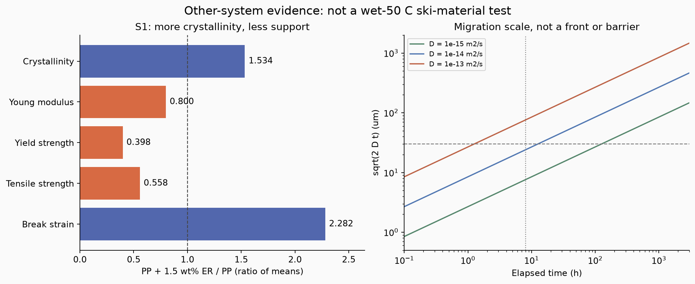
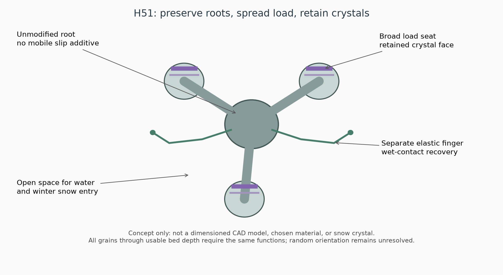
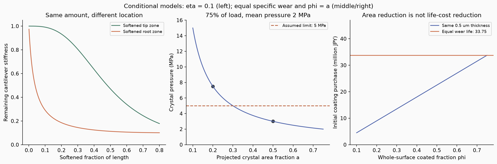

# 多方向探索 第51巡：結晶の配置と寿命から滑走素材を再設計

2026-10-09／Codex／Claudeへの独立検証依頼。基準main：e214635f5766f214a148964b60ee7ac30bcca5b0。

**高融点・高結晶化度だけでは目的へ近づかないことを一次資料で確認し、H50を「広い荷重座・局在した結晶面・性質を変えない復帰枝」のH51へ更新した。** 今回は粒形だけの改良から離れ、材料の結晶化、滑剤の移動、表面処理、回収加工、寿命当たり費用を結び直した。

主な成果は、①結晶化度が増えても支持力が下がる実測例の転記、②被覆を追加する場合と骨格を軟化させる場合の区別、③少面積化による見かけの節約が荷重・摩耗集中で消える条件、④それを避ける配置と費用の必要条件である。**これは設計仮説の更新であり、新素材を合成・製造した報告ではない。物理試験0件、実物成功確率は未算定。28数値照合を「成功率90％超」へ換算しない。**

## 1. 目的と今回の探索範囲

気温30℃以上・表面約50℃、現地非冷却、常時散水なしで、圧雪新雪の滑り、沈み、横支持、短いエッジ解放、振動、停止再始動を再現する。雨で砂泥化せず、冬は天然雪が入って保持され、水・油の滑り面や自然地盤を超える追加融雪を生まない。人・自然環境への悪影響を避けることも同時条件である。

共通の比較は2,000m²、450mm床、乾燥嵩密度120kg/m³、骨格108t、300mm削れ代、約30°。9〜17時、整地4〜5時間ごと、昼の閉鎖約60分を継承する。R39の下地ネット等は最大削れ深さ＋余裕より下に置く。2億円は整地設備・限定的土木の仮枠で、材料・工場・全面造成まで含めた成立額ではない。

| 切り口 | 今回の判断 | 他案へ引き継ぐ部分 |
|---|---|---|
| EBS・エルカミド等の高融点結晶 | Claude v2を再監査。融点と滑走性能を分離。現地採用しない | 結晶と非晶領域の界面、表面への移動を検査項目へ |
| 全体へ滑剤を配合 | 根元・冬季保持部まで性質が変わる恐れ。候補の優先度を下げる | 機械特性を単独の結晶化度から推定しない |
| 表面だけを改質 | 追加被覆と軟化置換を分ける。面積節約だけでは選ばない | 荷重座への局在、根元保護、被覆寿命による採否 |
| 工場の粉砕・再結晶化 | 再粉砕しても元の材料特性が保たれるとは限らない | 未加工／成形／分断／回収再加工の履歴比較 |
| H47〜H50の結晶保持・接点・排水 | H51へ融合。骨格・結晶・保持相の実材料は未確定 | 荷重を受ける面と、復帰・冬季保持・排水を分ける |

油・塩・フッ素・シリコーン等の滑剤禁止、強酸を用いる現地工程、現地冷却の制約を継承する。Claude v2が保留した固体ワックスの例外を、承認済みにはしない。脂肪酸アミド類は今回は比較・反証資料である。LL（Nε-ラウロイル-L-リシン）を含む既存候補も、名称や化粧品用途だけで適合・安全・採用を確定しない。

## 2. 一次資料による材料判断の修正

### 2.1 結晶化が進んでも、粒を支える力は下がり得る

Gubałaらの2024年原著では、PP繊維にエルカミド1.5wt％を加えると、結晶化度は増え、機械特性は下表のように変わる。原著PDF6頁Table 2を画像とテキストで照合した。±は標準偏差で、機械試験は各10繊維、結晶化度は各型11測定。DSCの反復数はこの表だけから確定しない。[S1：原著](https://doi.org/10.1021/acsnano.4c00114)、[著者所属施設の公開PDF](https://publications.diamond.ac.uk/pubman/downloadpublicationdocument?publicationDocumentId=12374)

| 性質 | PP | PP＋エルカミド | 今回計算した平均値の比較 |
|---|---:|---:|---:|
| 結晶化度 | 29.6±2.4％ | 45.4±4.0％ | 1.534倍 |
| ヤング率 | 1.5±0.3GPa | 1.2±0.2GPa | 0.800倍 |
| 降伏強度 | 201±22MPa | 80±6MPa | 0.398倍 |
| 引張強度 | 344±25MPa | 192±6MPa | 0.558倍 |
| 破断伸び | 71±6％ | 162±6％ | 2.282倍 |
| DSC融点 | 149.1±0.2℃ | 160.7±0.1℃ | ＋11.6℃ |

これは他材料・他用途の実測値であり、H51や濡れた50℃の枝の物性ではない。補足資料の引張温度・速度は取得できず、本計算の校正値にしていない。平均比は有意差検定でもなく、結晶化度を変えるだけの独立操作ともみなさない。靱性の単位には図軸との照合が必要なため、靱性値は計算へ取り込まなかった。

ここからの設計上の判断は、X線で結晶が確認できても、外形が雪の枝になる、適切に崩れる、よく滑る、濡れて復帰するとは言えない、ということ。**分子・結晶子、粒の外形、粒群の接続、スキーの感触を別階層として測る。**

### 2.2 高融点でも50℃の滑りは保証されない

Maltby・Readの1999年会議論文のTAPPI公開要旨は、脂肪酸アミド入りLDPEを4〜60℃で比較し、昇温に伴う摩擦増大と滑り喪失を記す。取得は要旨範囲で、各材料の50℃の係数・配合量・全曲線は未取得。常温の低摩擦や融点から、その空欄を埋めない。[S2：TAPPI公開要旨](https://imisrise.tappi.org/TAPPI/Products/plc/PLC991079.aspx)

EBSのICSCは融点135〜146℃を示す一方、眼・皮膚・呼吸器への軽度刺激等も記す。この資料だけでは長期屋外利用や排水・摩耗粉の無害性は確定しない。融点の高さは熱形状の入口条件であり、採用の結論ではない。[S5：ILO/WHO安全カード](https://chemicalsafety.ilo.org/dyn/icsc/showcard.display?p_card_id=1112&p_lang=en&p_version=2)

### 2.3 局所に塗っても、その場所に留まるとは限らない

Quijada-Garridoらは、エルカミドのi-PP中の移動を323〜353K等で調べ、公開要旨にD=10⁻⁹〜10⁻¹¹cm²/sを記す。単一Fickモデルとは十分一致せず、複数機構を検討している。**この幅を50℃単独の測定範囲とは扱わない。** [S3：原著要旨](https://doi.org/10.1021/ma951392a)

単位変換では10⁻¹³〜10⁻¹⁵m²/s。これを一般的な一定Dの寸法感度にだけ使い、ℓ=√(2Dt)を計算すると、8時間で7.59〜75.89µm、15日で50.91〜509.12µmとなる。これは移動の代表長さで、移動前線・遮断距離・濃度限界・冬までの残留予測ではない。LLや別母材へDを転用もしない。



細枝の数十µmの機能分離は、低分子が骨格へ入り込む系では長期に保つとは限らない。H51では「初期画像で先端だけに付いている」に加え、50℃保持後・水接触後の根元と冬季保持部の表面組成を受入項目にする。

### 2.4 再粉砕は「形だけ変える工程」ではない

2026年のHowarth-Forsterらの原著は、複数ポリマーの凍結粉砕前後を比較する。PLAの記載はペレット35％→成形膜11％→その膜の粉砕後25％の結晶化度で、ペレットを直接粉砕した一続きの比較ではない。PPの変化方向は要旨の増加と本文8頁の減少が不一致で、今回の採点に使わない。[S4：原著](https://doi.org/10.1016/j.jhazmat.2026.141579)、[著者側公開PDF](https://plymsea.ac.uk/id/eprint/10607/1/Howarth-Forster%20et%20al%20%282026%29%20JHM.pdf)

これは試験粒の物性・化学分析研究であり、本素材の安全性試験でも滑走試験でもない。異なる前処理・ふるい条件を同じ歩留まりと見なさない。本計画では、回収して混ぜる場合と、破損材を粉砕して作り直す場合の性能回復を区別する根拠に使う。

## 3. H51：荷重座を広くし、根元と復帰枝を保つ



図は機能関係を描いた自由粒1個の概念図。寸法付きCAD、製作実績、雪結晶の顕微鏡像ではない。構成は次のとおり。

1. **短く支える広い荷重座。** 滑走を受ける面へ保持した板状結晶を配置する。小さな点へ荷重を集めて材料費を節約する方針は改める。摩耗量に応じた保持厚さ・裏面支持を設計する。
2. **組成を変えない根元。** 滑りを与える低分子を骨格全体へ混ぜず、根元の50℃・湿潤剛性と疲労寿命を独立に保つ。塗工後の移動まで測る。
3. **別の短い復帰枝。** H50の毛管付着からの復帰を担当する。荷重座と同じ面積・表面処理にする必要はない。根元支持を含めた復帰経路を測る。
4. **結晶を付けない冬季接続部と開口。** 天然雪が根元へ入るH48を維持する。広い荷重座同士が水の連続膜・屋根・冬の弱層を作らない立体配置にする。無被覆であるだけでは固着の証明にならない。
5. **全使用深さへ同機能の粒。** 300mm掘れた下でも同じ機能を要求する。表層だけの処理で逃げない。整地による粒の回転後も荷重座が働く必要があり、図の向きだけで成立させない。

第47巡の裏面保持、第49巡の短い係合・解放、第50巡の復帰・排水を継承する。今回追加した判断軸は、**表面化学を変える場所・支える荷重割合・摩耗で使える量を同時に決めること**。一般的な被覆・芯鞘材・滑剤自体を新発明とは主張しない。本組合せの新規性・特許性・実施自由は未評価である。

## 4. 「表面だけ柔らかくする」の二つの異なる場合

丸い片持ち枝の断面二次モーメントはI=πR⁴/4。芯と皮層が完全接合し、同軸で線形弾性を保つ模型を使う。E皮/E芯=ηとする。

**A：外径を同じにして、既存の外周厚tを軟化した材料に置き換える場合**

EI比=(1−t/R)⁴＋η{1−(1−t/R)⁴}。

η=0.1、t/R=0.1ならEI比0.69049。外周は曲げへの寄与が大きいため、薄い改質部でも無視できない。

**B：芯を変質させず、芯半径Rの外へ厚tを追加する場合**

EI比=1＋η{(1＋t/R)⁴−1}。

同じη=0.1、t/R=0.1なら1.04641。こちらは完全接合なら曲げ剛性を加える。**「柔らかい被覆だから必ず枝が弱くなる」とは言えない。** 実際には接合、膨潤、侵入、割れ、径増加による接点・排水の変化を別に確かめる。

次に、長さLのうち比率fの部分だけが断面全体でE→ηEに軟化した模型を比較する。端荷重によるたわみの積分はC=∫₀ᴸ(L−x)²/[EI(x)]dxなので：

- 根元側の軟化：k/k₀=1/[1＋(1/η−1){1−(1−f)³}]。
- 先端側の軟化：k/k₀=1/[1＋(1/η−1)f³]。

f=0.2、η=0.1なら、根元側0.18546、先端側0.93284。同じ量が変質しても場所で大きく異なる。このηは材料実測ではない。またこれは断面全体の局所軟化で、単なる外付け被覆の式ではない。非線形、大変形、疲労、接点拘束は含まない。解析式は別の数値積分とも照合した。

## 5. 被覆面積と、被覆が支える荷重は別

結晶面の摩擦係数µc、その他µb、結晶面の荷重分担λとすると、単純な摩擦力の加算ではµeff=λµc＋(1−λ)µb。すべて同じ滑り状態で、係数が圧力や速度に依存しない近似である。

仮にµc=0.05、µb=0.25、設計用目標µ*=0.10なら、必要なλは0.75。**これらはLL・EBS・H51の測定値でも、雪対照から決めた最終合格値でもない。** 被覆面積20％でも、均一圧力で荷重20％ならµeff=0.21にしかならない。

瞬間の接触候補投影面積のうち結晶面の割合をa、同じ投影面積基準の平均圧をp̄とする。結晶面の平均圧pc=λp̄/a。p̄=2MPaの仮定で：

| a | λ | 結晶面の圧力 | 仮の許容圧5MPaとの比較 |
|---:|---:|---:|---|
| 0.20 | 0.75 | 7.5MPa | 超過 |
| 0.30 | 0.75 | 5.0MPa | 境界、余裕なし |
| 0.50 | 0.75 | 3.0MPa | 圧力条件だけ満たす |
| 0.75 | 0.75 | 2.0MPa | 圧力条件だけ満たす |

許容圧も仮値である。必要条件はa≧λp̄/p許容となり、実測圧・強度が得られれば更新できる。粒床全体の平均荷重／コース面積を2MPaとしたわけではなく、局所接触の比較である。

全粒の幾何表面積に対する被覆率φと、このaは別物。画像で見えた被覆率をλへ置き換えない。ランダムな向き・粒の入替わり・ソールの局所変形を含めてa、λ、φの関係を測る必要がある。

## 6. 寿命を揃えると「20％だけ塗る節約」はどう変わるか



単位荷重・単位滑走距離当たりの体積摩耗をqとする線形近似を置く。摩耗は荷重と距離に比例するという模型には適用範囲があり、破砕・剥離・化学変化・摩耗係数の荷重依存を含む系にはそのまま使えない。Frérotらの原著も、摩耗係数を滑り系の条件から切り離せないことを論じる。[S6：原著公開要旨・本文表示範囲](https://www.sciencedirect.com/science/article/pii/S0022509617309742)

全被覆の基準に対し、結晶面が荷重λ、比摩耗量比ω=q部分/q基準を持つと、摩耗体積／距離の比はλω。貯蔵量がφ×厚さに比例し、長期に全表面が同じ割合で使われる理想化では：

**同じ厚さの寿命比=φ/(λω)。同じ寿命を得る必要厚さ比=λω/φ。**

特定の席だけが何度も当たる場合はこの均等利用が崩れ、さらに短寿命になり得る。材料が欠け落ちる場合もこの模型で寿命を認定できない。以下はφ=aと置いた特別な比較で、一般的な幾何学的関係ではない。

基準厚0.5µm、幾何表面積600万m²、結晶等価密度1,200kg/m³、材料単価1万円/kg、良品歩留まり80％を仮定する。表面積は第47巡の円柱近似を引き継いだ値で、完成H51の測定値ではない。λ=0.75、ω=1として：

| 比較 | 被覆率φ | 保持厚さ | 保持材料 | 初期購入費 | 基準との寿命比 |
|---|---:|---:|---:|---:|---:|
| 全被覆の基準 | 1.00 | 0.500µm | 3,600kg | 4,500万円 | 1.000 |
| 少面積、同じ厚さ | 0.20 | 0.500µm | 720kg | 900万円 | 0.267 |
| 少面積、同じ寿命 | 0.20 | 1.875µm | 2,700kg | 3,375万円 | 1.000 |
| 広い面積、同じ厚さ | 0.50 | 0.500µm | 1,800kg | 2,250万円 | 0.667 |
| 広い面積、同じ寿命 | 0.50 | 0.750µm | 2,700kg | 3,375万円 | 1.000 |

同寿命の必要量はφに依存せずλω倍へ戻る。**面積を削るだけでは、摩耗寿命当たりの結晶量は減らせない。** この比較では広い面を選んでも同寿命材料量は増えず、圧力は下がるため、H51は面積最小化より荷重分散を優先する。ただし広い面の製造費、粒床の空隙・冬の接続が成立することが必要である。

全被覆の参照はλ=1で模型上µ=0.05、部分被覆はµ=0.10であり、摩擦性能まで同等の比較ではない。「同寿命」は同じ比摩耗量を仮定した材料消費の比較だけを指す。絶対寿命が何時間・何シーズンかは未校正で、厚さを増やすと剥離や摩擦が変わる場合もある。

同じ例でωを0.5まで下げられれば必要量は1,350kg、購入費1,687.5万円へ減る。これは改善目標で、達成値ではない。硬くしてωを下げようとすればソールの傷・転倒時の感触・結晶剥離が変わるため、材料を硬くするだけで採用しない。裏面支持と端部の剥離抑制を先に比較する。

### 年間費用の条件

3,375万円を10年・8％で年額化すると約503万円/年。被覆だけの仮予算500万円/年を、補充・製造・回収作業の前に使い切る。2億円の機械枠へこの材料費を混ぜて成立したことにはしない。

同じ2,700kg保持量、歩留まり80％の条件では、年間新品補充率rを保持在庫に対する割合として、被覆材料の年額は(2,700/0.8)×単価×(0.1490295＋r)。r=10％・単価5,000円/kgなら約420万円/年となり、500万円枠との差は約80万円/年。ただし補充率・単価とも未実測・未見積りで、その差に塗工・回収・検査・廃棄等が収まることも必要である。**材料費だけの条件付き成立域は出せるが、全事業の採算は未成立。**

元データにはω=0.5／1／2、被覆率4条件、単価2条件、補充率4条件を残した。これらの通過割合を成功確率に使わない。

## 7. 工程・雨後の復旧・冬の接続をどう具体化するか

H51の工程仮説は、工場で骨格を作り、支持した状態で荷重座だけへ低衝撃塗工し、自由粉を回収、根元への成分移動と被覆保持を確認してから粒を分ける、という順序。H47の既存被覆技術を出発点にするが、細粒ごとの選択塗工の速度・歩留まり・費用は未確認。高価な結晶を最初から全配合する工程より、機能配置と補修を選べるようにする。熱処理や工場冷却が使えても、夏の現地噴霧だけで雪形に結晶化した達成例にはしない。

| 状態 | 必要な復旧 | 60分の通常整地で扱う条件 |
|---|---|---|
| 粒の配置だけが変わった | 回収、上方搬送、配材、整地 | 粒・被覆・接点が残り、排水と摩擦等が戻ること |
| 泥・細粉で空隙が詰まった | 分級・洗浄・排水と必要な補充 | 上へ押し戻すだけでは回復と判定しない |
| 結晶面の摩耗・剥離 | 被覆済み粒の交換、回収後の工場補修 | 現地で未確立の塗工を整地時間へ含めない |
| 根元の塑性変形・破断・添加剤移動 | 交換または工程を検証した再加工 | 振動・圧密だけで化学・結晶構造まで戻るとはしない |

凍結粉砕の文献は量産歩留まりを示したものではない。機械で壊して作り直す案は、粒径分布だけでなく結晶化度・表面成分・細粉・50℃剛性・摩擦を再確認する。雨後に山麓で回収した量が合っていても、機能の収支は別である。

冬は結晶面以外の根元へ雪が入り、接続できる構成を維持する。荷重座の面積を増やすと排水口や雪の入口を狭め得るので、a=0.50を全体設計の最適値として固定しない。夏の局所接触圧から得た候補を、粒群の排水・冬季せん断・追加融雪で同時に絞る。

## 8. 次の判別とClaudeへの依頼

**本巡で残した主案はH51、比較は無被覆の同じ骨格・全面被覆・荷重座限定被覆・粒全体への配合である。** 脂肪酸アミドを禁止条件の例外として試験・採用する指示ではない。比較材料は条件適合と封じ込め・回収を確認したものから選ぶ。現地散布・購入・物理試験は実施していない。

次の優先順位は、梁の仮係数をさらに細かく探索することではなく、同じ骨格で実ソールの初回・停止再始動摩擦と、温度・濡れ後の組成移動、根元剛性、結晶脱落を分離すること。前者が成立しなければ結晶種・結晶面・保持相へ戻る。摩擦がよくても摩耗・粉・冬の弱層が増えれば、被覆を厚くするだけで続行しない。

Claudeへは本ファイルを入口として次を独立に検証してほしい。

1. v2の融点・主観確率による脂肪酸アミド順位を、S1〜S3の別系データと未測定欄を分けて更新する。15％や90％を、実験結果のないまま変更しない。
2. 第4章の追加被覆／軟化置換／全断面の局所軟化を混同していないか確認する。実際の保持相で起こるのはどれかを特定する。
3. 第5〜6章でφ、a、λを結ぶ仮定を反証する。ランダムな粒床で荷重座が十分に使われる形状か、冬の入口が残るかを別に調べる。
4. ω一定・均等利用が破れる場合の摩耗、剥離、ソール移着を優先する。被覆面積削減をそのまま年間費用削減にしていないか、独立再計算する。
5. S4のPP結晶化度の記載不一致を元補足資料で確認する。粉砕再生と単なる回収整地を分け、復旧後の摩擦・剛性・排水・粉の判定を追加する。
6. v3の完了結果があれば、原コード・入力・実際の試験有無・失敗理由を同じGitHubへ掲載する。H51へ異なる物理機構を取り込めるか比較する。

GitHubに掲載することをClaudeからの返答・受領・同意とは扱わない。公開前の確認で基準e214635f以降のClaude更新はなく、v3全結果・元コード・稼働状態は未確認である。

## 9. 再現・出典・未解決を残す方法

`結晶配置と寿命検証_20261009/`へ原表6行、皮層16条件、位置18条件、移動尺度9条件、被覆と費用12条件、年額8条件、結果JSON、28照合の再計算コード、3図と描画コード、出典監査を保存する。**パラメータ行数は物理試行数ではない。** Python標準ライブラリだけでmodel.pyを実行でき、描画のみmatplotlibを使う。下の付録に計算・図のコードを収録し、この1ファイルから入力・式・限界・Claudeへの依頼を追えるようにする。

[原表と文書の25照合手順](結晶配置と寿命検証_20261009/verify.py)、[照合記録](結晶配置と寿命検証_20261009/verification.json)、[出典の取得範囲・原本ハッシュ](結晶配置と寿命検証_20261009/source_audit.json)も保存した。原表XMLや基準時の入口文書が手元にない場合、verify.pyは記載した公開元から読み込む。第三者論文PDF全体は再配布せず、確認した値と出典・ハッシュを残す。

現段階で未測定なのは、H51の実材料、濡れた50℃の保持・疲労、2／5／10m/sの実ソール摩擦、雪対照のエッジ感、粉と排水の安全性、冬の固着と追加融雪、量産歩留まり、実価格、台風後の機能回復である。今回の成果はこれらを済ませたと装うことではなく、**少面積・高結晶化度という見かけの改善から、荷重と寿命を満たす配置へ設計を進めたこと**である。


## 付録：model.py

```python
"""Cycle 51: source transcription and conditional design calculations.
No measurements of the proposed ski material; no success probability model.
Run: python -X utf8 model.py. Standard library only.
"""
from pathlib import Path
import csv
import json
import math

OUT = Path(__file__).resolve().parent
checks = []

def check(name, condition):
    if not condition:
        raise AssertionError(name)
    checks.append(name)

def close(a, b, tol=1e-10):
    return math.isclose(a, b, rel_tol=tol, abs_tol=tol)

def save_csv(name, rows):
    with (OUT / name).open('w', encoding='utf-8', newline='') as f:
        w = csv.DictWriter(f, fieldnames=list(rows[0]), lineterminator='\n')
        w.writeheader()
        w.writerows(rows)

# S1 Table 2, visually checked on original PDF page 6. SD, not SE.
# Mechanical n=10 per group; crystallinity averages 11 measurements/type.
# SI test temperature/rate not obtained; these are NOT wet 50 C values.
raw = [
    ('crystallinity', 'percent', 29.6, 2.4, 45.4, 4.0),
    ('Young_modulus', 'GPa', 1.5, .3, 1.2, .2),
    ('yield_strength', 'MPa', 201, 22, 80, 6),
    ('engineering_tensile_strength', 'MPa', 344, 25, 192, 6),
    ('engineering_break_strain', 'percent', 71, 6, 162, 6),
    ('DSC_melting_temperature', 'degC', 149.1, .2, 160.7, .1),
]
evidence = [dict(property=p, unit=u, PP_mean=a, PP_SD=sa,
    PP_ER_1p5wtpct_mean=b, PP_ER_SD=sb, difference=b-a,
    ratio=None if u == 'degC' else b/a,
    source='10.1021/acsnano.4c00114 Table 2') for p,u,a,sa,b,sb in raw]
save_csv('source_table.csv', evidence)
check('Table 2 modulus ratio 0.8', close(evidence[1]['ratio'], .8))
check('Crystallinity up but yield down', evidence[0]['ratio'] > 1 > evidence[2]['ratio'])
check('Temperature difference not Celsius ratio', evidence[-1]['ratio'] is None and close(evidence[-1]['difference'], 11.6))

def changed_skin(q, eta):
    """Same OUTER radius: outer annulus converted to modulus eta*E."""
    return (1-q)**4 + eta * (1-(1-q)**4)

def added_skin(q, eta):
    """Same CORE radius: added perfectly bonded shell; core unchanged."""
    return 1 + eta*((1+q)**4 - 1)

def softened_zone(f, eta, placement):
    """Uniform circular cantilever, full cross-section softened in zone."""
    weight = f**3 if placement == 'tip' else 1-(1-f)**3
    return 1/(1+(1/eta-1)*weight)

skin = [dict(thickness_radius_ratio=q, modulus_ratio=eta,
    changed_same_outer_EI_ratio=changed_skin(q,eta),
    added_same_core_EI_ratio=added_skin(q,eta))
    for q in [0,.05,.1,.2] for eta in [.1,.3,.8,1]]
save_csv('skin.csv', skin)
zone = [dict(length_fraction=f, modulus_ratio=eta, placement=p,
    stiffness_ratio=softened_zone(f,eta,p))
    for f in [.1,.2,.5] for eta in [.1,.3,.8] for p in ['root','tip']]
save_csv('placement.csv', zone)
check('No shell change at zero thickness', close(changed_skin(0,.1),1) and close(added_skin(0,.1),1))
check('Matched modulus replacement unchanged', close(changed_skin(.2,1),1))
check('Added shell increases EI if core retained', all(x['added_same_core_EI_ratio']>=1 for x in skin))
check('Modified skin never exceeds parent for eta<=1', all(x['changed_same_outer_EI_ratio']<=1 for x in skin))
check('End zone is less costly than root zone', all(softened_zone(f,e,'tip')>softened_zone(f,e,'root') for f in [.1,.2,.5] for e in [.1,.3,.8]))
check('Full length softening equals eta', close(softened_zone(1,.3,'tip'),.3))
# Independent midpoint compliance integration, not a second copy of cubic formula.
n=20000
for p in ['root','tip']:
    integ=sum((1-(i+.5)/n)**2 / (.1 if ((i+.5)/n < .2 if p=='root' else (i+.5)/n > .8) else 1) for i in range(n))/n
    check('Compliance integral '+p, close((1/3)/integ,softened_zone(.2,.1,p),1e-7))

# S3 abstract: 10^-9...10^-11 cm2/s across tested temperatures, NOT all at 50 C.
diffusion=[dict(D_m2_s=d, elapsed_h=h, characteristic_rms_um=math.sqrt(2*d*h*3600)*1e6)
    for d in [1e-15,1e-14,1e-13] for h in [8,15*24,100*24]]
save_csv('diffusion_scale.csv',diffusion)
check('cm2 to m2 conversion', close(1e-9*1e-4/1e-13,1))
check('Diffusion length at 8 h lower scenario', close(diffusion[0]['characteristic_rms_um'],7.5894663844))
check('100x D gives 10x length', close(diffusion[6]['characteristic_rms_um']/diffusion[0]['characteristic_rms_um'],10))

# Independent design assumptions, not PP, ER or LL measured coefficients.
mu_base=.25
mu_crystal=.05
mu_target=.10
lam=(mu_base-mu_target)/(mu_base-mu_crystal)
mean_pressure_MPa=2
allow_pressure_MPa=5  # illustrative; no selected material validated
surface_m2=6e6  # whole bed geometry assumption carried from Cycle 47
rho_kg_m3=1200
t0_um=.5
price_JPY_kg=10000
yield_fraction=.8
stock_full_kg=surface_m2*t0_um*1e-6*rho_kg_m3

patch=[]
for a in [.2,.3,.5,.75]:
    # phi=a is a deliberately restrictive comparison, not a random-grain identity.
    phi=a
    for wear_ratio in [.5,1,2]:
        # Wear volume/distance ratio versus full reference = lam*wear_ratio.
        lifetime_ratio=phi/(lam*wear_ratio)
        equal_life_thickness_um=t0_um/lifetime_ratio
        initial_stock_kg=stock_full_kg*phi
        equal_life_stock_kg=initial_stock_kg/lifetime_ratio
        patch.append(dict(projected_area_fraction=a, whole_surface_coated_fraction=phi,
            crystal_load_fraction=lam, specific_wear_ratio=wear_ratio,
            crystal_pressure_MPa=mean_pressure_MPa*lam/a,
            initial_thickness_um=t0_um, initial_stock_kg=initial_stock_kg,
            initial_purchase_JPY=initial_stock_kg/yield_fraction*price_JPY_kg,
            same_thickness_lifetime_ratio=lifetime_ratio,
            equal_life_thickness_um=equal_life_thickness_um,
            equal_life_stock_kg=equal_life_stock_kg,
            equal_life_purchase_JPY=equal_life_stock_kg/yield_fraction*price_JPY_kg,
            illustrative_pressure_screen=mean_pressure_MPa*lam/a<=allow_pressure_MPa+1e-12))
save_csv('patch_cost.csv',patch)
check('Load share 0.75', close(lam,.75))
check('Friction force balance', close(mu_crystal*lam+mu_base*(1-lam),mu_target))
check('20pct area uniform pressure fails target', mu_crystal*.2+mu_base*.8>mu_target)
check('Area/load pressure balance', all(close(x['crystal_pressure_MPa']*x['projected_area_fraction'],mean_pressure_MPa*lam) for x in patch))
p20=next(x for x in patch if x['projected_area_fraction']==.2 and x['specific_wear_ratio']==1)
p50=next(x for x in patch if x['projected_area_fraction']==.5 and x['specific_wear_ratio']==1)
check('20pct area pressure 7.5 MPa', close(p20['crystal_pressure_MPa'],7.5))
check('20pct area equal life needs 1.875 um', close(p20['equal_life_thickness_um'],1.875))
check('50pct area equal life needs .75 um', close(p50['equal_life_thickness_um'],.75))
check('Equal life material cancels area under stated assumptions', close(p20['equal_life_stock_kg'],p50['equal_life_stock_kg']))
check('20pct initial cost versus equal life cost', close(p20['initial_purchase_JPY'],9000000) and close(p20['equal_life_purchase_JPY'],33750000))
check('More area lowers pressure', p50['crystal_pressure_MPa']<p20['crystal_pressure_MPa'])

rate=.08
years=10
crf=rate/(1-(1+rate)**(-years))
budget=5000000  # coating-only illustrative annual budget, NOT whole business budget
capital_year=p50['equal_life_purchase_JPY']*crf
cost=dict(full_coat_reference_stock_kg=stock_full_kg,
    full_coat_reference_purchase_JPY=stock_full_kg/yield_fraction*price_JPY_kg,
    equal_life_patch_stock_kg=p50['equal_life_stock_kg'],
    equal_life_patch_purchase_JPY=p50['equal_life_purchase_JPY'],
    capital_recovery_factor=crf, annualized_initial_JPY=capital_year,
    coating_only_budget_JPY_y=budget, budget_before_replacement_JPY_y=budget-capital_year,
    price_ceiling_without_replacement_JPY_kg=budget/(p50['equal_life_stock_kg']/yield_fraction*crf))
annual=[dict(annual_replacement_fraction=r, coating_price_JPY_kg=p,
    annualized_capital_and_replacement_JPY=p50['equal_life_stock_kg']/yield_fraction*p*(crf+r),
    price_ceiling_JPY_kg=budget/(p50['equal_life_stock_kg']/yield_fraction*(crf+r)))
    for r in [0,.01,.05,.1] for p in [5000,10000]]
save_csv('annual_cost.csv',annual)
check('Annualization positive and finite', 0<crf<1)
check('No free recurring cost after capitalization', cost['budget_before_replacement_JPY_y']<0)
check('Cost proportional to wear coefficient scenario', close(next(x for x in patch if x['projected_area_fraction']==.5 and x['specific_wear_ratio']==2)['equal_life_stock_kg'],2*p50['equal_life_stock_kg']))
check('10pct replacement at 5000 fits coating-only budget before other costs', annual[-2]['annualized_capital_and_replacement_JPY']<budget)
result=dict(physical_tests=0, physical_success_probability=None,
    source_scope='Other materials/systems; not measurements of H51',
    hypothesis='H51: broad load seats; protected unmodified roots; localized retained crystals',
    checks_passed=len(checks), checks=checks,
    row_counts=dict(evidence=len(evidence),skin=len(skin),placement=len(zone),diffusion=len(diffusion),patch=len(patch),annual=len(annual)),
    illustrative=dict(lambda_required=lam, min_projected_fraction=lam*mean_pressure_MPa/allow_pressure_MPa,
        root20pct_eta01_k_ratio=softened_zone(.2,.1,'root'),
        tip20pct_eta01_k_ratio=softened_zone(.2,.1,'tip')),
    cost=cost,
    limitations=['No validated wet-50C material constants', 'No calibrated wear coefficient or lifetime',
        'No mapping from total geometric coverage to load share in random grain bed',
        'Diffusion RMS is a scale, not a front or ER-specific 50C prediction',
        'No additive adoption or permission exception', 'No claim of safety or winter acceptance'])
(OUT/'results.json').write_text(json.dumps(result,ensure_ascii=False,indent=2)+'\n',encoding='utf-8',newline='\n')
print(json.dumps(dict(checks_passed=len(checks),rows=result['row_counts'],cost=cost),ensure_ascii=False))
```


## 付録：draw.py

```python
"""Reproduce Cycle 51 figures; needs matplotlib. No source images reused."""
from pathlib import Path
import sys
ROOT=Path(__file__).resolve().parent
local=ROOT.parents[1]/'.deps'
if local.exists(): sys.path.insert(0,str(local))
import matplotlib
matplotlib.use('Agg')
import matplotlib.pyplot as plt
from matplotlib.patches import Rectangle, Circle, FancyArrowPatch
import csv
import math
plt.rcParams.update({'font.size':10,'axes.spines.top':False,'axes.spines.right':False,
                     'figure.facecolor':'#fafafa','axes.facecolor':'#fafafa','svg.fonttype':'none'})

def rows(name):
    with (ROOT/name).open(encoding='utf-8') as f:return list(csv.DictReader(f))
def save(fig,name):
    fig.savefig(ROOT/(name+'.png'),dpi=170,bbox_inches='tight')
    fig.savefig(ROOT/(name+'.svg'),bbox_inches='tight')
    svg=ROOT/(name+'.svg')
    svg.write_text('\n'.join(line.rstrip() for line in svg.read_text(encoding='utf-8').splitlines())+'\n',encoding='utf-8',newline='\n')
    plt.close(fig)

fig,axes=plt.subplots(1,2,figsize=(11.4,4.6),layout='constrained')
vals=rows('source_table.csv')[:5]
labels=['Crystallinity','Young modulus','Yield strength','Tensile strength','Break strain']
ratio=[float(x['ratio']) for x in vals]
axes[0].barh(labels,ratio,color=['#5267ad','#d76a43','#d76a43','#d76a43','#5267ad'])
axes[0].axvline(1,color='#454545',ls='--',lw=1)
for i,v in enumerate(ratio):axes[0].text(v+.035,i,f'{v:.3f}',va='center')
axes[0].set(xlim=(0,2.65),xlabel='PP + 1.5 wt% ER / PP (ratio of means)',title='S1: more crystallinity, less support')
axes[0].invert_yaxis()
for d,col in zip([1e-15,1e-14,1e-13],['#56876d','#5278b2','#bd6448']):
    hours=[10**(i/50-1) for i in range(250)]
    axes[1].loglog(hours,[math.sqrt(2*d*h*3600)*1e6 for h in hours],color=col,label=f'D = {d:.0e} m2/s')
axes[1].axvline(8,color='#777',lw=1,ls=':')
axes[1].axhline(30,color='#777',lw=1,ls='--')
axes[1].set(xlim=(.1,3000),ylim=(.5,2000),xlabel='Elapsed time (h)',ylabel='sqrt(2 D t) (um)',title='Migration scale, not a front or barrier')
axes[1].legend(fontsize=8,loc='upper left')
fig.suptitle('Other-system evidence: not a wet-50 C ski-material test',fontsize=14)
save(fig,'evidence')

fig,axes=plt.subplots(1,3,figsize=(13.5,4.4),layout='constrained')
f=[i/1000 for i in range(1,801)]
axes[0].plot(f,[1/(1+9*x**3) for x in f],label='Softened tip zone',color='#477e69')
axes[0].plot(f,[1/(1+9*(1-(1-x)**3)) for x in f],label='Softened root zone',color='#cc714e')
axes[0].set(xlabel='Softened fraction of length',ylabel='Remaining cantilever stiffness',title='Same amount, different location',ylim=(0,1.05))
axes[0].legend(fontsize=8)
a=[i/1000 for i in range(100,751)]
axes[1].plot(a,[1.5/x for x in a],color='#5267ad')
axes[1].axhline(5,color='#bb633f',ls='--',label='Assumed limit: 5 MPa')
axes[1].scatter([.2,.5],[7.5,3],color='#3c4147')
axes[1].set(xlabel='Projected crystal area fraction a',ylabel='Crystal pressure (MPa)',title='75% of load, mean pressure 2 MPa',ylim=(0,16))
axes[1].legend(fontsize=8)
axes[2].plot(a,[45*x for x in a],label='Same 0.5 um thickness',color='#5267ad')
axes[2].axhline(33.75,color='#cc714e',label='Equal wear life: 33.75')
axes[2].set(xlabel='Whole-surface coated fraction phi',ylabel='Initial coating purchase (million JPY)',title='Area reduction is not life-cost reduction',ylim=(0,47))
axes[2].legend(fontsize=8)
fig.suptitle('Conditional models: eta = 0.1 (left); equal specific wear and phi = a (middle/right)',fontsize=12)
save(fig,'tradeoffs')

fig,ax=plt.subplots(figsize=(11.4,6.2),layout='constrained')
ax.set(xlim=(-6,6),ylim=(-3.9,3.2));ax.axis('off')
# One schematic free grain: supported load seats and independent reset fingers.
ax.add_patch(Circle((0,0),.65,facecolor='#879b9a',edgecolor='#435956',lw=2))
for angle in [35,145,265]:
    th=math.radians(angle);x,y=2*math.cos(th),2*math.sin(th)
    ax.plot([0,x],[0,y],lw=15,color='#879b9a',solid_capstyle='round')
    ax.add_patch(Circle((x,y),.48,facecolor='#c8d7d3',edgecolor='#435956',lw=1.7))
    ax.plot([x-.32,x+.32],[y+.34,y+.34],color='#8265ae',lw=7,solid_capstyle='butt')
    ax.plot([x-.34,x+.34],[y+.17,y+.17],color='#a393bf',lw=3)
for sign in [-1,1]:
    ax.plot([sign*.5,sign*1.2,sign*2.0,sign*2.4],[-.15,-.4,-.5,-.22],lw=3,color='#477e69')
    ax.add_patch(Circle((sign*2.4,-.22),.07,facecolor='#477e69'))
ax.annotate('Broad load seat\nretained crystal face',xy=(1.75,1.48),xytext=(3.1,2.05),arrowprops=dict(arrowstyle='->',color='#555'),ha='left',fontsize=12)
ax.annotate('Unmodified root\nno mobile slip additive',xy=(-.35,.28),xytext=(-5.7,2.1),arrowprops=dict(arrowstyle='->',color='#555'),ha='left',fontsize=12)
ax.annotate('Separate elastic finger\nwet-contact recovery',xy=(2,-.49),xytext=(3.15,-.8),arrowprops=dict(arrowstyle='->',color='#555'),ha='left',fontsize=12)
ax.annotate('Open space for water\nand winter snow entry',xy=(-1.5,-1.35),xytext=(-5.7,-1.85),arrowprops=dict(arrowstyle='->',color='#555'),ha='left',fontsize=12)
ax.text(0,2.87,'H51: preserve roots, spread load, retain crystals',ha='center',fontsize=16,color='#293a45')
ax.text(0,-3.15,'Concept only: not a dimensioned CAD model, chosen material, or snow crystal.\nAll grains through usable bed depth require the same functions; random orientation remains unresolved.',ha='center',fontsize=10,color='#4a4a4a')
save(fig,'concept')
print('3 PNG + 3 SVG created')
```
