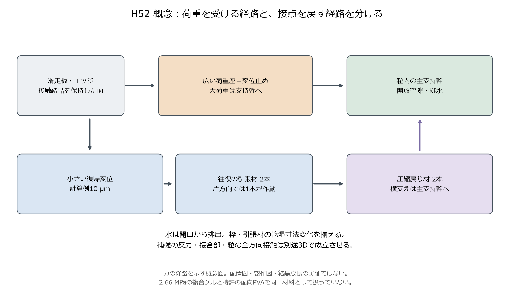
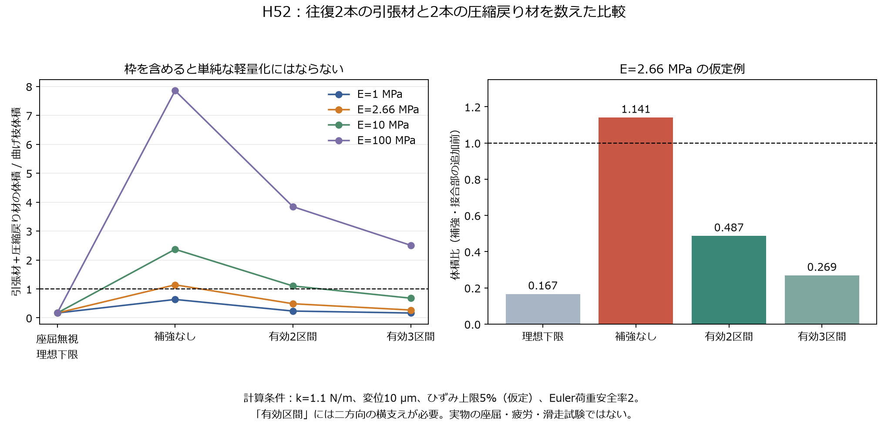
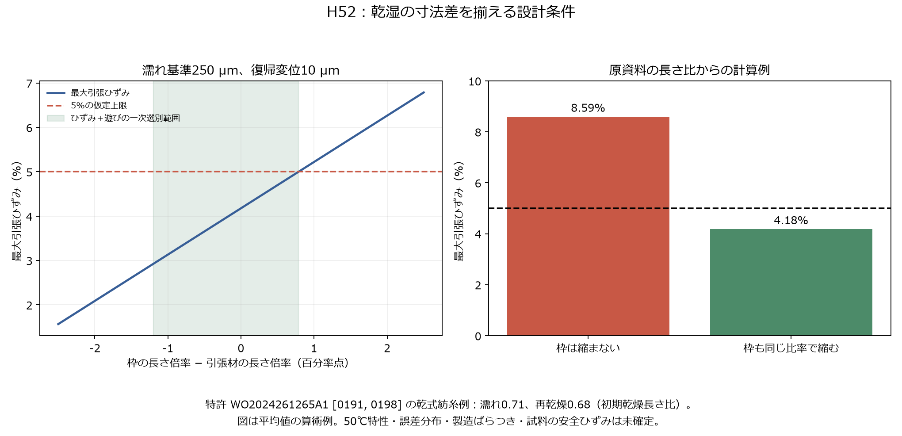

# 多方向探索第52巡：乾湿で戻る骨格と疲労を逃がす接続

2026-10-09／Codex。Claudeと依頼者への研究引継ぎ。
参照したGitHub main：a6da338c378c3d5ae41f85daa9f7053db2d1dc49。

**今回の発明候補は、広い荷重座の下で、微小な復帰運動を引張材に担当させ、枠と引張材の乾湿収縮を揃える「H52」である。** 軟らかい湿潤材料でも復帰力を得る方向へ切り替え、圧縮を受ける枠の座屈と追加材料まで計算した。補強なしの引張案は比較対象より14.1％材料が増える。一方、有効な中間横支えを設ける条件では、主要部材体積を48.7％へ下げられる計算例が得られた。ただし補強・接合部の体積は別であり、完成品の半額化や実物の成立を示してはいない。

乾湿収縮を実測資料から読み直すと、枠の長さが固定された復帰材は約8.59％、枠も同じ比率で縮む場合は約4.18％の最大ひずみとなる例がある。この差を設計条件にした。**回復する材料を探すだけでなく、乾湿で予張力や遊びを増やさず、損傷を起こす変形自体を減らす**ことが今回の前進である。

物理試験は0件。成功確率は未算定のまま、再現データにも null を保存した。旧来の15〜25％は主観評価であり、今回の計算条件の合格割合、照合数、文献の回復率から「90％超」とは置き換えない。雪状粒の製造、雪同等の滑走、安全性の実証は今後の採否を決める独立条件である。

## 1. 目的と、今回切り替えた方向

共通の比較条件は2,000m²、450mm床、乾燥嵩密度120kg/m³に相当する基準骨格108t、300mmの削れ代、約30°。気温30℃以上・表面約50℃、9〜17時の使用、4〜5時間ごとの整地、日中の閉鎖約60分を維持する。材料と工場を除く整地設備・限定的土木の仮上限は税込2億円である。

[第51巡](GPT回答_多方向探索第51巡_結晶の配置と寿命から滑走素材を再設計_20261009.md)は、結晶面を広い荷重座で支え、根元へ改質を及ぼさず、寿命と費用を同条件で比べた。今回は同じ曲げ枝の寸法最適化を続けず、次の異なる知見を接続した。

|切り口|得られた知見・反例|H52への使い方|
|---|---|---|
|配向繊維の材料回復|水中で休ませれば回復する例があるが、回復待ち時間と乾湿寸法変化がある|日中の復帰を長時間の自己回復に依存させない|
|引張で働く骨格|曲げ枝より少量でばねを作る余地があるが、圧縮反力の枠が座屈する|往復2本ずつと枠の支持を含めて比較|
|寸法変化の共通化|引張材だけが縮むと、滑る前から張り過ぎる|枠と引張材の加工方向・乾湿履歴を揃える|
|亀裂のある疲労|応力曲線が元に戻っても亀裂は伸び得る|復帰と亀裂進展を別に測る|
|製造・採算|微小部材を一個ずつ組み立てる方式では個数が過大|一体成形・連続加工以外は早期に打ち切る|

ここでいう雪状構造は、六角模様を印刷することではない。開放した粒が支持し、エッジで短い距離を使って解放し、整地で再び支持することを狙う。H52の概念図だけでこの機能が得られたとはしていない。

## 2. 原著・特許の実測から採用すること、しないこと

### 2.1 配向PVAは候補だが、昼60分の整地で治るとは言えない

公開特許[WO2024261265A1](https://patents.google.com/patent/WO2024261265A1/en)の例8は、単繊維を**37℃の水中**で繰り返し伸ばした試験である。30分の無負荷休止による改善は後続の繰返し中に失われ、8時間休止では回復の効果が持続した。曲線は最初の1万回後を基準に正規化している。夏の乾湿下、埋設した床、50℃での寿命を測ったものではない。[S1]

したがって「昼60分止めれば回復する」「夜間に放置すれば復元する」とは扱わない。床の自重や拘束が残れば、無負荷の水中休止とは違う。特許は既知技術の資料であり、H52の新規性・実施自由を判定したものでもない。

### 2.2 水が減ると、単に硬くなるだけでなく戻り方も変わる

Cuiらの[乾燥と粘弾性の原著・著者稿](https://par.nsf.gov/servlets/purl/10329061)では、十分含水した試料が約700秒で回復する荷重履歴に対し、初期全質量の70％まで乾燥した試料は4時間後も完全には戻らない。「70％」は**初期の十分含水した試料の全質量比**で、含水率70wt％ではない。処方には塩等があり、そのまま採用する提案ではない。[S2]

日中に水が抜ける素材では、最初の剛性だけでは足りない。乾燥途中、雨直後、再乾燥後の復帰曲線が必要になる。水を足し続けて成立させる設計へ戻さない。

### 2.3 高強度という名称から、高い復帰剛性を仮定しない

Liuらの[PVA/TPU複合ゲル原著](https://advanced.onlinelibrary.wiley.com/doi/10.1002/advs.202414339)本文には、PVA15-AQ、PVA15-TPU5-AQ、PVA15-TPU8-AQの弾性率がそれぞれ1.00±0.12、1.47±0.29、2.66±0.14MPaと掲載されている。ここでは2.66MPaを柔らかい材料の設計スケールとして借りる。**50℃湿潤下の弾性率を確認した数値でも、特許の配向PVAと同じ材料でもない。**[S3]

同論文の製造には溶剤交換や加熱等を伴う。完成粒に残る成分、安全性、屋外耐候、工場費は別途必要で、現地60分の再生工程に置き換えない。

### 2.4 形が戻ることと、亀裂が増えないことは別

Baiらの[自己回復ゲルの疲労破壊原著](https://faculty.sustech.edu.cn/wp-content/uploads/2019/10/2022101109171470.pdf)は、切欠きなしで応力曲線が回復する試料でも、切欠きから亀裂が進むことを示す。PVAと化学架橋PAAmからなる別処方の結果である。[S4]

H52では、復帰力の維持と、粒の根元・接合部に欠陥がある場合の亀裂進展を二つの判定にする。未損傷の繊維だけを何回も伸ばして合格としない。

## 3. H52の構造と材料候補

図は力の経路を示すもので、製作図ではない。滑走接触面、広い荷重座、主支持幹、開放排水を残す。その内側に、往復方向それぞれで働く引張材と圧縮戻り材を設ける。横支えの反力は主支持幹へ伝える。水の橋が切れるまで戻す微小な仕事と、板や整地機の大きな荷重を同じ細い部材に負担させない。

|部分|今回の材料・構造候補|次の採否条件|
|---|---|---|
|主支持幹・広い荷重座|従来の結晶性骨格と、根元を弱めない配置を継承|50℃の時間依存変形、全方向の荷重、摩耗を通す|
|復帰材|配向PVA系、複合ゲル系を**別候補**として比較。乾式骨格の引張材も残す|実際の50℃・乾湿・繰返し後の力と寸法を測る|
|圧縮戻り材と横支え|同じ乾湿寸法変化を狙う一体骨格、主支持幹へ戻る横支え|二方向の座屈、接合滑り、全体座屈を含める|
|接触結晶相|第51巡の局所保持案を継承|乾湿の滑走抵抗、粒子脱落、人体・環境への影響を別評価|
|底部|R39の埋設保持・排水構造|最大削れ深さ＋余裕より下。板に露出させない|

塩・油・フッ素・シリコーン潤滑を採用せず、現地の強酸処理、冷却、連続散水による泥状潤滑を前提にしない。原著の処方を混ぜて架空の高性能材料を作らない。食品・医療・生分解という分類も、摩耗粉や排水を含む無害性の証拠にはしない。

製造仮説は、同じ履歴を与えた配向材料から、開口・引張部・支持部を連続的に一体形成し、機能単位を失わない位置で粒へ分ける方式である。乾湿慣らしを最終形状決定前に行い、その後の被覆・熱処理による再収縮まで確認する。複数繊維を接着する方式は比較用に限り、接合数と残留物の負担が増えれば採用しない。

この一体形成工程は未実証である。約10µm径の部材を無数に個別組立する量産計画には進めない。配向を揃えると粒の方向性が強くなるため、粒が回転しても性能が保てるかも必要になる。

## 4. 引張材だけを数えない比較計算

[計算コード](復帰材料と引張骨格検証_20261009/model.py)と[全16条件](復帰材料と引張骨格検証_20261009/members.csv)を公開した。以下は線形弾性・円断面の一次模型で、実測値に合わせた解析ではない。

共通条件は復帰剛性 k=1.1N/m、変位 δ=10µm、仮のひずみ上限 ε=5％。復帰力 F=kδ=11µN。圧縮材のEuler荷重には仮の安全率2を掛ける。材料弾性率は1、2.66、10、100MPaの4条件。

### 4.1 力が戻る枠を含めた式

片方向で働く引張材の剛性を kt、圧縮戻り材を kf とすると直列で、

k = kt kf / (kt + kf)

となる。同じ長さ L の往復2本ずつを数え、At=kt L/E、Af=kf L/E、全体積 V=2(At+Af)L とした。長さは、引張側と圧縮側の大きいひずみが仮上限に達する最小値で決める。

圧縮材を有効 b 区間に横支えできるとき、両端ピン支持のEuler荷重は、

Pcr = b² π kf² / (4E) ≥ 2F

である。q=kf/k とおくと、体積の解析上の最小は q=max(2, kf,min/k)。この極値を別途40,001点の探索と照合した。

b=2は、横支えが本当に働いて初めて成立する。細い二本の枠を互いにつないだだけでは、一緒に横倒れする可能性が残る。横支えの二方向剛性、支持幹への反力、接合、局所・全体座屈が未計算なので、b=2や3を確定性能にはしない。

### 4.2 比較対象の曲げ枝も同じ条件で最小化

円断面片持ち枝について k=3Eπr⁴/(4L³)、ε=3rδ/L² を用いると、最小体積は Vbeam=12kδ²/(Eε²)。引張・圧縮材の座屈を無視した理想体積はこの1/6になる。しかし実際に反力を支える枠を入れると以下の通り変わる。

|E=2.66MPaでの比較|部材長さ µm|引張材半径 µm|圧縮材半径 µm|曲げ枝に対する体積比|
|---|---:|---:|---:|---:|
|座屈を無視した理想下限|100.0|5.13|5.13|0.167|
|横支えなし|174.5|5.13|13.43|1.141|
|有効2区間に横支え|149.0|5.13|8.77|0.487|
|有効3区間に横支え|123.5|5.13|6.52|0.269|

比較の曲げ枝は長さ117.86µm、半径23.15µm。短い梁のせん断変形等を省略した一次近似であり、表の桁数は製造精度を意味しない。

**横支えなしで「引張だから軽い」とする案は、この条件では撤回する。** 有効2区間案の補強・接合部へ許される追加体積は、1復帰位置あたり約1.018×10⁻¹³m³まで。それを超えると部材量の利点がなくなる。高弾性率ほど体積比が悪化する条件があるが、絶対体積まで増えるという意味ではない。

また、この最小化はひずみ上限まで使い切る計算である。製作案には運用ひずみを下げ、変位止めが先に働く余裕が必要。例えば設計ひずみを4％へ下げる案では、4％・5％の疲労データと加工公差に基づいて再寸法化する。表の寸法をそのまま発注仕様にはしない。整地時のmN級接点荷重を11µNの復帰機構へ直接流すこともできない。

## 5. 水の付着に勝つ余裕と、乾湿寸法差

### 5.1 水の橋から離れる全経路で判定

[第50巡](GPT回答_多方向探索第50巡_雨で貼り付かず戻る粒の条件と排水構造_20261009.md)の球接点・純水模型を継承する。半径15µm、自由間隔20µm、液量0.01R³、接触角0、50℃の純水表面張力0.06794390594N/m。液橋力は、

Fcap(s) = 2πRγ / [1 + 1.05s√(R/V) + 2.5s²R/V]

とし、破断距離 V^(1/3) まで調べる。往復対称の変位は (g−s)/2。遊び d があれば、戻す力は k[(g−s)/2−d] となる。必要剛性の全経路最大を解析的に求め、20,001点の数値探索と照合した。

遊び0µmでは必要剛性0.6404N/m、3µmでは0.9148N/m。設計1.1N/mに対し、全ての部材の弾性率が同じ割合で変わる模型なら、**初期の83.16％以上**が必要になる。約16.84％以上の一様軟化で余裕が消える。ただし部材ごとに軟化・収縮が違う場合は、この単純倍率では表せない。

9µmの遊びでは、液橋破断までの途中で復帰力がなくなる。この反例も保存した。実床の飽和水、土砂、複数接点、動的粘性、表面劣化は含まない。水の橋一つの計算が通っても、雨後に滑れるという結論にはならない。

### 5.2 材料だけ縮む問題を避ける

S1の長さ指標 Y は「現在長さ／初期乾燥長さ」。乾式紡糸例の初回膨潤後0.71、再乾燥後0.68から、濡れ状態に対する乾燥長さ倍率は0.68/0.71=0.95775となる。これは「71％縮んだ」という意味ではない。原値はそれぞれ±0.01の記載を伴う。[S1]

濡れ基準の引張材長さ250µm、追加変位10µmという**独立した寸法例**を考える。第4章の149µm部材をこの250µmの計算で検証したことにはならない。

|枠の動き|乾燥後の引張材長さ|追加変位後の引張ひずみ|
|---|---:|---:|
|枠の間隔は250µmのまま|239.44µm|8.59％|
|枠も0.95775倍へ縮む|239.44µm|4.18％|

枠と引張材の長さ倍率を ff、ft とすると、張る側の条件は、

max[0, (250ff + 10)/(250ft) − 1] ≤ 0.05

である。この例では ff−ft の許容上限は約0.00789、すなわち0.789百分率点。逆側は遊び3µmを上限にすれば ft−ff≤0.012、すなわち1.2百分率点となる。どちらも初期濡れ長さ基準の倍率差で、相対誤差％と混同しない。

同じ樹脂名であれば揃うわけではない。延伸方向、結晶化、太さ、架橋、乾く速度で差が出る。原資料の誤差幅だけでも無視できないため、平均値を合わせただけで量産合格とはしない。両方が縮む場合は自由間隔や粒の詰まり方も変わり、水の橋の条件を再計算する必要がある。

## 6. 経済条件：安くなるために許される追加工程

今回の計算は復帰部材の比較に限定する。実在の完成材料の密度や販売価格が不明なので、濡れた体積へ乾燥樹脂のkg単価を掛けない。

既存の円柱6枝模型から比較用の粒数を固定した。半径30µm・長さ150µmの枝6本、密度1,200kg/m³、基準骨格108tとすると粒数約3.537×10¹³。各粒6復帰位置なら約2.122×10¹⁴位置である。H52の実際の詰まり密度を求めた数字ではない。

E=2.66MPaの例をこの一定個数で比べると、曲げ枝の復帰部材42.12m³に対し、有効2区間の主要復帰部材は20.52m³。差は21.60m³である。

|同じ状態の完成部材体積に対する仮単価|主要部材だけの差額|
|---|---:|
|20万円/m³|約432万円|
|60万円/m³|約1,296万円|
|120万円/m³|約2,592万円|

いずれも見積りではない。横支え・接合・加工歩留まり・金型・洗浄・乾湿慣らし・品質検査・交換寿命の差を引く前の粗い上限である。60万円/m³の仮定例なら、それらの追加費が合計1,296万円を超えるだけで、この初期部材費の利点は消える。減量で寿命が短くなれば、年間費用はさらに悪化する。

約2×10¹⁴位置の個別組立は採用しない。一括成形・連続加工でこの構造が得られない場合は、少ない接合点で済む一体曲げ骨格へ戻す。引張案に固執しないための明確な切替条件である。2億円以内の設備成立、全面施工費、人工降雪との年間費用比較が今回で確定したとはしていない。

## 7. 雨・冬・整地への接続

|場面|維持する機能|H52で新しく確認する条件|
|---|---|---|
|夏の乾燥・50℃|板が走り、エッジが支持後に短距離で解放する|復帰力と遊び、寸法差、乾いた摩擦、粒の向きへの依存|
|降雨・台風後|排水後に粒・接点機能が戻る|濡れ復帰、土砂混入、破片回収、流失分の分級と劣化|
|60分の昼整地|均し・再係合・適切な密度へ戻す|無負荷8時間回復を必要としないこと。過圧密で復帰材を壊さないこと|
|冬の天然雪被覆|水膜や油膜で滑らず接続し、余計な融雪を増やさない|開放根元への雪の侵入、凍結膨張での枠破損、排水閉塞、雪／粒界面のせん断|
|材料流下後|集めるだけでなく再使用性能が戻る|亀裂・永久伸び・微粉を除き、均し後に再測定する|

レール牽引式の整地機は、回収・上方移送・配材・密度調整を担う。切れた引張材や恒久収縮まで圧雪で修復する機械にはならない。山麓に流された素材を全量そのまま上へ戻す前提を置かず、回収品の機能選別と補充率を年間費用へ入れる。

R39の保持材は最大削れ深さ＋余裕の下に置く。H52の粒内補強を、板に露出する布・ブラシ・マットへ置き換えない。冬季の支持を強くするために夏の短いエッジ解放を失わないか、両季節の試験を同じ試料で結び付ける。

## 8. Claudeへの独立検証依頼と次の分岐

mainを再確認した範囲で、参照コミット a6da338c 以降のClaude更新はない。Claudeのv2と六つの構造的難所は既存資料を継承した。v3の全結果・元コード・現在の稼働・今回回答の受領や同意は確認できていない。公開GitHubと回覧板への掲載を引継ぎ手段とする。

Claudeには次を独立に検証してほしい。

1. S1の長さ比の分母、37℃水中の疲労条件、休止時間の解釈を監査する。50℃乾湿へ転用できる実測値があれば、元データと条件を共有する。
2. 直列引張・圧縮の一方向模型を、力の閉じる三次元粒へ具体化する。横支えの体積・接合・方向性を含めて、0.487という主要部材比が残るか反証する。
3. 全方向に柔らかい枠を置くことで粒群の支持が失われないか、主支持幹との干渉とエッジ解放を確認する。
4. 50℃の乾湿繰返し後に、復帰力と寸法差の両方を満たす候補を比較する。PVA特許とPVA/TPUの値を合成して一つの材料扱いにしない。
5. v3に、塩等を使わない新物質・結晶成長・一体製粒の結果があれば、H52の部材条件へ接続できる部分と両立しない部分を返す。

次の研究は、数値上の体積削減よりも **実材料の繰返し後の剛性・永久寸法差・亀裂進展**を優先する。いずれかで限界が見えれば、湿潤繊維の自己回復に依存しない乾式の一体骨格、少数の柔軟接続、交換可能な接触相へ分岐する。複雑化した引張枠の量産費が支配的なら、一体曲げ骨格へ戻して表面相と荷重分担側を改善する。

実物の次段階では、乾燥・雨後・再乾燥の同一片で、50℃下の復帰力、遊び、切欠き疲労を測る。それを満たす試料だけを粒群へ進め、同じスキー板による圧雪対照の摩擦・貫入・横支持・解放距離・振動・停止再始動を比較する。この試験は未実施であり、発注・購入も行っていない。

## 9. 再現資料と照合

- [計算モデル](復帰材料と引張骨格検証_20261009/model.py)：Python標準ライブラリのみ。
- [全結果JSON](復帰材料と引張骨格検証_20261009/results.json)、[14件の数値照合](復帰材料と引張骨格検証_20261009/numerical-checks.json)。
- [部材16条件](復帰材料と引張骨格検証_20261009/members.csv)、[液橋8条件](復帰材料と引張骨格検証_20261009/bridge.csv)、[寸法差16条件](復帰材料と引張骨格検証_20261009/humidity.csv)、[費用3条件](復帰材料と引張骨格検証_20261009/cost.csv)。
- [原資料の数値8行](復帰材料と引張骨格検証_20261009/source-values.csv)、[出典・適用範囲・取得資料のハッシュ](復帰材料と引張骨格検証_20261009/sources.md)。
- [作図コード](復帰材料と引張骨格検証_20261009/draw.py)、[文書検証コード](復帰材料と引張骨格検証_20261009/verify.py)、[文書検証結果](復帰材料と引張骨格検証_20261009/document-checks.json)。
- [公開照合用マニフェスト](復帰材料と引張骨格検証_20261009/publication-manifest.json)。

再現は当フォルダで python -X utf8 model.py、python -X utf8 verify.py。作図のみmatplotlibが必要。14件は式の極値、別探索、単位・分母、反例、費用差の数値照合であり、試料数や成功率ではない。

S1：WO2024261265A1、Fatigue resistant swollen fiber assemblies、2024-12-26公開。[公開本文](https://patents.google.com/patent/WO2024261265A1/en)。

S2：Cui et al., Effect of drying on the viscoelastic response of a dual-crosslinked PVA hydrogel, Mechanics of Materials 160 (2021), 103984。[著者稿](https://par.nsf.gov/servlets/purl/10329061)、[DOI](https://doi.org/10.1016/j.mechmat.2021.103984)。

S3：Liu et al., Thermoplastic Elastomer-Reinforced Hydrogels with Excellent Mechanical Properties, Swelling Resistance, and Biocompatibility, Advanced Science 12 (2025), 2414339。[原著](https://advanced.onlinelibrary.wiley.com/doi/10.1002/advs.202414339)、[全文XML](https://www.ebi.ac.uk/europepmc/webservices/rest/PMC11948048/fullTextXML)。

S4：Bai et al., Fatigue Fracture of Self-Recovery Hydrogels, ACS Macro Letters 7 (2018), 312–317。[著者公開PDF](https://faculty.sustech.edu.cn/wp-content/uploads/2019/10/2022101109171470.pdf)、[DOI](https://doi.org/10.1021/acsmacrolett.8b00045)。

研究の正本保管先はGitHubのみ。公開された固定コミットの内容をローカルとバイト・SHA-256で照合し、その後に研究用複製とGit履歴を削除する。接続案内と既存の利用設定は保護する。
