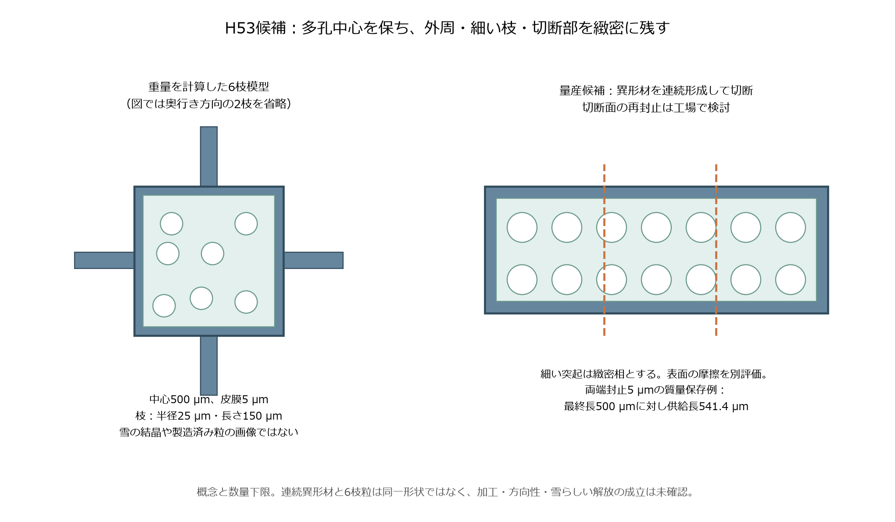
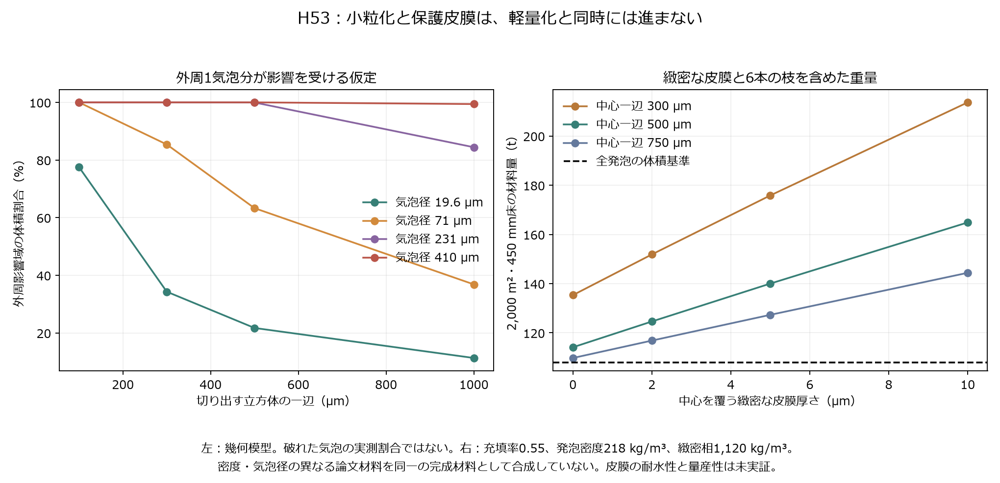
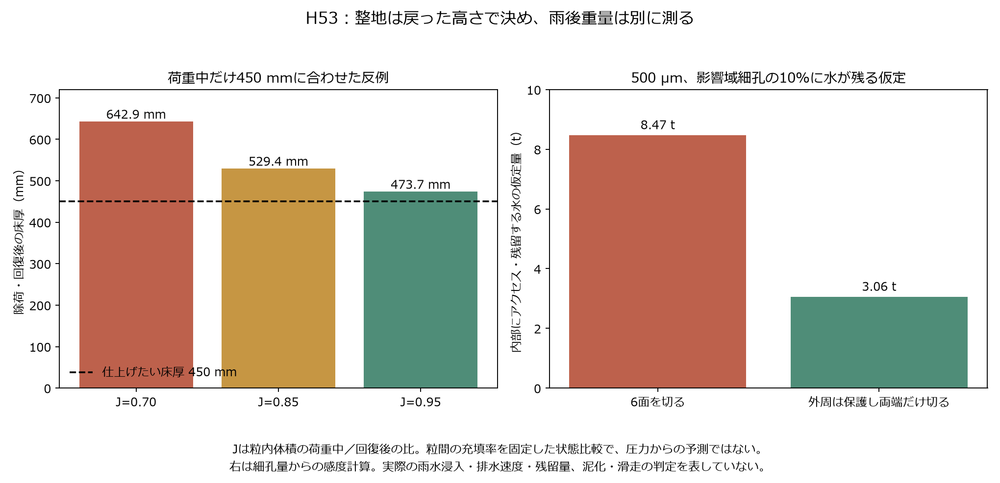

# 多方向探索第53巡：一体発泡で戻る粒と量産の成立条件

2026-10-09／Codex。Claudeと依頼者への研究引継ぎ。
参照したGitHub main：b4014e27c86096725c70cc09c0774c1ce394867c。

**第52巡の微細な引張機構に加え、一体発泡で戻る中心と、緻密な外周・突起を組み合わせるH53を候補にした。** 工場で一括形成する方向へ切り替え、小粒化で気泡を壊す問題、保護皮膜の重量、雨後の内部水、浮上、整地後の戻り、量産個数を同じ計算へ接続した。

今回得た設計上の変更は、発泡塊から細い枝まで一律に切り出す方式を避け、**中心の気泡を残し、細い枝と切断部分を緻密にする**ことである。連続した異形材を形成して切る方式では、切断の影響を両端へ限定できる可能性がある。形状の方向性と雪らしいエッジ解放が未解決なので、これを最終形状と決めない。

材料の温度特性には有望な一次資料が見つかったが、文章と図の試験条件に差も見つかった。原著に「60℃まで回復」とあっても、図に50℃・60℃の測定点がないため、その温度での直接の実証として扱わない。物理試験は0件、実物成功確率は未算定。旧15〜25％という主観値を更新した数値や、90％超という保証は作っていない。

## 1. 今回の成果と目的の関係

[第52巡](GPT回答_多方向探索第52巡_乾湿で戻る骨格と疲労を逃がす接続_20261009.md)では、引張材を支える圧縮枠まで数えると、軽量化が単純には成立しないことを確認した。H53ではその部品数を減らすため、材料内部の気泡壁を一括形成する案を調べた。

|目的|H53で前進した点|残る実証|
|---|---|---|
|50℃で形と支持力を保つ|発泡TPUの温度依存原著を確認。温度点・回復時間の記載差を切り分けた|選んだ完成粒の50℃・乾湿・疲労試験|
|雪に近い滑りとエッジ解放|中心の復帰と、外部突起・接触相の役割を分離|同じスキー板と圧雪対照による摩擦・貫入・横支持・解放・振動|
|雨後に機能を戻す|切断に伴う内部水の上限感度と浮上条件を計算|実際の浸水、排水、摩耗、捕集後の再使用|
|冬の天然雪の下地|外部は開放形状を保ち、粒内の気泡と区別|雪の侵入・接続、融雪水の滞留、凍結閉塞、滑り層の有無|
|経済性|皮膜と枝の追加重量、部材費、型成形と連続工程の数量下限|歩留まり、設備費、接触相、交換寿命を含む同条件比較|

共通の基準は2,000m²、450mm床、300mmの削れ代、約30°、気温30℃以上・表面約50℃、9〜17時使用、4〜5時間ごとの整地、日中の閉鎖約60分。税込2億円は整地設備・限定的土木の仮枠であり、材料・工場・全面造成を含めた成立額ではない。

R39の保持材は最大削れ深さ＋余裕より下に置く。板に露出するマットやブラシへ置き換えず、使用深さ全体で同じ機能を保つ。油、塩、フッ素、シリコーン潤滑、現地冷却、強酸処理、連続散水を成立条件にしない。

## 2. 材料・製造の一次資料を読み直した結果

### 2.1 温度依存：回復する成形体と、50℃で働く小粒は区別する

Meuchelböckら（2024）は、発泡TPUを蒸気で接合した成形体を低温から高温まで圧縮した。本文には約250kg/m³の試料の圧縮弾性率として、−20℃で1.19MPa、23℃で0.87MPa、40℃で0.82MPaが記載される。[S1：原著](https://link.springer.com/article/10.1186/s40712-024-00149-9)

ただし図9・10で確認できる温度点は、−50、−40、−20、0、23、40、80、120℃。本文や結論の「60℃まで」という説明だけから、50℃や60℃の試験を実施したとは確定できない。回復測定には本文の24時間と図注の72時間という差もある。少なくとも第2回の圧縮は72時間後の23℃であり、高温のまま日中に連続回復した試験ではない。

著者の[公開解析リポジトリ](https://github.com/Polymer-Engineering-University-Bayreuth/MechanicalProps_Foams)と入力例ZIPも確認したが、今回閲覧した例を50℃・60℃の試料へ対応付けられなかった。試験速度4mm/minの準静的圧縮や成形体の結果を、滑走速度・切断粒・湿潤床へ直接移さない。

進捗説明で述べた「60℃までの回復」は、原著の文章に基づく説明をここで限定し直す。50℃の直接証拠が得られたという意味ではない。

### 2.2 一括形成：気泡壁のしわで復帰部を変える

Huら（2022）は、CO₂発泡後のガス冷却で気泡壁に微細なしわを形成した。著者稿では比較試料の気泡径が約19.4〜19.6µm、発泡体の質量密度が218〜221kg/m³。4mm角試料の繰返し圧縮を調べている。[S2：著者稿](https://publications.aston.ac.uk/id/document/85867)、[出版社](https://pubs.acs.org/doi/abs/10.1021/acs.iecr.2c00001)

採用するのは、多数の気泡壁を加工工程で一括して変えられるという着想である。H52の微細な戻り材を個別に組み立てる方式の代替になる可能性がある。原著の工場工程には加熱・加圧・ガス冷却があり、夏の現地で噴霧すれば結晶化する実証ではない。

なお、著者稿の質量密度と空隙率には整合差があり、弾性率低下率の本文値と図7cの視読にも差がある。保持率の数値を今回の設計保証へ代入せず、原値と差を出典監査へ残した。

### 2.3 局所的に密度を変える工程は存在するが、微粒量産は別課題

Ellinghamら（2018）の射出成形研究は、一つの成形体で局所密度・構造を変える段階的発泡を扱う。出版社要旨の密度範囲は0.25〜0.42g/cm³。これは外周・突起と中心を同じ密度にしない構想を支えるが、500µmの枝付き粒の量産を示してはいない。[S3：出版社要旨](https://journal.hep.com.cn/fme/EN/10.1007/s11465-018-0498-6)

### 2.4 再生すれば新品と同じになる、とは置かない

Maciarielloら（2026）の工場規模のTPU再発泡研究では、再生材の気泡が細かくなっても、繰返し圧縮特性が低下した。原料は工場内の廃材であり、土砂を含むコース回収材ではない。[S4：原著](https://link.springer.com/article/10.1007/s00170-026-18031-7)

雨後の材料を回収し、溶かし直して小粒に戻せるとしても、初期の形態・分子状態・性能が再現するとは限らない。整地による再配置と、工場での再製造を分ける。

### 2.5 他材料の対照も残す

Zhuら（2025）はPEBAの接合発泡体の長期圧縮疲労を報告している。今回確認した出版社の要旨・抜粋は有望な比較候補を示すが、50℃湿潤粒の試験ではなく、全文・元データは取得していない。TPUに限定せず、PEBAを対照候補として残す。[S5：出版社要旨](https://www.sciencedirect.com/science/article/pii/S0142112325000386)

これら5資料は異なる材料・形状・処理・試験である。都合のよい値を合わせて一つの完成材料の性能表を作らない。原著の高い回復率やエネルギー返還率は、スキーの摩擦係数でも実験成功率でもない。

## 3. H53の構図と製造の分岐

H53では、粒の内部に復帰を担う多孔中心を置き、外周・細い突起・切り離す部分には緻密な相を残す。板と接する位置には、第51巡までの結晶相を保持する接触面を検討する。裸のTPUの表面が雪のように滑るとは仮定しない。

「内部に閉じた気泡があること」と「粒の間や枝の間が排水可能なこと」は異なる。気泡をすべて連通させなくても外部排水は設計できる一方、粒の浮上・流失には不利になる。後述の雨・冬の条件まで含めて採否を決める。

|製造案|利点|今回の判断|
|---|---|---|
|発泡塊を細かく砕き、枝まで切り出す|一括処理しやすい|薄い枝の多孔構造が切断に弱い。比較用に残し、本命から外す|
|中心と緻密な枝を一体形成し、緻密部で分離|気泡壁と薄い枝を守る余地|微細形状の形成・切断位置・製造速度の検証が必要|
|外周・突起を持つ異形材を連続形成し、短く切る|切断面を主に両端へ限定できる|量産候補。全方向の枝形状ではなく、向きの影響を評価する|
|微小な粒を一個ずつ型で成形|形を制御しやすい|個数が大き過ぎる。微細型の大量並列を安価と見なさない|

図左の6枝粒は重量模型、図右の異形材は量産の工程候補であり、同じ形状を実現した二つの図ではない。最終的には、量産できる形の試料で粒群の支持とエッジ解放を測り、圧雪から離れる場合は形状・材料の別案へ戻る。

## 4. 小さく切るほど、復帰する内部構造を失う

気泡径 c の半分〜1個分を、切断により性質が変わり得る外周層 ℓ と仮定した。これは破れた気泡の実測割合や、流路が連通した割合ではない。外周層の幾何的な感度である。

一辺 D の立方体を6面で切ると、影響を受けない内部割合は、

fcore = max(1 − 2ℓ/D, 0)³

となる。外周が既に保護された連続材を長さ L で切り、両端だけを対象にする場合は、

fcore = max(1 − 2ℓ/L, 0)

である。円柱状の枝では、直径 d と長さ L に対して、

fcore = max(1 − 2ℓ/d, 0)² × max(1 − 2ℓ/L, 0)

とした。[全72条件](一体発泡と小粒化検証_20261009/cutting.csv)

c=19.6µm、ℓ=c の仮定では：

|形状例|外周影響域の割合|
|---|---:|
|500µm立方体を6面で切断|21.72％|
|外周保護済み・長さ500µmの異形材を両端で切断|7.84％|
|直径50µm・長さ150µmの枝を全周で切り出す|96.55％|

立方体の内部を80％残すには、同じ仮定で一辺約547µm以上が必要になる。粒の外寸だけを大きくしても、細い枝の局所寸法が小さければ解決しない。したがって、細い枝は緻密に形成し、発泡中心とは役割を分ける。

S1の成形ビーズでは中心と外周で気泡径が大きく異なる。S2の約20µmの気泡をS1の温度特性と組み合わせて「同じ性能の小粒」とはしない。今回の図は、それぞれの寸法スケールを別々に感度へ入れた比較である。

## 5. 皮膜と枝を付けた完成粒の重量

重量模型は、一辺300・500・750µmの多孔中心、中心の皮膜0・2・5・10µm、半径25µm・長さ150µmの緻密な枝6本。発泡相218kg/m³、緻密相1,120kg/m³を仮に使用する。端部の丸み・根元の肉付け・接触結晶相は未加算である。

中心一辺 D、皮膜厚 t のとき、発泡内部体積 Vi=(D−2t)³、皮膜体積 Vs=D³−Vi。枝体積 Va=6πr²L。質量は、

m = ρfoam Vi + ρsolid(Vs + Va)

とした。粒の体積はD³+Vaであり、外接する直方体の体積ではない。粒内の閉気泡を含み、粒間空隙を含まない。

**中心500µm・皮膜5µmの例では、粒体積当たりの密度は282.88kg/m³。** 粒の体積が床の55％を占めると仮定すると、2,000m²・450mm床に約140.03t必要になる。同じ体積を全て218kg/m³の発泡相と置く単純比較は107.91tで、差は約32.12t。緻密な部分は体積では小さくても質量の約28.5％を占める。

床の乾燥嵩密度を120kg/m³に保つには、この粒の体積充填率を約0.424にする必要がある。充填率を下げても支持力が保てるという証拠はないため、単に配材量を減らす案にはしない。今回は完成H53の粒群密度を実測したものではない。

### 両端を熱で閉じる案にも質量が必要

切断面を同じ材料で緻密化し、閉気泡を保護する工場処理を考える。同じ断面積のまま5µmの緻密な膜を片端に作るには、質量保存上、218kg/m³の発泡体を約25.69µm分消費する。

最終長500µmに両端5µm膜を残すなら、必要な供給長は約541.38µm、長さ換算で約8.28％増える。これは熱処理時間・気密性・形状保持を証明した値ではない。薄膜の付加を無料・無重量として扱わないための計算である。[封止3条件](一体発泡と小粒化検証_20261009/end-seal.csv)

## 6. 雨後：内部水を減らしても、浮上を解く必要がある

500µm、気泡径19.6µm、影響域1気泡分、床内の粒体積495m³、文献記載の空隙率0.788を使う。影響域の細孔量のうち、水がアクセスできて排水後にも残る割合を α とすると、

残留水質量 = 水密度 × 粒体積 × 空隙率 × 外周影響域割合 × α

となる。α=0.10という仮定例では、6面切断で約8.47t、両端切断で約3.06tとなる。α=1はその10倍、α=0.01はその1/10。実際の浸水・保持率を測定した結果ではない。[水の感度24条件](一体発泡と小粒化検証_20261009/water.csv)

この値から、濡れたら泥になる・ならないという判定はできない。滑走抵抗、表面の土砂、摩耗粉、粒間の水、凍結閉塞は別に必要である。

一方、気泡を閉じて水を入れにくくするほど粒は浮きやすい。上記282.88kg/m³の粒が空気を保ち、自由に水へ浮く単純条件では、粒体積の約28.3％が水面下に入ると重さと浮力が釣り合う。さらに浸水し、外部拘束がなければ持ち上がる方向に力が働く。雨が降っただけで全床が浮くという予測ではないが、「吸水しないから台風でも安定」とはできない。

H53を進める条件は、外部排水を確保し、粒の流出が起きた場合には沈殿だけでなく**浮遊物を捕集する経路**を持つこと。埋設ネットだけで、その上の自由な粒の浮上まで止められるとは仮定しない。捕集後には枝の破損・永久変形・微粉・汚れを選別してから上方移送する。レール整地機で均せば壊れた気泡や枝まで復活するとはしない。

冬も、雪／素材間に水が滞留すれば、油がなくても弱い層になる可能性が残る。外部の枝による雪保持と、融雪水が抜ける状態を、凍結融解後まで測る。

## 7. 整地機は「押した高さ」ではなく「戻った高さ」を仕上げる

復帰性の高い粒は、ローラー通過後にも高さが変わる。粒内体積の荷重中／回復後の比を J、粒間の充填率を φ と区別する。Jは軸方向ひずみとは異なる。原著の圧縮ひずみ27.9％等を、そのまま体積比へ代入していない。

一定の材料量・面積に対して、床厚は H=M/(Aρpφ)。荷重によって粒体積がJ倍になり、粒間充填率がφfへ変われば、荷重中の高さは回復後の高さのJ倍になる。これは状態間の質量保存であり、整地圧力からJやφを予測する材料模型ではない。

例としてJ=0.85で荷重中に450mmへ合わせると、充填率がその後変わらない場合、回復後は約529.4mmとなる。回復後450mmを狙うなら、この仮定では荷重中382.5mmに相当する。ただし圧力、時間、乾湿によってJも充填率も変わるので、固定の79.4mm補正を施工仕様にはしない。

レール牽引機の工程は、回収・配材→密度調整→除荷後の高さ測定→小さな仕上げ補正を候補とする。60分の閉鎖内に必要な回復と測定が終わることを条件にする。S1の長時間休止を昼整地へ持ち込まない。

柔らかさが強過ぎるとスポンジの上を滑る感覚になり、復帰が強過ぎれば振動や跳ねが増える可能性もある。H53は内部の回復能力を得る候補であり、圧雪に必要な粒間の支持・短い解放を別に合わせる必要がある。

## 8. 個別組立をやめても、量産個数の問題は残る

500µm中心・5µm皮膜の重量模型では、充填率0.55の基準床に約3.905×10¹²粒が必要。30日、1日16時間、稼働率75％、良品歩留まり100％という楽観的な計算でも、稼働中に約301万粒/秒、質量で約389kg/hが必要になる。

|工程の単純な数量比較|仮定|必要並列数・量|
|---|---|---:|
|個別の型成形|1m²全面に0.8mmピッチ、30秒周期、全て良品|最低58面相当|
|連続ロール上での配列形成|幅1m、30m/min、0.8mmピッチ、全て良品|最低4系列相当|
|質量で見た正味生産量|360稼働時間で140.03tを製造|約389kg/h|
|2時間のガス処理を仮に必要とする場合|同じ正味処理量、仕掛品だけ|約778kg|

いずれも、微細型の充填・離型や三次元枝のロール形成が可能と確認した数字ではない。切断・封止・被覆・検査・停止・不良を入れる前の下限であり、設備見積りでもない。S2の小試料の2時間処理を量産装置へ比例拡大できるともしていない。

このため「一体形成だから安い」とは結論しない。形状精度を保つ連続工程が作れない場合は、粒内機構の単純化、密な突起の数・寸法、直接形成できる別材料を優先する。数兆個を個別に扱う高価な方式へ進まない。

### 材料費と寿命を同時に比べる

比較単価を完成した粒本体300・1,000・3,000円/kgと仮置きする。約140.03tに対する本体費は約4,201万円・1億4,003万円・4億2,008万円。107.91tの全発泡の体積基準に対する増額は約963万円・3,212万円・9,635万円となる。

価格は見積りではない。接触結晶相、金型、工場設備、歩留まり、輸送、施工、捕集、年間交換は別。比較対象の全発泡粒が滑走に使えると認めた数字でもない。

同じkg単価で本体交換費を釣り合わせるだけでも、約140tの案には約108tの基準に対して**約1.30倍の寿命**が必要になる。保護皮膜が寿命を伸ばす実測が得られなければ、重量増を正当化できない。材料費を設備2億円の枠へ紛れ込ませず、共通の使用日数・面積・寿命で人工降雪・整地費と比較する。

## 9. 次の採否とClaudeへの検証依頼

公開前にmainを再確認し、b4014e27以降のClaude更新はない。Claudeのv2の六つの難所は継承した。v3の全結果・元コード・現在の稼働・今回回答の受領や同意は未確認であり、GitHubと回覧板へ検証材料を渡す。

Claudeへの独立検証依頼は次の通り。

1. S1の50℃・60℃の試料、24時間／72時間の回復記載を確認し、同定できる元データがあれば共有する。
2. 多孔中心＋緻密な外周・突起を、数兆個規模で作る場合の製法を反証する。微細型を安価と仮定せず、連続形成・切断・封止まで工程と歩留まりを返す。
3. 6面切断と両端切断の外周模型を、実際の気泡開口・浸水・排水へつなげる。幾何割合を実測の開気泡率に置き換えない。
4. 浮上・流失と冬の水層を防ぐ構造を、表面マットへ置き換えず検証する。埋設保持材の上にある自由粒をどう捕集するかも含める。
5. v3の新物質・製粒案で、H53より少ない工程で復帰と雪らしい解放が両立するものがあれば、同じ面積・重量・寿命・費用で比較する。

次に進める材料実験は、既存の成形体の高い回復率を追認することではない。**完成粒の50℃乾湿下での復帰、切断面の気密・浸水、繰返し後の形状・摩耗**を先に判定し、それを通った粒群だけで圧雪対照の滑走試験へ進む。TPUが粘る・跳ねる・劣化する場合は、PEBA等の別骨格、乾式の結晶骨格、一体の柔軟接続へ分岐する。

購入、発注、試作、物理試験は行っていない。無害性は樹脂名や医療・生分解という分類から認定せず、皮膚接触、粉じん、排水、土壌生物、紫外線と加水分解後の溶出まで完成配合で確かめる。H53の提案は、雪の結晶を30℃以上で噴霧成長させた発明の完成報告ではない。

## 10. 再現資料

- [計算コード](一体発泡と小粒化検証_20261009/model.py)、[結果JSON](一体発泡と小粒化検証_20261009/results.json)、[15件の数値照合](一体発泡と小粒化検証_20261009/numerical-checks.json)。
- [原資料の数値7行](一体発泡と小粒化検証_20261009/source-values.csv)、[切断72条件](一体発泡と小粒化検証_20261009/cutting.csv)、[粒12条件](一体発泡と小粒化検証_20261009/particles.csv)。
- [水24条件](一体発泡と小粒化検証_20261009/water.csv)、[浮力3条件](一体発泡と小粒化検証_20261009/buoyancy.csv)、[整地9条件](一体発泡と小粒化検証_20261009/grooming.csv)。
- [費用3条件](一体発泡と小粒化検証_20261009/cost.csv)、[封止3条件](一体発泡と小粒化検証_20261009/end-seal.csv)、[出典監査](一体発泡と小粒化検証_20261009/sources.md)。
- [作図コード](一体発泡と小粒化検証_20261009/draw.py)、[文書検証コード](一体発泡と小粒化検証_20261009/verify.py)、[文書検証結果](一体発泡と小粒化検証_20261009/document-checks.json)、[公開マニフェスト](一体発泡と小粒化検証_20261009/publication-manifest.json)。

再現は当フォルダで python -X utf8 model.py、python -X utf8 verify.py。作図のみmatplotlibを使用する。15件は質量保存、幾何境界、数量下限、分母・記載差等の確認であり、実験試料数や成功率ではない。

研究成果はGitHubを正本とする。公開された固定コミットの内容をバイト・SHA-256で照合した後、研究用のローカル複製とGit履歴を削除し、接続案内と既存設定を保持する。
