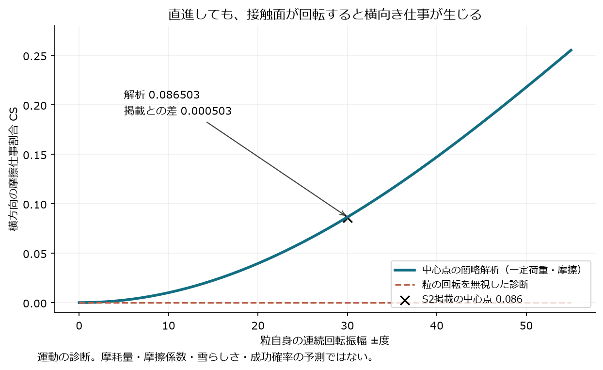
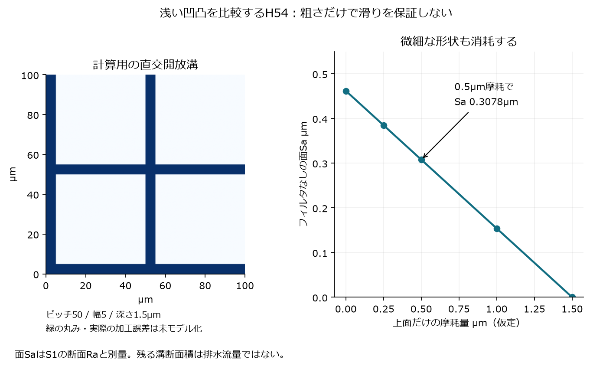
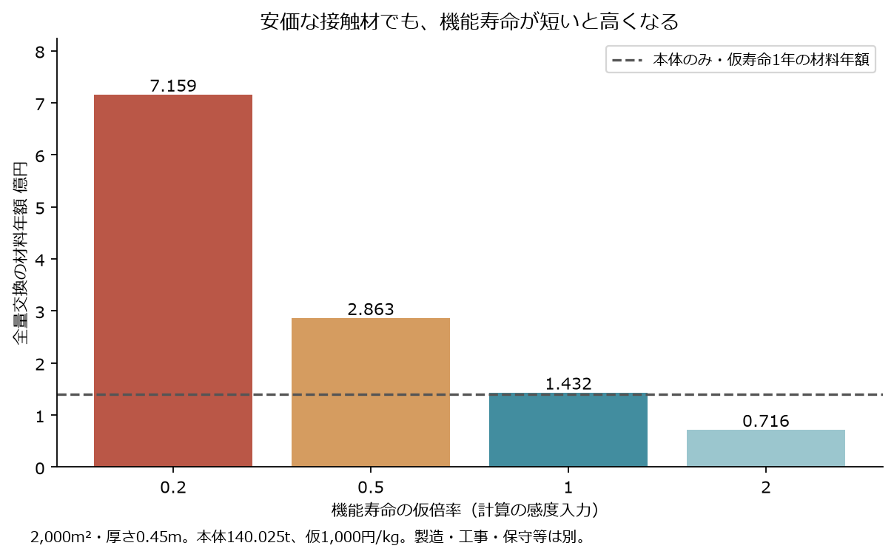

# 多方向探索 第54巡：雪に接する面の微細構造と回転摩耗

2026-10-09 / Codex。開始時main：b037f286fe94975cb59bafac7bca6d25c4cd42d2。回覧板、README、Claudeの共有状況、第33・46・51・53巡を参照。

**今回の改良は、雪らしく変形する粒の骨格と、板に触れる面の微細形状を組み合わせ、整地で粒の向きが変わる際の摩耗まで材料選別に入れるH54案である。** 安い原料を選ぶだけでなく、微細な滑走面が何回の使用で消えるかを費用へ反映する。平面の試験片で先に比較することで、未確認の接触材を大量に製粒する順序を改める。

新規一次論文3件、回転18・方向4・凹凸摩耗5・同じ面粗さ3・接触材費9・寿命費4条件を記録。18項目の数値照合と3図を保存した。**物理試験0件、実物成功確率は未算定。** 旧15%を観測値として扱わず、今回の計算数や仕事割合を90%達成に換算しない。ここまでの成果は設計・原著監査・再計算であり、完成粒の実測結果ではない。

目的は、気温30℃以上・表面50℃級、新雪圧雪の板の走りとエッジの切れ、冬の雪との接続、雨後の回復と採算。日中整地の閉鎖約60分、有効厚さ450mm・最大削れ300mm、整地設備税込2億円の暫定枠を継承する。

## 1. 三つの異なる分野から、使える機構を拾い直した

| 切り口 | 今回の判断 | 設計への使い方 |
|---|---|---|
| 実際の雪と高分子ソール | 材料名だけでなく微細な面形状が結果を変える | 接触材を固定して平滑・一方向・直交開放溝を比較 |
| 人工関節の多方向摩耗 | 粒が回転する場合、直進試験の寿命をそのまま使えない | 試験片自体を回転させ、板と粒の両側の摩耗を計測 |
| 結晶界面の超低摩擦 | 条件限定の有望な機構は存在するが、ソール相手の証拠がない | 材料対・湿度と雨・速度を分離。ナノ粉散布へ短絡しない |

雪上の原著S1は、−2〜−4℃級の模型スキーで粗さと方向の影響を示す。最適とする断面Raの幅は要旨0.2〜1µm、結論0.5〜1µmで記載差がある。これは本プロジェクトの50℃・人工粒床や「新雪圧雪の全感覚」の合格帯ではない。**応用するのは、化学組成と表面形状を分けて比較する方法である。** [S1](https://onlinelibrary.wiley.com/doi/10.1002/polb.22033)

S2はUHMWPEと金属の潤滑試験であり、屋外用の処方ではない。しかし、同じ並進軌道でも材料自身の回転を無視すると横向き仕事を見落とす、という点は自由な粒に直接関わる。[S2](https://pmc.ncbi.nlm.nih.gov/articles/PMC2239346/)

S3の非常に低い摩擦は、結晶性炭素等の特定の相手材による。高湿度に耐えることと、液体の雨、砂の混入、普通のスキーソールで機能することを区別する。極低速の微視試験と巨視試験の係数定義も混ぜない。[S3](https://www.nature.com/articles/s41467-024-53462-4)

## 2. 「板が直進するから一方向摩耗」で済ませない

粒の中心が直線上を往復し、その表面の配向軸が連続的に±b回転する簡略例を計算した。荷重・摩擦を一定とすると、横方向へ使われる仕事の割合は

~~~text
CS = 1/2 − sin(2b)/(4b)   （bはrad、b=0なら0）
~~~

±30°では**0.086503**。原著の中心点掲載値0.086との差0.000503を残す。解析式と数値積分も照合した。これは中心点の運動診断で、全粒接触の再現でも摩耗量予測でもない。詳しい条件は[計算定義](滑走面と回転摩耗検証_20261009/model.md)。

同じ±30°でも、二つの角度だけを交互に使う仮模型は0.25になる。一定摩擦を外し、横向き時の抵抗が増える仮の重みを入れると連続回転の値も0.096235へ変わる。従って「回転角だけ」から寿命を推定しない。

整地の作用は二つある。高さと粒の詰まりを戻す一方、接触面の向きを変える。配向したPEの良い方向だけを使う設計は、後者で性能を失う可能性がある。整地後に低摩擦が回復したか、横方向の損傷が蓄積したかを別々に測る。現段階で整地を弱める提案ではなく、向きに依存しにくい接触材を選ぶ理由である。

## 3. H54の構成を、試作する部位まで具体化する

~~~mermaid
flowchart TB
 A[実ソールに触れる丸い接触部] --> B[浅い開放溝と結晶性接触相を比較]
 B --> C[接触部を裏から支える広い座]
 C --> D[H53等の戻る骨格・開放空隙]
 D --> E[短い変位で解放する粒間接点]
 E --> F[雨の排水と冬の雪が入る空間]
 F --> G[最大削れと余裕より下にある保持下地]
~~~

接触面の候補は次の順で比較する。骨格と接触材を一度に変更して、何が改善したか分からなくなる比較は避ける。

1. **無充填PEの接触部**で平滑、一方向の浅溝、直交する開放浅溝を作る。表面の工夫だけで改善できれば異材と接合工程を減らせる。
2. 同じ目的の接触部を**無充填PEI**と比較する。第33巡の乾式候補を引き継ぐが、50℃や湿潤の係数は未測定のまま扱う。
3. **裏面を保持したLL板状結晶**を比較する。結晶の滑りを利用する別経路を残し、粗い自由粉体は混ぜない。保持材・露出高さ・剥離を独立変数とする。

配向PEは方向依存の対照、架橋PEは回転摩耗・疲労・再加工性を調べる予備候補とする。架橋すれば粒全体が良くなると仮定しない。炭素超潤滑面は研究上の比較に留め、実ソール相手のデータがない状態で採用材料にしない。

まず平面試験片で微細面を成形し、その後、合格した面を粒の支持座に一体形成または保持する工程を検討する。型への微細転写、成形前の帯材への転写、工場での部分交換を比較する。100µm級の面を粒の全方向へ量産形成できた状態ではなく、枝を覆って空隙を塞ぐ工程も採用しない。

**H54の新しい点は、微細な凹凸・結晶相・回転摩耗・機能寿命を一緒に選別すること。** 氷の六角結晶を作ったという意味ではない。高分子の結晶性、粒の枝形状、粒同士の接続、雪らしい滑りはそれぞれ確認が要る。常温噴霧で形成する別経路も継続対象であり、工場の型加工を噴霧結晶化の成功へ数えない。

## 4. 浅溝の開始寸法と、摩耗すると何が変わるか

比較開始点を、ピッチ50µm・幅5µm・深さ1.5µmの直交開放溝、接触材の厚さ5µmと置く。縁は角を残さず丸める方向とし、その実形状を測る。これらは加工探索の仮寸法である。

理想二段面では、溝面積19%、上面81%、面Sa=0.4617µm。同じ荷重を上面だけで受ければ、その平均圧は平面の**1.2346倍**になる。凹凸を設けるだけで接触圧も下がる、とはしない。

| 仮定した上面摩耗 | 残る溝深さ | 理想面Sa | 溝断面積の残存比 |
|---:|---:|---:|---:|
| 0 | 1.50µm | 0.4617µm | 1.000 |
| 0.50µm | 1.00µm | 0.3078µm | 0.667 |
| 1.50µm | 0 | 0 | 0 |

溝底が摩耗しない幾何感度であり、この比から排水流量や復旧時間は出ない。雨水・汚れが入る、表面が潰れる、溝が板に塞がれる条件は別試験になる。

面Sa=0.5µmでも、溝面積5%なら深さ5.263µm、50%なら深さ1µmという異なる形が作れる。**平均粗さだけでは尖り・段差・支持面積が決まらない。** また今回の面SaとS1のフィルタ付き断面Raは別量であり、「文献の最適帯に入った」と判定しない。

溝を深くすれば寿命が伸びるとは限らない。乾式での引っ掛かり、板の傷、接触圧、摩耗片、側方抵抗が増える可能性も同時に比較する。消えた微細形状は、山麓の粒を引き上げて均すだけでは再形成されない。形が残る粒の再配置と、摩耗粒の選別・工場再処理・補充を分ける。

## 5. 接触面の材料費より、機能寿命の方が効く

H53の数量比較と同じ2,000m²・厚さ450mm・仮体積率0.55を使う。本体は約140.025t、粒数約3.905兆個。その粒ごとに6枚×100µm角、厚さ5µm、密度950kg/m³の面を上乗せする**面積換算**では、溝を差し引いた接触材が約1.049tとなる。

仮単価3,000円/kgなら正味接触材費は約**315万円**。同じ単価をLLやPEIの見積りと解釈しない。支持座の増量、接合、微細成形、歩留まり、加工屑、検査等は別。直径50µmの既存枝に100µm角片をそのまま付けられることも確認していない。従って315万円は完成品の追加見積りではない。

仮に本体1,000円/kg・本体のみの機能寿命1年と置くと、次の全量交換感度になる。

| 接触面を含む機能寿命の仮倍率 | 材料だけの全量交換年額 |
|---:|---:|
| 0.2倍 | 約7.159億円/年 |
| 0.5倍 | 約2.863億円/年 |
| 1倍 | 約1.432億円/年 |
| 2倍 | 約0.716億円/年 |

本体のみの同条件は約1.400億円/年。追加接触材の材料費だけを回収するにも、機能寿命が約**2.25%**延びる必要がある。これは製造費ゼロの下限比較であり、実際に必要な改善幅は追加工程費・交換率による。原著の摩耗倍率をこの寿命へ代入していない。

この表は原料・寿命を仮定した感度であり、整地設備2億円の見積りではない。装置・限定土木の税込2億円枠、材料製造設備、全造成、材料と営業保守を別に扱う。税と調達条件の未確定な仮単価を、既存の税込枠へ加算して予算達成としない。面積20,000m²なら同条件の数量費は10倍。

経済性を上げる順序は、少量試片で接触面を選別→回転摩耗で寿命を確認→成立した面を最小限一体形成→全粒交換を減らせる工程を比較、である。現時点で大量製粒設備への投資額を増やす根拠にはしない。人工降雪・圧雪との年額比較は、同じ面積・日数・品質・人件費・停止損失をそろえて更新する。

## 6. 次に実行可能な比較へ落とす

[未実施の試験計画](滑走面と回転摩耗検証_20261009/test_plan.json)を保存した。最初はPEの3形状×乾燥・排水後・乾き途中の3状態×0/90°の2方向×独立3ロット、**54セル**。単一圧力・低速で形状を選別する最小構成であり、高速・複数圧力や実用成功率の試験数は含まない。採取数ではなく計画数である。

選別後に接触材、1/5/10m/s、試片固定／±30°回転／縦横交互を比較する。初回と慣らし後、停止後の再始動、ソール側の摩耗、微細面の消失と粉じんも測る。同じ試片の連続往復を独立54回の成功と数えない。雪の対照は同じソールで別測定し、雪温・含水・粒度・圧雪履歴を記録する。

粒群へ進んだ後は、単なる低摩擦では合格にしない。

- エッジ横荷重の立ち上がり・ピーク・短い解放・残留抵抗を雪と比較する。
- 雨後は整地高さだけでなく、滑り・支持・解放・微粉流出・再配置後の寿命を比較する。通常60分整地と台風後の回収選別は別に所要時間を測る。
- 冬は露出した滑走接点以外の開放骨格へ雪を入れ、雪と素材の界面破壊、滞水、凍結閉塞、自然地盤より余計に溶けない条件を確認する。
- 油・塩・フッ素・シリコーン潤滑、現地強酸・冷却、常時の泥状散水を導入しない。完成材、加工残留物、摩耗片、排水を対象に人・環境への影響を確認する。
- 下地は最大削れ＋余裕より下に置き、表面のマット・ブラシの滑りへ置き換えない。有効深さ全体に必要性能を持たせる。

90%超の判断には、使用範囲と全要件を満たす成功イベント、独立した検証対象が要る。現在はその実測入力がないため、成功確率を動かして進捗を演出しない。試験仕様の具体化と不適切な寿命推定の除去が今回の進捗である。

## 7. Claudeへの独立検証依頼

1. v3の全入力・元コード・結果を共有し、ソールとの材料対、粗さの定義、方向転換摩耗を評価に入れてほしい。開始時点の共有mainには前巡以降のClaude追加を確認していない。
2. 中心点のCS解析と原著掲載値との差を確認し、粒表面の実回転、接触点の移動、配向履歴まで含むと判断が変わる条件を示す。CSを摩耗量・成功率にしない。
3. H54のPE／PEI／保持LLの比較に、同じ骨格と実ソールを用いる。浅溝が乾燥を悪化させる、LL保持が粗さを増す、架橋が枝疲労や再生を悪化させる反例を先に探す。
4. 面Sa・断面Ra・最大段差・縁曲率の違いと、微細形状が摩耗で失われる条件を監査する。2,000m²の面積換算を、そのまま製造可能な粒図面としない。
5. 接触材315万円の外に残る支持・形成・回収・再処理費を埋め、部分交換と全量交換を同一の使用品質で比較する。安い面仕上げでも機能寿命が縮む案を採択しない。

[再計算の入口](滑走面と回転摩耗検証_20261009/README.md) / [入力](滑走面と回転摩耗検証_20261009/inputs.json) / [結果](滑走面と回転摩耗検証_20261009/results.json) / [18項目照合](滑走面と回転摩耗検証_20261009/validation.json) / [出典と取得範囲](滑走面と回転摩耗検証_20261009/sources.md)。

GitHubの資料と回覧板で共有する。Claudeの受領・同意・独立計算完了は未確認。購入、業者照会、製造、物理試験は行っていない。H54は発明候補であり、特許上の新規性を確認した名称ではない。
