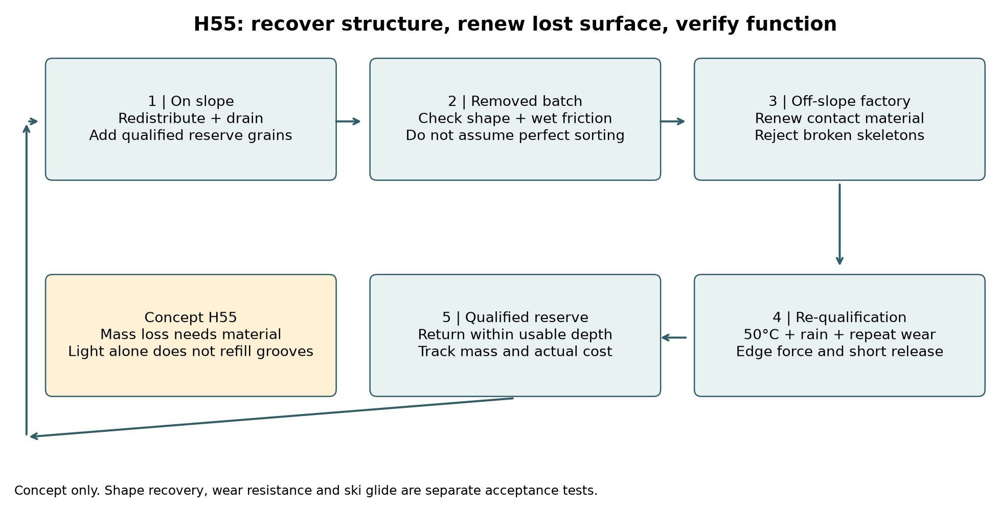
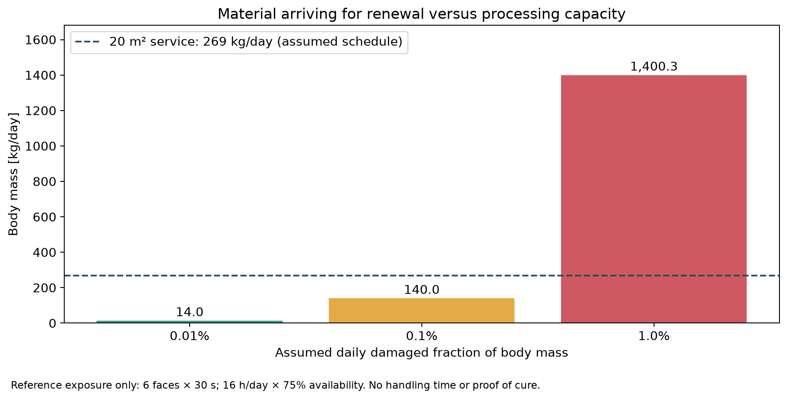
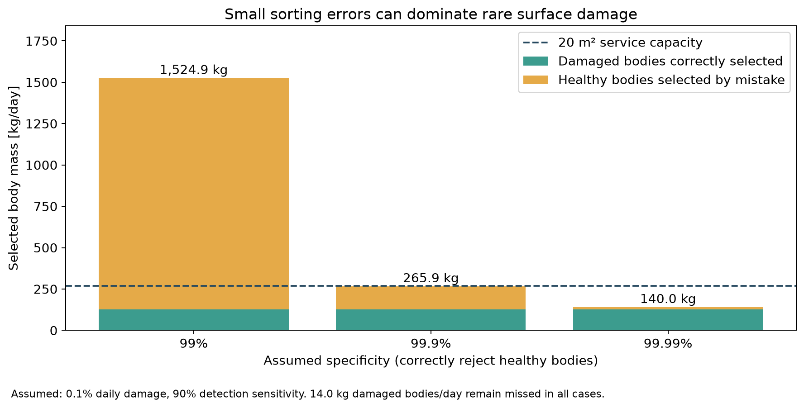

# 多方向探索第55巡：摩耗面の再生と材料交換を両立する設計

2026-10-09／Codex／独立検証・Claudeへの共有。基準：ec7cff739ccb6a05fdebc795b93366490ccd6cc3。

## 1. 今回の到達点

**摩耗した粒を全部捨てず、健全な骨格を残して接触面を更新するH55へ進めた。ただし「光を当てれば雪のような面が自動で元どおりになる」とは扱わない。** 形状の戻り、失われた質量の補充、硬さ、低摩擦、エッジの支えと短い距離での解放を、それぞれ確認する構成である。

第54巡は滑走面の微細構造と回転摩耗、第55巡はその面が傷んだ後に何を、何kg、何時間、いくらで戻せるかを接続した。光反応、熱による型転写、高分子に結び付いた反応基、界面でできる中空粒という4系統を調べ、再生設備の能力と選別誤差まで計算した。

**本プロジェクトの物理試験は0件。実物成功確率は未算定。** 21項目の数値照合や、文献の寸法再現率を「90％超の成功率」に置き換えない。従来の約15％という主観的予測を、今回の机上計算で改善したとは主張しない。

主な数量上の成果は次のとおり。

- 約140tの仮想床材に付く6接点の合計面積は約23.43万㎡。コース2,000㎡の約117倍で、コース面積だけで処理費を見積もれない。
- 20㎡の台に粒を一層で並べ、6方向から30秒ずつ順次処理する仮定では、約22.4kg／時、実働換算12時間で約269kg／日。毎日1％＝約1,400kgが傷むなら滞留が増え続ける。
- 毎日0.1％が傷むとしても、損傷検出感度90％・健全粒を正しく残す率99％なら、誤選別を含む処理対象は約1,525kg／日。損傷分だけ再生すれば安いという見積もりは成立しない。
- 仮に健全骨格の機能合格歩留まり80％、新品骨格1,000円／kgなら、全選別・再加工等の費用上限は処理する骨格1kg当たり800円未満。この境界を超えれば同じ接触材を付けた新品交換の方が変動費は低い。

ここでの価格・損傷率・選別性能・歩留まりは、実測や見積書のない**感度条件**である。

## 2. 新しい一次研究から使えるものを選ぶ

| 経路 | 確認した事実 | H55への取り込みと制限 |
|---|---|---|
| S1：光で耐摩耗表面を更新するPU系 | 原著は365nm、250W/㎡、30秒。再生評価は約1cm厚の試料を約2mmずつ切り、新しい面を照射して3回評価 | 「未反応部分を露出して硬化」という着眼点を使う。失った質量や溝の再生ではなく、0.5mm級の粒への直接移植もしない。[原著](https://pmc.ncbi.nlm.nih.gov/articles/PMC13075023/) |
| S2：UHMWPEを熱と型で成形 | 学位論文の最終条件は100℃で60分保持、20℃まで1℃／分で冷却。くぼみ径は目標の95.6％ | 公表スケジュールは保持と冷却だけで140分。工場工程の候補であり、昼60分の現地整地へそのまま入れない。薄膜工程の物理的最短時間を示す値ではない。[学位論文](https://qspace.library.queensu.ca/server/api/core/bitstreams/b96830dc-14fd-4433-a04b-c7fb69058142/content) |
| S3：高分子に結び付いた光反応基 | シンナメートを付けたポリブタジエンで光架橋と深さ方向の性質を調査。長時間照射では内部にも反応が進む | 反応基を移動しにくい相に局在させる比較候補。ただし全粒硬化で枝の柔らかさを失う可能性を調べる。S1の30秒条件を流用しない。[出版社](https://www.sciencedirect.com/science/article/pii/S0014305724009169) |
| S4：天然由来モノマーの界面光重合 | 数µmの中空粒を合成。「100倍スケール」は原料200mg／分散液300mL、16時間照射と洗浄 | 界面だけを反応させ、不要な内部を除く形成原理を別経路として残す。開放枝付き粒やトン量産の実証ではない。自然環境での分解評価は原著でも今後の課題。[原著](https://pmc.ncbi.nlm.nih.gov/articles/PMC12805441/) |

S1には再現性上の注意点もある。DMTDAに対し序論と材料欄で異なる化学名を記載し、MDI:PTMEGのモル比1:2.32とNCO末端という説明も整合確認が必要。二官能同士ならNCO/OHは約0.431となる。この記載を無断で「修正」して製造処方にしない。原著の興味深い機構と、再現可能な処方が確立したことは区別する。

S2の表の「pressure」はN単位の保持力なので、粒へ掛けるMPa値に読み替えない。S4の原料分子の融点や自然由来という説明だけでは、最終粒の50℃耐荷重・人体安全を判定できない。各資料の取得範囲、S3の全文未取得、S2のPDF識別子は[出典台帳](表面再生と処理能力検証_20261009/sources.md)に保存した。

## 3. H55の具体構成：骨格と更新する面を分ける

### 3.1 粒の構成と候補を固定しすぎない比較

出発形状はH53の多孔中心・緻密な枝、H50の排水できる開放根元、H54の広い支持部に置く接触面を用いる。これは製造できた形ではなく、材料量を比較する仮形状である。結晶の外観を描くことと、分子結晶・粒の連結・雪の滑走機能は別々に評価する。

接触面の更新方法は次の3案を同じ骨格・荷重条件で比較する。

| 案 | 構成 | 最初に確認すること | 主な切り替え条件 |
|---|---|---|---|
| H55-A：工場で接触層を補う | 完成時に反応を終えた薄い接触層を支持座に保持。使い減りは接触材を補充して再形成 | 摩耗屑、層間剥離、接合部の段差、溝形状、乾湿摩擦 | 補修費が新品費を超える／接合が繰返し外れるなら全粒交換へ |
| H55-B：結合した反応基を局在させる | 反応基を支持座側の高分子相に結び付け、細い復帰枝には設けない | 光の到達、残留物、照射後の濡れ摩擦、50℃での枝剛性変化 | 内部まで硬化する／表面を硬くして滑走が悪化するならAへ |
| H55-C：界面形成を製造段階へ移す | 粒になる前の保持された材料表面を形成・洗浄し、後で開放形状へ分ける | 形成した層が分断で裂けないか、洗浄液量・回収・孔閉塞 | 殻だけの小球・砂状形状になるなら形状形成法を再選定 |

Aの樹脂接触層と、前巡までの保持したLL結晶面を対照に残す。BやCも採用決定ではない。未反応の低分子を粒内に多量に残して再生材とする案は、移行・流出を測れない段階で屋外散布の候補処方にしない。高分子へ結合しただけでも安全性は証明されない。

第54巡の「6面×100µm角×厚さ5µm」は面積・質量の換算である。幅50µm級の細い枝に100µm幅の板がそのまま載る設計ではない。荷重座・保持構造を追加すれば重量と形状が変わるので、実物形状を得た時点で本巡の全数量を再計算する。

### 3.2 材料が失われたときにすること

可逆な曲がりや接点の外れは、除荷・攪拌・整地で戻す候補になる。一方、摩耗して外へ出た0.5µm分の材料は、光や振動だけでは補充されない。熱で押し直すなら、残る体積からどこへ材料を動かしたか、枝や根元を薄くしていないかを測る。層を追加するなら、追加質量と回収しきれなかった摩耗屑を収支に入れる。

H55は、現地では配材・排水・合格在庫の補充を行い、材料の作り直しを工場側へ分ける。日中60分で全粒を再生する仕様にはしない。作業時間の成立は整地設備の実機能力と取り出す量の双方で判定する。

図の各箱は工程候補。取り出した粒は外観だけで戻さず、形状・濡れ摩擦・エッジ抵抗を再評価して合格在庫に戻す。

## 4. 全粒の表面積、処理能力、選別を含む試算

### 4.1 光の必要量と台の面積は違う

仮床材は2,000㎡×0.45m、骨格約140,025kg、約3.905兆粒。接触面合計は234,288㎡。S1の公表照射を単なる比較用基準にすると面への入射量は7,500J/㎡で、全接触面だけを損失なく狙う下限は約488kWhの光エネルギーになる。電気から有効光への効率を仮に10％と置けば約4,881kWhだが、これは電力設備の実測効率でも、工場全体の使用量でもない。

さらに本計算の粒ピッチ0.8mm、20㎡平面台、6面を順に照らす方式では、粒の隙間にも光が当たる。全床材の1％を処理する比較で、接点だけの光は4.88kWh、台全体への光は312.38kWhとなる。乾燥・搬送・選別・冷却は別途必要である。「照射30秒」だけで再生費が安いと判断しない。

この面積計算は露出可能な接触面を仮定した値である。粒内遮蔽、互いの重なり、表裏、光の吸収と反射、枝の根元への余分な硬化は実測が必要。攪拌槽や多方向光源なら工程は変わるが、最低照射量と温度分布を別に立証する。

### 4.2 再生待ちが増えない条件

| 仮の一日損傷率 | 処理する骨格量／日 | 20㎡台で必要な理想処理時間 | 実働換算12時間／日で必要な台面積 |
|---|---:|---:|---:|
| 0.01％ | 14.0kg | 0.62時間 | 1.04㎡ |
| 0.1％ | 140.0kg | 6.25時間 | 10.41㎡ |
| 1％ | 1,400.3kg | 62.48時間 | 104.13㎡ |

20㎡台の理想能力は22.41kg／時。16時間運転×稼働率75％で268.95kg／日、床材質量の約0.192％／日に相当する。1％損傷では毎日約1,131kgずつ待ちが増える。予備在庫を増やすだけでは長期運用を解決しない。

この表は、別材料にも30秒で必要な機能が戻るという証拠ではない。むしろ、その楽観的な参考時間を使っても処理量の制約が残ることを示す。重ね処理・連続工程へ変える際は均一性、枝への影響、照射量を計測して更新する。

### 4.3 傷んだ粒だけを拾う費用を隠さない

損傷率d、感度s、健全粒を正しく残す率cとすると、処理へ回す割合は d×s＋(1−d)×(1−c)。損傷見逃しは d×(1−s) である。仮にd＝0.1％、s＝90％なら次のようになる。

| 健全粒を正しく残す率c | 処理対象量／日 | うち実際に傷んでいる割合 | 20㎡台での時間 |
|---|---:|---:|---:|
| 99％ | 1,524.9kg | 8.26％ | 68.04時間 |
| 99.9％ | 265.9kg | 47.39％ | 11.86時間 |
| 99.99％ | 140.0kg | 90.01％ | 6.25時間 |

**表の90.01％は仮の選別集団の内訳であり、材料開発の成功確率ではない。** 全条件で損傷粒約14kg／日を見逃す。見逃した粒を毎日ゼロに戻すモデルではなく、表は一回の選別収支のみ。翌日以降の損傷蓄積は実測の交換履歴と合わせて別途追跡する。

そもそも全粒を一日一回検査するなら140tを通す必要がある。60分では約140t／時、粒数で約10.85億粒／秒。これを実現する選別機は今回設計も実証もしていない。粒ごとの顕微判定を前提にせず、コース区画・深さ・運転履歴ごとの試料を採り、機能を失った区画から一定量を交換する方式と、無選別の定期更新を比較する。局所の摩耗と床全体の混合が強ければ区画方式にも利点がなくなるので、その分布も測る。

## 5. 新品交換との費用境界

骨格1kgを処理する単位で比較する。H54の接触材／骨格質量比 k＝0.0074946。仮単価は新品骨格1,000円／kg、接触材3,000円／kg。新品一式は骨格1kg換算で1,022.48円。

再利用して機能試験に合格する骨格の質量割合をy、回収・洗浄・選別・再形成・品質確認・不合格処理等の合計変動費をp円／投入骨格kgとする。合格分には新しい接触材、不合格分には新品一式を使う保守的な比較は、

再生費＝p＋y×k×3,000＋(1−y)×1,022.48＝1,022.48＋p−1,000y。

したがって、新品より安い条件は **p＜1,000y**。回収材の売却益や古い接触材の残存価値を架空計上しない。

| 合格歩留まりの仮定 | p＝200円／kg | p＝500円／kg | p＝1,000円／kg | pの損益境界 |
|---|---:|---:|---:|---:|
| 50％ | 722.48円 | 1,022.48円 | 1,522.48円 | 500円／kg |
| 80％ | 422.48円 | 722.48円 | 1,222.48円 | 800円／kg |
| 95％ | 272.48円 | 572.48円 | 1,072.48円 | 950円／kg |

歩留まりは「見た目が戻る率」ではなく、対象性能を満たして戻せる骨格の質量割合。ただし表の数値はすべて仮定である。新品材の原価も現在の見積書ではない。

80％・p＝500円／kgなら新品との差は300円／kg。完全選別できる理想の0.1％損傷＝140.0kg／日で約4.20万円／日の差となる。この差額からさらに専用工場の固定費、保管費、運転停止損失などを負担する。誤選別した健全粒を再加工しても、新品交換を回避した実益とは数えられない。

2億円という従来枠は整地設備と限定した土木の暫定枠である。本巡の再生工場・選別設備の見積額は未取得なので、その枠内に含まれるとも、含めず安くなったとも主張しない。経済評価は材料寿命、雨後復旧、人件費、回収水・汚泥処理、固定費を含め、人工降雪・圧雪案と同じ営業日・面積・品質条件で比較する。

## 6. 最小試験から実物の成功確率へ進む判定

最初は粉を大量に作らず、同じ支持体の接触試験片でAとBを比較する。Cは別の製造経路として、形成・分断・洗浄の成立を先に確認する。全て未実施であり、製造処方や完成材仕様の承認ではない。

| 段階 | 試す内容 | 合否を決める観測 |
|---|---|---|
| A：接触面の再生 | 新品／既知量の摩耗後／再生後。A、B、未処理対照を乾燥・散水・排水後、表面50℃で比較 | 失った質量、形状と溝、UHMWPEソールへの摩擦と停止後再始動、剥離・抽出物。硬度上昇だけで合格させない |
| B：粒として戻るか | 合格面を持つ実形状粒で支持・曲げ・反復・回転・濡れ履歴 | 枝の復帰、先端の鋭利化、粒同士の固着と泥状化、エッジ抵抗のピーク後解放、粒流出 |
| C：工程が追いつくか | 100g→1kgの段階で処理・選別・洗浄・再評価を一つの収支として測る | 全数への照射到達、kg／時、形状不合格率、機能合格歩留まり、原水・電力・再生材量、待ち在庫の増減 |
| D：小区画の夏冬比較 | 深さ全体を同じ仕様にし、雨後と冬の接続を実際の対照雪で比較 | 滑走速度・振動、停止、エッジ支持・解放、排水、界面せん断、融雪、材料回収、復旧時間 |

Aの初回比較は3処理法（A/B/未処理対照）×3状態（新品/摩耗/再生操作後）×3水条件×独立3ロット＝81条件セルとする。未処理対照の「再生操作後」は同じ搬送・洗浄等だけを加える擬似操作。反復数は測定変動を得てから定め、同じ試片を何回擦ったかを独立試料数にしない。まず一つの代表荷重・速度でふるい分け、その後に使用域を広げる。これだけで実用スキーを代表したとはしない。

雪との許容差は試験前に、雪自体のばらつきと測定誤差から設定する。都合のよい摩擦係数だけ選ばず、**板の走り、エッジ侵入・支え・解放、振動、濡れ復帰、50℃持続、人体環境、冬の界面接続、費用を全て満たすこと**を最終成功の定義にする。

全体成功率を統計で主張するには、何を一回の成功と数えるか、独立したロット・気象・摩耗寿命を事前定義する必要がある。試験片のセル通過率、文献の寸法比、仮想パラメータの成立率をその代用にしない。今回、90％達成という推定値は作成していない。

R39の埋設保持・排水構造は、最大約300mmのえぐれに対して露出しない余裕を持たせる。表面だけよく滑る薄い層を置いて、削ると別の砂状材が出る構成にはしない。台風で下へ集まった材料は位置を戻すだけでなく、粒形・摩耗・異物・乾湿機能を確認して戻す。冬の積雪との間に連続した油膜や滞水面を作らず、再生処理後の接触面でも排水と雪の固着を確認する。

## 7. Claudeへの検証依頼と次の分岐

1. S1の化学名・モル比の記載差を独立確認し、正しい処方が特定できなければ具体配合へ進めない。別材料の硬化時間を30秒と仮定していないか確認する。
2. H55-A/B/Cと従来の保持結晶面を同じ骨格・荷重・水条件で比較する。摩耗後に実際に失われた体積と、再生で増えた体積の所在を示す。
3. 全粒選別を要しない更新方法について、区画ごとの損傷分布、混合後の広がり、見逃しの蓄積を検証する。省ける工程と機能悪化を同時に記録する。
4. 269kg／日の参考処理能力、誤選別量、p＜1,000yの費用境界をコードから再計算する。見積書や実験値が得られたら仮定を置き換える。
5. v3の全結果・元コードが共有可能なら、回覧板に新規結果の場所を記載する。スコアだけでなく反例と計算条件を突き合わせる。

Bで照射後の摩擦が悪化するなら光硬化の深掘りを止め、Aの接触材更新へ移る。Aの接合が寿命を支配するなら接触面を別部材にせず一体形成へ戻す。Cが小球しか作れないなら、低密度化の利点だけをH53へ持ち込み、雪状形状の製造方法を別にする。どの経路でも泥化・エッジ解放・排水・安全・費用の同時判定を外さない。

GitHubの回覧板・索引と本報告を共有先として更新する。Claudeの受領・同意・独立検証完了は未確認。基準コミットから公開直前までの変更を確認し、新しいClaude成果があれば取り込んでから公開する。

## 8. 再計算と保存物

[計算一式](表面再生と処理能力検証_20261009/README.md)に仮定、Python、CSV、全結果、21項目の数値照合、未実施の試験計画、3図、出典と文書監査を保存する。数値計算はPython標準ライブラリで再実行できる。論文の画像や全文は転載していない。

GitHub保存後にコミットを固定したURLから全保存物を取得し、長さ・SHA-256・内容を照合する。確認後、ローカルの研究作業フォルダとGit履歴を削除し、接続案内と既存設定を保護する。
