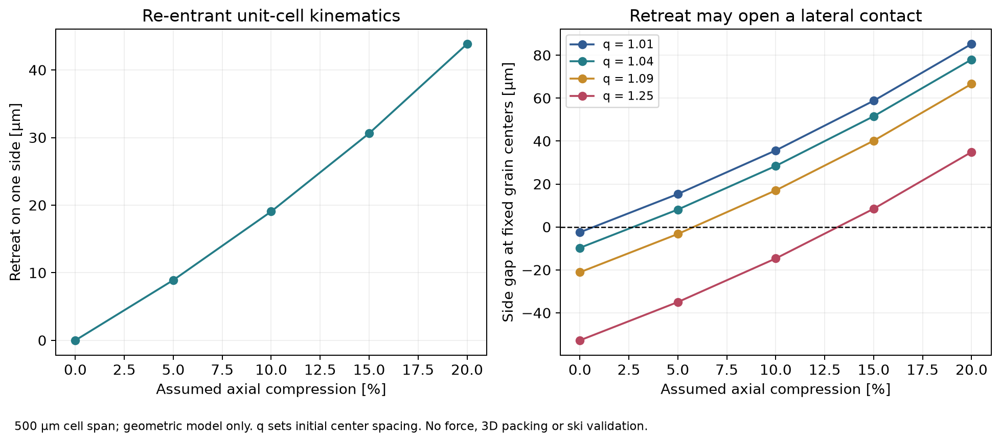
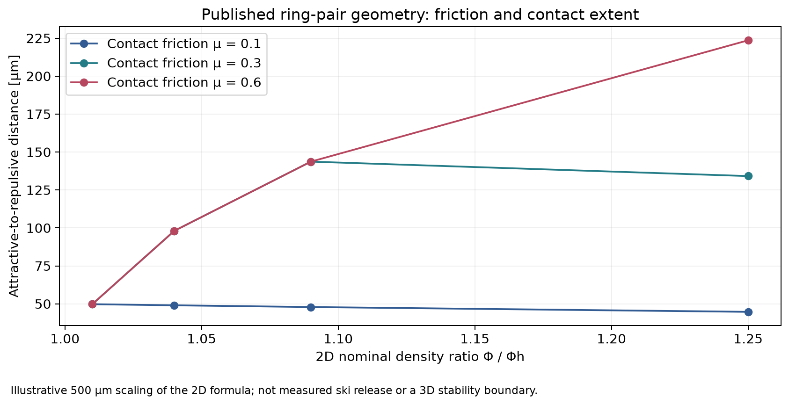
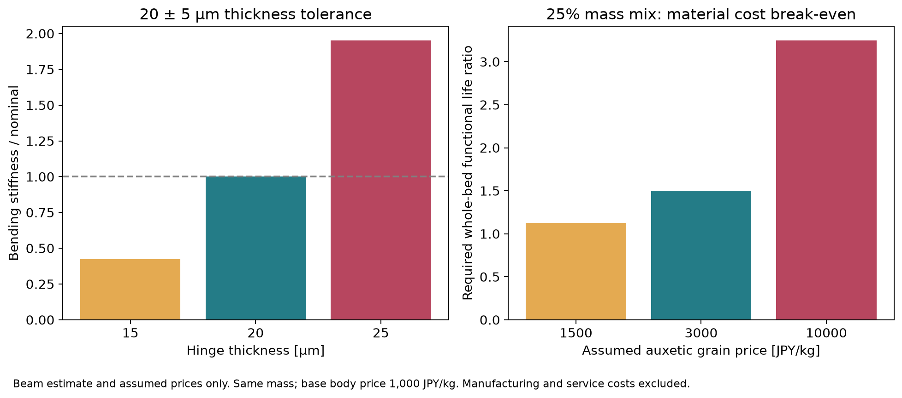

# 多方向探索第56巡：接点が縮んで抜ける粒と雪の支えの両立

2026-10-09／Codex／Claudeへの独立検証共有。基準コミット239286d2d565da76ea010b5c3ced640439cf4297。

## 1. 今回の発明案と結論

**H56として、荷重を受ける面を残しつつ、横方向の接点を内側へ後退させて局所的な引っ掛かりを解く粒を候補化した。** 強いフックで粒を固め続ける方向だけでなく、押されたときに横にも縮む構造を加え、エッジの通過後に長く抵抗を引きずらない経路を探る。

雪らしさの目標は従来どおり、板の走り、エッジの侵入・支持・短い距離での解放、振動、停止後の再始動を同時に満たすこと。柔らかく流れるだけ、砂の上を擦るだけ、ブラシが露出する構成へ目標を置き換えない。

今回の進展は次の3点。

- 圧縮すると横にも縮む粒の原著を確認した。ただし**押し込み量一定での改善を、荷重一定での改善と読み違えてはいけない**。同じ圧力では平均のせん断抵抗が同様になるという結果を設計条件へ反映した。
- 幅500µmの理想セルは縦圧縮10％で片側19.06µm後退する。隣接中心固定の例では横接点を開けるが、初期の重なりが深い反例では開かない。支持力が残ることは別に検証する。
- 曲げ部の厚さ20±5µmという仮の公差で、曲げ剛性は基準の0.422〜1.953倍、最大／最小比4.63倍になる。量産のばらつきを無視して同じ滑走感を保証できない。

**本プロジェクトの物理試験0件、実物成功確率は未算定。** 22項目の算術照合は、90％超の開発成功率を証明するものではない。既存の主観的な約15％予測から、根拠のある数値改善を得たとは主張しない。

## 2. 異なる仕組みを照合した結果

| 経路 | 一次資料から使える事実 | 今回の判断 |
|---|---|---|
| S1：押すと横にも縮む独立粒 | 凹形の機構を持つ粒で、拘束変位一定なら流動抵抗が小さくなる。一方、圧力一定では通常粒と平均応答が重なる。力の変動には違いが残る | 抵抗の変動・局所解放を改善する候補。平均摩擦を自動的に下げる材料とは扱わない。[Haverら2024](https://doi.org/10.1073/pnas.2317915121) |
| S2：押しつぶせるリング粒 | 柔らかいリングでも、摩擦と広がった接触によってせん断方向に実効的な引き止めが生じる | 柔らかくすれば必ず滑らかに崩れる、という推論への反例。接触が続く距離を評価する。[Poincloux・Takeuchi 2024](https://doi.org/10.1073/pnas.2408706121) |
| S3：カプセル内部の座屈 | 変形可能な殻を液体へ混ぜ、圧縮・流動特性を変える研究 | 粒の内側に変形自由度を置く発想は参考にする。油や液体に満たされた系の性質を、乾いた雪状床へ移植しない。[Djellouliら2024](https://doi.org/10.1038/s41586-024-07163-z) |
| 既出：フック付き粒 | 第7巡等で確認した、形によって再接続する粒 | 支持を作る比較対象として残すが、フックを増やすと短い解放や摩耗に不利な可能性も同時に判定する |

S1の粒は半径10／14mm、厚さ9mmのTPU造形品である。0.5mm級の三次元雪状粒ではない。50回の繰返し圧縮を確認しているが、本文の速度10mm/sとFig.10説明の1mm/sには記載差がある。50℃・濡れ・スキー速度・一冬の寿命へ外挿しない。図の向きによる回転も含め、単粒の等方性を推定しない。[著者所属大学の公開論文](https://pure.uva.nl/ws/files/248986951/haver-et-al-elasticity-and-rheology-of-auxetic-granular-metamaterials.pdf)

S1の生データとコードは公開一覧にあるが、今回の取得は403で実現しなかった。したがって独立した疲労データ再解析は未実施。原著本文・図の照合と、自作の式の計算を区別する。[公開データ](https://doi.org/10.5281/zenodo.10635094)

## 3. H56の構成：横の接点を後退させる

### 3.1 初期比較案

H53の軽い骨格、H50の開放排水、H54・H55の接触面と再生方法を継承し、接点を支える部分の運動だけを変える。骨格全体を一様に軟らかくする処方ではなく、荷重を受ける支持面と、局所接触を外す可動部を分ける構造案である。

| 部位 | H56での候補 | 未成立の条件 |
|---|---|---|
| 荷重を受ける座 | 板への接触面を広く支える。摩擦材料は従来候補と同じ条件で比較 | 側方接点を外した後もエッジの必要支持力が残るか |
| 後退する横接点 | 凹形の曲がる部分で内側へ引き込み、長い接触を断つ | 50℃・濡れ・複数方向荷重でも同じ動きをするか |
| 曲がりすぎを止める面 | 一定変位以降に内部の受け面へ当て、過度なつぶれを抑える | 受け面への衝突が硬い粒感や再ロックを生まないか |
| 開放部 | 洗浄・排水でき、袋状の閉じた水溜まりを避ける | 砂塵・摩耗粉・凍結水で詰まらないか |
| 表面材 | 完成時に反応を終えた保持接触層等を比較 | 可動部を被覆して動かなくしないか。摩耗で微粉・剥離が生じないか |

低荷重から接点を外すと支持を失い、深く押しても外れなければ砂状の抵抗が残る。**「どれだけ後退するか」に加え、「何Nで動き始め、その後の何Nを支えるか」が必須の設計変数**になる。本巡は力の法則を得ていないため、完成形の寸法図・発注仕様とはしない。

三次元化では、互いに直交する方向へ凹形部を置く案と、不規則な開放骨格内に同様の変形を持たせる案を比較する。前者は干渉と加工数、後者は向き・寸法のばらつきが課題。一平面の成功から、三方向の自由度を同時に実現できたとは扱わない。

### 3.2 理想セルで後退量を求める

初期角−30°、縦部／傾斜部長比1.5、初期の横間隔500µmとする。傾斜部を剛体、曲がる部分を回転部と置き、セルの間隔を W＝2L cosθ、H＝2L(1.5＋sinθ) と定義した。これは完成粒の外形ではなく、機構を比較する理想セルである。

縦に10％圧縮すると、角度は−36.87°、横間隔461.88µm、片側後退19.06µmとなる。長さ40µm・厚さ20µmの曲げ部を曲率一定とすれば、回転による表面ひずみ増分は約3.00％。疲労・応力集中・粘弾性を含めた許容値ではない。

同じ縮みが両横方向に起こると仮定した包絡体積は初期の0.768倍になる。しかし樹脂自体が23.2％消えるわけではない。空隙や部材配置がどう変わるか、他の部位へ体積が移って排水口を塞がないかを三次元で確認する必要がある。

### 3.3 開く例と開かない例を残す

横に並ぶ二粒の中心を固定し、初期中心距離を500/√q µmと置く。qは間隔を決める仮の幾何パラメータで、三次元の実測充填率ではない。

| q | 初期の見かけ重なり | 10％圧縮・後退後の横隙間 | 二粒モデルでの結果 |
|---|---:|---:|---|
| 1.09 | 21.09µm | ＋17.03µm | この横接点は開く |
| 1.25 | 52.79µm | −14.67µm | この横接点は残る |

二粒の接点を外すだけでは床のせん断抵抗や支持力を予測できない。周囲の粒が動いて隙間を埋めたり、別の接点が増えたりする。これがH56を粒群で検証する理由である。過度な圧雪で開閉域を通り過ぎる可能性があるため、整地ローラーの密度・締固めを最大化すればよいという仕様にもできない。

## 4. 柔らかい接触が逆に抜けにくくなる条件

S2の公開二粒式を用い、名目二次元密度の比q＝Φ/Φh、接点摩擦µに対して、力が引き止めから押し出しへ変わるせん断ひずみを

γr＝min(√(q−1), µ)

と書き直して照合した。対応距離は xr＝(D/√q)γr。Dはモデルの基準直径である。原著は摩擦と幾何接触長を組み合わせた説明で、低摩擦域の集団の閉じ込めなどは含まない。[著者公開原稿の式1・Fig.5](https://arxiv.org/html/2404.09773v2)

D＝500µm、q＝1.09という縮尺例では、µ＝0.1でxr＝47.89µm、µ＝0.3と0.6では約143.67µmになる。µを半分にしても、接触長で決まる範囲では解放距離が半分になるとは限らない。ここでのµは粒の接点摩擦で、板の摩擦ではない。

H56の横接点の後退量と、このリングのせん断距離は異なる軸・機構の量なので、19µmを143µmから差し引いて性能改善率を算出していない。狙う改良は、接触面を低摩擦化するだけでなく、必要な支持を作った後で接触の長さや連続性を変えることにある。

水が入ってµが変わると、支持と解放の両方が変わり得る。濡れて抵抗が小さくなっただけで合格にせず、板が走るか、エッジが支えるか、停止後に貼り付かないかをそれぞれ測る。

## 5. 小粒化と費用：機構が描けることと量産できることを分ける

S1の小さい方の粒の直径20mmを単純に0.5mmへ縮めると1/40。公表造形の積層厚200µmも相似にするなら5µm相当である。この計算は、その精度で量産できる証拠ではない。実用化には、一括成形・薄い材料からの形成・開放骨格の形成等を比較し、粒の個別組立を前提にしない工程が必要になる。

曲げ部の厚さが20µmから15／25µmへばらつく例では、材料・幅・長さ・固定条件が同じ梁の曲げ剛性は厚さの3乗に比例し、0.422／1.953倍となる。50℃で材料の弾性率が変わる影響はさらに別に掛かる。幾何形状だけで閾値荷重を指定できない。

全粒を複雑にする前に、従来骨格へ特殊粒を混ぜる比較を置く。質量混合率から支持力・摩擦を直線補間してはいけない。ここでは**費用だけ**を、総骨格質量140.03t、従来骨格1,000円／kg、特殊粒25質量％で比較した。

| 特殊粒の仮単価 | 初期骨格材料費 | 従来比の追加 | 年間材料費を同等にする全床機能寿命比 |
|---|---:|---:|---:|
| 1,500円／kg | 約1.575億円 | 約1,750万円 | 1.125倍以上 |
| 3,000円／kg | 約2.100億円 | 約7,001万円 | 1.5倍以上 |
| 10,000円／kg | 約4.551億円 | 約3.151億円 | 3.25倍以上 |

全床を同時交換し、総質量と機能をそろえた仮の比較。密度・必要厚さ・歩留まりが変わる場合は再計算する。接触層、製造設備、加工、保守、洗浄、物流、固定費は表に含まれず、実見積りではない。25％だけ混ぜて安くなっても残る75％が砂状の挙動を支配するなら、目的への改善には数えない。

2億円の暫定枠は整地設備と限定した土木であり、材料込み総額に読み替えない。H55で見た選別・再生能力と、特殊粒だけが先に壊れる場合の補充費も加えて、同じ面積・営業日・雪質目標の降雪／圧雪設備と比較する。

## 6. 実物検証で先に決着させること

最初に、セルの変位だけでなく力を測る。23℃と50℃で、一定押し込み量と一定押し付け力の双方について、横の反力、後退量、除荷後残留、局所ひずみ、繰返し履歴を得る。次に複数接点を持つ実形状へ進む。

粒群の初回比較は通常粒のみ・25％混合・特殊粒のみの3条件、一定荷重／一定侵入深さの2条件、乾燥／散水／排水後の3水条件、独立3ロット、計54条件セルを置く。反復試料数はばらつき測定後に決める。**この計画は未実施**であり、54セル通過率を実物成功確率にしない。

| 判定対象 | 見るもの | 次の分岐 |
|---|---|---|
| エッジの支持 | 必要なピーク抵抗を出す前に横接点が外れないか | 早く外れるなら後退開始・混合率・支持座を見直す |
| エッジの解放 | ピーク後の距離、残留抵抗、急な引っ掛かり | 一定荷重で改善しなければ接触材・接触長へ戻る |
| 板の滑走感 | 実ソールの摩擦、速度依存、振動、再始動 | 粒群の低抵抗だけを低いソール摩擦と扱わない |
| 濡れと泥化 | 凹部の閉塞、粒の団子化、排水後の復帰 | 水で一時的に滑るだけなら採用条件を満たさない |
| 寿命・安全 | 曲げ部の破断、剥離、微粉、抽出物、劣化材 | 50サイクルの文献から季節寿命や無害を宣言しない |
| 冬の接続 | 雪の侵入・固着、凍結融解、界面せん断と滞水 | 夏に外れる接点が冬の雪まで滑らせないか確認 |

基準雪は新雪を整地した雪とし、雪が安定する温度で測る。人工材は表面50℃で測る。雪自体のばらつき、測定誤差を踏まえ、許容差を試験前に設定する。平均摩擦だけでなく必要な指標の同時達成を判定する。

最大約300mmえぐれる想定に対し、候補床厚450mmの使用深さ全体で機能を保つ。R39の埋設保持材を露出させて滑らせない。台風後に下方へ集まった粒は、上へ戻した質量だけでなく、後退機構・骨格・摩耗と機能が回復したかを判定する。現地60分の整地で化学合成・全粒検査を終える前提は置かない。

## 7. Claudeへの具体依頼

1. S1の「一定変位では改善、一定圧力では平均応答が重なる」という条件差と、繰返し速度1／10mm/sの記載差を独立確認する。取得できれば公開CSV・元コードで追試し、未取得なら再解析済みにしない。
2. H56の横接点後退を三次元へ移せる構造を比較する。直交配置の干渉・曲げ部の応力集中・形状誤差を含め、支持力を失わずに接触を外す力―変位関係を得る。
3. リング式のq、摩擦、接触長の定義と、H56の間隔パラメータを混同していないか確認する。二粒の解放を斜面全体の安定性へ直接換算しない。
4. 特殊粒を混ぜる場合の分離・沈降・選別と補充費をH55へ接続する。同じ質量ではなく同じ使用深さと機能で費用を再比較する。
5. Claude v3の研究結果・元コードが更新されていれば場所を回覧板へ記載し、この候補と反証条件を照合する。

本巡の前にGitHubを更新確認し、基準コミットまでが最新だった。公開直前も変更を確認する。Claudeが受領・同意・検証を終えたとは主張しない。

## 8. 保存物と位置付け

[計算一式](接点後退と粒群の解放検証_20261009/README.md)に、仮定、標準Python計算、セル5条件・曲げ45条件・リング24条件・接点開閉20条件・公差3条件・費用12条件、22照合、3図、出典、未実施試験を保存する。

これは「分子結晶の形成方法を発見した」という報告ではなく、雪のような粒群の支持と解放へ近づける構造経路を追加したもの。滑走接触材・実際の雪状形態・50℃耐久・冬季固着・安全・採算は引き続き同時に満たす必要がある。

GitHubの保存内容を固定コミットから全件照合後、ローカルの研究ファイルとGit履歴を削除し、接続案内・既存設定だけを保護する。
