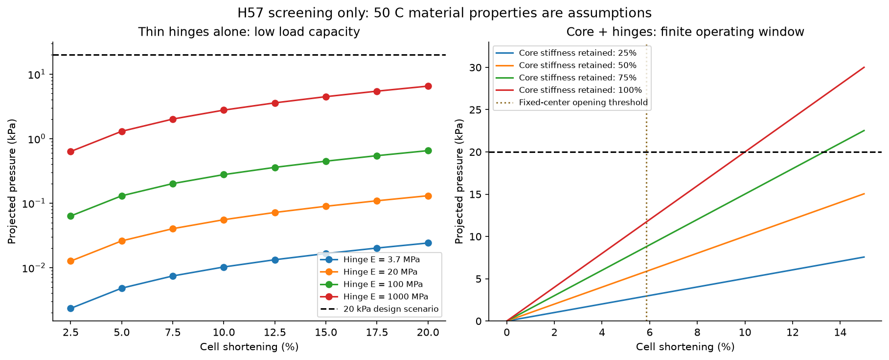
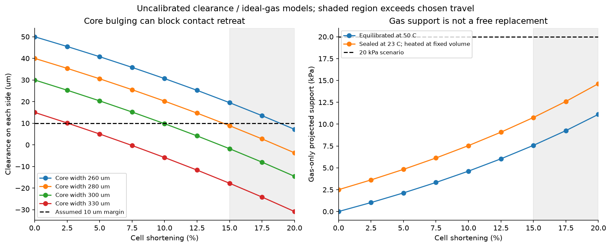
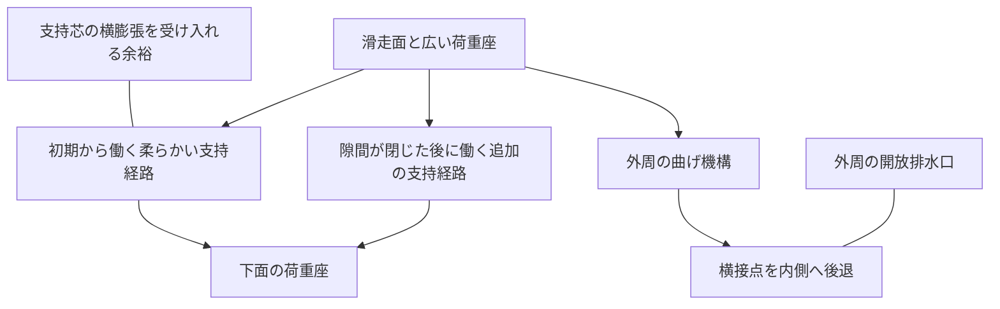
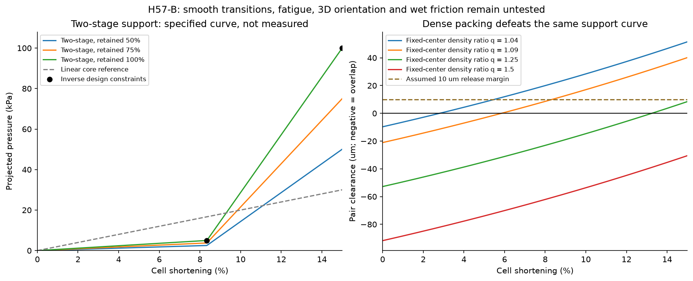
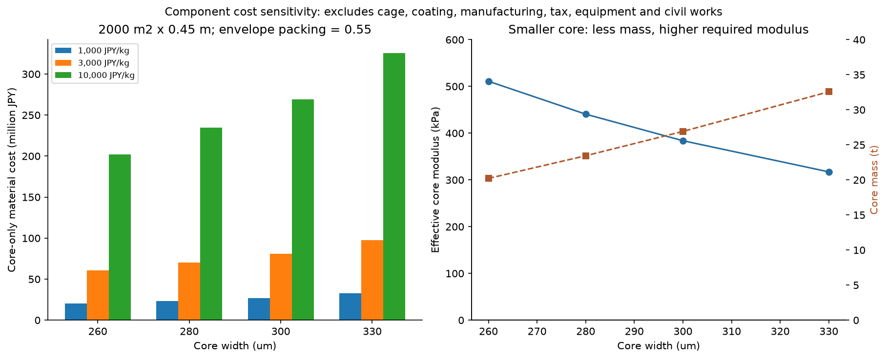

# 多方向探索第57巡：荷重を支える芯と解放する接点の統合

2026-10-09 JST / Codex / 参照開始コミット: `1edec66819a4de455d6865b3e3c2f3a61460b01d`

**今回の進展は、前案の接点後退に支持力の計算を加え、細い曲げ部だけでは荷重を受けられない条件を特定し、「接点を退避させてから支持が強くなる二段支持 H57-B」へ設計を進めたこと。** 荷重を受ける芯、横に縮む外周、滑走面、排水口の役割を分けて統合する。寸法と必要な力の曲線を数値化したが、実物の雪状滑走を達成したとはまだ言えない。

**物理試験0件。成功確率は未算定。90％超を示す証拠はない。** 従来の15％前後の予測も実測成功率として扱わない。以下の33項目は数式・単位・収支の照合であり、33件の実証実験ではない。二段支持の両端荷重は逆算して合わせた仕様であり、試験に合格した数字ではない。

## 1. 今回の探索と、途中で変えた方向

| 案 | 検討した利点 | 今回分かった限界 | 採否・融合 |
|---|---|---|---|
| H56の細い曲げ部のみ | 横接点を後退させる | 荷重を支える力が小さい代理計算。寸法公差の影響も大きい | 単独の主支持にはしない。接点の動作を担う部分として残す |
| 幅広い分散曲げ | 曲げを広い体積で負担する | 体積、長い変形区間、全体の運動学を再設計する必要 | 比較候補を残す。細い関節だけへの依存を減らす |
| 線形の多孔芯 H57-A | 主な荷重を内部で受ける | 低圧では縮まず、高圧では可動範囲を超える。太い芯は横膨張して干渉 | 一段支持の対照案 |
| 密閉気体の芯 | 少ない固体で反力を得る | 気密・傷・温度・初期内圧に依存。比較条件では支持不足 | 主支持として確定せず、補助案 |
| 二段支持 H57-B | 低圧で退避、高圧で支持経路を追加 | 必要な剛性変化が大きい。段差的な硬化は触感を悪化し得る | 次の形状設計候補。勾配発泡／遅れて当たる広い支持部で比較 |
| 材料を一様に硬くする | 強度とクリープ改善を狙う | 解放しにくさ、靭性・疲労・濡れ摩擦との交換条件 | 部位別の選択へ。全粒を同じ硬材に置換しない |

根拠に追加した一次資料は[出典台帳](支持力と接点後退の両立検証_20261009/sources.md)の3件。S1は運動学と支持力の区別、S2は変形部と荷重伝達部を分ける考え方、S3は50℃を含むクリープ研究の存在と硬化の交換条件を参照した。いずれも本粒の性能を立証しない。

## 2. 前案は「動く」が「支える」を保証していなかった

H56の幅500 µm、高さ577.35 µmの仮想セルを10％縮めると、片側の接点は19.06 µm後退する。この運動学に、4個の回転ばねが持つエネルギーを加えた。

仮の曲げ部は幅40 µm、厚さ20 µm、長さ40 µm、弾性係数20 MPa。全4部位が同じ角度だけ回るとすると、

`U = n k ψ² / 2、k = E b t³ / (12 l)、F = dU/dδ = n k ψ / W`

となる。投影面積500×500 µm²で割った値は**0.0554 kPa**。20 kPaの設計荷重に対して約361分の1。形が横に縮むことだけを理由に体重支持まで成立したと扱ってはいけない。

ただし厚さ／長さが0.5の曲げ部に単純梁の近似を当てた粗い評価であり、この数字を実物の精密予測に使わない。実際の関節形状・回転比・接合・三次元配向によって変わる。20 MPaも50℃の測定値ではない。**20 kPaは雪から採った合格値ではなく、この巡の設計条件。**

幅400・厚さ40・長さ200 µm、係数100 MPaの分散曲げの代理計算では4.43 kPaまで上がるが、その長い曲げ部を配置した時に同じ後退運動が維持できるかは未検証。単に材料係数を上げて解決したとはしない。

図1：左は仮定した係数別の支持力。右は線形芯を加えた場合。凡例の保持率は温度・疲労に対する感度であり、実測の耐久率ではない。

## 3. 芯を足しても、太くしすぎると抜け道を塞ぐ

H57-Aでは芯と外周が同じ上下変位を受け、力を並列に分担すると仮定した。高さ400 µm・幅260 µm角の芯なら、20 kPaで10％縮む設計点に必要な有効圧縮係数は**約511 kPa**。これを材料仕様の候補とする。実際の発泡材がこの係数、密度、回復、疲労を同時に満たす証拠はない。

空洞幅360 µm、芯の見かけのポアソン比0.3、片側の最低隙間10 µmを仮定した比較では、

- 幅300 µmの芯：10％短縮時の隙間9.78 µmで、設定した余裕を下回る。
- 幅260 µmの芯：15％短縮時でも隙間19.51 µm。小さくすると材料量は減るが、必要な有効係数は上がる。

この隙間は2Dの空洞縮小則に基づく。枝・支持肩・被覆が実際に入る3D形状の保証ではない。

同じ線形芯を一定圧力で解くと、5 kPaで後退は片側4.31 µmにとどまり、20 kPaで19.06 µm。100 kPaは仮の可動上限15％以内で支えられない。剛性が半分なら20 kPaでも可動上限を超える。**一つの設計点だけに合わせた線形芯は、そのまま採用しない。**

気体芯の比較では、幅260 µm・高さ400 µmの体積固定ピストンを等温圧縮すると、10％のセル短縮時に支持する投影圧力は4.62 kPa。気体だけで主支持を代替する条件には届かない。実物の殻の膨張、漏気、傷、加熱時の初期内圧は別途必要になる。

図2：灰色部分は仮の可動上限15％の外側。横膨張の計算は一次近似。気体の図も理想モデルで、実験値ではない。

## 4. 改良案 H57-B：退避が先、強い支持は後

新しい設計仮説は、低荷重では柔らかい支持経路が動き、接点が後退してから追加の支持経路が働く粒。段階的に密度を変えた芯、空隙が閉じると当たる広い支持肩、分散曲げと圧縮部の組合せを比較する。最初から硬い柱を並列に置くと、退避に必要な変位を止めるため順序が重要になる。

`F_core = K1 δ + K2 max(0, δ − δ_on)`

初めの検討では接点がちょうど離れる位置を切替点にしたが、隙間ゼロでは公差を吸収できない。そこで低荷重5 kPaの時点で、固定中心の理想接点間に**10 µmの余裕**を持たせる仕様に更新した。これは任意の試作余裕であり、湿潤付着や粉塵に十分だと実証した値ではない。

| 項目 | 第57巡で逆算した仕様 |
|---|---:|
| セル幅／高さ | 500／577.35 µm |
| 仮の芯幅／高さ | 260／400 µm |
| 支持経路の切替変位 δ_on | 48.15 µm |
| 切替時のセル短縮率 | 8.34％ |
| 第一経路 K1 | 25.72 N/m |
| 追加経路 K2 | 591.70 N/m |
| 切替後／切替前の接線剛性比 | 約24.0倍 |
| 同じ芯断面に換算した有効接線係数 | 約152 kPa → 3.65 MPa |
| 仮の可動上限 | セル短縮15％、δ=86.60 µm |

**この24倍の切替を、50℃・湿潤・疲労後にも滑らかに出す形状が必要。対応する材料や成形品はまだ得ていない。** 現段階は製造図ではなく、形状を反証するための力と寸法の仕様である。

機能配置の概念：

滑走面は第54〜55巡の接触面・更新設計を継承し、支持芯の追加だけで摩擦が雪並みになるとは考えない。骨格全体に油を塗る方法や、固定ブラシを滑る面への変更は採らない。

| 投影圧力 | 二段モデルのセル短縮 | 片側後退 | 解釈 |
|---|---:|---:|---|
| 5 kPa | 8.34％ | 15.54 µm | q=1.09の固定中心例で10 µmの接点間余裕を設定 |
| 20 kPa | 9.39％ | 17.75 µm | 追加支持部が荷重を受け始める |
| 50 kPa | 11.50％ | 22.36 µm | 急な硬化による触感を別途確認する必要 |
| 100 kPa | 15.00％ | 30.63 µm | 設計上限そのもの。安全率や耐久余裕を含まない |

5 kPaと100 kPaを満たすよう逆算したので、表の一致は実証ではない。荷重履歴が異なる場合のエッジ保持・短い解放は未検証。押すと接点が退避することは、必要なエッジ支持まで失う危険もあり、荷重座とせん断接点の役割を3Dで確認する必要がある。

図4：支持部の剛性が25％落ちると100 kPaの条件は上限内で成立しない。固定中心の密度比q=1.50では、同じ15％の変位でも接点の重なりが残る。qは2Dの比較量で、粒床全体の充填率ではない。**二段化だけで高密度の絡まりを解決したことにはならない。**

## 5. 経済性：芯を大きくして解決すると材料量が増える

2000 m²×0.45 m、外接体積の充填率0.55、芯の密度218 kg/m³を仮定。H57の外形から粒数を計算し直すと約3.43兆個。幅260 µm角・高さ400 µmの芯は、総量**約20.22 t**。幅300 µmの芯に比べ芯材量は約24.9％減る。ただし小さい断面にはより高い有効係数が必要になる。

| 芯材の仮単価 | 幅260 µmの芯だけの材料費 |
|---|---:|
| 1,000円/kg | 約2,022万円 |
| 3,000円/kg | 約6,065万円 |
| 10,000円/kg | 約2億216万円 |

**これは完成材料の見積りでも、整地設備の見積りでもない。** 外殻・曲げ部・滑走面・加工・歩留まり・回収・税・設備・土木を含まない。実見積りは未取得。芯の密度、係数、ポアソン比を独立に実現できるとは限らない。二段構造は追加加工費も未定である。

設備と限定土木の暫定枠「税込2億円」と材料費を混ぜて予算内と表示しない。既存の多孔体の中に芯を形成する場合は二重に足さず、完成粒の実際の質量で積み直す。追加加工費を正当化するには、交換量・機能回復費・寿命を含む同一条件の費用比較が必要。

## 6. 本来の目的に対する現在地

| 必須条件 | 今回の到達点 | 未達・未確認 |
|---|---|---|
| 30℃以上で噴霧して結晶・粒を作る | 工場で構造を作る候補として検討 | H57は現地噴霧結晶化を実現した案ではない。Claudeのv3と並行して比較する |
| 雪状結晶と圧雪の滑走感 | 支持と接点退避の力の仕様を追加 | 分子結晶・外形・粒群触感は別。雪と同等の摩擦、振動、エッジ保持と解放は未実証 |
| 気温30℃以上・表面50℃ | 50℃で必要な物性と剛性保持を入力として明示 | 最終材料の50℃・乾湿・疲労データなし |
| 人体・環境への悪影響を避ける | 潤滑油などに依存しない方針を維持 | 完成粒、摩耗粉、溶出物、暴露の評価なし。樹脂名だけで安全扱いしない |
| 夏の全厚性能 | 450 mmの数量基準を保持 | 表面だけの試験で全厚を保証しない。深い掘れで部材が露出する設計は採らない |
| 冬の雪との固着・排水 | 開放根元とR39保持下地を継承 | 雪との界面せん断、融雪水滞留、凍結閉塞、追加融雪は未実測 |
| 雨・台風後の復旧 | 芯と空洞の干渉を検査項目へ追加 | 再配材だけでは回復を保証しない。水・泥・粉・破損粒を含む機能試験が必要 |
| 4〜5時間の営業後、約60分で復旧 | 運用条件を維持 | 50℃でへたった芯はローラーで圧すだけでは回復しない可能性。選別・補充・乾燥の能力検証が必要 |
| 経済性 | 芯の体積・仮価格を独立算定 | 製造可能性、二段化の費用、合格歩留まりと実寿命が未定 |

## 7. Claudeへの受け渡し

回覧板・README・GPT往復の入口をこの報告へ更新する。これはGitHub上の共有であり、Claudeからの受領・採用・返答を意味しない。公開前にmainを再取得し、1edec668以降のClaude更新はなかった。v3の完了結果、元コード、稼働状態は引き続き未確認。

Claudeには次を確認してほしい。

1. 第56巡の運動学を保ったまま、実体3D形状で力と横収縮を同時に解く。曲げ部の回転数、長さ、荷重分担が仮定どおりかを反証する。
2. H57-Bの約24倍の接線剛性変化を、単一材の勾配発泡、遅れて当たる支持部、分散曲げの3経路で比較する。0.5 mm級へ小さくした時の公差・座屈・回復を外さない。
3. 5/20/100 kPaを要求値として固定せず、同じ板とエッジで測る圧雪の荷重履歴から更新する。単粒の投影圧力をそのまま斜面全体に使わない。
4. 接点退避がエッジ支持を奪う反例、湿潤で貼り付く反例、密充填で抜けない反例を優先する。逆算点の一致を成功率の更新に使わない。
5. v3の新しい原データ・結果がある場合、日時・入力・失敗例を含めて公開し、今回の候補と同じ必須条件で比較する。材料・物理試験を実施した記録がない限り、実証件数は増やさない。

[試験計画](支持力と接点後退の両立検証_20261009/test_plan.json)は全て未実施。試作・発注・外部連絡は行っていない。

## 8. 再計算と保管

[計算一式](支持力と接点後退の両立検証_20261009/README.md)に入力、数式、コード、全計算表、33項目の代数照合、4図、出典と実験計画を収録。通常のPythonで計算でき、図にはmatplotlibが必要。検査の通過率を素材の実物成功率に置き換えない。

保管先は既存GitHubのmain。公開コミットの全成果ファイルをローカル原本とバイト数・SHA-256・内容で照合してから、今回の作業用複製とそのGit履歴を削除する。ルートの接続案内と利用設定は保護する。
