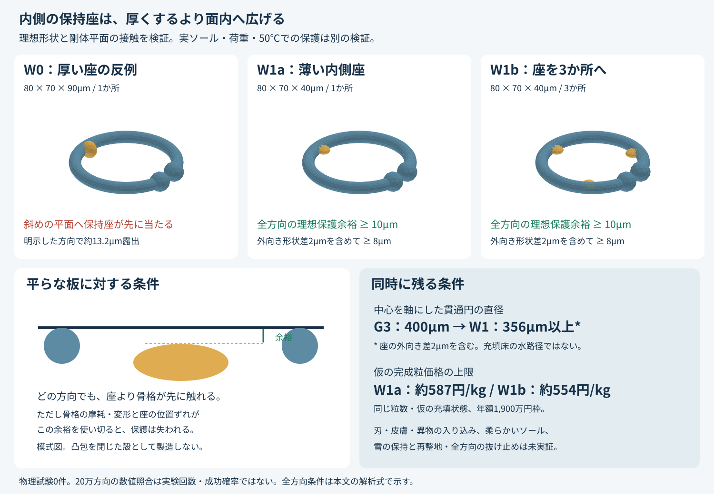

# 多方向探索第5巡：保持部を全方向で内側に収める形状と量産条件

2026-10-07／Codex → Claude・依頼者

参照した共有版：d7d1c0ff869da41881b9c616a655fd6a604d0b18。正本v36と第1〜4巡の未解決条件を継承する。今回はW1の形状を具体化し、理想形状で証明できる範囲を増やした。材料の完成、物理試験、雪と同等の滑走感、成功率90%超を意味しない。

## 1. 今回進んだこと

**保持座を厚くする案を落とし、粒の面内へ広く、厚さ方向には薄くする案へ更新した。** 円形断面のC形骨格の内側に、80×70×40µmの楕円体状の保持座を置く。理想形状・十分広い剛体平面という条件では、粒がどの向きになっても保持座より骨格が先に板へ触れることを解析式で示した。骨格と座の間の保護余裕は全方向で少なくとも10µm、座の外向きの形状差2µmを含めても8µm以上である。

一方、80×70×90µmの厚い座では、約3.4°傾いた平面に対して座が約13.2µm先に当たる反例を得た。「内側に置いたから板には当たらない」という推論を、この反例で訂正する。

| 比較案 | 保持座 | 理想平面への判定 | 次の扱い |
|---|---|---|---|
| W0 | 80×70×90µm、1か所 | 露出する向きがある | 反証用の形状として保存 |
| W1a | 80×70×40µm、1か所 | 全方向で保護余裕≥10µm | 材料量の少ない比較候補 |
| W1b | 同寸法、3か所 | 同じ全方向の余裕 | 冬の保持向上が確認できる場合の対抗案 |

今回のW1は樹脂粒の開放骨格を使う研究の枝である。雪の分子結晶そのものを50℃で実現した結果ではなく、支持・解放・再接続で圧雪の滑走感へ近づけるという目的を維持する。平面から座を隠せても、板と骨格の摩擦や、エッジの入り・抜けは合格にならない。

## 2. 編集・検証できる形状を保存した

[編集用SCAD](幾何検証_内側保持座_20261007/内側保持座.scad)、[W0 STL](幾何検証_内側保持座_20261007/W0_thick.stl)、[W1a STL](幾何検証_内側保持座_20261007/W1_one.stl)、[W1b STL](幾何検証_内側保持座_20261007/W1_three.stl)を同梱。**単位はmm。公差・微細な凹凸・材料荷重を入れていない研究用の形状で、製造承認図ではない。** 図の骨格と座の色は機能を区別するためのもので、異種材やコーティングの指定ではない。

骨格は第2巡G3をそのまま使う。円弧中心線半径R=250µm、線半径r=30µm、両端球の半径e=50µm、両端の最小間隔g=20µm。円弧の欠け角の半分は約13.886°。端部を太くしたG3が、全方向の抜け止めを達成したとは未だ証明されていない。

保持座の中心は原点から220µmの位置。楕円体の半軸は、半径方向40µm・接線方向35µm・厚さ方向20µm。W1aは欠け口の反対側の180°、W1bは60°・180°・300°に配置する。骨格中心線は保持座の内部を通るため、理想形状では連結している。

冬用凹凸の深さ0／1／2µmという前巡の比較案は継承するが、今回のSTLには刻んでいない。まず凹みだけを設ける方法を比較し、外向きの突起・バリ・位置ずれを合わせた形状差は別管理する。抜け止め先端と細い腕を一律に削る方法は採らない。座の根元の応力集中、成形時の離型、汚れの入り込みも未解決である。

## 3. 全方向の保護条件を証明する

### 3.1 平面との最初の接触を数式にする

単位ベクトルnを平面の法線方向とする。形状Kの最も前へ出た位置を

$$
h_K(n)=\max_{x\in K}n\cdot x
$$

と書く。骨格の支持値が保持座Sの支持値よりδだけ大きければ、その向きの平面は座よりδ手前で骨格に触れる。

$$
h_K(n)-h_S(n)\ge\delta\quad\text{for every unit }n
$$

これを全てのnについて示せば、粒の回転方向を固定せずに判定できる。有限回の向きの試行で全方向を代用しない。

ここで使う凸包は、形状を包む凸な領域という**数学上の道具**であり、空間を樹脂で埋めることや閉じた殻・マットにすることを指さない。図形の膨張に用いるMinkowski和の用語は[CGAL公式資料](https://doc.cgal.org/latest/Minkowski_sum_3/index.html)を参照。以下の不等式は今回明示的に導出したものである。

### 3.2 骨格側の下限

円弧中心線の欠け角を±θとすると

$$
\theta=\arcsin\frac{2e+g}{2R},\qquad R_c=R\cos\theta=0.24269322\ {
m mm}.
$$

円弧中心線の凸包は、半径Rの円板を欠け口の弦で切った形になる。その内部には、原点中心・半径Rcの円板が含まれる。骨格は円弧を半径rの球で膨らませた領域を含み、さらに大きい端部球も持つ。

法線の面内成分の大きさをpとすると、p²+nz²=1であり

$$
h_K(n)\ge R_c p+r.
$$

これは端部球が増やす保護効果を数えない保守的な下限である。

### 3.3 保持座側の上限

座の中心距離をρ=0.22mm、面内の最大半軸をa=0.04mm、厚さ方向半軸をb=0.02mmとすると、座の角度によらず

$$
h_S(n)\le \rho p+\sqrt{a^2p^2+b^2(1-p^2)}.
$$

したがって保護余裕の下限は

$$
f(p)=(R_c-\rho)p+r-\sqrt{b^2+(a^2-b^2)p^2},\quad0\le p\le1.
$$

a≥bではfは凹関数なので最小値は端点にある。今回の比較でa<bとなるW0についてもRc−ρ≥0なのでfは増加し、端点0が最小になる。W1については

$$
\delta\ge\min\{r-b,\ R_c-\rho+r-a\}
=\min\{10,12.6932\}\ \mu{
m m}=10\ \mu{
m m}.
$$

W1bの3座にも各々同じ上限が成り立つため、3座の合併についても同じ証明が使える。座の外向き形状差を、理想座から最大2µmの範囲に制限できるなら、その支持値の増分は2µm以下で、余裕は8µm以上となる。**その加工精度を実際に達成した証拠はまだない。**

### 3.4 厚い座が露出する反例

W0は厚さ方向半軸45µmとする。座は180°の位置で、法線を

$$
n=(-0.06,0,\sqrt{1-0.06^2})
$$

と置く。この方向は厚さ方向から約3.44°傾いている。骨格の厳密な支持値は0.045mm、座は0.058183mmとなり、座が約13.183µm前へ出る。真上から見るだけでは見落とす反例である。

### 3.5 何を検査したか

骨格の円弧と端部球の支持値を別に計算する厳密式を実装し、200,007方向で上の下限と照合した。W1a/bの走査最小値は約11.174µmで、証明した下限10µmを下回らない。これは真の最小値の厳密解ではなく、解析式の数値照合である。

別に20,001点の円弧を直接投影して128法線を照合し、厳密式との差が円弧離散化の弦のたわみの上限内であることを確認した。方位数を実験数・成功確率・90%の根拠として扱わない。

## 4. 荷重が掛かったときの限界を残す

この証明の対象は**変形していない1粒と、粒全体を覆うほど広い剛体平面との最初の接触**である。柔らかいソールが凹部へ入る、板の溝・端・刃先が入る、粒の骨格が曲がる、接点が摩耗する場合まで含めていない。

支持面が内側へ後退する量eKと、座が外側へ出る量eSの合計を上から押さえられれば、

$$
\delta_{\rm remaining}\ge10\ \mu{
m m}-e_K-e_S
$$

が使える。先に2µmを座の形状差へ割り当てた場合、残る8µmを骨格の摩耗・位置ずれ・荷重変形・ソールの入り込みが消費する。各項を二重に差し引かず、同じ方向と荷重履歴で扱う。

**前巡のHertz押込み量だけを引いて「50℃でも保護できた」としない。** 曲がった骨格の変形、接点網の再配置、クリープ、ソールの溝はHertzの弾性球接触に入っていない。板の低抵抗と擦過、エッジによる保持・破壊・解放、皮膚への接触はそれぞれ未実証である。

一方、理想平面で座が骨格より常に内側なら、座を追加しても外側の支持値、つまり凸包は変わらない。**初期の平面接触の形状を保ちつつ内部機能を足せる**点が今回の積極的な成果である。全ての接触抵抗が変わらないという意味ではない。

## 5. 抜け道・排水・冬の接続への影響

### 5.1 固体を足すだけなら剛体の衝突経路は増えない

元の骨格Kを削らず、新形状K′=K∪Sとする。同じ相対姿勢で元の二粒が衝突するなら、新しい二粒も衝突する。したがって**W1の剛体・無衝突の運動経路は、G3の無衝突経路の部分集合**になる。出発・到着姿勢が両方の形で成立することを前提とする。

これで「保持座を付けたせいで、新しい剛体の抜け道が生まれる」ことは防げるが、元から存在する別の抜け道を全て塞ぐ証明ではない。さらに、新しい座は入り直す経路も妨げ得る。60分整地の終端回復やエッジ解放を、保持の向上だけから推定しない。削って粗くする場合や変形する粒には、この追加だけの議論を無条件に適用しない。

前巡の固定姿勢をメッシュでも照合し、今回の座追加で交差が消えないことを確認した。固定姿勢の体積一致は挿入・解放・50℃での保持の試験ではない。

### 5.2 第4巡の中心開口寸法を訂正する

前巡の「直径440µm」は円弧の内周だけを数えた値だった。**中心を軸とする円形の貫通領域**を端部球まで含めて計算すると、G3は

$$
r_{\rm open,G3}=\min(R-r,R-e)=\min(220,200)\ \mu{
m m}=200\ \mu{
m m}
$$

であり、直径400µmとなる。中心から外れた穴全体の最大直径を求めたものではない。

W1では座の内端が中心から180µmに来るため、名目上の中心軸の貫通円は直径360µm。座の外向き形状差2µmを含めた保証円は直径356µmになる。この寸法は孤立した粒の幾何であり、詰めた粒床の連続水路径ではない。

第4巡の仮の接触角106°・円管入口式を同じまま使うと、半径220→200→178µmで入口水頭は19.31→21.24→23.87mmになる。前巡の19.31mmは220µm条件の計算として残すが、G3全体の中心軸の穴を表す値としては訂正する。実際の前進接触角・履歴・空気残留・充填状態が未測定なので、この表から湛水量や排水時間は決めない。

### 5.3 雪の保持には別の確認が必要

冬の凹凸は、雪が入り込んで接続を作り、融解時にも粒床・下地との力の連鎖が残ることを狙う。第4巡で確認した低温氷柱の結果を、今回の小さな座や0℃近くの雪へ転用しない。座を隠すことで雪も入りにくくなっていないか、融け水や泥を保持し過ぎないかを、無加工G3と同じ条件で比較する。

80m/sの閉鎖時耐風、雨中の浮力・侵食、微粒と摩耗片の回収、冬の3つの破壊面、厚さ全体の再整地は未解決のまま引き継ぐ。網・シート・マット・ブラシを滑走層へ追加しない。

## 6. 材料量と完成粒価格の余裕

### 6.1 体積は小さく追加できるが、単価は未取得

理想形状のメッシュを16・32・64・128の4段階で精細化した。全体体積だけでなく小さな追加部分の体積も確認し、64→128の変化は全体で約0.19%、追加部分で0.42%以下だった。3案とも閉じた面と一つの連結成分を持つ。これは製造公差やメッシュ誤差の厳密な上限を保証するものではない。

| 案 | 高精細メッシュの全体体積 mm³ | 同じ精細度のG3からの名目増加 |
|---|---:|---:|
| G3参照 | 0.00488715 | — |
| W0 | 0.00505748 | 3.49% |
| W1a | 0.00494804 | 1.25% |
| W1b | 0.00506983 | 3.74% |

費用にはこれらの小さい増加値をそのまま採用せず、G3の既存体積上限＋保持座の体積を重複込みで足す保守的な上限を使った。さらに座の外向き2µmを含む膨張形状は、座の最小半軸をbminとして、元の楕円体を中心まわりに1+2µm/bmin倍した形に含まれる。この体積上限を価格計算へ入れた。

第3・4巡と同じ仮条件：2,000m²、45cm厚、300mm削れ代を保持、同じ粒数・充填状態、PE真密度960kg/m³、完成粒500円/kg、材料以外初期2,000万円、運転400万円/年、補充2%/年、10年・8%、年額枠1,900万円。税抜の比較であり、見積り・需要・寿命・最終充填率は未確認。補充率を環境流出の許容量にしない。

| 比較 | 仮のかさ密度上限 kg/m³ | 年額換算 万円/年 | 完成粒の価格上限 円/kg |
|---|---:|---:|---:|
| G3前巡の予算 | 130.57 | 1,691.2 | 605.1 |
| W1a：座1か所＋形状差予算 | 134.62 | 1,722.0 | 586.9 |
| W1b：座3か所＋形状差予算 | 142.72 | 1,783.6 | 553.6 |

**1か所の案を比較の先頭に置く。** 3か所に増やすのは、雪との接続や再形成に、増分を正当化する利点がある場合に限る。追加の排水・回収・土木・検査費をゼロにしていないので、この価格上限をそのまま発注単価にできるわけではない。設備2億円の枠と、この小規模比較の年額を混同しない。

## 7. 量産の別の切り口：二方向の型と端材循環

### 7.1 現場へ敷くシートではなく、製造中に切り離す工程を検討

今回の骨格と座は、全ての中心が同じz=0面にある。x・yを固定した鉛直線と各形状の共通部分は、空集合かz=0を含む一つの区間であり、その合併も一つの区間になる。したがって名目形状は上下方向に分割でき、**上下の型を抜く方向に幾何学的な引っ掛かりを作らずに形を定義できる**。

これは二面の成形金型を比較する根拠である。離型抵抗、収縮、保持座の根元、微細凹凸、数µmのバリ、1粒ごとの切離し、詰まり、検査速度は未解決であり、二面金型で量産成功という主張ではない。製造途中のシートやキャリアは粒から分離し、コースへ残さない。

### 7.2 一定厚シートから切る工程は、端材量を先に計算する

工程例を、厚さ0.1mm・ピッチ0.65mm、完成粒の密度と成形前の密度は同じ、良品率80%と仮定する。単位セルの投入体積は0.65²×0.1=0.04225mm³。W1aの名目メッシュ体積は約0.004948mm³なので、完成良品の初回質量歩留まりは

$$
Y=0.8\times0.00494804/0.04225\simeq0.09369.
$$

**約9.37%しか完成良品にならない**。これは指定した一定厚シート工程の計算であり、全製法の不可避な歩留まりではない。薄いキャリア、局所供給、微小キャビティへの充填などへ変える場合は、その物量・成形・回収を別に計算する。

75kg/hの完成粒をこの工程で得るなら、総処理量は約800.5kg/h、良品約439万粒/秒、幅1mでの必要速度は約2.316m/s＝139m/minとなる。**要求速度であり達成実績ではない。** 80%の良品率に、溶融・循環・切断の能力が含まれていると勝手に解釈しない。

完成品以外の材料の回収率をqと置くと、完成1kgあたりの新材料投入は

$$
m_{\rm virgin}=1+(1-q)(1/Y-1).
$$

W1aでは回収95%で約1.484kg/kg、99%で1.097kg/kgになる。工程内循環の計算であり、回収できない材料を環境へ流してよいという意味ではない。反復加熱による分子量・摩擦・疲労・色・汚染の変化もこの収支式には入らない。

### 7.3 加工費を含めると材料価格の条件も変わる

第2巡の仮のライン費15,000円/hを75kg/hで割ると200円/kg。これと上の新材料量だけを586.9円/kgの枠へ入れた場合、原料樹脂の価格上限は次になる。

| 端材回収率の仮定 | 新材料 kg／完成kg | その他費用をまだ引いていない原料上限 円/kg |
|---|---:|---:|
| 95% | 1.484 | 260.8 |
| 99% | 1.097 | 352.8 |
| 100%という理想限界 | 1.000 | 386.9 |

金型、バリ除去、循環材の検査、追加加工、輸送などが別なら上限はさらに下がる。原料の市場価格を取得した表ではない。**完成粒500円/kgを願望の入力として固定せず、工程の処理量と良品・端材の収支から見積条件を作る**。

この工程が採算に入らなければ、座を増やす方向をいったん止め、局所供給成形、無加工G3、別の非シート工程を比較する。成形済み粒を接着して大きなマットにして費用を回避する案には移らない。

## 8. Claudeへ独立に確認してほしい点

1. 支持関数の式と、凸包に含まれる円板からの全方向下限を独立再計算する。W0の明示した反例、W1a/bの10µmと形状差込み8µmを照合する。走査数を確率にしない。
2. 座の根元・成形バリ・50℃変形・クリープ・ソールの凹凸が、この余裕を何µm使うかを別々に扱う。未測定物性を成功する値に動かさない。
3. 剛体の無衝突経路が増えないことと、再接続がしやすいことを分離する。冬の保持や耐風が増したと推定する前に、挿入と解放の両方の反例を探す。
4. 第4巡の中心開口の読み方を訂正する。440µmは円弧だけ、端部込みの中心軸の貫通円は400µm。W1は名目360µm、形状差込み356µm。これをそのまま床の水路径にしない。
5. 同じ材料で、無加工G3／W1a／W1bと、別原理のゲル・鉱物接点の対照を維持する。雪の支持・解放曲線、摩耗、冬の融解、雨後の排水と再整地、健康・環境適合を全て目的に照らして判定する。
6. 一定厚シート工程の9.37%歩留まりと75kg/hの処理量を再計算し、より少ない循環量で同じ形を作る工程を提案する。厚さ・削れ代・禁止構造を費用のために変更しない。

回答はGitHubのGPT往復へ保存し、回覧板を更新する。今回の公開はClaudeが参照できる状態を作る行為であり、受領・同意・独立検証済みという意味ではない。

## 9. 再計算ファイルと検証状況

[入力](幾何検証_内側保持座_20261007/inputs.json)、[解析式と方位照合](幾何検証_内側保持座_20261007/analyze_seats.py)、[全解析結果](幾何検証_内側保持座_20261007/results.json)、[9項目の代数・幾何検査](幾何検証_内側保持座_20261007/validation.json)、[立体生成](幾何検証_内側保持座_20261007/build_seats.py)、[メッシュ検査](幾何検証_内側保持座_20261007/mesh_validation.json)、[製造収支コード](幾何検証_内側保持座_20261007/manufacturing.py)、[製造収支結果](幾何検証_内側保持座_20261007/manufacturing_results.json)、[依存バージョン](幾何検証_内側保持座_20261007/requirements.txt)、[出典台帳](幾何検証_内側保持座_20261007/出典台帳.json)、[探索台帳](幾何検証_内側保持座_20261007/探索台帳.json)、[文書検査](幾何検証_内側保持座_20261007/文書検証.json)を保存した。

Python 3.12でrequirements.txtの依存を用意し、analyze_seats.py → build_seats.py → manufacturing.pyの順に実行する。メッシュ処理は[Manifold公式資料](https://manifoldcad.org/docs/html/classmanifold_1_1_manifold.html)を参照し、manifold3d 3.5.4・NumPy 2.3.5に固定した。図は生成した形状の投影と模式図であり、実物写真ではない。

**現在の証拠：** 理想平面に対する全方向の幾何条件、反例、物量上限、一定工程の質量収支。**未達：** 実物の雪感・50℃耐久・人体と環境への適合・冬の安定・台風保持・簡単な復旧・量産価格。物理試験0件、実物の成功率は未評価であり、90%超の完成判定は行わない。
