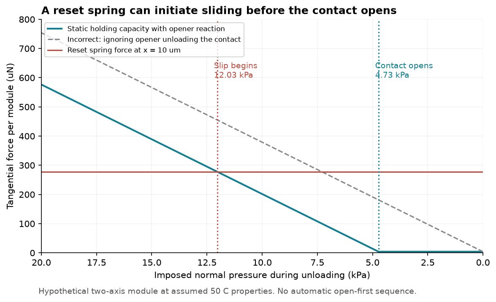
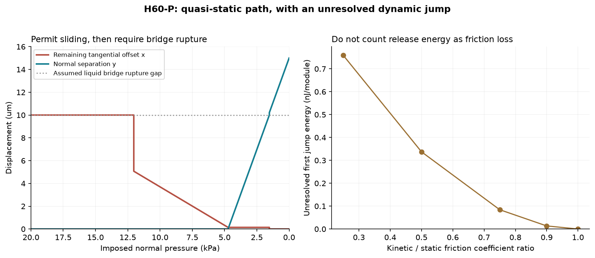
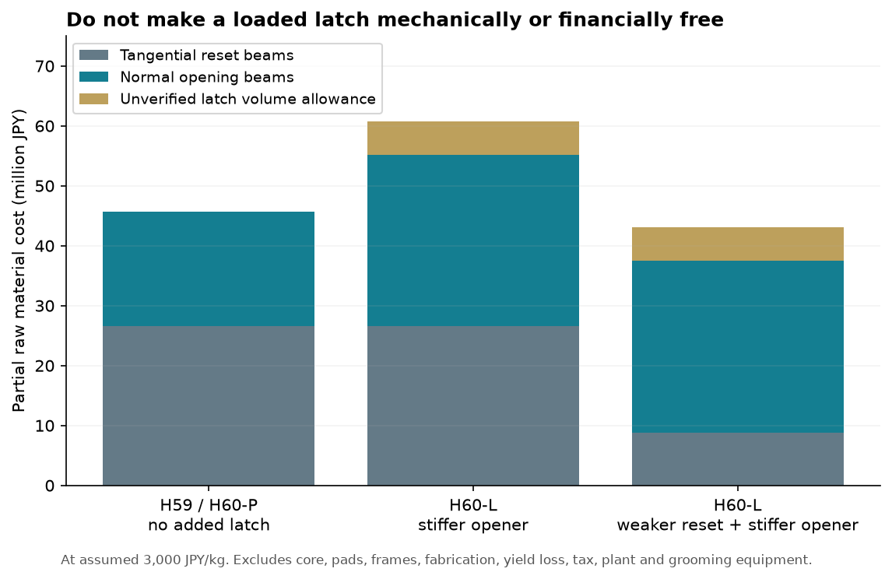

# 多方向探索第60巡：戻る順序の反証と留め具を増やさない連成復帰

2026-10-09 / Codex / 起点 346e7879c9fef03607ad446575b4ebe3cd47ee50

## 1. 今回変えた設計判断

**第59巡の「接点を先に開き、それから戻る」という順序は、2本のばねを足すだけでは保証されない。** 開くばねが接触圧を下げるため、戻すばねが先に面を滑らせる。この接触の釣り合いを取り直し、次の2案を比較した。

- **H60-P：途中の滑りを許す連成復帰。** 順序を固定する留め具を増やさず、滑り・開離・液橋破断を通じて最終的に復帰する。
- **H60-L：留め具で順序を固定。** 接線変形を保持してから開く。ただし荷重を受けた留め具の抜去摩擦、部材、製造費が増える。

今回の推奨はH60-Pを先に試すこと。ユーザーの目的は粒内の作動順序ではなく、新雪の圧雪バーンの滑走・エッジ・復旧・冬接続を実現することだからである。H60-Pで急な滑りや反発が残る場合は、H60-L、摩擦面の速度依存の調整、粘弾性芯の併用を比較する。

**物理試験0件、実物成功確率は未算定。** 今回は30件の数式・釣り合い照合、3図、経路・感度・費用表を作成した。実験による成功率が90%に近づいたという意味ではない。未検証の部品を増やす前に、一体化すると破綻する条件と不要かもしれない部品を特定した成果である。

## 2. 他分野の機構から取り入れる範囲

|一次資料|取り入れる点|今回にそのまま使えない点|
|---|---|---|
|[アーチによる係合・離脱機構](https://arxiv.org/html/2511.06039v1)|接触による保持と状態切替を分離する考え方。著者原稿本文・試作記載を確認。|側方アーチを切り替えて状態を指定する。無操作で戻る微小粒・50℃水濡れの実証ではない。|
|[段階的に変形する機械メタマテリアル](https://doi.org/10.1126/sciadv.abn5460)|変形の順番を設計する考え方。書誌と原著の検索取得部分を確認。|全文取得は未完了。25/80℃の挙動を、50℃での自然復帰と同一視しない。寸法・物性の数値は転用しない。|
|[圧縮・ねじり連成の摩擦散逸材](https://doi.org/10.1016/j.engstruct.2026.122391)|摩擦部を分け、固着するパラメータ境界を調べる考え方。出版社要旨の範囲。|公表された散逸率72.2%は雪代替の成功確率でない。本文未取得で、材料値・形状を本計算へ移していない。|

これらを裏付けとして完成扱いにはせず、前巡の仮定を同じ接触の式へ入れ直した。出典の確認範囲は[台帳](開離と滑りの連成復帰検証_20261009/sources.md)に保存。

## 3. なぜ「先に開く」が崩れるか

1モジュールの外部法線荷重をW、開離ばねの開く力をFo、法線付着をFaとする。面が閉じているときの圧縮接触反力は

**N = W + Fa − Fo**

である。NをWと置くと開離ばねが接点を除荷する効果を落とす。接線復帰ばねの力Fx、接線付着Ta、静摩擦μsに対して、保持条件は Fx≤μs N+Ta。

荷重を減らすと、面が開く点は Wopen=Fo−Fa。Fx>Taなら、滑り始める点は Wslip=Wopen+(Fx−Ta)/μs。従って**滑り始めるほうが高い荷重になる**。開離ばねを強くするだけでは、この2点の順序は逆転しない。強い接線付着TaがFx以上なら前提が変わるが、それを濡れた粒の安定な保持手段として採用したわけではない。

前巡の仮寸法から、開離剛性20N/m、予備変形15µm、接線剛性27.778N/m、初期接線変形10µmを設定。法線付着4.269µN、接線付着4µN、静／動摩擦0.6／0.3、50℃でこれらを保つと仮定する。いずれも今回の粒の測定値ではない。接線剛性はカム再配置後に同じ値になると確認したものでもない。

|段階|仮の外圧|起きること|
|---|---:|---|
|荷重中の初期状態|20kPa|接線10µm変形を摩擦で保持|
|初回の滑り|12.032kPa|面が閉じたまま接線復帰が始まる|
|固体接点の開離|4.732kPa|隙間が生じるが液橋は残りうる|
|仮定した10µm液橋の破断|1.532kPa|付着がなくなるモデル上の境界|

第59巡の開離に必要な力の計算を否定するものではなく、**それだけでは接線方向を止められない**という追補。第59巡本文にも第60巡への注記を追加した。

## 4. H60-P：途中で滑っても、付着を切って復帰する

法線の隙間yと接線の残留変形xを同時に追う。面は押し合えても貫通せず、固体接点が離れた後に固体摩擦を残さない。液橋が残る間の付着と、破断後を分ける。滑り出しには静摩擦、滑っている枝には動摩擦を使う。

|終了時の仮圧力|法線隙間|接線残留変形|液橋|評価|
|---:|---:|---:|---|---|
|1kPa|11.875µm|0µm|破断|仮定した平衡経路では復帰|
|3kPa|5.412µm|0.144µm|残存|変形が小さくても付着解消を満たさない|

したがって「残留1µm以内」という値だけでは不十分。液橋、再接続、再負荷の力のピークまで判定する。450mm床の自重、力鎖、含水、スキー荷重で残留圧が下がらなければH60-Pでも戻らない。第59巡の平均嵩密度約401kg/m³という自重境界も、独立軸の基準条件だけの目安として継承する。

### 静的な平衡点と、急な動きを区別する

初回の滑りで、静的終点はx=10から5.072µmへ移り、差は4.928µm。ばねから放出される1.032nJに対し、仮の一定動摩擦抵抗が消費する仕事は0.694nJ。残り**0.337nJ／モジュール**は、慣性、速度依存、追加減衰、衝突等へ流れる未解決のエネルギーである。

これを全て摩擦で消えたと数えてはいけない。動摩擦／静摩擦の比を1へ近づける感度計算では初回の不連続は小さくなるが、実材料でその比を得られるとは未確認。小さな部品のエネルギー減少を全粒の低反発と同一視せず、第58巡の支持芯のエネルギー収支も残す。

図は時間波形ではなく準静的平衡枝。実際にオーバーシュートせず着地するかは、質量・粘性・速度依存を含む動的試験が必要。載荷から整地までの全サイクル、粒群の姿勢変化、再付着は未計算。

## 5. 二方向のばねが干渉したら戻れるか

H60-Pの全経路は、法線と接線の弾性干渉がゼロという仮定。実物では同じ枠・接合を共有するため、この仮定を検証しないと新しい架空材料を作ることになる。

対称な線形剛性行列を使い、Kxy=κ√(KxKo)と置く。液橋破断後の自由接線平衡でも、法線荷重Wが残ると

Keff=Ko(1−κ²)、y=y0−W/Keff、x=Kxy W/(Kx Keff)

となり、接線変形が残る。基準1kPaでの比較は次の通り。

|κ|破断後の隙間|接線残留変形の絶対値|判定|
|---:|---:|---:|---|
|0|11.875µm|0|独立軸の仮定|
|±0.25|11.667µm|0.707µm|仮の1µm条件内|
|±0.50|10.833µm|1.768µm|液橋が切れても変形条件を外れる|

今回の仮荷重・寸法では、1µm以内にする必要条件は**|κ|≤0.33484、すなわち|Kxy|≤7.89N/m**。これは破断後の最終平衡だけの計算で、干渉を含む全経路の成立や材料の成功率ではない。

立体化は「粒骨格→法線開離ステージ→その上の接線復帰ステージ」の直列配置を比較する。2方向の梁を同じ部品へ並列接続すると、他方向の剛性が動きを止める可能性がある。梁断面の向き、枠・支持芯との干渉、20µm厚部材の成形、公差と雨後の寸法変化を含むCADと実測が次の作業となる。今回、完成CADや製造図面を作成したとはしていない。

## 6. 順序を固定するH60-Lとの比較

直線状の留め具でFxを保持すると、法線方向に抜く抵抗が概算μl Fxだけ増える。基準Fx=277.778µN、μl=0.3なら83.333µN追加。1kPaの条件で開離終端の余裕は**−50.10µN**となり、前案の20N/m開離梁では不足する。必要開離剛性は30.0205N/m以上で、公差・疲労の余裕はさらに必要。

開離剛性を30N/mに増すだけでは、μl=0.3でなお僅かに不足する。別枝として、接線復帰剛性を1/3、開離を30N/mにすると、μl=0.6でも仮の終端余裕27.68µNが得られる。しかし、弱い復帰ばね、閉鎖圧7.2kPa、保持面・枠・疲労という別の条件を負う。第57巡の低荷重支持との適合は未検証。

|案|力学上の利点|未解決|
|---|---|---|
|H60-P・途中の滑りを許す|順序固定用の部品を増やさない|静動摩擦差の急な動き、液橋破断、軸間干渉|
|H60-L・留め具追加|所定距離まで接線変形を保持できる可能性|抜去摩擦、再係合、閉鎖負担、公差、製造費|
|二安定アーチ等で保持|保持力と切替を分担できる可能性|戻りの駆動が別途必要な例を、自動復帰と混同しない|
|粘弾性芯との併用|局所の急な動きを減衰できる可能性|50℃・速度依存、クリープ、支持力と跳ね返りの同時評価|

滑り止めの留め具を足せば必ず改善する、とは判断しない。H60-Pの動的挙動が雪の対照範囲に入るなら、不要な留め具を省くほうが製造・保守に有利になる。

## 7. 費用、雨後、冬の条件を継承

2000m²×450mm、外接体積充填率0.55、密度1120kg/m³の前巡条件。以下は**一部の部材の原料費だけ**で、単価3000円/kgを仮定し税別で比較した。

|部材構成|部分質量|部分原料費|
|---|---:|---:|
|H59／H60-P：既存の復帰梁と開離梁|15.221t|4566万円|
|H60-L：既存復帰梁＋1.5倍の開離梁＋留め具仮体積|20.251t|6075万円|
|H60-L：1/3復帰梁＋1.5倍の開離梁＋留め具仮体積|14.351t|4305万円|

留め具仮体積は1モジュール120000µm³で、コース全体約1.844t。応力検証済み部品の必要数量ではない。安い最後の案が機能同等とは確認されていないため、確定削減額として扱わない。主枠・支持芯・滑走面片・案内・接合・加工・ロス・工場・税・整地設備・土木は含まず、設備等2億円枠に完成コースが収まると結論しない。

雨や台風後はR39の捕集・排水・回収・分級を継承する。粒を山頂側へ配り直しても、破片、泥、生物膜、変形した接点は自動で治らない。60分閉鎖で復旧するには、処理量だけでなく、再整地後の滑走・復帰・粒度・粉じんが対照範囲へ戻ることを検証する。追加留め具には泥詰まりの箇所が増えるため、H60-Pとの比較に含める。

冬は雪が入り込む開放部と排水を維持し、雪／素材の界面滑動・凍結閉塞・自然地盤より増える融雪を測る。R39の保持網は最大削れ深さと余裕より下に置き、夏に固定網上を滑る代替にしない。夏の微小機構が冬に動かなくても雪の固定を損なわないか、別に確認する。

人体・環境の安全は完成粒、摩耗粉、劣化片、浸出液と曝露で評価する。用途や樹脂名だけで無害とせず、油・塩・フッ素・シリコーン潤滑、現地強酸・冷却・連続散水を導入しない。結晶を含む高分子と雪の分岐結晶は同一ではなく、今回も温暖環境で噴霧結晶化を実証したわけではない。

## 8. 次の実験とClaudeへの引継ぎ

[試験計画](開離と滑りの連成復帰検証_20261009/test_plan.json)は未実施。最初に2自由度の少数モジュールで、同時にx・y・法線反力・接線力を測る。外圧Pを接触反力Nと同一視しない。50℃、乾湿、停止後、泥混入、摩耗後で静動摩擦・付着を分離し、全剛性行列と急な滑りの速度を測る。材料ロットの値で式を再計算してから粒群へ進む。

その後、自然の新雪圧雪を対照に、同一の板・エッジ荷重・速度で滑走抵抗、エッジ貫入、ピークと解放距離、振動、停止再始動、転倒時挙動、再整地を比較する。条件と許容幅は試作結果を見る前に固定する。全厚450mm、30°保持、雨後60分復旧、冬接続、安全、採算を省略して成功率を出さない。

Claudeへの具体依頼：

1. 第59巡の「先に開く」を仮定した解析があれば、N=W+Fa−Foの釣り合いへ修正してほしい。
2. H60-Pの独立軸を実現する立体配置とKxyを提示し、|Kxy|≤7.89N/mという仮の境界を余裕付きで満たすか確認してほしい。
3. 急な滑りの0.337nJを全て散逸と計上せず、動的計算・高速度観測で行先を確認してほしい。
4. H60-Lを選ぶ場合は、保持した荷重を受けたまま抜く摩擦と再係合まで検証し、留め具を無料・無摩擦と置かないでほしい。
5. 新しい実測や未公開v3の成果があれば、元データ・コード・条件をGitHubへ置いてほしい。現時点で受領・返答・同意・v3稼働を確認したとはしていない。

起点以降のClaude更新は公開前にも確認する。成果の正本はGitHub mainで、公開バイト照合後は作業用クローンとGit履歴を削除する。接続案内とユーザー設定を保護する。

[再計算・式・全CSV・図への入口](開離と滑りの連成復帰検証_20261009/README.md)
