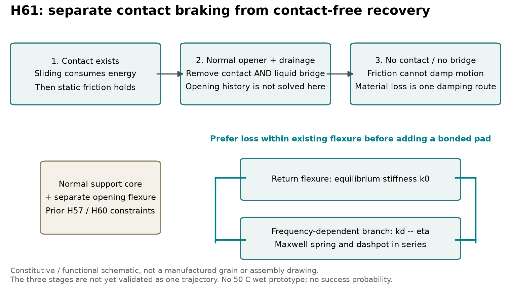
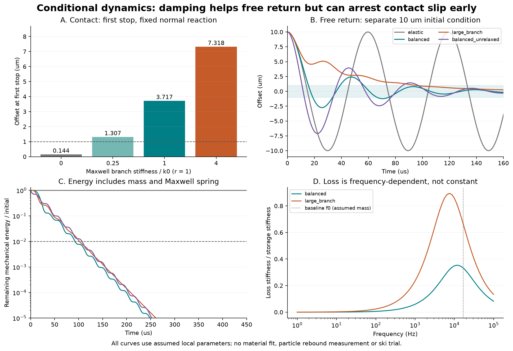
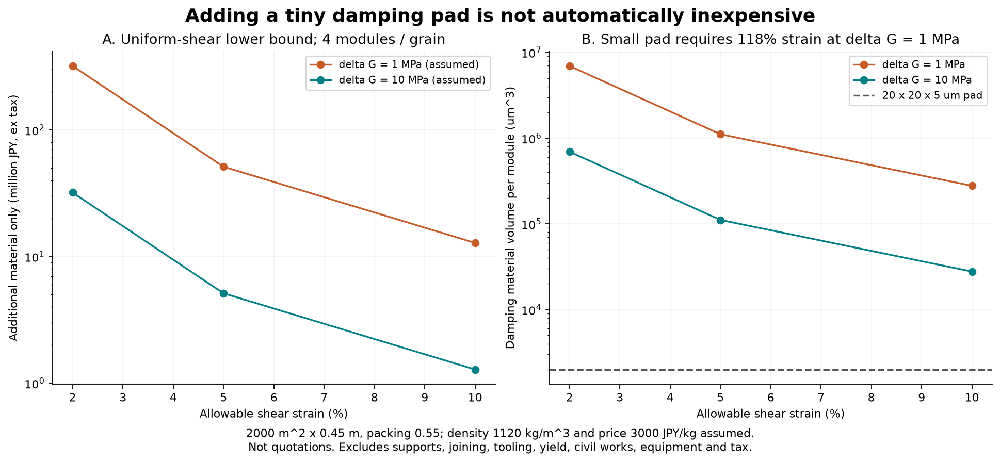

# 多方向探索 第61巡：接触中の摩擦停止と離れた後の復帰を分ける設計

作成：2026-10-09／Codex。参照基点：main の e6943509dfd8e8dfccf5226e650d89e2f3c607b3。

**今回の成果は、前案の未処理エネルギーの行き先を求め、減衰部品を増やす前に必要性と材料量を判定できるようにしたこと。実物の雪状材料を完成させた報告ではない。物理試験は0件、実物の成功確率は未算定（null）。15％から90％超への到達を示す証拠は、まだない。**

## 1. 何を変えるか

前案H60は、粒の接点が戻る途中で先に滑ることを認める構造だった。しかし、最初の滑りを静的な釣合い位置で止めていたため、1接点あたり0.337294 nJの行き先が未解決だった。

今回、接触が残る間の運動を解くと、このエネルギーは一時的な運動エネルギーになる。その後さらに滑り、動摩擦で減速して静摩擦で停止する。前案の条件では、10 µmのずれが約29.804 µs後に0.144 µmまで戻る。したがって、この未処理量を全部「跳ね返り」とみなしてダンパーを追加する理由はなくなった。

ただし、これは動摩擦／静摩擦の比が0.5という仮定に強く依存する。比が0.8なら6.058 µm残り、0.2なら反対側へ5.770 µm行き過ぎる。**接触中の摩擦だけで中立位置への復帰を保証しない。接点と液橋を開離し、その後の復帰を別に成立させる。**

ここからH61を提案する。支持芯・法線方向の開離機能・接線方向の戻し梁は引き継ぐが、減衰を加える場合は、まず戻し梁自身の材料損失を利用する。別付けの粘着パッドや水を含ませた芯は、費用・粘着・雨による性能変動が合格した場合の比較案にする。これは構成と材料要求の提案であり、組立可能性を確認したCADや製造済みの粒ではない。

## 2. 雪・樹脂・吸水体の一次資料から分かったこと

|資料|今回確認した範囲|設計に持ち込めること／持ち込めないこと|
|---|---|---|
|[S1：Neubauerら、TPUフィルムのDMA、2022](https://doi.org/10.3390/polym14235285)|ポリエーテルTPU ELASTOLLAN 1170 A、厚さ0.3 mm。温度−60～100℃、実測周波数0.1～50 Hz。Table 1の40℃・60℃各6試料を転記|貯蔵剛性と損失を周波数・温度の両方で扱う。50℃湿潤・微細梁の実測値ではない|
|[S2：Gorinら、Impacts of poroelastic spheres、著者版v1](https://arxiv.org/html/2411.05891v1)|直径68 mmのフォーム球と液体を使う衝突実験。内部流動・液膜・毛管付着を区別|吸水で衝突損失が変わる実例。乾燥／雨後で同一性能、500 µm粒への相似、雪の滑走感を保証しない|
|[S3：Chae、雪の動的弾性・減衰、1967](https://hdl.handle.net/2115/20345)|加工雪480 kg/m³、25°F（約−3.89℃）、約800～6000 Hzの小変形試験|雪にも周波数依存がある。新雪圧雪のエッジ破壊をそのまま代表するデータではない|

S1の**50 Hz**での平均貯蔵弾性率は、40℃で14.220 MPa、60℃で11.332 MPaだった。これは50℃の値ではない。前案の梁に置いた100 MPaを、この銘柄の実測として扱えない。同論文の時間温度換算では約40℃以上でWLF近似のずれが示されているため、50℃・kHz帯を単純な温度シフトだけで確定しない。今回は論文のProny係数を推定して材料性能に割り当てることもしていない。

S3は温度の°F／℃、装置の周波数範囲／実際の試験範囲を分けて確認した。図9・11のキャプションと本文には対応の不整合があるため、曲線の数値読取りを採用していない。

参照の版・取得ハッシュは[出典記録](摩擦停止と動的復帰検証_20261009/source_provenance.json)、表の転記は[CSV](摩擦停止と動的復帰検証_20261009/source_table_TPU.csv)。論文全文の複製は成果倉庫に置かない。

## 3. 接触中：滑り始めた粒はどこで止まるか

### 3.1 境界条件

1接点の戻し剛性 k0＝27.7778 N/m、初期ずれ x0＝10 µm、静摩擦係数0.6、動摩擦係数0.3、接線付着抵抗 Ta＝4 µN。H60で最初に滑る瞬間の法線反力 N＝456.296 µNを短時間だけ一定とする。ばねと粒の有効質量 m＝2.5×10⁻⁹ kg（2.5 µg）は**未測定の仮定**で、粒の総質量から確定したものではない。

最初の滑り方向を x の減少方向とすると、抵抗 Fk＝μk N＋Ta＝140.889 µN。運動は以下となる。

    m x'' = -k0 x + Fk
    xeq = Fk/k0 = 5.072 µm
    x(t) = xeq + (x0-xeq) cos(ω0 t)
    ω0 = sqrt(k0/m)

xeqでは速度が最大になる。そこで静止したとするのが前巡の準静的近似だった。最初に速度が0になるのは t＝π/ω0、位置は xstop＝2xeq−x0。そこで |k0 xstop| が静摩擦の保持範囲内かを確認し、成立すれば停止する。往復する正弦波を永久に続ける計算にはしていない。

|量|今回の結果|
|---|---:|
|最初の停止まで|29.8038 µs|
|停止位置|0.1440 µm|
|最大運動エネルギー|0.337294 nJ|
|停止までの摩擦仕事|1.388601 nJ|
|停止時に残るばねエネルギー|0.000288 nJ|
|初期ばねエネルギー|1.388889 nJ|

摩擦仕事＋残留エネルギー＝初期エネルギーになる。H60の未処理量は、この局所モデルでは追加の未知散逸ではなく、途中の運動に対応していた。ただし法線方向へのエネルギー移行、粒間衝突、座屈、弾性波放射は含めていない。粒全体の反発係数を求めたものでもない。

仮に法線圧を200 kPa/sで下げると、この約30 µs中の変化は0.00596 kPa。これを短時間一定とする根拠にした。実際の圧力履歴や力の連鎖は未測定であり、衝突で急変する場合にこの近似を適用しない。

### 3.2 都合のよい摩擦比に依存することも反証した

初期滑り条件 k0 x0＝μs N＋Taを保ち、動／静摩擦比だけを変えると、付着4 µNでは次になる。

|μk/μs|初回停止位置|意味|
|---:|---:|---|
|0.2|−5.7696 µm|反対側への移動空間が必要。実物のストッパーに衝突する可能性を未計算|
|0.5|0.1440 µm|前案の名目条件|
|0.8|6.0576 µm|復帰不足|
|0.95|9.0144 µm|ほとんど戻らない|

初回停止だけで±1 µmに収まる比は、約0.441964～0.543425に限られる。付着を40 µNに増やすと、比0.5でも1.440 µm残る。[8条件の反例表](摩擦停止と動的復帰検証_20261009/friction_ratio_sensitivity.csv)の合格割合を成功確率に読み替えない。

## 4. 開離後：戻し梁にどの程度の損失が必要か

接点と液橋が切れれば、接点摩擦を減衰として使えなくなる。そこで、戻し梁を平衡ばねとMaxwell枝1本の並列で表す。Maxwell枝はばねと粘性要素の直列であり、実物に液体ダンパーを設ける意味ではない。

    m x'' + k0 x + q = 0
    q' = kd x' - q/τ
    α = kd/k0, r = τ sqrt(k0/m)
    U = m(x')²/2 + k0 x²/2 + q²/(2kd)
    U' = -q²/(kd τ)

接触中はこれに動摩擦仕事を加える。物理的に受動なモデルとして、損失が負になる係数を使わない。一定粘性を全周波数へ無制限に延長するモデルや、大きい損失係数をそのまま減衰比へ置き換える方法は使わない。

**この自由復帰計算は、接触中の計算の続きではない。** 液橋が完全に切れた状態で、ずれ10 µm、速度0、Maxwell枝の初期力0を置く独立した試験条件である。開離時に本当にこの状態になるか、初期力がどれだけ残るかを次段階で接続する必要がある。

判定は、位置が一瞬ゼロを横切ることではなく、残存機械エネルギーが初期の1％以下、かつ以後の変位を±1 µmに抑えられるエネルギー以下になることとした。モデル内ではエネルギーが単調減少するため、その後もこの上限を保つ。**1 µmや100 µs級という数値は開発用の比較条件で、雪の感触の実測許容値ではない。**

|仮定した材料枝|接触中の初回停止位置|独立した自由復帰の収束時間|
|---|---:|---:|
|α＝0（損失なし）|0.144 µm|約1.897 msの計算窓では収束せず|
|α＝0.25、r＝1|1.307 µm|354.428 µs|
|α＝1、r＝1|3.717 µm|92.449 µs|
|α＝4、r＝1|7.318 µm|101.746 µs|
|α＝1、r＝0.1|0.858 µm|435.066 µs|
|α＝1、r＝10|4.934 µm|742.392 µs|

損失を増やすと接触中には早く捕まり、位置が残る。一方で自由復帰には適度な損失が効く。α＝4はα＝1より損失が大きいのに、今回の自由復帰の判定時間は短くならなかった。従って損失最大化だけを目的にしない。

### 4.1 時間尺度、材料の記憶、全粒との違い

名目条件の f0＝16.776 kHz、r＝1のτ＝9.487 µs。α＝1の損失係数最大値は0.353553で、約11.863 kHzにある。これらは**必要物性を探索する仮想モデルの値**で、S1の樹脂が満たすと確認した値ではない。

実際のτを9.487 µsに固定して有効質量を0.25／2.5／25 µgに振ると、自由復帰の時間は74.925／92.449／438.300 µsになる。質量を変えながら r も同じに保つと材料まで変更した計算になるため、その取り違えを避けた。

またα＝1、r＝1でも、Maxwell枝に初期力 k0 x0が残る場合は初期エネルギーが2倍、収束時間が115.929 µs、途中の反対側変位が約7.118 µmとなる。初期力0の約2.749 µmとは違う。クリープ履歴を無視して安全な可動域を決められない。

500 µmを10 m/sで通過する局所時間は50 µs、一方1 mの板の接触包絡は100 ms。同じ時間尺度ではない。さらに、前案の支持芯の最大蓄積エネルギーは約535 nJ/粒だった。今回の戻し接点1個の約1.39 nJ、H60の未処理量0.337 nJだけを処理しても、全粒や板の振動を処理したことにはならない。第32巡の法線接触モデル、エッジ破壊・再接触と統合する課題を残す。

## 5. 材料を増やさない工夫と、別付けパッドの費用下限

### 5.1 H61-A：既存の戻し梁を損失のある部材にする

第一候補は、H60-Pの戻し梁の平衡剛性を保ちながら、その梁に適切な緩和時間を持たせる構成。支持芯と法線開離梁まで同じ柔らかい樹脂に置き換えない。機能を分けたまま、部品・接着境界の追加を抑える。

材料を決める前に必要なのは、50℃で乾燥・吸水・摩耗後の k0、kd、τ、変形依存性、復帰後の残留ひずみを同定すること。S1の銘柄をそのまま採用品とはしない。低い弾性率に合わせて梁を厚くすれば、曲げひずみ、横干渉、製造量も変わる。既存梁の体積で要求する動的損失を出せるかは未確認で、追加費0円と確定してはいない。

### 5.2 H61-B：別付けパッドには剛性・体積・ひずみの制限がある

せん断パッドの面積A、厚みt、変位伝達比λ、材料の緩和前後のせん断弾性率差ΔGを用いると、kd＝λ²ΔG A/t。平衡弾性率 G∞が残る実材なら、追加静剛性も λ²G∞ A/tとなる。

α＝1を得ながら追加静剛性を既存 k0の5％以下に制限する場合、ΔG/G∞≧20が必要。この5％は設計比較条件であり、実測合格値ではない。余分な静剛性をゼロとして損失だけを都合よく足さない。戻し梁を細くして補正する場合も、新しい支持力・耐久計算が必要である。

さらに、許容するせん断ひずみをγmaxとすれば、均一せん断で効率よく使っても次の材料体積が必要になる。

    Vmin = kd x0² / (ΔG γmax²)

これは線形せん断モデルの下限であり、あらゆる材料・機構の普遍的下限ではない。てこの比を下げてひずみを抑えても、剛性がλ²で下がるため、このモデルの必要体積は消せない。実物の非均一ひずみ、端部、固定部はさらに材料を要する。

2000 m²×厚み0.45 m、占有率0.55、粒包絡500×500×577.35 µm、約3.429×10¹²粒、1粒4接点。密度1120 kg/m³、原料仮単価3000円/kg、α＝1で計算した。

|仮定ΔG|許容せん断ひずみ|追加質量の下限|追加原料費・税別|
|---:|---:|---:|---:|
|1 MPa|2％|106.694 t|3億2008万円|
|1 MPa|5％|17.071 t|5121万円|
|1 MPa|10％|4.268 t|1280万円|
|10 MPa|2％|10.669 t|3201万円|
|10 MPa|5％|1.707 t|512万円|
|10 MPa|10％|0.427 t|128万円|

ΔGと許容ひずみを独立に満たす銘柄は未選定。良い方の行をそのまま見積りには使えない。20×20×5 µmの小パッドなら追加材料は約30.7 kgに見えるが、ΔG＝1 MPaで必要剛性を出すとせん断ひずみ約118％が必要になる。小変形のDMAを根拠にこのパッドを成立済みにするのは不適切である。

これらは原料の条件付き計算で、業者見積りではない。支持部・接合・金型・歩留まり・回収再加工・工場・設備・土木・税を含まない。従来の税込2億円は整地設備等の暫定枠であり、この税別追加材料費と混ぜて「2億円以内を達成」としない。経済上は、材料を全面追加する前に既存梁で同じ役割を兼ねられるかを判定する順番が合理的になる。

## 6. 一方向に固定しない比較と融合

|経路|今回取り入れる部分|今回の判断と切替条件|
|---|---|---|
|H60の乾式内部摩擦|接触中の運動を仕事として消費する機能|残す。ただし摩擦比の狭い範囲だけを合格にしない。開離後まで摩擦減衰を期待しない|
|H61-Aの粘弾性戻し梁|接点が離れた後の振動を減らす機能|材料同定へ進める第一候補。湿潤50℃で緩和時間・静剛性・疲労が同時に合わなければ寸法調整だけを続けない|
|H61-Bの拘束せん断パッド|損失を一部に集中する機能|体積下限と残存静剛性を先に判定。部品追加を含む総費用・界面寿命でAを上回る場合だけ採用候補に戻す|
|開放多孔体・内部流動|固体骨格と空隙で変形・損失を分担する考え方|支持芯の比較として残す。S2の湿潤衝突結果を乾湿同一性へ転用しない。油・塩・恒常散水による調整は採用しない|
|Claudeの噴霧析出・結晶の首・鉱化繊維|粒を現地で作る工程、結晶の首で接続する考え方|温暖噴霧経路として別途継続。今回の工場成形機構粒を「30℃空気中で噴霧結晶化した雪」と呼ばない|

[Claudeの公開v2記録](../バーチャル試験/自律ループv2_噴霧結晶化素材_第1〜4ラウンド_20261008.md)の概要、22案表、再スイープ末尾、再現資料の所在を参照した。そこにある要件別点数の積や最良2.8×10⁻⁴は実測成功率ではない。安全・規制について一次確認未了の記述もあるため、本報告の適合判定へ転記していない。開発サーバーの元コードとv3全結果は、この公開資料から取得・再現できていない。

**探索の切替先は、単により柔らかい樹脂を足すことではない。** H61-Aで必要損失と復帰が両立しなければ、支持芯の変形そのものへ散逸を分散する多孔構造案、接続の首を交換・再生する案、温暖噴霧で形成する別の骨格へ戻す。その際、本巡の「初回の滑り停止」「開離後の復帰」「材料体積」の三つの検査を共通の入口として使う。

## 7. 雨後・冬季・整地機への条件

今回、雨後にピステンやレール機でならせば元へ戻ると確認したわけではない。表面が平らでも、吸水によってτや静摩擦、液橋が変われば機能は戻らない。回収→排水→配材→締固めの前後で、接点の戻り、せん断、滑走抵抗を再測定する。振動・圧縮で壊れるパッドや摩耗粉が増える場合、形状回復を性能回復と数えない。

冬季は、上を雪が覆う条件で、雪との界面に水が溜まらず、剪断抵抗が自然下地より悪化しないことを別試験で確認する。固体樹脂だから固定できる、排水穴があるから排水する、とは断定しない。水濡れ時の接点開離、凍結した可動部、融解後の復帰も対象にする。

R39の保持網は最大掘れ深さ300 mmに余裕を加えた位置より下とし、450 mmの使用層の途中から固定マット・ブラシの感触へ変わる逃げ道を設けない。レール整地の60分閉鎖条件と設備枠は継承する。本巡の粒モデルだけでは、土砂混入・流出量・回収率・長期費用を確定できない。

人体・環境への影響は未確認。候補の市販実績や生分解性だけで無害としない。実粒・摩耗粒・溶出物の測定を先行し、人の滑走試験はその評価と機械試験を経た段階に置く。

## 8. Claudeへの具体的な受け渡しと次の検証

共有方法は本報告・コード・入力・全出力をGitHub mainと回覧板へ掲載すること。Claudeが受領・同意したとは記録しない。公開前のmain照合で、基点e6943509以降に別の更新がないことを確認してから追加する。

Claudeへの依頼は以下とする。

1. **本巡の摩擦停止の独立反証。** μk/μs＝0.5に固定せず、濡れた実接点の速度依存摩擦、付着、逆方向可動域を入れる。第60巡の「5.072 µmで止まる」を実運動の停止点として再利用しない。
2. **温暖噴霧のv3結果との融合。** 候補ごとに、空中での結晶成長、着床後の析出、工場成形粒の散布を分ける。形成時間・成長量・首の再生・水収支を元コードとともに公開する。今回の動的検査を候補の接点へ適用できるかを評価する。
3. **材料モデルの置換。** k0、kd、τを任意の数値のまま使わず、50℃の乾燥・吸水・摩耗後の実測に置き換える。特にkHz帯、初期応力、数％以上のひずみ域を確認する。S1の50 Hzを50℃と取り違えない。
4. **全体への接続。** 法線支持芯・開離ばね・接線摩擦・液橋・質量を一つの履歴として解く。既存の第32巡法線損失と今回の微小接点を混同せず、全粒エネルギー、エッジ後の短い解放、滑走抵抗へつなぐ。
5. **費用の実体化。** 既存梁への機能統合と別付け材について、成形単価・歩留まり・接合寿命・交換率を同じ数量で比較する。材料費の安い一行だけで採否を決めない。

[実施前の検証計画](摩擦停止と動的復帰検証_20261009/validation_plan.md)に、測る項目・棄却条件・90％目標の扱いをまとめた。計算で良いパラメータを選び直し続けても、実物の成功率は上がったと証明できない。今回の成果は、誤ったエネルギー解釈と追加部品の過小見積りを防ぎ、反証可能な材料要求へ進めた点にある。

## 9. 再現用ファイル

- [入力値と仮定](摩擦停止と動的復帰検証_20261009/inputs.json)
- [計算コード](摩擦停止と動的復帰検証_20261009/calculate.py)・[計算結果](摩擦停止と動的復帰検証_20261009/results.json)
- [モデルの適用境界](摩擦停止と動的復帰検証_20261009/model.md)
- [摩擦停止](摩擦停止と動的復帰検証_20261009/friction_events.csv)・[独立した自由復帰](摩擦停止と動的復帰検証_20261009/free_return.csv)・[質量感度](摩擦停止と動的復帰検証_20261009/mass_sensitivity.csv)
- [全時系列](摩擦停止と動的復帰検証_20261009/time_history.csv)・[周波数応答](摩擦停止と動的復帰検証_20261009/frequency_response.csv)・[体積費用](摩擦停止と動的復帰検証_20261009/damping_volume_cost.csv)
- [29件の数式・エネルギー・刻み幅照合](摩擦停止と動的復帰検証_20261009/numerical_checks.json)・[図の再生成](摩擦停止と動的復帰検証_20261009/draw.py)

CSV計14,525行（観測値の転記2行を含む）。これらは14,525回の実験ではない。実験設備・購入・外部への試験発注は行っていない。原データを取得できない段階で「90％超の実証済み素材」とすることはしない。
