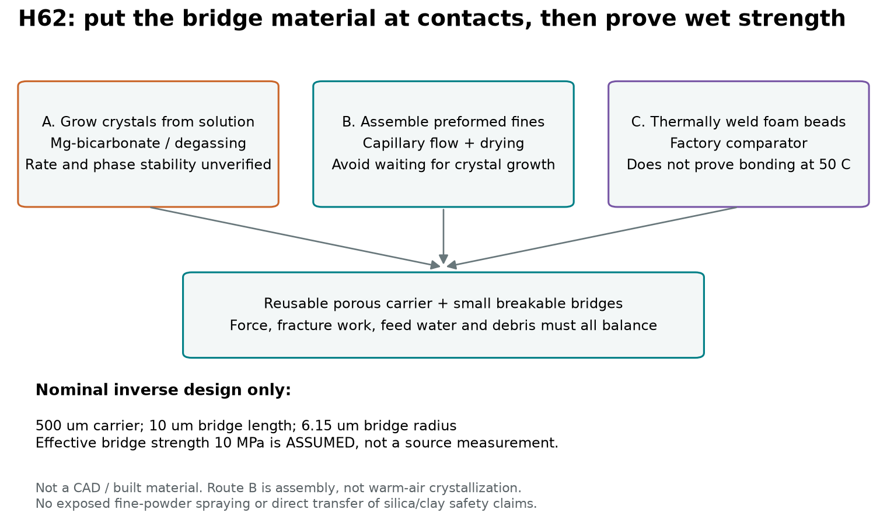
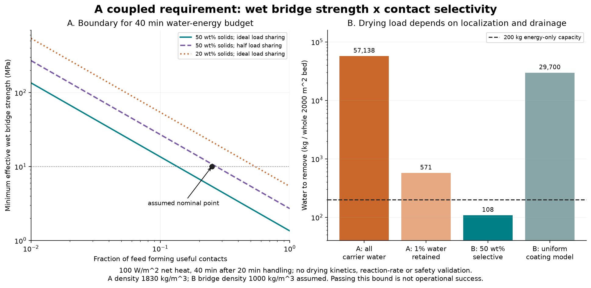
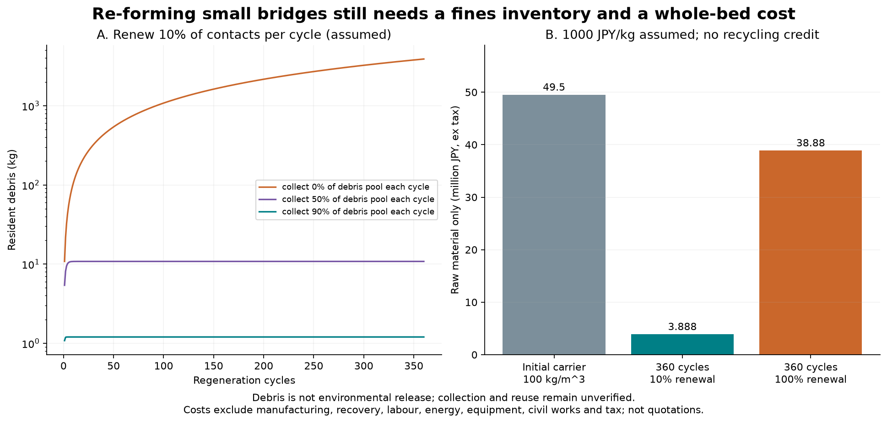

# 多方向探索 第62巡：結晶接点と水で集める固体橋の選択再生

2026-10-09／Codex。参照基点：815b5effcd3ce08fc04723b7df1f0992060743c7。

**微小ばねの調整から離れ、温暖な環境で結晶を作る経路、既成粒子を接点へ集める経路、発泡粒を熱接合する経路を比較した。今回の前進は、結晶の存在だけで採否を決めず、接点強度・供給の選択性・水量・年間再生量を同じ収支で判定できるようにしたこと。物理試験0件、実物成功確率は未算定（null）。90％超を実証した結果ではない。**

## 1. 発明候補をどう進めたか

第一の比較候補を、**既に作った微粒子を、少量の水とともに粒の接点へ集めて固体の橋にするH62-B**とする。現地で全量の結晶成長を待つ工程を省ける可能性があり、微小な留め具やばねを各粒へ組み込まない経路でもある。これを、結晶を現地で析出させるH62-A、発泡粒の熱接合H62-Cと同じ床量で比較する。

「再利用骨格＋壊れる少量接点」は[第16巡](GPT回答_多方向探索第16巡_噴霧結晶化と骨格接点の分流再生_20261008.md)にもある。本巡はそれを新しい着想として数え直さず、Claudeの炭酸Mg系探索、新しく確認した固体橋の実験、接点への選択供給という条件を加える。特許上の新規性・実施自由は判定していない。

重要な区別は、**H62-Bは既成粒子の集合であり、30℃の空気中で新たに結晶が成長した証明ではない**こと。温暖噴霧結晶化の優先課題はH62-Aで残す。また多孔質の丸粒は比較模型であり、丸粒だけで雪のエッジ感が出ると採用したわけではない。

## 2. 一次資料で裏づけた部分と、未確認の部分

|一次資料|確認した内容|本用途への限界|
|---|---|---|
|[S1：Backら、ネスケホナイトの形態制御、2025](https://doi.org/10.1007/s42247-024-00968-8)|針状の炭酸Mg水和物を扱う。反応法には塩系・添加物系・加圧CO₂系がある。加圧系列は40／55／70℃、20～100 bar、48時間|40℃で結晶ができることを、屋外・大気圧・60分の形成へ移せない。相変化や体積安定性も課題|
|[S2：Oliverら、重炭酸Mg溶液の脱ガス、2014](https://researchportal.murdoch.edu.au/esploro/outputs/journalArticle/Biologically-enhanced-degassing-and-precipitation-of/991005544294207891)|著者所属機関の要旨で、窒素気泡による脱ガスとネスケホナイト析出を確認|本文の速度・濃度は未取得。今回の25 mmol/Lや収率はこの論文の実測値ではない。酵素・藻の現地添加も採用していない|
|[S3：Dippoldら、発泡粒同士の接合試験、2025](https://doi.org/10.1002/pol.20240830)|ETPUの接合を温度・接触荷重・保持時間で分けて測定。接合5分、引張は冷却後23℃。90～140℃で接合が増す例|50℃で圧縮すれば自動再接合する実証ではない。一定力と一定変位の違いにも注意|
|[S4：Seiphooriら、水で組み立てる固体橋、2020](https://doi.org/10.1073/pnas.1913855117)|大小粒子が乾燥時に接点へ集まり、再湿潤で崩れにくい集合体を作る実験|500 µmの実用品・50℃・台風・人体安全の実証ではない|

S4の代表系は20 µmと3 µmのシリカ粒子で、0.1 µL級の滴、22℃・相対湿度約50％。真空処理や表面処理を含み、再湿潤の流速例は180 µm/sだった。この条件を屋外へそのまま移さない。乾燥時の引離しエネルギーが増える結果も、濡れた接点の強度値には置き換えない。シリカ・粘土・ナノ粒子を安全と認定して撒く提案ではなく、**粒子を接点へ集める原理と試験方法**を借りる。

S1の針状結晶は温度だけでなく圧力・時間・溶液条件に依存する。塩化物・硫酸塩・アンモニア・界面活性剤を使う文献配合は、そのまま現地へ採用しない。塩や油で滑らせない方針を維持する。

[出典と取得範囲](結晶接点と固体橋の再生検証_20261009/source_provenance.json)に、本文を読めた資料と要旨だけの資料を分けて記録した。アクセス制限画面を論文としてハッシュ保存していない。

## 3. 接点が「何kgあればよいか」を強度と結びつけた

比較床は2000 m²×0.45 m、粒包絡の占有率0.55、球形の代表粒径500 µm、接点数6/粒。これは前巡の角形粒と異なる比較幾何で、粒数を流用せず約7.563×10¹²粒と数え直した。接点は2粒で共有するため、約2.269×10¹³個となる。

法線方向の結合応力の比較目標を5 kPa、接点の有効引張強度を10 MPa、首の長さを10 µmと仮定する。**5 kPaは新雪の測定値ではなく、10 MPaはネスケホナイトや粒子橋の測定値ではない。** 特に、塊の圧縮強度と、濡れた微小接点の引張強度を同一視しない。

中心力だけを伝える等方的な接点網から、法線応力成分の上限的な尺度を置く。

    nc = (粒数/床体積) × 接点数/2
    σ比較 = ε × nc × D × F接点 / 3
    F接点 = σ接点 × πa²
    M接点 = nc × 床体積 × πa² × 首の長さ × ρ接点

εは荷重の不均一などを表す追加の効率で、名目は1。全接点が同時に限界力を使える楽観側であり、実際の一軸引張・剪断・エッジ支持強度を解いた式ではない。弱い経路からの破壊や接続していない粒を含む実床では、別の荷重分配が必要になる。

名目条件では1接点約1.190 mN、首半径約6.155 µmとなる。

|首の比較模型|仮の首密度|有効接点に必要な量|
|---|---:|---:|
|A：結晶に相当する密な首|1830 kg/m³|49.41 kg|
|B：粒子で組み立てた多孔質の首|1000 kg/m³|27.00 kg|

密度も比較仮定。Bを軽くしたままAと同じ10 MPaを保てる材料は確認していない。強度を1 MPaに下げると、同じ応力目標に必要な質量は10倍となる。荷重効率ε＝0.5なら2倍。軽さと強さを独立に都合よく選ばない。

一方、粒径を大きくすると、この単純式では単位床体積当たりの必要首質量が減る。ただし粗粒化による滑走のざらつき、エッジの解放、転倒感は悪化し得るので、材料費だけで3 mm粒へ変更しない。

### 3.1 壊れれば雪らしいとは限らない

破壊エネルギーGc＝1 J/m²という未測定の仮定では、全接点が一度壊れる仕事は約3 J/m³。これは「圧縮応力20 kPa×ひずみ0.1＝2000 J/m³」という別の比較仕事よりずっと小さい。後者も実雪の測定値ではない。

首の破壊だけで押し込み・切り裂き・振動の全仕事を再現したとはいえない。粒内の多孔構造の変形や粒間摩擦が他の仕事を担う必要がある。前巡の局所ばね減衰と同様に、一部品の散逸を全床の滑走感へ拡大解釈しない。

## 4. 水量を減らす発明上の工夫：溶かして運ぶか、固体で運ぶか

### 4.1 H62-A：溶液から結晶を作る

Mg濃度25 mmol/Lを仮定すると、ネスケホナイト換算の最大生成量は3.459 g/L。供給した材料の25％が有効な接点になると仮定し、49.41 kgの首を作るには、全析出物換算197.64 kg、溶液約57.138 m³が必要になる。床全面では約28.57 mmの供給液量に相当する。

この25％は実験収率ではない。送液、反応、接点への析出までを含む有効率ηであり、接点以外へ析出したものを成功に含めない。化学量論は Mg(HCO₃)₂＋2H₂O→MgCO₃·3H₂O＋CO₂ として元素収支を確認した。熱・反応速度・pH・イオン活量を解いた計算ではない。

**この液を全量蒸発させる必要があるとはしていない。** 排水・回収できる量と、接点・細孔に残る量を分ける。仮に1％残留しても約571 kgの水になる。析出が排水と同時にどの場所で進むか、残液が冬季の界面へ何を持ち込むかを測る必要がある。

### 4.2 H62-B：既成の粒子を濃い懸濁液で運ぶ

結晶を工場で作って洗浄・調整し、粒子を50質量％の懸濁液で供給できると仮定する。**密度・接点強度・有効率をAと同一にした公平な比較**では、固体197.64 kgに対して水197.64 kgとなる。上記の希薄溶液経路の水量約57,138 kgと比べて約289分の1。ただし50質量％で送れること、接点に集まること、固体橋として結合することは未確認である。

Bの多孔質の首（仮密度1000 kg/m³）なら、全接点の再生で有効量27 kg、供給固体108 kg、水108 kgとなる。これはさらに軽い首を成立させた場合の別条件で、密度変更による改善を供給方法だけの改善と混ぜない。

現地では微粉を空中へ撒く方式を前提にせず、閉じた混合・供給部で湿潤粒に供給する構成を比較する。安全性はそれでも未確認。材料を乾かした後に擦れる用途なので、摩耗粉と再飛散を測る必要がある。

## 5. 60分整地と両立するための条件

閉鎖60分のうち移動・配材・整形など20分、残り40分を条件付けの時間と仮置きする。実機の工程時間ではない。乾燥に使える正味熱流100 W/m²、水の蒸発潜熱2.4 MJ/kgという比較条件では、40分に蒸発へ使える水量は床全体で200 kgとなる。これはエネルギーだけの上限で、湿度・物質移動・粒内部の水・降雨による遅れを含まない。

|条件|水量|熱収支だけの最短時間|
|---|---:|---:|
|B、首密度1000 kg/m³、強度10 MPa、有効率25％、固形分50％|108 kg|21.6分|
|上と同じだが荷重効率が半分|216 kg|43.2分|
|Aと同じ首密度1830 kg/m³の既成粒子、他は同じ|197.64 kg|39.528分|
|B、固形分20％|432 kg|86.4分|

名目条件だけなら時間枠に入るが、荷重効率が半分になるだけで外れる。39.528分の行も40分に近く、実運用の余裕があるとはいえない。降雨・台風後に100 W/m²を確保できる保証もない。

Bの密度1000 kg/m³、全接点の再生、固形分50％、荷重効率1では、必要条件を次の一式にまとめられる。

    濡れた首の有効引張強度[MPa] × 有効接点になる割合η ≧ 1.35

有効率25％なら強度5.4 MPa以上が必要。荷重効率が半分なら10.8 MPa以上、固形分20％・荷重効率1なら21.6 MPa以上となる。**文献S4はこの強度を保証していない。** この値を測定の入口にして、届かない配合を大量製造へ進めない。

### 5.1 「接点だけ」に届けられるかが成否を左右する

名目の首が占める粒表面の面積割合は約0.0909％。これは実工程の有効率ではなく、均一に表面へ析出・塗布する場合の比較基準である。粒全面に半首長さ5 µm相当の層を作る単純模型では、Bの必要固体は29.7 tとなり、有効率25％の108 kgに比べ275倍になる。

この反例により、少量接点案は「少量で足りるはず」だけでは成立しない。毛管流で接点へ偏って集める、濡れた状態で接点を作ってから乾かす、余分を回収する、という工程を**有効率ηの測定**で確かめる必要がある。粒全体を細粉で覆えば、ユーザーが懸念する砂・泥の表面に戻る可能性がある。

今回のBは結晶成長待ちを避ける候補であり、乾燥待ちや細粉の問題まで消した案ではない。固体橋が湿潤状態で形成・維持できる材料が見つかれば、水除去の条件は緩められるが、それは新たな実測で確認してから計算を変更する。

## 6. 雨後の復旧と、破片を増やし続けない運用

整地で位置を戻しても、壊れた首はそのままでは再接続されない。逆に新しい材料を毎回足し続けると、接点外の付着物と旧首の破片が蓄積する。

Bの名目有効首27 kg、有効率25％で毎回10％の接点を更新すると、固体供給は10.8 kg/回。旧首の破片2.7 kgと新しい供給の接点外8.1 kgを合わせ、接点以外へ10.8 kg/回が増える模型となる。360回では、回収しないと3.888 t蓄積する。回数は「180日×2回」相当の比較で、実測寿命ではない。

毎回、生成後の破片在庫の50％を回収できれば、360回後の残留は10.8 kg、90％なら1.2 kgになる。しかしこれは**破片在庫から回収する割合**であって、流出防止率や実物成功率ではない。細かい破片を健全な粒から分離できる設備、実際の回収率、再利用時の結合性能は未確認である。

台風で全接点を失う場合は、10％更新の数字で済ませず、全再生条件を用いる。360回すべて全再生なら総固体供給は38.88 tになる。微粉の流出量・吸入ばく露量は計算しておらず、上記の「残留在庫」を環境排出量と読み替えない。

## 7. 費用：少量接点と床全体の材料を分けた

原料仮単価1000円/kg、再利用の割引なしとすると、Bの360回の接点材料は、10％更新で約389万円、全更新で約3888万円。接点材料の年間費であり、装置込みの見積りではない。

床本体も必要になる。粒包絡密度100 kg/m³、占有率0.55なら本体49.5 tで、同じ仮単価では4950万円。包絡密度は粒内部の空隙を含むが、粒間の空隙は含めず別に掛けた。床のかさ密度100 kg/m³として二重計算した値ではない。密度60～200 kg/m³、単価500～3000円/kgの表も[費用CSV](結晶接点と固体橋の再生検証_20261009/carrier_cost.csv)に残した。

単価は見積り未取得。量産成形、洗浄、乾燥、混合、回収・再処理、歩留まり、作業員、エネルギー、土木、設備、税を含まない。税込2億円の整地設備等の枠と、ここでの税別材料費を混ぜて予算達成としない。再利用90％の感度も計算したが、回収物がそのまま使えるという証拠がないため、採算の確定値には採らない。

## 8. ここからの比較試験とClaudeへの依頼

優先順は、巨大な試験床を作る前に**二粒の接点**でBをふるいにかけ、A・Cと比較すること。S3の二粒試験の考え方を借り、接合の保持時間、接触荷重、温度を分ける。一定力と一定変位で結果を取り違えない。

1. 50℃の乾燥／浸水／排水後で、実際の首の引張強度と破壊仕事を測る。Bの密度と強度を同じ試料から得る。名目10 MPaを採用済みにしない。
2. 接点へ入った固体、表面に残った固体、回収した固体を質量と画像で分け、ηを測る。毛管流があるという説明だけで25％にしない。
3. 水と時間の収支を測り、40分枠へ入るか確認する。真空乾燥した小滴の結果を、雨天の450 mm床へ直結しない。
4. 新雪圧雪を対照に、圧縮、ソール摩擦、再始動、エッジ保持・解放、振動を同じ条件で測る。接点の強さや結晶形だけで雪の感触を合格にしない。
5. 雨後の回収・再配材・締固めで機能まで戻るか、冬季に滞水・剥離・融雪悪化がないかを確認する。最大300 mmの掘れでも同じ使用層を保ち、R39の保持網を露出させない。
6. 摩耗粒・遊離細粉・溶出物を含む実試料で安全性を評価する。市販実績、天然物、生分解性を無害の証拠にしない。

Claudeには、公開v2の「重炭酸Mgからの結晶の首」について、v3結果・元コード・濃度・速度・水収支の公開を依頼する。合わせて、H62-Bの粒子集合経路と比較し、**結晶化の遅さを避けても乾燥・接点選択性・細粉で破綻しないか**を独立反証してほしい。AとBのどちらも強度と再生で限界なら、Cの工場内再生と交換率、既存の機構粒の費用を同じ全床条件で比較し直す。

[Claudeの公開v2](../バーチャル試験/自律ループv2_噴霧結晶化素材_第1〜4ラウンド_20261008.md)のMg系提案を参照した。基点取得時点では第61巡以降のClaude更新はなかった。公開前にもmainを照合する。v3全結果・開発サーバーの稼働・Claudeの受領や同意は未確認。GitHub mainと回覧板への掲載を共有の記録とする。

## 9. 成果と残る証拠

本巡は、H62-Bを「材料名が良さそうな案」から、強度×有効率、処理水量、更新率を同時に満たす必要がある候補へ進めた。26件の式・単位・物量照合、2324行の比較表、3図を作成した。計算の通過割合は成功率ではない。

最重要の不足は、濡れた50℃の接点強度と、実際の選択供給率である。これらが得られるまでは、雪らしい結晶構造、90％超の成功率、人体安全、雨後60分の復旧を実証済みとしない。

- [入力](結晶接点と固体橋の再生検証_20261009/inputs.json)・[計算コード](結晶接点と固体橋の再生検証_20261009/calculate.py)・[結果](結晶接点と固体橋の再生検証_20261009/results.json)
- [模型の適用範囲](結晶接点と固体橋の再生検証_20261009/model.md)・[検証計画](結晶接点と固体橋の再生検証_20261009/validation_plan.md)
- [接点網](結晶接点と固体橋の再生検証_20261009/network_bounds.csv)・[溶液経路](結晶接点と固体橋の再生検証_20261009/solution_route.csv)・[懸濁液経路](結晶接点と固体橋の再生検証_20261009/slurry_route.csv)
- [強度と選択性の条件](結晶接点と固体橋の再生検証_20261009/coupled_requirements.csv)・[在庫収支](結晶接点と固体橋の再生検証_20261009/debris_inventory.csv)・[全履歴](結晶接点と固体橋の再生検証_20261009/debris_history.csv)
- [数式照合](結晶接点と固体橋の再生検証_20261009/numerical_checks.json)・[図のコード](結晶接点と固体橋の再生検証_20261009/draw.py)
