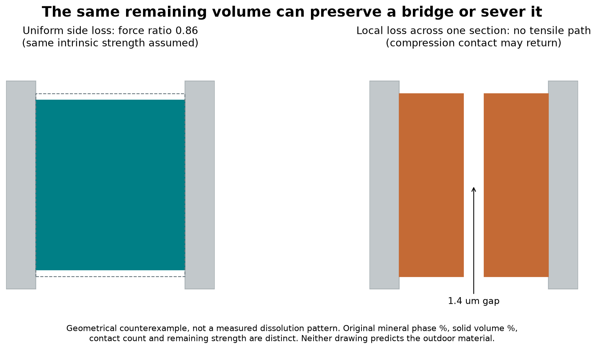
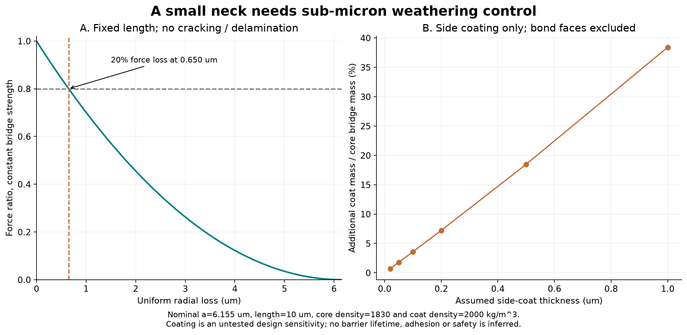
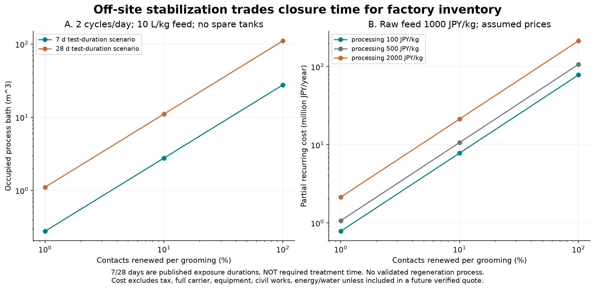

# 多方向探索第63巡：結晶の安定化と壊れない接点の区別

2026-10-09／Codex。初期基点 main: 2b5c0a8b0e97d1297f6fb51dbae7c631b9f72418。公開前に追加された調査台帳を取り込み、統合基点を e9be02fa93efb425120ede9311d021a10ee03083 へ更新。

**今回の前進は、温暖環境で作れるMg系結晶に対し、リン酸・溶存シリカ・多糖の安定化研究を比較し、結晶の残存と粒同士の接続を別々に判定する設計へ進めたこと。** 2026年7月のキサンタンガム研究も追加した。H62の「小さな首を再生する」案に対し、首が化学的・機械的に傷む場所、保護処理の順番、工場在庫、雨水への物質移動を計算した。

物理試験0件、実物成功確率は未算定。従来の15％程度という見立てを測定済み確率として使わない。文献の80〜86％という結晶相残存量も、90％超の実物成功率ではない。本巡は実験結果を作っていない。

## 1. 目的と継承範囲

夏の気温30℃以上・表面約50℃、新雪圧雪の板の走り、エッジの支持と短い解放、停止後の再始動、振動、転倒時の挙動を同時に満たすことが目的。約30°斜面、4〜5時間ごとの整地、日中の閉鎖は約60分。比較床は2000 m²・450 mm厚、最大300 mmの掘れでも同じ機能を保ち、保持網は掘れ深さ＋余裕より下とするR39方針を継承する。

冬の雪との固着、界面の排水、天然地盤に対して余計な融雪を起こさないこと、雨・台風後の機能復旧、人・環境への安全を含む。油・塩・フッ素・シリコーンの潤滑、現地冷却、強酸の現地使用、常時べしゃべしゃの散水には依存しない。工場での塩類や薬品の使用と、それをコースへ残すことは区別し、洗浄・回収・残留評価まで必要とする。

[第62巡](GPT回答_多方向探索第62巡_結晶接点と水で集める固体橋の選択再生_20261009.md)の乾燥熱収支と接点への有効供給率の制約は消えていない。[第30巡](GPT回答_多方向探索第30巡_浸水履歴と開放支持骨格の設計_20261008.md)・[第50巡](GPT回答_多方向探索第50巡_雨で貼り付かず戻る粒の条件と排水構造_20261009.md)の濡れ履歴・開放排水、[第43巡](GPT回答_多方向探索第43巡_微粉を流さない材料と雨水回収の設計_20261009.md)の微粉回収も継承する。今回は液橋模型の繰り返しよりも、首そのものの相変化へ探索を移した。

## 2. 一次資料で分かったこと

### 2.1 「50℃まで安定」という一文で耐用年数は決まらない

Harrisonほかは25℃で57日、35℃で20日以内にネスケホナイトからダイピンガイトへの変換を観測し、35℃では元の外形が失われた。試験は0.10 M NaCl・0.06 M NaHCO₃を含む閉鎖系で、実際の雨水ではない。溶解度積の測定値を、そのまま雨に溶ける速度へ置き換えてはいけない。[S1・著者稿](https://discovery.ucl.ac.uk/id/eprint/10064741/1/Harrison%20et%20al_manuscript_cleansed%20%282%20files%20merged%29.pdf)、[書誌・DOI](https://doi.org/10.1016/j.chemgeo.2018.11.003)

一方、2008年の研究の要旨には純水中50℃まで安定という記載がある。要旨だけでは、今回と同じ期間・水交換・形状の耐久性を確認できない。時間・水組成・CO₂・乾湿・判定法の異なる報告を、一つの安全温度へ丸めない。[S5・出版社要旨](https://pubs.acs.org/doi/abs/10.1021/je800438p)

### 2.2 安定化を狙う三つの切り口

|切り口|一次研究の観測と条件|この用途へ移す際の不足|
|---|---|---|
|リン酸系の表面保護|50℃、1 g/10 mLの液中、7・28日の比較。28日後のNQ残存は商用緩衝液約80％、自製約86％。表面のMg–K–P相が保護に寄与するとの解釈。|静置した結晶の相評価。摩耗、雨水交換、接点強度、壊した後の再接続は未評価。|
|溶存シリカの利用|Mg塩・重炭酸塩・NaClの系で、析出と後の相変換への影響を測定。Si添加量を増やすほど一方向に改善する結果ではなく、3 mM系と6 mM系で挙動が異なる。|塩を含む合成条件を現地散布へ移さない。固体シリカ粉を撒けば同じ効果、とはならない。|
|多糖による形成・安定化|2026年研究では、グルコースとキサンタンガムを比較。48 hで形成したNQが、多糖条件では120 hでも主相として観測された。束・放射状集合など形態も変化。|新雪の六角結晶、50℃雨中寿命、60分噴霧形成、湿潤接点の強度を証明したものではない。|

リン酸系は[S2・原著](https://pubs.rsc.org/en/content/articlehtml/2025/ma/d4ma00947a)、シリカ系は[S3・原著](https://pmc.ncbi.nlm.nih.gov/articles/PMC10785746/)、多糖系は[S4・原著](https://pmc.ncbi.nlm.nih.gov/articles/PMC13326699/)を参照した。S2は出版社の検索取得本文で方法・結果・結論を確認し、直接取得は403だったため全文ハッシュを付けていない。S3・S4は公開XML本文を取得照合した。著者図や全文の転載はしていない。

S4の添加量は1.5 mg/25 mL、Mg 0.05 M・Ca 0.01 Mの合成系。密閉容器のガス拡散法であり、アンモニウム塩とアンモニア吸収用の強酸を伴う実験を屋外噴霧手順に採用しない。温度を上げ続けるTG-DSC測定は、50℃に保って雨に晒す試験の代用にならない。食用にも使われる物質だからといって、出来上がった鉱物複合粒や摩耗粉の安全性まで確定しない。

**判断：三系統とも研究候補に加えるが、採用材料とはしない。** 特にリン酸系は目的温度での相保持という直接的な手掛かりがあり、閉じた試験での比較優先度を上げる。多糖系は結晶の形を変える候補として比較する。現地に緩衝液・溶存シリカ・ガムを撒いて対応済みとする案は採らない。

## 3. 結晶が86％残っても、接点が86％働くとは限らない

H62の仮定を引き継ぐ。球換算の粒径500 µm、占有率0.55、配位数6、首の長さ10 µm、有効引張強度10 MPa、等方的荷重分担を置く。床の応力尺度5 kPaを支える首の半径は約6.155 µm、各接点約1.190 mN、全首のNQ相当質量49.41 kgとなる。これらは雪の実測値でも、文献が示す接点強度でもない。

同じ長さで首の側面だけが一様に削れ、材料強度が変わらない仮定なら、引張力比は次式になる。

    F/F0 = ((a − δ)/a)²

初期の80％を残す仮の管理条件では、半径方向の減少δは**0.650 µm以下**でなければならない。表面が少し変わっただけに見えても、細い首では無視できない。亀裂、濡れによる強度低下、接着界面の剥離があれば、この一様減肉模型より悪化し得る。

次の二つは、元の荷重負担体積が86％残るように作った数学的反例である。

- 全側面が均一に薄くなる：同じ材料強度なら力比0.86。
- 首の途中の1.4 µm区間が全断面にわたって非接続になる：残りが86％あっても、引張力を伝える道は切れる。

後者は実際の変換形態を予測したものではない。相変換した部分が必ず隙間になるとも置いていない。**XRD/TGAの相分率、残存体積、接点数、荷重支持率を相互に変換できない**ことを示す反例であり、S2の86％をこの模型へ直接代入した実験再現ではない。圧縮すると再び触れる断片もあるため、圧縮試験だけでは接続の喪失を見落とす。

### 3.1 公開直前に追加されたClaudeの台帳との照合

新しい[物性値照合台帳](../調査台帳/物性値照合_自律ループv2v3.md)のMg系4節と、[計算部品索引](../調査台帳/計算部品索引.md)の関連項目を確認した。v3 K-Aの一部監査は公開済みとなったが、索引に載る開発サーバーのスクリプト本体・全結果を取得したわけではない。[取得記録](温暖湿潤の結晶安定化と接点寿命_20261009/claude_update_review.json)

台帳は、成形・養生したNQ材料の圧縮強度を、自由析出した首の強度へ転記する問題を指摘している。また索引の rv_r4_4_need.py には首強度0.02〜1 MPaの仮定範囲が記載されていた。この範囲も実測値とは採用せず、今回の10 MPaと並べて必要量を再計算した。

|仮の湿潤首強度|首半径|全首材料|10％更新・28日保有時の処理液|
|---|---:|---:|---:|
|10 MPa|6.155 µm|49.41 kg|11.068 m³|
|1 MPa|19.46 µm|494.1 kg|110.678 m³|
|0.1 MPa|61.55 µm|4941 kg|1106.784 m³|
|0.02 MPa|137.62 µm|24705 kg|5533.920 m³|

弱い側では小さな首という形状仮定自体が崩れる。半径/粒径が0.1を超えるケースを注意表示したが、この0.1は計算の診断用で、物理的な合否しきい値ではない。下二行を、そのまま製造可能な設計とは扱わない。したがって後述する11 m³や費用は、10 MPaという楽観的な名目仮定に条件付けられており、見積りの中心値に採用しない。

台帳に含まれる溶解・凝固点・安全・成功確率の数値は、原データの再現や一次出典を必要に応じて再確認する対象として扱う。今回のMg輸出換算を、台帳の平衡濃度や法的基準へ置き換えない。物性照合の蓄積を受け取り、今回の新出典と計算も台帳へ追記する。

## 4. 雨と保護層を、測定できる条件へ落とす

### 4.1 雨水のMg収支から接点喪失を監視する

49.41 kgのNQが持つMgは約8.680 kg。仮に首全体の20％が一様に失われるなら、NQ 9.882 kg、Mg 1.736 kgの移動に相当する。100 mmの雨が2000 m²へ降ると水量は200 m³で、その全量を捕集できる仮定では、正味Mg濃度の増加約**8.680 mg/L**に相当する。

これは溶解度・溶出予測・排水基準ではなく、測った流量と濃度を物量へ戻す換算である。Mgは母材や土からも出るため、流入水・母材だけの対照が必要。再析出・吸着・未回収水があると排水Mgだけでは損失を捉えられない。細粉に含まれるMgも、溶存Mgとは分けて総収支へ入れる。

局所的に最細部が切れれば、平均20％に達する前に機能を失う。従って濃度監視だけで合格を決めず、接点像・二粒引張・全床性能を併用する。

### 4.2 保護層を足す量と、接点を作り直す矛盾

首の側面だけを厚さtで覆うと仮定し、付着する端面を除く円筒差分で量を計算した。仮密度2000 kg/m³、t=0.1 µmでは床全体約**1.769 kg**、元の首質量の約3.58％。20 nm〜1 µmの感度を保存した。これはS2の実測膜厚・密度ではなく、首だけを狙って処理できた場合の仮設計である。粒全面を被覆した量ではない。

薄ければ安いとは限らない。欠陥なく接点へ届く歩留まり、濡れた接着、摩耗後の膜、表面反応の抑制を確かめる必要がある。保護が効いて水との反応を抑えるほど、破断後に同じ首を迅速に化学再生できるかが別問題になる。

## 5. H63の構成比較：保護する工程と接続する工程を分ける

|候補|具体的な構成・工程|狙う改善|採否を分ける条件|
|---|---|---|---|
|H63-P 接点形成後の保護|粒を接続して首を作り、その首の露出側へ保護相を形成。滑走面の全面硬化を避ける。|既存の結晶接続を残しつつ水への感度を下げる。|現地で接点を作るなら、処理全体が60分以内か。破断面の再保護も同時に必要。S2はこの速度を証明しない。|
|H63-X 工場で調整した複合粒|多糖による結晶形成・集合、洗浄、湿潤安定化を工場で行い、形・細粉・接点機能を選別して供給。|現地での長い結晶成長を避け、結晶形態の設計範囲を広げる。|工場内でできた粒内の首は、現地の粒間接続とは別。濡れた粒間保持と雪の切れを別に成立させる。ガムによる泥状化・膨潤・生物膜を測る。|
|H63-M 役割を分ける融合案|工場で安定化した粒内構造と、H61のような外部の機械的な係合・解放を組み合わせる。安定化鉱物が不要なら外す対照も設ける。|化学的に保つ部分と毎回開閉する部分の矛盾を減らす。|鉱物を足すことで摩耗・重量・価格が増し、滑走が良くならなければ融合しない。H61自体も未実証。|

これらは設計仮説であり、製作済みの粒や特許上の新規性の認定ではない。H63-Mを「成功しやすそう」という理由だけで最終目的へ置き換えない。温暖な噴霧から雪状構造を形成する目的はH63-Pの経路として残す。工場成形・集合を、その噴霧結晶化の達成とは呼ばない。

**試験の優先順を変更する。** まず無添加NQ・リン酸処理・シリカ由来・多糖由来の同寸法接点を比較し、50℃の流水と摩耗で首の強度と形を保てるか調べる。相保持だけ通過した候補を大規模床へ進めない。その次に処理済み面を破断し、60分以内の再接続を試す。再接続だけが限界なら、粒内安定構造へ用途を移し、外部接点の機械案と費用を比較する。

## 6. 工場へ移すと、整地時間ではなく在庫が増える

S2の1 g/10 mLという実験比率を単純に10 L/kgへ換算し、7日・28日を保有期間に置いた。**文献の試験期間は、必要な前処理時間ではない。** その長さの工程が必要になった場合の設備負担を見えるようにした比較である。処理後に洗い出しても保護効果が残るか、液の再利用、攪拌、溶解損失、処理速度は未実証。

首質量49.41 kg、有効接点率25％、一回10％更新、日2回とすると、供給は19.764 kg/回、39.528 kg/日。7日保有で約276.7 kg・処理液約2.767 m³、28日なら約**1.107 t・11.068 m³**となる。槽の空き、固体体積、予備、洗浄・回収槽は別途必要。一回全更新なら全て10倍であり、台風後の全再生を10％更新の数字で説明しない。

180日×2回の比較年で、10％更新の供給は約7.115 t。原料仮単価1000円/kgなら約711.5万円/年。処理を100・500・2000円/kgと仮置きすると、原料＋処理の部分費は約782.7・1067.3・2134.5万円/年になる。処理単価は見積り未取得の感度入力で、実際に電力・洗浄・回収・人件費がこの中へ収まる保証はない。

母体粒、量産歩留まり、補給・流出、輸送、装置、土木、税は別。税込2億円の整地設備等の枠を満たした見積りではなく、材料や処理費を設備予算へ紛れ込ませない。H62-Bの27 kgという多孔質首ではなく、今回はNQ密度1830 kg/m³の49.41 kgを使っているため、前巡の389万円/年との違いを値下げ・値上げの実測と読まない。

### 6.1 リン酸系を使うなら物質を閉じた系で管理する

仮に処理浴のP濃度を0.05 mol/Lと置き、毎回新液を使うなら、上記7.115 tに対する年間総投入相当量はP元素約110.2 kgとなる。この濃度はS2から転記した処方ではない。10・50・100 mmol/Lと系外移動割合の感度を計算しただけである。

この110.2 kgの1％が循環系外へ移る条件は約1.102 kg/年。系外移動には回収廃棄物や製品への持出しも含むため、そのまま自然界への流出量とはしない。使った浴の再利用だけでなく、固体に残るP、摩耗粉、洗浄水、雨水への移動まで追う。溶存分は粒子フィルターだけでは収支を閉じられない。採用前に実濃度・実移動量と処理費が必要である。

## 7. 検証で合格とする対象を取り違えない

1. **材料・形態**：同じ接点の初期と50℃乾燥／浸水／流水／乾湿反復後について、相、首の最小断面、接着界面、引張・せん断・破壊仕事を測る。膜の存在と機能を同じ試料で照合する。
2. **再生**：実際に接点を壊し、洗浄・配材・整形を含む60分の中で機能が戻るか確認する。首の数だけでなく、残った首の劣化を含める。例えば接点86％が残っても各強度が半分なら、欠損14％を全て新品同等に戻した単純並列模型でも合計0.57に留まる。実際の連結網は別途評価する。
3. **滑走と冬**：新雪圧雪と同じ計測条件で、ソール摩擦、エッジ支持・解放、再始動、振動を比較。雪との界面の剪断・排水・凍結融解・融雪差を測る。成分や結晶形だけで雪と同等と判定しない。
4. **雨・環境**：溶存Mg/P/有機物、細粉、全流量、未捕集分を収支化する。実配合の摩耗物・浸出物で人体と環境の評価を行う。天然物・食用実績・相保持率を安全の証拠にしない。
5. **経済性**：物理的に合格した再生率・破片量・処理時間・浴再利用率から費用を再計算する。失敗粒も均して戻せば使えるという前提を置かない。

[詳細試験計画](温暖湿潤の結晶安定化と接点寿命_20261009/validation_plan.md)には、測定する変数と次の切替条件を記載した。実験の発注・薬品購入・合成操作は実施していない。

## 8. Claudeへの検証依頼と公開状態

[Claudeの公開v2](../バーチャル試験/自律ループv2_噴霧結晶化素材_第1〜4ラウンド_20261008.md)のMg系案とH62を基点にした。開始時点はmain 2b5c0a8bだった。公開直前にClaudeの調査台帳新設を検出し、e9be02faまで取り込んだ。v3の一部監査とスクリプト索引を新たに確認したが、全結果・元コード・稼働プロセス・本報告の受領や同意は未確認である。GitHubと回覧板への記載を共有の記録とする。

Claudeには次を依頼する。

- S2の相保持と、洗浄後・流水後・摩耗後の接点保持を分離し、保護層を破断した後に短時間で再接続できる根拠があるか反証する。
- 2026年のS4の多糖由来結晶を、常温噴霧・50℃耐久へ外挿せず検討する。塩・酸を現地へ持ち込まず、母液回収と残留成分まで含む製造経路を提示する。
- H63-P/X/Mを同じ全床・全使用層・雨後復旧条件で比較し、工場前処理で解決した機能と現地で未解決の粒間接続を混同しない。
- v3の成功・失敗双方の元データとコードを公開し、15％や90％の母集団・合格定義・証拠を示す。相分率や計算条件の通過割合を成功率へ使わない。

本巡は27件の式・単位・収支照合、235行の比較表、3図を作成した。新しい材料・滑走床の成功を実証した結果ではない。次の材料選択を変える証拠は、安定化の原著と、接点の局所損傷・再接続・処理在庫を同時に扱う条件である。

- [入力](温暖湿潤の結晶安定化と接点寿命_20261009/inputs.json)・[計算コード](温暖湿潤の結晶安定化と接点寿命_20261009/calculate.py)・[結果](温暖湿潤の結晶安定化と接点寿命_20261009/results.json)
- [模型の範囲](温暖湿潤の結晶安定化と接点寿命_20261009/model.md)・[出典と取得範囲](温暖湿潤の結晶安定化と接点寿命_20261009/source_provenance.json)
- [数値照合](温暖湿潤の結晶安定化と接点寿命_20261009/numerical_checks.json)・[図のコード](温暖湿潤の結晶安定化と接点寿命_20261009/draw.py)・[成果物一覧](温暖湿潤の結晶安定化と接点寿命_20261009/README.md)
