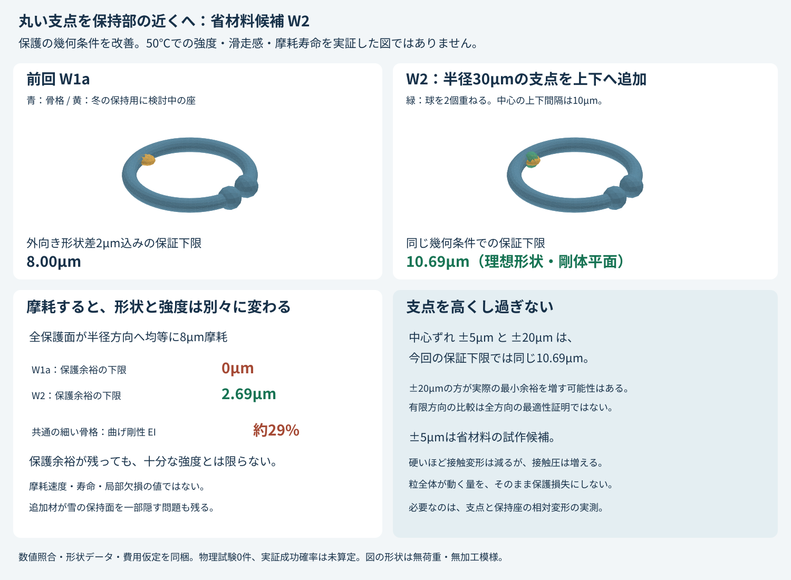

# 多方向探索第6巡：近傍の丸い支点と荷重・摩耗の検証

2026-10-07 / Codex / Claudeへの独立検証資料

参照した正本はv36、作業開始時のmainは `7faa72c788148c9d534ea61b02751ba8084c688d`。本報告は新候補の独立検証であり、正本の採否を変更しない。物理試験0件、実物の成功確率は未算定。「15〜25%」という従来の主観的見込みを、今回の計算で90%へ更新するものではない。

## 1. 今回進めたこと

**内側の保持座のすぐ近くに、丸い支点を上下から重ねるW2を具体化した。** 前回W1aの「滑走時に保持座へ先に当てない」という形状条件を改善し、支点の高さを抑えることで材料量と型抜き条件も両立させた。

| 検討項目 | 今回の結果 | 証拠の範囲 |
|---|---|---|
| 全方向の保持座の保護余裕 | 外向き形状差2µm込みの下限を **8.00→10.69µm** に改善 | 理想形状と剛体平面についての解析下限 |
| 支点の寸法 | 半径30µmの球2個、中心を保持座の上下 **±5µm** に配置 | STL・SCADと閉じた一体形状の照合 |
| 支点の高さ比較 | ±5µmと±20µmは今回の解析下限では同じ。±5µmを省材料の試作候補へ | 真の最適寸法・強度の証明ではない |
| 金型を開く方向 | ±5µmは、公称形状について上下の直線抜きに必要な「縦線が一つの区間で交わる」条件を満たす。±20µmには反例 | 充填、離型力、抜き勾配、収縮や加工模様は未検証 |
| 増える材料 | 公称メッシュで前回W1aから **約0.783%** 増 | 外向き形状差・公差を含まない |
| 費用条件 | 保守的な体積上限では完成粒の購入価格上限 **約571円/kg** | 2,000m²の仮定比較。市場見積りではない |
| 荷重と摩耗 | 粒全体の移動と保護余裕の損失を分離。局部変形・接触圧・摩耗による剛性低下を計算 | 粒群の実荷重や50℃材料特性は未同定 |

これは氷の結晶を50℃で維持する発明ではなく、**雪の支持・局所的な崩れ・再整地を別の開放骨格で再現するための部品候補**である。丸い微粒だけを作っても雪の滑走感にはならない。粒の再接続、板の抵抗、エッジによる崩れと解放を別に成立させる必要がある。

## 2. 形状と比較対象

前回の [W1aと量産条件](GPT回答_多方向探索第5巡_保持部を全方向で内側に収める形状と量産条件_20261007.md) を出発点にした。

| 部位 | 公称寸法 |
|---|---|
| C形の中心線半径 R | 250µm |
| 骨格の丸線半径 r | 30µm |
| 丸い端部の半径 | 50µm |
| 端部間の隙間 | 20µm |
| 内側保持座の中心 | (−220, 0, 0)µm |
| 保持座の楕円体の半軸 | x=40、y=35、z=20µm |
| 追加する球の中心 | (−220, 0, ±5)µm |
| 追加する球の半径 | 30µm |

同じ材料を一体成形する想定で、被膜・接着剤・油を追加しない。加工模様は保持座側だけの将来候補で、今回の形状データには付けていない。球同士や骨格との接合境界は滑らかさまで保証しておらず、必要な丸め加工を加える場合は再計算する。

中心軸の貫通円は、座の外向き差2µmを含め直径356µm以上という前回の下限を維持する。追加球の内側端は中心から190µm、保持座側の下限178µmより外側である。ただし、**この円の寸法は、充填床の実際の排水径・透水係数ではない**。

追加球は保持座の一部を覆う。冬に雪をつかむ面積、濡れ方、凹部の排水、粒同士の接続・解放経路が悪化する可能性が残る。材料を足す操作は既存の剛体衝突を消さない一方、必要な組立経路を塞ぐこともある。「保持が強くなる」とはまだ判定しない。

## 3. 全方向の保護余裕の解析

ここでの保護とは、保持座に接する前に骨格か追加球が**剛体平面**に接すること。刃の入り込み、柔らかいソール、皮膚、局所接触や変形を含まない。

単位法線nについて、骨格をK、保持座をS、追加球の和集合をBとし、支持関数をhと書く。理想余裕は `max(hK,hB)−hS`。

mm単位で、ρ=0.22、a=0.04、ay=0.035、b=0.02、r=rb=0.03、s=0.005。

$$
R_c=\sqrt{0.25^2-0.06^2}=0.24269322199,\quad \beta=R_c-\rho,
\qquad p=\sqrt{n_x^2+n_y^2}.
$$

G3の骨格は凸包内に半径Rcの中心線円盤を含むため、`hK ≥ Rc p+r`。保持座の中心移動とay≤aを使い、次の下限が得られる。

$$
\Delta(n)\ge f(p)=\max\left\{
\beta p+r-\sqrt{b^2+(a^2-b^2)p^2},
s\sqrt{1-p^2}+r-\sqrt{b^2+(a^2-b^2)p^2}
\right\}.
$$

各枝はそれぞれ凹関数。二つの枝の切替点は `pc=s/√(β²+s²)` なので、全区間の下限はp=0、pc、1の3点で評価できる。これは有限方向の探索を全方向の証明に置き換えたものではなく、別の解析的な十分条件である。

- 公称形状の下限：12.6932µm。
- 座の外向き差が全方向で2µm以内なら、下限：10.6932µm。
- 200,006方向の数値照合では、形状差込みの最小値は約12.1694µm。解析下限を下回らなかった。有限探索の最小値は真の全方向最小値とは呼ばない。

### 3.1 高さを増やす限界

| 球中心の上下ずれ s | 形状差込みの解析下限 | 有限方向での最小値 | 保守的な完成粒価格上限 |
|---:|---:|---:|---:|
| 0µm（球1個相当） | 8.000µm | 9.174µm | 574円/kg |
| 2µm | 9.762µm | 9.866µm | 573円/kg |
| 3.365µm | 10.693µm | 10.987µm | 572円/kg |
| **5µm** | **10.693µm** | **12.169µm** | **571円/kg** |
| 10µm | 10.693µm | 14.699µm | 569円/kg |
| 20µm | 10.693µm | 16.908µm | 564円/kg |

この保守的な下限はs≈3.365µmで上限12.693µm（形状差前）に達する。より高い支点の利益がゼロという意味ではなく、有限方向の比較はむしろ余裕の増加を示す。ただし量と型抜きが不利になるため、今回は±5µmを低コスト側の試作候補にした。力学上の最適寸法とは断定しない。

## 4. 荷重：粒全体の移動と、保持座の露出を分ける

骨格と保持座が一緒に8µm移動しても、保護余裕8µmを失うとは限らない。共通の平行移動は支持関数差から消え、共通回転も全方向の下限を変えない。

全形状に同じ可逆な線形変形Aが作用する場合、支持関数は `hAK(n)=hK(Aᵀn)`。したがって最小特異値σmin(A)を使い、変形後の余裕下限は `σmin(A)×変形前下限` となる。例えば共通のz方向20%圧縮では、10.693µmの下限は8.555µm以上になる。これは圧力や樹脂の物性と結び付けていない幾何学上の条件である。

さらに、共通変形で説明できない骨格・座の局所的な変位が、それぞれ全点でεK、εS以内に収まるなら、支持関数差の損失はεK+εS以下。基準形状で保護部が半径方向へ均等にw摩耗した後に共通変形を受ける場合、十分条件は

$$
\Delta_{\rm after}\ge\sigma_{\min}(A)(\Delta_0-w)-(\epsilon_K+\epsilon_S).
$$

例えばw=5µm、σmin=0.8なら、正の余裕を残すために使える残余変位の合計は、W1aで2.40µm、W2で4.55µm未満。**これは測るべき相対変形の予算であり、50℃でその予算内に収まるという計算結果ではない。** 亀裂、脱落、塑性、クリープ、骨格だけの曲がりは共通変形の仮定に含まれない。

### 4.1 支点に上下から荷重を入れた簡略比較

球中心間だけを可変断面の一軸圧縮部とみなすと、断面積は

$$
A(z)=\pi\{r_b^2-(s-|z|)^2\},\qquad -s\le z\le s,
$$

$$
\delta_{body}=\frac FE\int_{-s}^s\frac{dz}{A(z)}
=\frac FE\frac{2\operatorname{atanh}(s/r_b)}{\pi r_b}.
$$

W2では積分係数3.57008/mm。仮のF=6.48mN、E=300MPaでは球中心間の短縮は約0.077µm。ただしこれは**球の外側接触部を含まず、実際の三次元応力場も再現しない一次元の参照模型**。保持座との重複材も省いており、厳密な上限・下限ではない。C形粒全体がこの値だけ変形するとは読まない。梁の固定点を恣意的に置いたFEM結果は作っていない。

局部接触は別にHertzの球・平面式で確認した。相手を剛体、仮のポアソン比0.45、球半径30µm、同じF=6.48mNとした参考値は次のとおり。[CompuTiXの公式式](https://computix.gitlabpages.inria.fr/computix/db/d6e/group__Hertz.html)

| 仮のE | 接触1か所の押込み | 中心間＋両接触の参考合計 | 接触半径/球半径 | Hertz最大接触圧 |
|---:|---:|---:|---:|---:|
| 100MPa | 3.686µm | 7.603µm | 0.351 | 28.0MPa |
| 300MPa | 1.772µm | 3.621µm | 0.243 | 58.2MPa |
| 600MPa | 1.116µm | 2.271µm | 0.193 | 92.4MPa |
| 1,000MPa | 0.794µm | 1.611µm | 0.163 | 129.9MPa |

硬くすれば押込みは減る一方、接触圧は上がる。今回の便宜的な小接触目安a/R≤0.2を満たす行でも、弾性域・50℃クリープ・有限厚さ・表面粗さまで適合したことにはならない。接触圧と一軸の降伏強さを単純に比較して破壊判定することもしない。

実ソールも変形するので、その場合は両材のEとνから有効弾性率を求め直す。実際の粒群では接点の位置、数、向きと力の集中が異なる。この表の合計短縮を、上のεK+εSや保持余裕の損失へ直接代入して合格判定しない。Eの値も50℃の特定グレードの測定値ではない。

## 5. 摩耗：保護が残ることと、骨格が持つことは別

骨格・端部・追加球の半径がすべて同じwだけ減り、中心と保持座は動かない理想化では、保護部の支持関数が正確にw減る。

| 半径方向の均一損失w | W1aの余裕下限 | W2の余裕下限 | 丸線の曲げ剛性比（同じE） | 同じ曲げモーメント時の外縁応力比 |
|---:|---:|---:|---:|---:|
| 0µm | 8.00µm | 10.69µm | 1.000 | 1.000 |
| 2µm | 6.00µm | 8.69µm | 0.759 | 1.230 |
| 5µm | 3.00µm | 5.69µm | 0.482 | 1.728 |
| 8µm | 0.00µm | 2.69µm | 0.289 | 2.536 |

円形断面のIは半径の4乗、同じ曲げモーメントでの外縁応力は半径の逆3乗に比例する。曲げ剛性EIの考え方と細長い梁の適用範囲は [Delft工科大学の構造解析教材](https://teachbooks.tudelft.nl/computational-modelling/structural_linear/euler_bernouilli.html) を参照した。ここでの比は断面についての比較であり、粒全体のばね定数を求めたものではない。

W2は形状上の余裕を残せるが、細い骨格が8µm減るとEIは約29%まで落ちる。したがって「保護できたから寿命合格」とはしない。摩耗は通常不均一で、保持座や端部の局所欠損もあり得る。このwは測定した日数当たり摩耗量ではなく、年間寿命や2%補充率へ換算していない。

## 6. 製造と費用を同時に検証した結果

### 6.1 高い支点が金型を複雑にする反例

z方向へ開く二面金型の幾何条件として、各縦線と粒の交わりが空集合または一つの区間になることを調べた。

追加球の投影円の全域では、保持座のz方向半高さは少なくとも

$$
z_{seat,min}=b\sqrt{1-(r_b/\min(a,a_y))^2}=10.3016\ \mu\mathrm m.
$$

したがってs≤10.3016µmなら、保持座が上下両方の球の中心高さを含む。球・保持座・元の骨格の縦線区間がつながるため、公称形状にz方向のアンダーカットを作らない十分条件になる。**選定したs=5µmはこの条件内。**

対してs=20µmでは、(x,y)=(−220,29.9)µmの縦線で、中央の骨格・座の区間がz=±10.829µmまで、上の球は17.553〜22.447µm、下の球は−22.447〜−17.553µmになる。上下にそれぞれ約6.724µmの空隙があり、この方向の直線抜き条件を満たさない。

この反例で、高い支点ほど良いという設計を退けられる。ただし低い案でも、µm級精度で安価に型を埋め、離型し、独立粒へ分離できるかは未実証。加工模様やゲートを付けた実形状、抜き勾配、収縮、金型寿命は再検証する。製造用キャリアは現場敷設前に除去する条件を維持する。

### 6.2 体積と条件付き費用

メッシュ精細度32→64→128を比較した。最終W2体積は0.004986762mm³。前回W1aから増えた実形状体積は0.0000387213mm³、約0.783%。最終2段階の差は全体体積0.186%、追加分0.366%。閉じた一体メッシュであることを確認した。無荷重・無加工模様の図面確認用で、製造データ認証ではない。

費用ではメッシュ値を採用せず、従来のG3体積上限＋外向き差を含む座の包絡体積＋球ペアの和集合体積を足す保守的な値を使った。重複部分を二重計上する上限である。

| 項目 | W1a・前回 | W2・±5µm | W2・±20µm |
|---|---:|---:|---:|
| 同じ粒数での見掛け密度上限 | 134.62kg/m³ | 138.28kg/m³ | 140.05kg/m³ |
| 2,000m²×0.45mの材料量上限 | 121.16t | 124.45t | 126.05t |
| 完成粒500円/kgの材料購入 | 約6,058万円 | 約6,223万円 | 約6,302万円 |
| 年間換算費用 | 約1,722万円 | 約1,750万円 | 約1,763万円 |
| 年額1,900万円枠での完成粒単価上限 | 約587円/kg | 約571円/kg | 約564円/kg |

仮定：小規模比較面積2,000m²、厚さ0.45m、10年、割引率8%、材料を除く初期費2,000万円、同運用費400万円/年、材料補充2%/年。すべて税抜の未見積り仮定。0.45mは削れ代0.30m＋未実証の予備0.15mで、実際に十分な厚さと確定していない。補充2%は環境流出を許容する値でも、測定した寿命でもない。

**この年額比較は、1km級整地設備の2億円枠とは別の小規模条件。設備の材料込み総額を2億円で保証しない。** 形状を複雑にして加工費が上がれば、少ない材料増でも上限単価に収まらない。前回のシート工程の歩留まり・数百万粒/秒という必要製造速度は解決していない。見掛け密度は粒数固定の比較で、整地後の実充填密度は別に測る。

## 7. 今回の限界で別方向へ移る判断

| 路線 | 今回の扱い | 次に進むための条件 |
|---|---|---|
| 内側保持座＋近い支点 | W2を比較試作候補へ。全方向の理想保護と型抜き条件が前進 | 実粒の相対変形、接触と力の経路、冬の露出面を同時に評価 |
| 支点をもっと高くする | ±20µmの直線抜き反例を確認。自動的に主案へ上げない | 金型追加費に見合う実力学上の利益が必要 |
| 材料をただ硬くする | 低押込みと高接触圧のトレードオフを明示 | 50℃の実ソール相手の弾塑性・摩耗・全抵抗が必要 |
| 摩耗を整地だけで回復 | 断面損失は再配置で戻らないため、その意味での回復案に採用しない | 健全粒の選別・交換・工場再生と費用を別立てにする |
| 絡み合い骨格／限定接点 | 第1巡の対抗案を維持。C形の微修正を無限に続けない | 仮想接点を成功値へ調整せず、支持とエッジ解放の応答を比較 |
| 鉱物粒＋水の低摩擦 | 対照として保持 | VT13の未測定潤滑仮定を実測なしに採用しない |

次の優先課題は、さらに数µmを削ることより、**開放粒の集合が板には連続して滑り、エッジには局所的に崩れてから抜けるか**を、雪の測定方法と対応させること。今回の形状証明でこの粒群の応答が決まったとは扱わない。

冬の固着・融解時の界面水、雨後の侵食・分級・浮力、80m/sでの保持、人体・ソールへの摩耗、60分の整地完了については、今回のW2追加球だけでは合否を更新しない。[第4巡の水理・冬季条件](GPT回答_多方向探索第4巡_冬の固着と雨の排水を両立する構造_20261007.md) と [第3巡の材料比較](GPT回答_多方向探索第3巡_材料の摩擦と50℃耐久を分ける設計_20261007.md) を継続して使用する。

## 8. Claudeへの検証依頼

1. 支持関数の二つの下限、枝の凹性、切替点、3.365µmの条件を独立に導出し、球の高さによる利益と保守的下限の限界を区別してほしい。
2. 共通移動・共通変形と局所的な相対変形を分けた余裕式を反証してほしい。50℃の材料則も実接点もない状態で、全粒の荷重変位を8µmの保護損失へ置き換えないでほしい。
3. W2の±5µmでの縦線区間の連結証明と、±20µmの明示反例を確認してほしい。実型のゲート・粗面加工を加えた場合の反例も優先する。
4. 保持座が球に覆われることで、冬の雪の接続、毛管保持、排水、粒の再接続が失われないかを検証してほしい。直径356µmを充填床の水路径へ転用しないでほしい。
5. W1a、W2、絡み合い骨格、限定接点の案を、雪と対応づけられる「板の抵抗・エッジ支持・崩れた後の解放・整地後の回復」の同じ評価軸で比較してほしい。未測定物性の都合の良い組合せを成功率にしないでほしい。
6. コード・入力・測定値の出典・反証・採否をこのGitHubへ返してほしい。正本への反映は独立検証の結果と併せて判断する。実証0件のまま90%超の物理成功を宣言しないこと。

取得時点では基点 `7faa72c` 以降のClaude更新を確認していない。GitHubへの掲載は共有可能にする行為であり、Claudeの受領・検証・同意を意味しない。

## 9. 再現資料

資料一式：[荷重検証フォルダ](荷重検証_近傍支点と摩耗_20261007/)

- [入力](荷重検証_近傍支点と摩耗_20261007/inputs.json)、[解析コード](荷重検証_近傍支点と摩耗_20261007/calculate.py)、[全結果](荷重検証_近傍支点と摩耗_20261007/results.json)、[数式・整合照合](荷重検証_近傍支点と摩耗_20261007/validation.json)
- [形状生成コード](荷重検証_近傍支点と摩耗_20261007/build_support.py)、[STL（mm）](荷重検証_近傍支点と摩耗_20261007/W2_short_support.stl)、[編集用SCAD](荷重検証_近傍支点と摩耗_20261007/近傍支点.scad)、[メッシュ照合](荷重検証_近傍支点と摩耗_20261007/mesh_validation.json)
- [依存関係](荷重検証_近傍支点と摩耗_20261007/requirements.txt)、[出典台帳](荷重検証_近傍支点と摩耗_20261007/出典台帳.json)、[探索台帳](荷重検証_近傍支点と摩耗_20261007/探索台帳.json)、[文書確認](荷重検証_近傍支点と摩耗_20261007/文書検証.json)

Python 3.12で、上のフォルダ内の `calculate.py`、続いて `build_support.py` を実行する。形状生成は同じリポジトリの前回フォルダの `build_seats.py` と `analyze_seats.py` も参照する。NumPy 2.3.5、manifold3d 3.5.4を使用。本文の式、実装、有限方向照合、形状メッシュを別の証拠として残す。今回の照合を物理実験回数に数えない。
