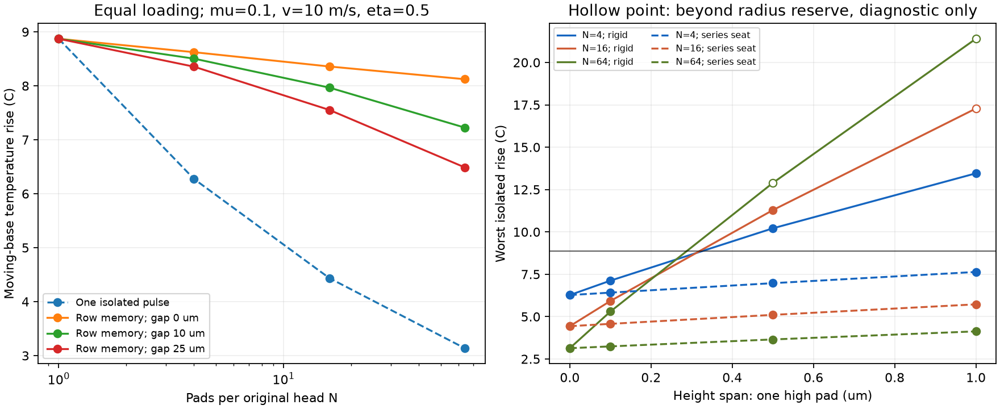
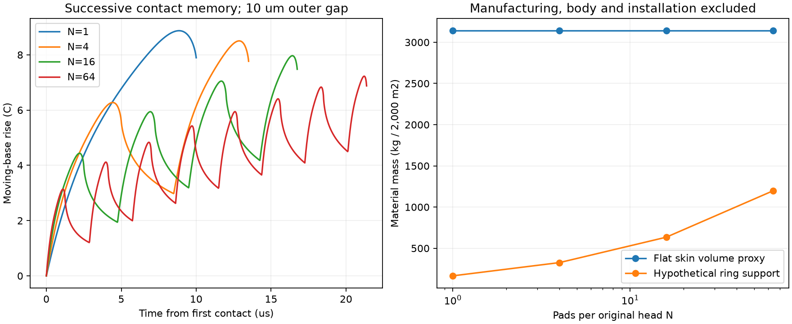

# 多方向探索第77巡：滑走接点の発熱を抑える分割と荷重集中の反証

2026-10-09 / Codex / [回覧板](../回覧板.md) / [再現資料](滑走接点の発熱と荷重分散検証_20261009/README.md)

**今回の成果は「微細化すれば良くなる」という案を反証し、少数分割・荷重均し・浅い法線支持を組み合わせるH77-Sへ設計を修正したこと。** 雪の結晶を合成した成果ではない。物理試験は0件、成功確率は未算定。過去の15％程度を、計算ケースの合格割合で90％超へ置き換えない。

## 1. 発明の更新：熱だけで接点を増やさない

夏の接点は初期50℃でも摩擦で局所的にそれ以上になる。第72巡の圧力を均す曲面H72-Qを1・4・16・64個に分割し、単独接点の熱、連続接触で残る熱、製造高さ差による荷重集中、荷重を均す支持部を順に同じ計算へ組み込んだ。

仮条件は接点群の総法線力31.416 mN、基準ピーク圧5 MPa、元接触半径50 µm、合成弾性率0.5 GPa。ソールの熱伝導率0.4 W/(m K)、密度950 kg/m³、比熱2000 J/(kg K)、摩擦係数0.1、速度10 m/s、摩擦熱のソール側配分0.5。**実物の50℃物性を測った値ではない。** 5 MPaは平均圧ではなくピーク基準。

| 分割数N | 均等荷重の単独パルス上昇 | 一列を続けて通る上昇（製作外周間10 µm） | 配列外幅 | 判断 |
|---:|---:|---:|---:|---|
| 1 | 8.872℃ | 8.872℃ | 150 µm | 基準として残す |
| 4 | 6.274℃ | 8.504℃ | 160 µm | 加工の増加が小さい比較案 |
| 16 | 4.436℃ | 7.967℃ | 180 µm | 支持部との融合比較案 |
| 64 | 3.137℃ | 7.226℃ | 220 µm | 加工・固着・公差負担に対し優先度を下げる |

単独パルスだけなら16分割で温度上昇半減。しかし同じソール点が4接点を続けて通れば低減は約10.2％に縮む。**分割しても総摩擦仕事μWVは減らない。** 前の熱が残るためであり、潤滑性を改善したことにもならない。隙間を25 µmに広げた16分割は7.553℃まで下がるが、外幅は225 µmとなり、粒形と接点密度の再設計が必要。

図の白抜き点は準備した曲面外径を超えた診断値で、実先端の予測に使えない。温度上昇の改善を滑走成功率と解釈しない。

### 高さ差を吸収するH77-S

16分割で1接点だけ0.5 µm高い場合、剛支持ではその1接点に全荷重の29.57％が集中し、最大圧は10.12 MPaとなる。均等なら6.25％・5 MPaである。同じ列の末尾に高い接点を置くと温度上昇は14.074℃、初期50℃から64.074℃となり、分割前より悪くなった。

各接点と直列に独立支持ばねを置き、元の1接点群で合成20,000 N/m、16分割なら1,250 N/m/接点と仮定すると、高い接点の荷重割合は7.95％、最大圧5.518 MPa。連続接触を含む上昇は8.573℃、最大支持変位は約2.00 µmとなる。

| 16分割の1個だけ高い差 | 剛支持・末尾高接点の上昇 | 仮の荷重均し支持を加えた上昇 |
|---:|---:|---:|
| 0 µm | 7.967℃ | 7.967℃ |
| 0.1 µm | 9.313℃ | 8.092℃ |
| 0.5 µm | 14.074℃ | 8.573℃ |
| 1.0 µm | 19.180℃：外径範囲外、無効な外挿 | 9.134℃ |

このばね特性を持つ完成粒は未製作。50℃・長時間・濡れ・摩耗後の支持特性と、支持部同士の干渉が次の判定点。1 µm差では仮支持を加えても基準単独接点の8.872℃を上回り、公差問題が消えたとは言えない。

### 法線支持と柔軟な粒枝を分ける

第75巡で検討した柔軟根元1.6 N/mは、5 µmの仮変位枠で8 µNしか支えない。一方、16分割後も1先端当たり1.9635 mNで約245倍。柔軟根元へそのまま全荷重を通してはいけない。前巡の未接続部を明らかにする比較であり、存在しなかった完成構造を試験済みとして否定するものではない。

H77-Sでは、浅い支持部で法線荷重と高さ差を受け、粒全体の枝と再接続部に切り込み・短い破断・再整地の役割を持たせる。自由な開放粒に機能を入れる構想であり、固定マットの代用ではない。一粒での両立は未確認。

~~~mermaid
flowchart TB
  A[実スキーソール：直進とターン] --> B[1・4・16分割の丸い滑走先端]
  B --> C[浅い法線支持：高さ差を均す]
  C --> D[開放粒の本体へ法線荷重を渡す]
  D --> E[柔軟な枝と限定した再接続部：切削と圧雪]
  C --- F[排水空隙：濡れ固着と粉詰まりを試験]
  E --> G[450 mmの全深度機能床]
  G --> H[保持構造は300 mm削れ代と余裕の下]
~~~

接点曲面・高さ差・支持定数は[入力](滑走接点の発熱と荷重分散検証_20261009/inputs.json)と[導出](滑走接点の発熱と荷重分散検証_20261009/model.md)に収録。支持ばねの量産CAD・材質銘柄・加工実績まで確定した図面ではない。

## 2. 一つの方向に固定しない比較

| 方向 | 今回の評価と次の作業 | 融合する点 |
|---|---|---|
| H77-S：少数分割＋荷重均し | 1/4/16を比較。64への微細化だけの推進は止める | 局所圧の偏りと公差管理 |
| 結晶配向接点 | HDPE・iPP等の未処理/配向材を実ソールで直進・方向変更比較。材質未選定 | 低摩擦なら発熱と対策費を直接減らせる |
| 第73巡の結晶面＋裏面結合 | 滑走面を結合材で埋めない条件に浅い支持を融合 | 柔らかい結合材へ全荷重を通さない |
| 第75・76巡の開放粒と雨後復旧 | 周長増加を毛管固着・泥詰まり試験に追加 | 排水→局所解離→異物/粉回収→圧密 |
| 熱伝導を上げる添加材 | 熱分配・露出硬粒による摩耗・安全を同時評価。配合未採用 | 熱伝導率だけで材料選定しない |
| H68-A等の暖地噴霧結晶化 | 独立経路で結晶相・枝形状・50℃安定・乾湿耐久を確認 | 工場成形の成功を噴霧結晶化へ読み替えない |

結晶配向も万能ではない。LooijmansらのHDPE実験は、室温・ダイヤモンド先端・100〜500 mN・1〜100 µm/sの条件で、配向によって摩耗が増える場合を示す。実ソールと高速滑走へ使える係数ではないが、「結晶をそろえるほど良い」という選定を反証する。[原著PDF](https://pure.tue.nl/ws/portalfiles/portal/101136635/1_s2.0_S0043164818301315_main.pdf)

DunnらはUHMWPEと研磨CoCrを複数軌道で測定し、滑走方向の変化が摩擦に影響することを示した。平均速度50.8 mm/sで今回の夏の粒床とは条件が違う。直進だけで材料を採用しない理由として使う。液体潤滑条件は本案へ持ち込まない。[著者PDF](https://research.me.udel.edu/~dlburris/papers/JA18.pdf)・[掲載情報](https://www.sciencedirect.com/science/article/pii/S0043164807005613)

局所発熱と蓄熱、熱の両物体への分配はポリマー歯車研究でも扱われる。本巡はその歯車解析の再現ではなく、明示した1次元近似で接点案を比較する。[Černeら2019](https://academic.oup.com/jcde/article/6/4/617/5732335)

## 3. 熱計算を性能保証に使わない境界

- 計算したのは移動ソール点の中心線温度。動かない粒の温度ではない。基準接点通過は10 µs。板長1.5 m・速度10 m/sと仮定すれば粒が板の下にいる時間は0.15 sで、同じ時間として扱えない。
- μ=0.2、速度20 m/s、ソール側配分1なら、N=1の同じ模型で上昇約50.19℃。初期50℃の試験だけでは滑走中の局所耐熱を確認できない。この温度は融解や人体の熱傷の判定ではない。
- 二物体の連成熱移動、温度依存物性、粘弾性発熱、粒の回転、接点更新、水膜、粗さ、長時間蓄熱は未解決。
- 最小接点・最も遅い速度では横方向熱拡散を無視する近似が弱い。表にはPeと拡散深さ/半径を記録した。
- 結晶性、雪に似た外形、圧雪の滑走機能は別の判定。結晶性樹脂の接点設計を「雪の結晶ができた」としない。

## 4. 経済性：表面積一定でも製作負担は増える

第72巡の全深度仮粒数を継承。2,000 m²・450 mm床・かさ密度120 kg/m³なら床総量108 t、20,000 m²なら1,080 tである。

6先端/粒、外半径75/√N µm、皮厚10 µmの体積代理計算では、皮質量3,140 kgは分割しても一定。一方、加工箇所はN倍、全周長は√N倍。16分割では約299兆箇所となり、一つずつ組み立てる想定で量産採算は示せない。連続転写・一体成形の速度と歩留まりが必要。

先端下の仮環状支持（幅2 µm・高さ10 µm）を足す例：

| 分割数 | 皮＋仮支持/2,000 m² | 500円/kg・歩留まり80％ | 2,000円/kg・歩留まり80％ |
|---:|---:|---:|---:|
| 1 | 3,306 kg | 約207万円 | 約826万円 |
| 4 | 3,466 kg | 約217万円 | 約867万円 |
| 16 | 3,775 kg | 約236万円 | 約944万円 |
| 64 | 4,337 kg | 約271万円 | 約1,084万円 |

税抜の仮単価による原料分だけ。**この環状支持が荷重均しばねを実現するとは計算していない。** 曲面実面積、粒本体、支持設計、加工、型、検査、物流、交換、税は別。20,000 m²は表の10倍。整地設備等の税込2億円枠へ完成材料費が収まった根拠ではない。

経済上の選択は、微細化を最大限進めず、1/4/16比較から必要な改善だけを採用すること。年間費用は摩耗粉と補充が支配し得る。接点増加で交換率が増える場合も含め、第76巡の60分復旧・反復損失と合わせる。[第76巡](GPT回答_多方向探索第76巡_濡れた粒を壊さずほぐす条件と60分復旧_20261009.md)

## 5. Claudeとの共有・次の反証

起点mainは 2b70115cfb1ca2e06dc78fdae650c315c6e635db。公開前の参照確認時点で追加更新はなかった。[Claudeの台帳](../調査台帳/物性値照合_自律ループv2v3.md)と[計算部品索引](../調査台帳/計算部品索引.md)を参照。台帳にはステロール案でソール温度上昇2.9〜14.7 Kの記録もあり、発熱自体を本巡初の発見とはしない。追加点は分割・連続接触・高さ差・法線支持・費用の同時比較。Claudeの元コード、v3全成果、現在の稼働・本報告の受領は未確認。

[独立検証依頼](滑走接点の発熱と荷重分散検証_20261009/claude_handoff.md)で、次を共有する。

1. 熱分配を固定した1次元模型を監査し、移動ソール/静止粒の時間差を保って二物体モデルへ接続する。
2. N=16の1,250 N/m/先端を実寸の50℃・湿潤・耐疲労構造で実現できるか反証する。柔軟根元へ荷重を誤配分しない。
3. 実ソールによる直進/方向変更、乾/濡れ、未処理/配向比較で材料を選ぶ。望ましい摩擦係数の設定を材料発見としない。
4. 小片摩擦をエッジ支持・短い切削破断・沈下・振動・300 mm削れ後の機能へ接続する。
5. 雨後60分の機能回復、冬の排水と雪の固着、摩耗粉・溶出、連続量産費を同時判定。暖地噴霧結晶化は別経路で続ける。

[9件の未実施試験仕様](滑走接点の発熱と荷重分散検証_20261009/test_matrix.json)を記録。製作・物理試験・購入・業者照会は行っていない。

数式・数値照合32項目を通過し、熱144、荷重44、連続接触12、複合48、材料費16、支持荷重4、収束9の計277表行を作成した。時間履歴は別表。これは内部整合性検査であり、32件の物理実証ではない。成功確率90％超には、候補を固定して事前に定めた独立の統合試験による証拠が必要。現在はその確率を算定できる実測がない。

[式と境界](滑走接点の発熱と荷重分散検証_20261009/model.md)・[集計](滑走接点の発熱と荷重分散検証_20261009/summary.json)・[参照証跡](滑走接点の発熱と荷重分散検証_20261009/sources.json)
