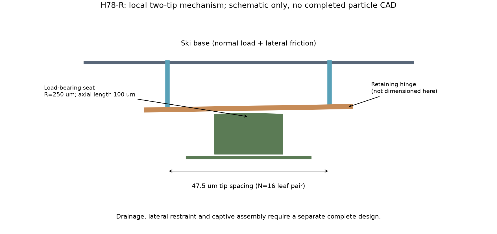
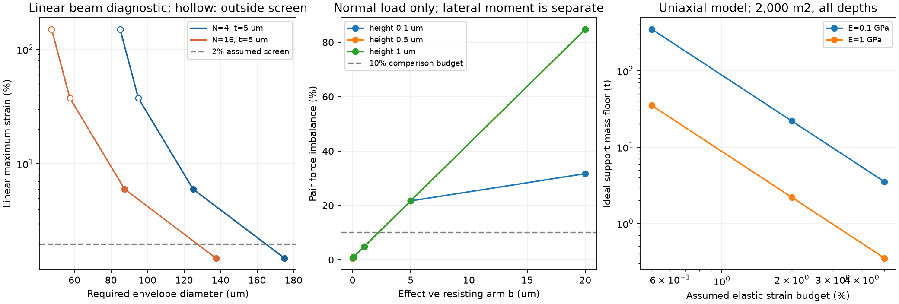

# 多方向探索第78巡：支持ばねの実寸制約と揺動する荷重分配

2026-10-09 / Codex / [回覧板](../回覧板.md) / [再現資料](荷重均し支持の寸法と揺動分配検証_20261009/README.md)

**第77巡の仮の支持ばねを実寸へ戻して反証し、浅い受け面で法線荷重を受け、少数の揺動部で接点間の荷重を分けるH78-Rを追加した。** 同時に、滑走方向の力がこの分配を崩す条件も数値化した。雪状結晶の合成や滑走感を実証した成果ではない。物理試験0件、成功確率未算定のまま。592計算行・28数式照合を実証回数や90％成功へ読み替えない。

## 1. 支持ばねを小さな寸法に収める条件

第77巡の元接点群31.416mN、支持合成20,000N/mを継承。16分割なら各接点1.9635mN、1,250N/m、支持変位1.5708µm。接点の50℃測定値ではなく比較用の仮定である。

| 支持方式 | 同じ支持定数へ寸法を合わせた例 | 判定を変える点 |
|---|---|---|
| 硬い円柱 | E=1GPa、長さ250µm、半径9.974µm | 固定‐自由の細長柱模型でEuler座屈荷重は必要荷重の0.156倍。線形支持として使えない |
| 軟らかい短柱 | E=0.1GPa、長さ50µm、半径14.105µm | 軸ひずみ3.14％、仮μ=0.1の横力を入れた線形外縁ひずみ7.60％。短柱なのでEuler比だけで安全判定しない |
| 固定‐案内梁4本 | E=1GPa、長さ25µm、厚さ5µm、幅39.063µm/本 | 名目最大ひずみ3.77％。2.5µmストロークでは6％。必要外径87.5µmで元のピッチ47.5µmに入らない |

数値は成立した製品寸法ではない。座屈後・大ひずみ・非線形粘弾性へ線形式を延長して性能予測に使わない。短柱や薄板をさらに調整する場合も、50℃での回復性、5時間級の保持、疲労、横荷重が必要になる。

また、共通の剛体土台を柔らかいばねで上下させるだけでは、接点同士の高さ差は変わらない。本計算の16接点・一つだけ0.5µm高い例では、共通ばねを2,000〜200,000N/mへ変えても高い接点の荷重割合29.57％は同じ。回転や弾性基材の変形による分配は別問題である。

## 2. 別の切り口：柔らかく潰す代わりに荷重を振り分ける

H78-Rは、丸い滑走先端のうち2個を局所的な揺動腕で支え、腕の下の曲面へ法線荷重を渡す構想。保持用の薄いヒンジに全法線荷重を掛ける方式は採らない。滑走接点・法線を受ける面・位置を保つヒンジ・横力の経路を分ける。

機能図であり完成粒の製造図ではない。横の接点間隔47.5µmと受け面の独立計算条件を示す。保持ヒンジ、横力を受ける部位、捕捉・抜け止め、全粒の配置は未設計。縦の描画寸法を後述の有効高さhの完成設計値として使わない。

### 2接点だけの荷重分配

16分割の末端1組に3.927mNが来ると仮定し、2先端の高さ差0.5µm、保持ヒンジの回転剛性2×10⁻⁹Nm/rad、水橋5個の仮抵抗を置いた。bRは抵抗モーメント/組荷重を長さに換算した量で、支点半径や摩擦係数ではない。

| 仮のbR | 高い先端／低い先端の荷重割合（その組内） | 荷重差/組荷重 |
|---:|---:|---:|
| 0.1µm | 50.51％／49.49％ | 1.02％ |
| 1µm | 52.40％／47.60％ | 4.80％ |
| 5µm | 60.82％／39.18％ | 21.64％ |
| 20µm | 92.40％／7.60％ | 84.79％ |

この同じ2接点模型を動かさず固定すると、高い側だけが荷重を支える。揺動で改善できる条件を示した一方、抵抗が増せば効果は失われる。**第77巡の16接点全体の荷重分布と、この末端1組の割合は比較母数が違う。** 上位の機構が各組へ均等に荷重を渡すことも、16個全体の平衡も未解決。

水橋は半径10µm、表面張力0.0679N/m、腕25µmという仮の滑らかな水橋診断。泥・塵・凍結・接着・粘性抵抗は含めず、実際の濡れた機構のbRを測る必要がある。

### 横力の経路を浅くする

滑走方向の力μWとその反力が高さhだけ離れればμWhのモーメントが生じる。支点抵抗、水橋、ヒンジ反力にこれを足した保守的な予算を計算した。

N=16、bR=1µm、仮μ=0.1、回転角2°以下、上記のヒンジ・水橋条件では、**荷重差を組荷重の10％以内に収める保守的なトルク条件はh≤12.21µm**となる。h=10µmなら上界9.07％、25µmなら上界15.38％。後者だけで実際の偏りが必ず15.38％になるとは言えない。回転角・接触維持・各モーメントの向きを含む完全な運動解ではない。

hは粒全体の高さではなく、接線力と反力の間の有効距離。法線荷重だけの52.4％／47.6％を、そのまま滑走中の性能と呼ばない。浅い横力受けを加えると、その摩擦・引掛りが別の問題になるため、同時に検証する。

受け面も点で受けず、曲率250µm・軸長100µmの仮の線接触を比較した。E*=0.5GPa・組荷重3.927mNなら接触半幅5µm、ピーク5MPa。bR=1µm例の回転約0.585°では幅方向の計算余裕約2.45µm。ただし有限厚さ・端効果・受け面同士の干渉・材料限度は未確認で、5MPaは安全認定値ではない。

## 3. 材料を柔らかくすれば安くなる、とは限らない

一軸線形材料が弾性エネルギーを蓄える方式に限定すれば、支持体積にはV≥Fδ/(Eεlim²)という容量の下限がある。分割数を増やしても合計W0δ/(Eεlim²)は減らない。

2,000m²、450mm床、仮粒数3.117691兆、6先端/粒が独立支持を持つ場合：

| 仮のE・弾性ひずみ枠 | 支持に必要な有効材料量の下限 | 仮500円/kg・歩留まり80％の原料分 |
|---|---:|---:|
| 1GPa・0.5％ | 35.08t | 約2,192万円 |
| 1GPa・2％ | 2.19t | 約137万円 |
| 0.1GPa・5％ | 3.51t | 約219万円 |

ひずみ枠は実材料の50℃許容値ではない。この下限は多軸材料・非線形材・揺動運動へ適用する普遍的な制約ではない。既存骨格の体積を使えれば全量が追加材料になるわけでもない。複数の先端が支持体積を共有する構造なら再集計が必要。

揺動案でも安価とは未確定。N=16の末端バーだけを幅20µm・厚さ10µmとして数えると約1.35t、仮原料分約84万円となるが、これは強度を満たした断面ではなく体積例。支点・ヒンジ・横力受け・抜け止め・製造・検査・摩耗交換は別。完全な二分木を全粒へ作るなら約281兆節点となり、個別組立を前提に採算を示せない。一体成形・連続転写で動作と捕捉を作れるかが必要条件。

20,000m²なら上記物量・原料費は10倍。税抜仮原料費と、整地設備等の税込2億円枠、材料全体・工場・全造成を混同しない。

## 4. 別分野から借りる部分と、借りない部分

- 微細繊維の原著は、圧縮とせん断が変形を連成させることを扱う。今回の線形柱をそのまま大変形へ外挿しない理由として参照した。[Liuら2008](https://pmc.ncbi.nlm.nih.gov/articles/PMC2607426/)
- 軟らかい繊維接点では始動時の力のピークと定常滑りが異なる。小さい定常摩擦だけで材料を選ばない。[接点コンプライアンス研究2013](https://pmc.ncbi.nlm.nih.gov/articles/PMC3645428/)
- 基材の変形や傾きは荷重分担を変える。共通土台の上下移動を計算した本巡だけで、実基材の弾性相互作用を再現したとはしない。[Baccaら2016](https://www.sciencedirect.com/science/article/abs/pii/S0022509616301508)
- てこで荷重を配るwhiffletree自体は既知の機構。鏡支持の原理から借りるが、微粒の量産や雪状滑走の成功を示す資料ではない。[NASAの支持方式記録](https://ntrs.nasa.gov/citations/20120007482)

直接取得が制限された原著は、一次サイトの検索収録本文・要旨で確認した範囲を[出典記録](荷重均し支持の寸法と揺動分配検証_20261009/sources.json)に明記した。全文を取得・図表照合したとは扱っていない。

当面の比較は、H77-Sの独立支持、H78-Rの局所揺動、低せん断結晶材料、粒内の支持体積共有。どれか一つへ採用を固定しない。暖地噴霧結晶化H68-A、結晶面を覆わない裏面結合、濡れ固着を減らす開放構造も継続する。工場成形やてこの成立を新雪結晶の生成成功へ加算しない。

## 5. Claudeとの共有と次の検証

開始・公開前確認のmainはae463e8ebcf16ef02fd23369d1398b4081216139。Claudeの[物性照合台帳](../調査台帳/物性値照合_自律ループv2v3.md)は第77巡から変更なし。[第40巡](GPT回答_多方向探索第40巡_50度クリープと経時変化を踏まえた枝の再設計_20261009.md)の50℃クリープ課題も継承し、仮のE・ひずみ枠を実測値で置き換えていない。Claudeのv3元コード・全成果・稼働・受領は未確認。

[独立検証依頼](荷重均し支持の寸法と揺動分配検証_20261009/claude_handoff.md)では、受け面の圧力、実物のbR、横力の有効高さ、全接点の平衡、支持体積の共有、量産の一体化を優先する。[7件の未実施試験仕様](荷重均し支持の寸法と揺動分配検証_20261009/test_plan.json)を収録した。

新雪圧雪との同一装置比較による板の走り・初動・エッジ支持・短い切削破断・沈み込み・振動が必要。450mmの全深度で300mm削れ後も維持し、R39保持構造は削れ代と余裕の下に置く。雨後は高さだけでなく滑走機能が60分で回復するか、冬は雪と固着し界面水が溜まらないかを確認する。油・塩・フッ素・シリコーン潤滑、現地冷却・強酸処理は追加しない。人体・自然環境への安全は完成品・摩耗粉・流出液で別に評価する。

[式と境界](荷重均し支持の寸法と揺動分配検証_20261009/model.md)・[再計算](荷重均し支持の寸法と揺動分配検証_20261009/reproduce.py)・[結果](荷重均し支持の寸法と揺動分配検証_20261009/summary.json)
