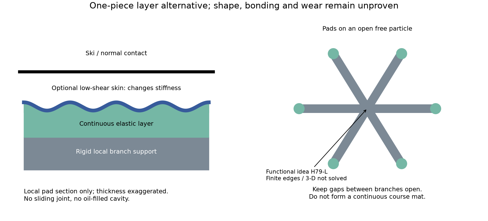
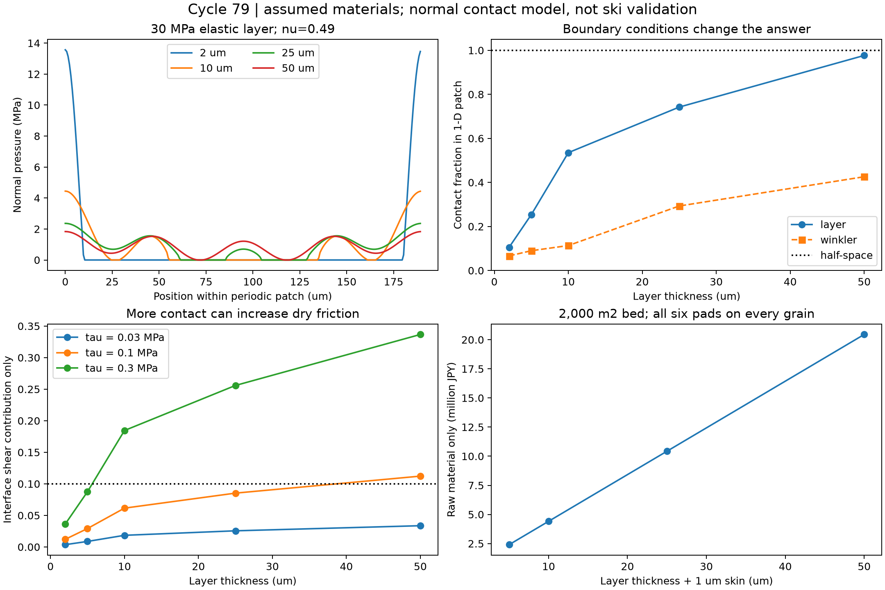

# 多方向探索第79巡：可動部を省く弾性層と滑り抵抗の交換条件

2026-10-09／Codex／基点 main：9547993e3fe089afde054334b1161ed050c8faac

**粒子ごとの微小関節を増やす方向から離れ、開放粒の局所支持面を連続した弾性層で覆うH79-Lを比較した。** 個別組立を省く可能性はあるが、薄くすれば安く滑る、厚くすれば均等に支えられる、という単純な設計では成立しない。今回、層厚・接触面積・必要な界面せん断抵抗・全粒子の加工面積を同じ条件へ接続した。

物理試験0件、実物成功確率は未算定。30数式・数値照合、479比較行、1,280描画用標本、2図、8未実施試験仕様を保存する。計算の収束や条件通過率を成功率90％へ読み替えない。Claudeの公開物性台帳は第78巡から変更なし。v3の全結果・元コード・稼働・今回の受領は確認していない。

## 1. 今回残す発明候補：開放骨格＋少数の連続弾性面

H79-Lは、自由な枝付き粒の太い支持部に弾性層を一括形成し、その上の接触相を別に選ぶ構想。コース表面へ固定マットを敷く方式ではない。枝間を膜でつながず、粒全体の開放性・エッジによる短い解放は従来の骨格・接続案へ受け持たせる。図は機能配置で、完成粒のCADや雪結晶の成長実証ではない。

|切り口|今回の扱い|限界を越えるための条件|
|---|---|---|
|独立した微細ばね|第78巡の寸法・座屈・材料量を継承|仮のばね定数だけでは採らない|
|揺動支点H78-R|比較候補として残す|濡れ・塵・横力と膨大な可動部の量産が未解決|
|連続弾性層H79-L|今回の新しい比較候補|支持部を一括形成。厚さ、界面摩擦、剥離・動的物性が採否を決める|
|低せん断の結晶接触相|弾性層の表面材料として別途比較|結晶という名称から低摩擦を推定しない。厚さ・摩耗・濡れ後の値が必要|
|長い周期の高さ差を骨格側で減らす|第70・75巡の連続成形／柔軟根元との融合候補|本巡は残る高さ差を感度計算しただけ。整地で所定の微小公差になるとはしていない|
|温暖噴霧で構造を生成|独立経路として継続|工場でフィルムを作れることは、屋外30℃以上での噴霧結晶化を証明しない|

## 2. 同じ材料でも、厚さと裏側の拘束で荷重分布が変わる

剛体へ接着した弾性層の応答式を使い、圧力が負にならない接触領域を計算した。基礎式は既知の弾性理論で、新理論の発明とは呼ばない。[S1：層の応答式](https://www.cambridge.org/core/journals/journal-of-fluid-mechanics/article/regimes-of-soft-lubrication/2198767B3740A49ED7CB55CC3F165053)、[S2：法線・接線連成の原著](https://arxiv.org/html/2006.16133)。閲覧できた範囲と式の採用箇所は[sources.json](連続弾性層と接触面積の成立条件_20261009/sources.json)に記録した。

仮E=30MPa、ν=0.49、周期190µmの局所面に、47.5µm周期と190µm周期の凹凸を各振幅0.25µmで重ねた。平均圧力0.870MPaは前巡の仮荷重を局所面へ割り当てた値で、スキー床全体の平均ではない。奥行き一様の平面ひずみ模型であり、有限粒子の三次元形状・実測表面ではない。

|層厚|局所面の接触率|最大法線圧力|圧力/E|計算から分かったこと|
|---:|---:|---:|---:|---|
|2µm|10.5％|13.57MPa|0.452|薄さで強く拘束。線形模型の数値を実物性能へ採用しない|
|10µm|53.5％|4.44MPa|0.148|圧力集中は低下するが、線形性を要確認|
|25µm|74.2％|2.36MPa|0.079|法線支持の比較用試作点。摩擦・有限縁は未解決|
|50µm|97.7％|1.83MPa|0.061|接触が広がる一方、材料量と界面摩擦の負担が増す|

圧力/Eや変位/厚さを0.1と比較するのは診断であり、材料の安全限界ではない。最大内部ひずみ・強度・疲労を計算したわけでもない。

25µmの例を半無限に厚い材料として近似すると接触率100％・最大1.69MPa、局所ばねの集合で近似すると29.3％・7.10MPaとなった。**柔らかさを表す一つの数字では、同じ接触を再現できない。** 半無限体と局所ばねは極限・近似との比較であり、どちらかを安い材料として選べるという意味ではない。[33接触条件](連続弾性層と接触面積の成立条件_20261009/contact_results.csv)

128／256／512点で確認し、25µmのピーク圧力は約2.3624／2.3626／2.3626MPa。これは数値解の確認で、実験との一致ではない。

## 3. 荷重を均すほど滑る、とは限らない

一定の界面せん断抵抗τを仮定した診断では、界面摩擦の寄与はµ=τ×接触率/平均圧力となる。層厚25µmでτ=0.03／0.10／0.30MPaなら約0.0256／0.0853／0.2558。摩擦の仮の全体目標0.1に対し他抵抗へ0.02を残すなら、**この条件のτは約93.8kPa以下**が必要となる。

これは既存樹脂・結晶の達成値ではない。圧力依存のせん断、粘弾性、掘り起こし、濡れ付着、始動摩擦を別に測る必要がある。硬い雪の研究でも、接触・遅延回復・表面の破壊が区別されている。−6℃の十分焼結した雪の結果を、新雪圧雪や50℃の樹脂へ直接移さない。[S3：Theileらの原著](https://link.springer.com/article/10.1007/s11249-009-9476-9)

横力も無視できない。S2の応答式で仮µc=0.1とすると、25µm層の法線・接線の核の寄与比は47.5µm周期で約0.0036、190µm周期で約0.135。10µm層・190µm周期では約0.270。これは摩擦係数でも圧力誤差の割合でもないが、長い周期について法線だけの結果で設計を確定できないことを示す。[90条件の診断](連続弾性層と接触面積の成立条件_20261009/coupling_diagnostic.csv)

**融合案は、細かな凹凸への追従を局所層へ、粒同士・支持面同士の高さ差への対応を開放骨格へ分けること。** 例えば10µm層で190µm周期の仮振幅を0.25から0.05µmへ減らすと、最大法線圧力は4.44から2.84MPaへ下がる。ただし50nmの残留振幅を大量生産や整地で実現した証拠はなく、製造公差として要求すれば費用が増え得る。[8比較](連続弾性層と接触面積の成立条件_20261009/scale_separation.csv)

## 4. 材料と工程を具体化する際の分岐

下層の比較材は、ポリエーテル系TPU、PEBA系、現行骨格材の同材一体層を候補とする。いずれも50℃の完成品性能を認定したものではない。

- **ポリエーテル系TPU：** 湿潤環境を考える下層の比較材。メーカー資料は化学構造・温度・媒体で耐性が変わると説明している。耐加水分解の一般説明だけから、屋外寿命や摩耗粉の安全性を決めない。[S6](https://solutions.covestro.com/en/highlights/articles/theme/product-technology/chemical-properties-tpu)
- **PEBA系：** フィルム・共押出の工程比較材。メーカーは10µmフィルムと、ポリエーテルTPU等へのオーバーモールドを記載する。しかし190µm角の6面を持つ開放粒の量産は示していない。[S4](https://hpp.arkema.com/en/product-families/pebax-elastomer-family/pebax-processing-guidelines/)
- **物性の混同を避ける：** 4033 SP 01ページの調湿曲げ弾性率77MPa・融点160℃を、今回のE=30MPaや50℃動的弾性率に置き換えない。ページには新版の案内もあり、銘柄確定・発注はしていない。[S5](https://hpp.arkema.com/en/products/product/f/spa_hpp_PebaxPellets/p/pebax-4033-sp-01/)

表面に硬い低摩擦相を載せる場合、膜の曲げ剛性が下層の追従を妨げる。仮下層E=30MPa・10µm、周期47.5µmに、仮E=1GPaの1µm膜を載せた板模型では、追従性は約99.57％残る。一方3／5µmでは約89.5／64.8％という線形外挿になるが、この二つは厚さ/波長の薄板診断を外れる。厳密な複合層解を行わず、その数値で膜厚を採用しない。[72条件](連続弾性層と接触面積の成立条件_20261009/skin_stiffening.csv)

**メーカーの10µmフィルム実績は、1µm保護膜の量産・耐摩耗の証拠ではない。** まず膜なし同材層、薄い接触相付き層、厚い耐摩耗層を同時に比較し、必要なτを出せる最小構成を選ぶ。表面だけ良くして摩耗直後に高摩擦の下層が出る案は採らない。

工程候補は、工場で連続した骨格用材へ層を形成→局所形状を付与→開放粒へ分割する流れ。第70巡の連続成形と接続できる可能性があるが、切断面・6面配置・層剥離・回収再生は未設計。必要な設備は乾燥供給、共押出／塗工、形状付与ロール、分割・分級、捕集、厚さ・摩擦・剥離の検査であり、装置見積もりは未取得。

5m/sで47.5µm／190µmの凹凸を通過する周波数尺度は約105／26kHz。実際の変形には複数の時間尺度がある。低速の室温弾性率だけでは、滑走と4〜5時間保持の両方を評価できない。

## 5. 可動部を減らしても、加工面積は大きい

2,000m²・450mm床、仮粒数3.117691兆、6面/粒、各190µm角を全粒へ配置すると、処理する局所面の合計は**約67.5万m²**になる。表面の一層だけを数えた費用ではない。

|下層＋仮1µm表面層|仮密度950kg/m³での完成層量|仮500円/kg・歩留まり80％の原料分、税別|
|---|---:|---:|
|10＋1µm|約7.06t|約441万円|
|25＋1µm|約16.68t|約1,042万円|
|50＋1µm|約32.72t|約2,045万円|

価格・密度・歩留まりは仮定。銘柄価格、接着材、骨格、設備、電力、成形、検査、廃棄、施工、交換は含まない。既存骨格の材料を置換できる部分は追加質量を再計上する。20,000m²では上記の10倍。[材料量・原料分](連続弾性層と接触面積の成立条件_20261009/material_cost.csv)

幅1m、速度5m/min、稼働率70％、面積歩留まり80％なら約4,020時間。20m/minでも約1,005時間。**一括成形は関節の個別組立を省く方向だが、量産費ゼロにはならない。** これは6面の形成を平面工程へ換算できると仮定した能力計算で、実際にそのラインで製造できるという保証はない。[加工時間](連続弾性層と接触面積の成立条件_20261009/coating_throughput.csv)

税込2億円の仮枠は引き続き整地設備・限定土木用。今回の原料分から、材料工場・全面造成まで2億円以内に収まるとは判断しない。

## 6. 本来の目的に戻した未実施試験

共通条件は気温30℃以上・表面50℃、約30°、9〜17時、4〜5時間ごとの整地、日中閉鎖約60分、450mm機能床・300mm削れ代。R39保持材は削れ深さ＋余裕より下。油・塩・フッ素・シリコーン潤滑、現地冷却、強酸処理、連続散水を成立条件にしない。

1. **同じ板での摩擦：** 完成面に対し乾燥・濡れ・雨後の始動／定常／停止を測り、τ0・圧力依存項・粘弾性抵抗を分離する。94kPaは25µm模型の診断値で、雪感の合格基準そのものではない。
2. **50℃の時間依存：** 低速保持から凹凸通過帯域までE'・損失・回復を測る。5時間保持後にも層厚・接点位置・剥離を確認する。
3. **完成粒の力学：** 有限縁・三次元・法線＋接線を含む実形状を測定・解析し、裸の骨格、H78-R、H79-Lを同条件で比較する。
4. **雪との比較：** 新雪圧雪を対照に、貫入、エッジ横支持、ピーク後の短い解放、振動、跳ね返りを測る。硬い焼結雪だけを対照にしない。
5. **雨後60分復旧：** 排水→低損傷の解離→異物捕集→再配材・圧密後に、摩擦とエッジ応答まで復旧したか測る。形状が平らになっただけでは合格にしない。
6. **冬の接続：** 雪との境界せん断、融雪水の滞留、凍結閉塞、底面滑り、自然地面より余計な融雪がないか比較する。膜を枝間へ張らない設計でも実証は必要。
7. **完成品安全・損失：** 摩耗粉、溶出、皮膚・吸入等の曝露、環境放出を完成品で評価する。食品用途や原料名だけで人体無害と認定しない。
8. **製造と寿命費：** 層厚分布、欠陥・切断面、接着、再生回数、交換・回収率を測って、全深度・全期間の費用へ戻す。

詳細な対照と記録項目は[test_plan.json](連続弾性層と接触面積の成立条件_20261009/test_plan.json)。全部未実施。

## 7. Claudeへ渡す判断

今回の採用判断は保留し、**H79-Lを「個別可動部を減らせる工程候補」として追加**する。25µmだけを本命と決めず、10／25µm・膜なし／あり・現行骨格対照の比較へ進める。今の証拠では「雪結晶になった」「雪と同じ滑り」「雨後に泥化しない」「冬に滑落しない」「人体無害」を宣言できない。

Claudeには、(a)有限粒子で法線・横力連成を再計算、(b)50℃の実物性と実ソールのτを根拠付きで提示、(c)長い周期の高さ差を減らす方法の量産公差を確認、(d)6面を一括形成する工程と層寿命費を反証するよう依頼する。受領・返答・合意は未確認。[受け渡し本文](連続弾性層と接触面積の成立条件_20261009/claude_handoff.md)

[計算一式・再現方法](連続弾性層と接触面積の成立条件_20261009/README.md)／[式と限界](連続弾性層と接触面積の成立条件_20261009/model.md)
