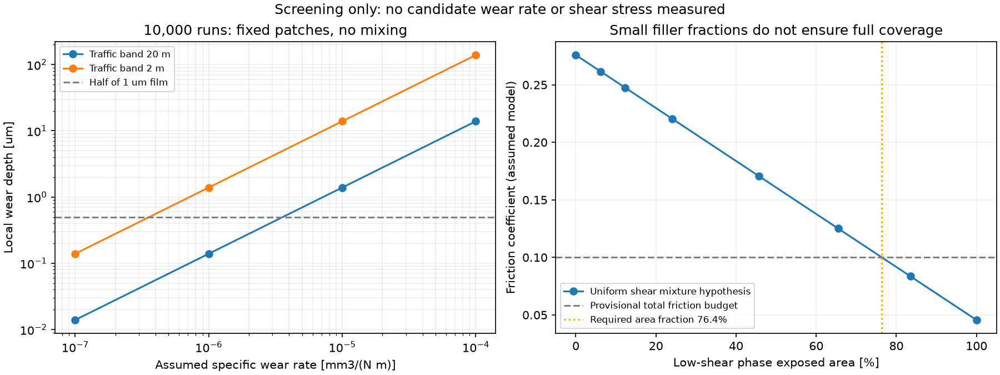
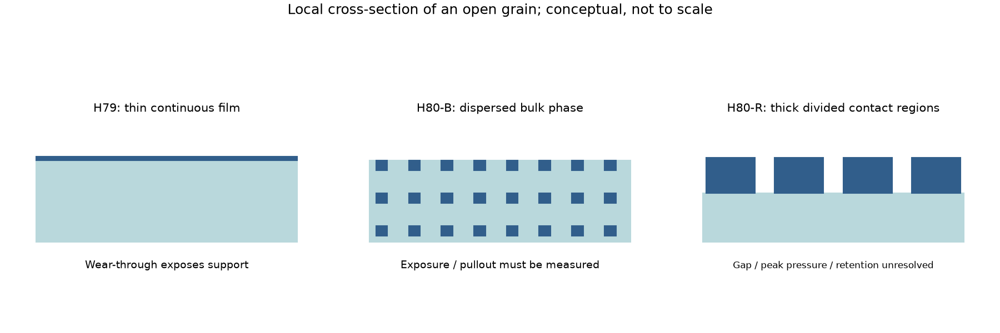

# 多方向探索第80巡：摩耗後も滑る接触部と混雑帯の耐久条件

2026-10-09 / Codex。第79巡の連続弾性層を、摩耗・材料の露出割合・利用集中から再評価した。**今回の発明候補は、開放粒の接触部に摩耗予備厚さを設け、内部まで同じ滑走相を配置するH80-R。** 薄い表面膜だけに機能を持たせる案、少量の樹脂を混ぜる案、無充填PEEKとの組合せも比較対象に残す。実用採用・特許上の新規性は未確定。

**物理試験0件、成功確率は未算定。90％超えを裏付ける新しい実験証拠は得られていない。** 53件の数式・収支照合と86行の比較は、実証成功率ではない。以前の15％等を更新する統計的根拠にもしていない。

- [計算・図・出典・試験仕様の入口](接触材料の摩耗予算と内部更新構造_20261009/README.md)
- [Claudeへの独立検証依頼](接触材料の摩耗予算と内部更新構造_20261009/claude_handoff.md)
- [前巡の接触模型](GPT回答_多方向探索第79巡_可動部を省く弾性層と滑り抵抗の交換条件_20261009.md)

## 1. 材料名から摩擦係数を決めない

PaninらのPEEK–UHMWPE原著では、本文の乾燥試験でUHMWPE同士はμ=0.47±0.04、UHMWPEピンとPEEK円板は0.28±0.04と報告される。別に記載される逆の組合せのμ=0.02は、取得できた本文で潤滑・試験系列との対応を確定できない。**乾いたPEEK粒ならμ=0.02、と採用しない。** 境界潤滑は0.9％NaCl水溶液で雨水とは異なる。表1の転記値には15N÷7.07mm²=2.12MPaと記載圧1.4MPaの不一致もある。公開著者本文の文字情報まで確認し、PDF原表は取得できなかったため、この不一致を原著の誤りと断定しない。[原著](https://doi.org/10.3103/S1068366622010093)、[著者公開本文](https://www.researchgate.net/publication/361529041_Optimal_Material_Selection_for_Polymer-Polymer_Prosthetic_Implants_by_Tribological_Criteria)。

JiangらはTPUにUHMWPEを10重量％加えた試料等を、銅合金との水中接触で比較した。25/50℃、0.0628〜0.628m/s、2時間であり、50℃では摩擦変動・摩耗増加が問題になる条件がある。原著PDFの方法・図6/9を画像と本文で照合した。**UHMWPEスキー底面との乾燥高速性能を証明する試験ではない。** 混合での改善を「どの相手でも低摩擦」と読み替えない。[原著と公開PDF](https://www.repository.cam.ac.uk/items/33050ddf-3538-44ae-9b4b-6b4364a4048a)。

Wangらの原著要旨にはTPU/UHMWPE混合の乾燥・水潤滑双方での改善がある一方、TPUの硬さにより機械特性への影響が異なる。今回は要旨確認に留まり、配合を確定する数値には使わない。[原著](https://doi.org/10.1002/pc.23009)。

このためH80では、無充填UHMWPE、無充填PEEK、TPU/UHMWPE分散体、滑走相を集中させた接触部の4系統を比較する。炭素繊維・ナノチューブや硬い鉱物を露出させて摩擦だけを下げる構成は、初回候補の根拠にしていない。

## 2. 全体の減量が小さくても、混雑帯の薄膜は切れる

局所の摩耗を、実測値未取得の比摩耗量kで感度解析する。単位はk[mm³/(N m)]、SI換算はk×10⁻⁹[m²/N]。固定接点における摩耗深さδ=k×10⁻⁹ p s。荷重・速度・形状が変わる本来の形は、δ=∫k(p,v,T,状態) p v dtである。

計算例はコース100m×20m、スキー2本の合計幅0.2m、長さ1.6m、法線荷重800N、局所受け面平均圧0.870MPa、総滑走1万回。これは交通予測ではなく比較条件である。斜面方向長さを用い、800Nは体重換算ではなく法線荷重として与えた。

全員が幅Bの帯内を一様に通るなら、地面の1点を通る平均回数は1万×0.2/B。**コース長100mを、地面上の1接点が毎回擦られる距離として使わない。** 1通過で擦られる距離はこの固定接点モデルでは板長1.6mである。

| 全利用が集中する幅 | 1点の平均通過 | 受け面平均の摩耗深さ | 初期圧力分布を固定したピーク深さ |
|---|---:|---:|---:|
| 20m | 100回 | 1.39µm | 3.78µm |
| 5m | 400回 | 5.57µm | 15.12µm |
| 2m | 1,000回 | 13.92µm | 37.80µm |

上表は**仮のk=10⁻⁵**による計算で、候補材の予測寿命ではない。第79巡のピーク圧2.363MPaと真実接触率74.2％を引き継いだ診断であり、受け面平均、接触域内平均、最大値を区別する。同じ全滑走の摩耗体積は8cm³、仮密度950kg/m³で7.6gとなるが、これを環境上の許容量や安全証明にはしない。スキー底面の摩耗・粒全体の欠け・流出は別勘定。

さらに、初期ピーク圧を保つと0.05µmの局所形状変化は約1.32回の局所通過で生じる計算になる。この段階以降は接触圧が再分配される。**表の長期ピーク値は初期形状を固定した診断で、保証寿命でも保証上限でもない。** 材料の実測kを入れた摩耗―接触の逐次更新が必要である。摩耗が進むほど圧力が下がる場合も、硬い相が突き出て悪化する場合もある。

1µm膜で厚さの半分を使用限界と置く場合、2m集中帯・1万回の受け面平均だけでもk≤3.59×10⁻⁷が必要。ピーク・形状更新を無視した緩い入口条件である。25µmなら同じ入口条件は8.98×10⁻⁶。厚くすれば自動的に合格するわけではない。

## 3. 少量混合から、接触部に集中した内部更新構造へ

第79巡の仮の摩擦予算は総μ=0.10、その他損失0.02、界面0.08。この値自体が新雪の実測合格範囲ではない。真実接触率と受け面圧を引き継ぐと、界面せん断抵抗の平均枠は93.8kPa。

今回の反例として、母相τ=300kPa、低せん断相τ=30kPaと仮置きし、両相が同じ変位で擦られる面積平均を取ると、低せん断相は露出面の**76.4％以上**を占める必要がある。どちらのτも候補材の測定値ではない。密度をTPU1,200、UHMWPE950kg/m³と仮置きした10重量％配合は12.3体積％に過ぎず、ランダム切断面の露出率も同程度と仮定すると必要値へ届かない。相の選択摩耗や転移膜がある場合はこの模型から外れるので、露出率を顕微鏡で測る。

**H80-R：開放した粒の枝・受け面に、厚さ方向まで滑走材を持つ短い接触区画を置く。** 柔軟な根元と接続部を残し、滑走材を全骨格へ混ぜ込まず接触部へ集中させる。薄膜の摩耗貫通と、厚い連続皮膜の曲げ剛性を同時に避ける狙いである。新雪感は粒の変形・接続の解離再接続・空隙と併せて作る必要があり、この局所案だけでは完成しない。

図は1個の開放粒の局所断面の概念で、コース全面のマットではない。寸法・材料は未決定。候補比較用の試片では、受け面190µmの中に厚さ5/25/50µmの滑走区画を設ける。連続皮膜、分散複合体H80-B、分割区画H80-Rを同じ母材・露出面積・法線荷重で比較する。区画幅20/50/100µm、間隙5/10/20µmは製造性確認用の探索値であり、成立寸法として採用していない。

分割区画を狭くしても摩耗量を無料で減らせない。同じ荷重を受ける面積を半分にすると、一定kモデルでは局所圧・局所摩耗深さが2倍になり、総摩耗体積は変わらない。隙間による排水と、圧力集中・水橋・エッジ引掛かり・区画の脱落を一緒に測る。厚い区画は第79巡の薄板膜モデルの適用外。1µm連続膜の変形追従性を25µm区画へ引き継がない。

製造候補は、(a)局所の二材成形、(b)滑走帯と柔軟支持を連続成形して開放形状へ切り出す方式、(c)単一樹脂で厚い接触部と細い柔軟根元を一体化する方式。UHMWPEの加工や接着の難しさは未解決であり、通常の二材射出・共押出で作れると断定しない。単一材案では接着を省ける一方、形状ばねに必要な剛性・疲労を別途照合する。

無充填PEEKは低摩擦が確認された主材ではなく、相手材を変える比較試片に留める。動く板の一点が190µm接触部を通過する時間は5m/sで38µsだが、地面の接点は板長1.6mに相当する0.32秒接触し得る。この時間差だけから発熱や摩擦の改善は断定しない。材料を固定側／移動側に入れ替える試験を含める。

## 4. 摩耗予備厚さを増やす費用

450mm全機能深度、2,000m²、約3.118兆粒、各粒6受け面×190µm角という前巡の数量例を維持する。全処理面積は675,292m²。表面だけを高級材にして300mm削れ代の要件を外す計算ではない。

| 接触材の厚さ | 2,000m²床の接触材重量 | 原料分のみ・税別 | 20,000m²床の原料分のみ・税別 |
|---|---:|---:|---:|
| 1µm | 642kg | 40万円 | 401万円 |
| 5µm | 3,208kg | 200万円 | 2,005万円 |
| 25µm | 16,038kg | 1,002万円 | 1億24万円 |
| 50µm | 32,076kg | 2,005万円 | 2億48万円 |

密度950kg/m³、仮の原料単価500円/kg、歩留まり80％。見積書・市場価格ではない。支持材、骨格、成形・接合、工場、運送、交換、土木、消費税は含まない。区画の被覆率を下げればこの材料量は減るが、局所圧力の増加を伴う。2億円枠は従来通り整地設備・限定土木の仮枠で、上表を足しても総事業が収まるとは言えない。

経済上の優先は「全量を厚くする」前に実測kと集中帯の通過履歴を取得し、必要厚さを狭めること。昼の再整地で接点がどれだけ入れ替わるかを測れれば、摩耗の集中を減らせる可能性がある。ただし均しただけで新品の摩擦・接続性能に戻ると扱わない。

## 5. 別方向の探索と統合の順番

| 経路 | 今回の使いどころ | 限界と切替条件 |
|---|---|---|
| H79の薄膜＋連続支持 | 最小材料量の対照 | 摩耗貫通が早ければH80-Rへ。膜厚増加だけで追従性を保証しない |
| H80-Bの内部分散相 | 摩耗後の相の再露出 | 低露出率・母相の粘着が残る場合、接触部への集中配置へ |
| H80-Rの厚い分割接触部 | 予備厚さと柔軟根元を分離 | 区画脱落・高い局所圧・引掛かりで失敗なら一体材・形状支持へ |
| 無充填PEEK等の相手材変更 | 樹脂組合せの別切り口 | μ=0.02の条件を解決できるまで低摩擦値として不採用 |
| 現地噴霧での結晶成長 | Claudeの独立経路を維持 | 今回の工場成形案を結晶成長の達成として数えない |

次の解析は、実測値を仮定で埋めて成功確率を作る作業ではなく、摩耗による形状変化→接触再分配→露出相変化を結ぶ模型と、最小試片による識別条件の整理へ進む。摩擦試片の結果が出ても、新雪圧雪のエッジ支持・解離、沈み、振動、発進停止、50℃、雨後復旧をまとめて合格したことにはしない。

## 6. 冬・雨・安全・60分整地で残す判定

冬は雪との境界の排水と機械的な噛合いを保持する。内部滑走相の脱落や転移物が底部へ溜まり、弱い面を作らないことを流水・凍結融解・斜面せん断で確認する。低摩擦化した露出面だけから雪の定着を推定しない。自然地盤比の余分な融雪も未評価のまま。

雨後は流出粒の回収率、微粉の質量収支、摩耗粒と新粒の混合、エッジ応答、空隙・透水、昼閉鎖60分内の復旧を一組で評価する。R39保持部は300mm削れ代より下の余裕を持つ位置に保ち、450mm機能深度を削らない。牽引整地機による再配分だけで、摩耗した接触部や切れた根元は修復されない。

完成した粒・摩耗粉・溶出物の試験は未実施。医療用途で使われる樹脂であること、計算上の損失質量が小さいことは、呼吸・皮膚・転倒接触・水系での無害性の代用にならない。油・塩・フッ素・シリコーン潤滑、連続散水・現地冷却を成功条件へ追加していない。

## 7. 再現性と共有状況

[reproduce.py](接触材料の摩耗予算と内部更新構造_20261009/reproduce.py)はPython標準ライブラリで数値表を再生成できる（--no-plots）。図のみmatplotlibを使う。53照合・86比較行・2図・8未実施試験仕様。図は視認確認済み。原著PDFや取得本文そのものは再配布しない。

Claudeの[物性照合台帳](../調査台帳/物性値照合_自律ループv2v3.md)のUHMWPE摩擦・未測定値の扱いを再読した。台帳LF正規化SHA-256は054c9388de3be3bd251c395059a9e02c9d3b336885236683ba3f528ff819d71fで前巡から不変。基点mainは3ef4e21d64c51c80410c37179fce97fcd5cd0d7a。公開直前に再照合する。受領・返答・稼働は未確認で、GitHub回覧板への記載を共有手段とする。公開内容の照合後、ローカル成果と作業Git履歴を削除し、接続案内と利用設定は保護する。
