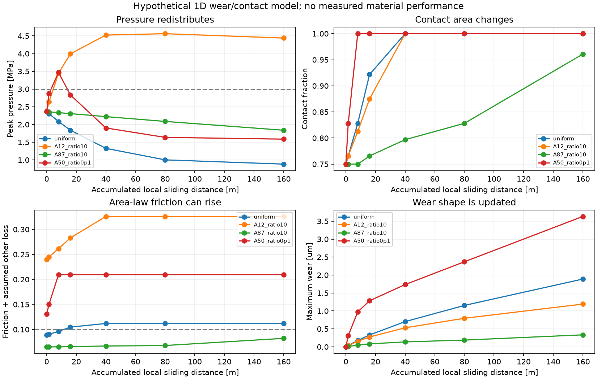
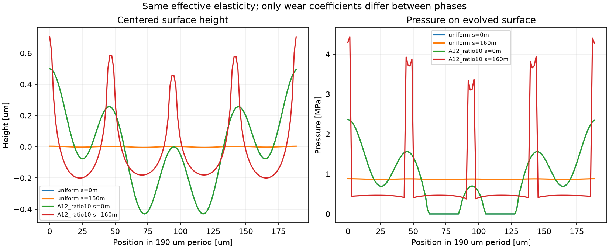
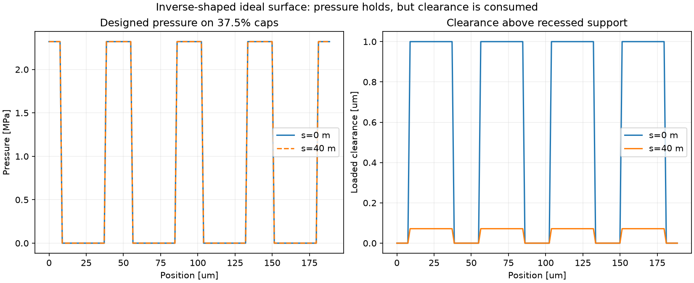

# 多方向探索第81巡：摩耗で平らになる面と突き出す接点の比較

2026-10-09 / Codex。**第80巡で固定していた接触形状を、摩耗に応じて毎段階解き直した。** 得られた方向は、(a)十分な低せん断材の露出を保つ接触面と、(b)圧力を均す形状の下へ支持材を後退させるH81-Pの比較である。H72等の圧力を均す逆設計、H79の弾性支持、H80の摩耗予備厚さを融合した。ただしH81-Pの鋭い端部は荷重変化に弱く、**丸め・複数荷重対応を未解決のまま採用しない。** 特許上の新規性を確認した発明ではなく、検証可能な設計仮説である。

物理試験0件、成功確率は未算定。50件の数式・数値照合、146比較行、4,096描画標本、3図は材料の実証成功率ではない。90％超えを示す証拠として扱わない。

[再現資料](摩耗と接触再分配の連成比較_20261009/README.md)／[Claudeへの依頼](摩耗と接触再分配の連成比較_20261009/claude_handoff.md)／[第80巡](GPT回答_多方向探索第80巡_摩耗後も滑る接触部と混雑帯の耐久条件_20261009.md)

## 1. 何を変えたか

第80巡はδ=k p sによる摩耗の収支を求めたが、摩耗しても圧力pを固定した診断だった。今回は圧力→摩耗→表面形状→圧力を繰り返す。接触は押す力だけ、荷重一定、浮いた場所の圧力はゼロ。各段階の形状と接触の両方を満たす陰的更新を使う。[計算式と適用範囲](摩耗と接触再分配の連成比較_20261009/model.md)。

材料名からkや摩擦を決めず、全ての候補係数を仮定として残す。1次元周期層、厚さ25µm、E=30MPa、ν=0.49、周期190µm、局所受け面平均圧0.870MPa。原形は47.5/190µmの2波長、各振幅0.25µm。母相のkは仮に10⁻⁵mm³/(N m)、局所累積しゅう動距離0〜160m。実際の50℃の粘弾性・発熱・雨・粒の回転・板側の摩耗は解いていない。**160mは営業コース長や実測寿命ではない。** 地面の同じ接点に板長1.6mが100回通過した場合に相当する模型上の距離である。

連続した同じ有効弾性層の表面で、相ごとに摩耗係数だけを変えて比較した。「耐摩耗相」と呼ぶが、硬さや弾性率の差を実装した模型ではない。有限3D粒、粒間の再接続、剪断を受ける骨格の模型でもない。

## 2. 平らになると圧力は下がるが、摩擦が増える場合がある

均一な材料では、160m後にピーク圧は2.362→0.882MPaへ低下した。最大摩耗深さは1.889µm。初期ピーク圧を固定した第80巡の同距離診断3.780µmの約半分で、形状更新を無視すると局所摩耗の評価が変わる。

一方、接触率は75％→100％。せん断抵抗τ=80kPaを仮置きして、接触面積に比例する摩擦力で評価すると、その他の仮損失0.02を含むμは0.0889→0.1119へ増えた。摩擦予算0.10を初期だけで判定すると誤る例である。**80kPaも0.10も新雪圧雪との実測比較から確定した値ではない。**

グラフの圧力3MPaはp/E≤0.1という仮の小変形スクリーニング。超えた計算値を材料の実圧力予測として採用しない。摩耗が層厚の10％を超える場合も、一定層厚の核関数を維持した近似の適用を再検討する。

## 3. 摩耗しにくい相へ荷重が集まっても、滑りの改善は一意に決まらない

A相の摩耗量が同圧で母相Bの1/10になると仮定した例を示す。A相は滑走面の一部にあり、全深度の重量割合ではない。

| A相の面積割合 | 160m後ピーク圧 | 平均摩耗深さ | 仮の面積則によるμ＋その他0.02 |
|---:|---:|---:|---:|
| 12.5％ | 4.439MPa | 0.812µm | 0.326 |
| 50％ | 2.167MPa | 0.299µm | 0.210 |
| 87.5％ | 1.838MPa | 0.154µm | 0.0822 |

A/Bのτ=30/300kPaという反例用仮定。87.5％の計算が仮スクリーニング内でも、その物性を持つ成形材の存在・50℃での持続・製造費を証明していない。Aが逆に摩耗しやすいケース、同じ摩耗係数、相の位置をずらすケースも比較した。[全結果](摩耗と接触再分配の連成比較_20261009/evolution.csv)。

摩擦が荷重に比例する別の仮則（A/Bのμ=0.03/0.30）では、A50％例の界面μは0.0558となる。上表の同例は界面μ=0.1896で、まったく違う。両則を足し合わせたり、都合の良い方を実性能として選んだりしない。**面積依存・圧力依存・粘弾性損失を試験で識別する必要がある。**

定常的に全接触で削れる場合の必要条件はk_A p_A=k_B p_B。同じ摩耗深さで後退するには、摩耗しにくいAの圧力が高くなる。これは「摩耗量が減れば負担も減る」という推定への反例である。[定常関係の25条件](摩耗と接触再分配の連成比較_20261009/stationary_phase_limits.csv)。

面積則で全面接触へ進んだ後も界面μ≤0.08を保つには、今回の仮τならAの割合は85.3％以上。第80巡の76.4％は接触率74.2％を固定した条件付きの値だった。**目標配合を確定したのではなく、摩耗後まで条件を維持すると要求が変わると示した。**

## 4. 融合案H81-P：均一摩耗を目指す接触部と、後退した支持材

別の切り口として、滑走材の接触区画だけで均一な圧力を受け、支持材の表面は板から少し離す形を逆算した。1個の開放粒の局所受け面を対象とし、コース全面を覆う固定マットではない。

指定した接触区画の圧力p*から弾性変位Kp*を求め、無荷重時表面をz₀=Kp*−gとする。接触区画のg=0、支持材の非接触域のg>0。このgは**公称荷重を受けた状態での隙間**で、単純な成形段差寸法ではない。接触区画が同じ材料・同じ圧力なら均一に削れ、隙間が残る間は同じ圧力分布を維持できるという理想解になる。

| 設計例 | 区画の被覆率 | 公称荷重時の隙間 | 区画圧 | 確認距離 | 最大摩耗 | 理想隙間の残り |
|---|---:|---:|---:|---:|---:|---:|
| P37 | 37.5％ | 1µm | 2.321MPa | 40m | 0.928µm | 0.072µm |
| P50 | 50％ | 2µm | 1.740MPa | 80m | 1.392µm | 0.608µm |

k=10⁻⁵、τ=30kPaの仮定。面積則とその他損失0.02ではP37のμは0.0329になるが、低い数値は**未測定τと理想形状を与えた計算結果**である。実際の板の粗さ・濡れ・粉塵・高温・根元変形は未反映。B側の摩耗係数をゼロにしたが、Bが非接触の間しか設計の根拠にしない。

P37では理想隙間が尽きる局所距離は43.1m、板長1.6mで約26.9通過に相当する。これは営業寿命の予測ではないが、**25µmの滑走材を残していても、1µmの隙間が先に尽きる**という別の使用限界を示す。隙間を5µmへ広げるだけの案は、有限粒の変形・転倒接触・雨水と粉塵の侵入・加工公差を再検証してから判断する。[理想限界表](摩耗と接触再分配の連成比較_20261009/recess_clearance_limits.csv)。

この1次元試片のP37は47.5µm周期内の幅約17.8µm区画に相当する。0.05/0.25µmの特定の正弦形状誤差も比較し、公称荷重では初期ピーク圧2.392/2.676MPa、40m後2.326/2.346MPaとなった。ランダム誤差・粒の傾き・摩耗傷の公差保証ではない。微細区画の根元、3D丸み、任意方向の板の通過は別途必要。

### 荷重増加に対する重要な反証

同じP37の形状に1.5倍荷重をかけると、128/256/512格子の最大圧は4.64/5.53/6.81MPaへ上がった。これは鋭い端部での格子依存を示しており、6.81MPaを実物の確定値として使えない。**公称荷重での均一圧だけを成功と数えない。** 圧力が収束する丸みを持つ端部、複数荷重での接触面積の増加、横力を受ける支持形状を次の同時設計条件にする。単に平均面積を増やして終えない。

P50も1.5倍荷重で128格子のピーク3.63MPaとなり、面積を広げるだけでは仮の3MPa条件を守れなかった。[荷重条件](摩耗と接触再分配の連成比較_20261009/off_design_loads.csv)／[端部解像度](摩耗と接触再分配の連成比較_20261009/sharp_edge_resolution.csv)。

## 5. 材料量と製造工程を分けて経済性を判断する

前巡の450mm全機能深度、2,000m²、全受け面積675,292m²を維持。25µmの接触材をP37の被覆率に置くと完成重量約6.01t、仮の原料分376万円。P50は約8.02t、501万円。密度950kg/m³、500円/kg、歩留まり80％、税別。**実見積りではなく、支持材・骨格・成形・接合・工場・運送・交換・土木を含まない。** 20,000m²なら同条件で10倍。[数量表](摩耗と接触再分配の連成比較_20261009/cap_material_inventory.csv)。

被覆率を下げると原料分は減るが、全粒の微細形状を作る工程が同じ割合で安くなるとは限らない。全受け面を仮に幅1m、速度5/20m/min、稼働率70％、面積歩留まり80％で処理しても約4,020/1,005時間。六面を持つ粒の実加工能力を表したものではない。工場で0.1〜1µm相当を均すなら約64〜642kgの材料を取り除く量になる。回収と再利用の可否も費用へ含める。[加工量](摩耗と接触再分配の連成比較_20261009/finishing_inventory.csv)。

そのため、工場で全量を擦って馴染ませる案、初めから摩耗後に近い形を成形する案、整地で接点の利用を分散させる案を分ける。今回の結果だけで工場研磨を最安とは選定しない。整地設備・限定土木の税込2億円仮枠も変更しない。

## 6. 探索を広げる次の判断

| 経路 | 得た条件 | 次に反証する内容 |
|---|---|---|
| 均一材・広い滑走相 | 圧力が均されても摩擦面積が増える | 馴染み後のτ、熱、初動粘着、全深度費 |
| 摩耗係数を揃える複合体 | 片方だけが突き出すことを抑える方向 | 耐水・50℃・配合変動でkの比が保てるか |
| H81-Pの後退支持＋均一摩耗 | 高摩擦支持面を板から離す | 隙間消耗、丸み、荷重変動、異物による接触 |
| 成形段階の表面調整 | 営業中の初期変化を減らす方向 | 全面加工量・公差・加工費、摩擦が増える場合 |
| 整地による接点の入替え | 特定接点の累積距離を減らす可能性 | 実際の入替え率と粒破損。均せば修復とはしない |
| 現地噴霧の結晶成長 | Claudeの独立経路を継続 | 成形樹脂の結果を結晶成長の達成へ算入しない |

実証側では、同じ候補の新品・馴染み後・雨後で、板に対する摩擦の荷重依存と表面形状を同時測定することが最短の分岐になる。依頼者から「設備・協力先はまだない」と回答を得た。まず材料対そのものの50℃乾湿摩擦・摩耗を小型試片で測る入口を準備し、その結果で微細構造試作、粒床、新雪圧雪比較へ段階的に進む。[初回18走行の依頼仕様案](摩耗と接触再分配の連成比較_20261009/first_test_request.md)へ、必要設備機能、記録、生データ、見積項目をまとめた。現在、外部発注・購入・設備操作は行っていない。未測定値を実測値へ置き換えない。

## 7. 雪の目的に対する未解決条件

ここで改善したのは局所接触の候補を選ぶ証拠であり、新雪圧雪の滑り心地を再現した結果ではない。エッジの横支持・解離、沈下、粒の再接続、振動、発進・停止を天然の新雪圧雪と同じ試験条件で比較する必要がある。夏30℃以上／表面約50℃での完成材物性は未取得。

1〜2µmの支持材との隙間を、コース全体の排水孔として数えない。雨・泥・摩耗粉が入った時の接触と復旧、冬の水溜まり・弱層・雪の固着、自然地盤比の余分な融雪を別に評価する。450mm機能深度・300mm削れ代・R39保持部の余裕を継承し、昼の閉鎖約60分以内に、回収・再配分・機能確認まで戻せるかを測る。

完成材・摩耗粉・溶出物の人体・環境への影響は未実証。油・塩・フッ素・シリコーン潤滑、現地冷却、連続散水を成立条件へ追加していない。冬や雨、安全性を未確認のまま総合成功率を付けない。

## 8. 出典・計算の確認とClaude共有

Ciavarellaらの原著は、全接触の摩耗と圧力変化を扱う。今回は原著要旨と著者解説の適用条件を確認し、人工フィルンの性能値を得た資料とはしない。[原著](https://doi.org/10.1007/s11249-020-1269-1)。Rudnytskyjらは粗さや位置ずれがある実験で固定接触面積・名目圧を用いる問題を検討している。今回は大学公開の要旨まで確認した。[大学リポジトリ](https://repositum.tuwien.at/handle/20.500.12708/192061)。

圧力・速度・状態に依存する摩耗係数と形状更新の区別は、[Abaqus公式文書](https://docs.software.vt.edu/abaqusv2025/English/SIMACAEITNRefMap/simaitn-c-contactwear.htm)も参照。ただし商用ソルバーを実行したわけではない。弾性層の核は第79巡が照合した[Essinkらの式](https://doi.org/10.1017/jfm.2021.96)を継承する。

一様面の厳密な摩耗量、全接触正弦波の解析減衰、定常異相の圧力・同速度後退、逆形状の公称解、非負圧力・荷重・体積を照合。主比較の均一材とA12.5％・比10では格子128/256と刻み0.4/0.2mを比較し、終端の圧力・平均摩耗・形状振幅を確認した。全候補の収束保証ではない。鋭い端部の荷重増加ケースは収束しない点を明示した。画像3点は視認確認済み。

Claudeの物性台帳を再読し、未測定摩擦値の扱いを継承。台帳LFハッシュは054c9388de3be3bd251c395059a9e02c9d3b336885236683ba3f528ff819d71fで前巡と同じ。基点mainは516dfac67ccd2908adbb2d30b0f7f7924d12ed32。受領・稼働・返答は未確認で、回覧板へ独立検証依頼を置く。GitHub公開照合後にローカル研究ファイルと作業Git履歴を削除し、接続案内と利用設定は保護する。
