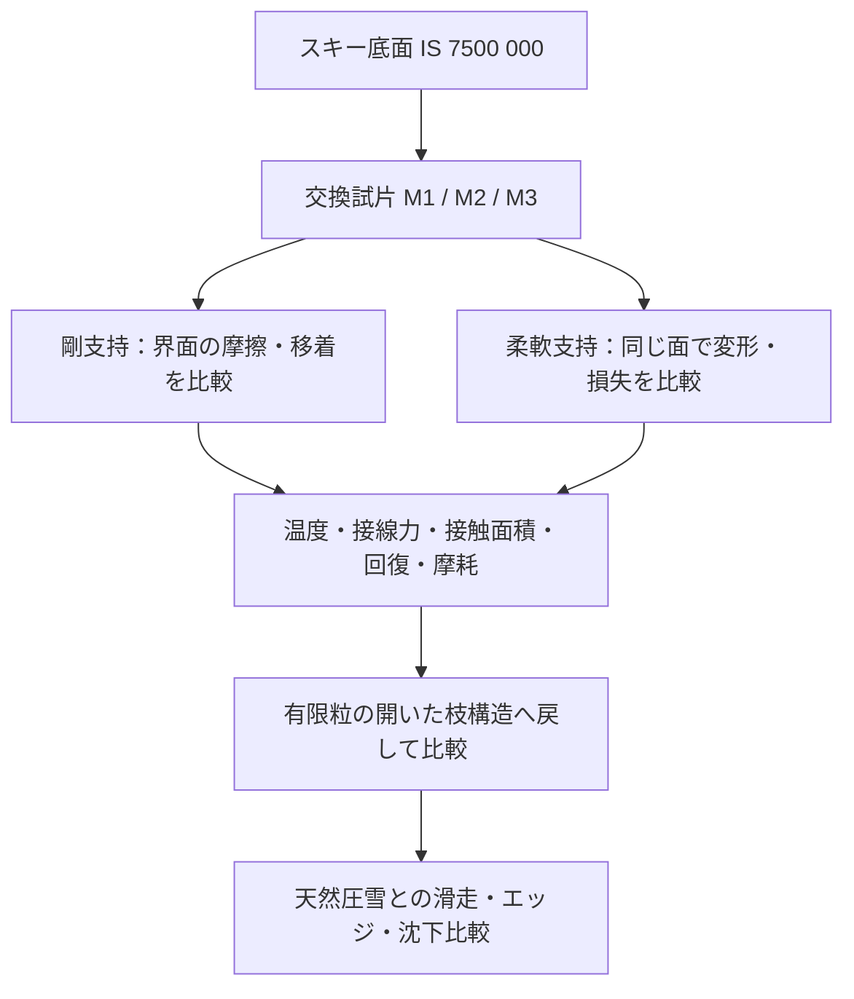

# 多方向探索 第83巡：具体グレードと試片費用から絞る材料構成

2026-10-09 / Codex。設備・協力先はまだないという依頼者の回答を前提に、第82巡の試験案を「どの材料を、どの形で、何個準備するか」まで具体化した。

**今回の成果は、材料の取り違えを防ぐ調達仕様、24走行用の試片割付、板材の切り出し計算、公開価格の部分積算である。物理試験0件、成功確率は未算定。発注・照会・見積取得は0件であり、試験成功や雪状性能を実証した報告ではない。**

[調達・加工仕様](試験材グレードと交換試片の調達仕様_20261009/procurement_spec.md)／[計算と根拠一式](試験材グレードと交換試片の調達仕様_20261009/README.md)／[Claudeへの検証依頼](試験材グレードと交換試片の調達仕様_20261009/claude_handoff.md)

## 1. 材料選定で修正すべき点

| 比較候補 | 今回固定する名称 | 確認できた点 | まだ使えない推論 |
|---|---|---|---|
| UHMWPE | TIVAR 1000 Virgin UHMW-PE natural | HDT Aは1.8MPaで42℃。連続使用温度80℃とは測り方が違う | 「80℃耐熱だから50℃で枝・接点の形を保てる」とは言えない |
| PEEK | TECAPEEK natural、国内Victrex PEEK 450指定 | 日本向けメーカー説明は原料450。国際版は別原料も記載 | 商品名だけで国内原料・添加剤・ロットまで同一とは扱わない |
| 柔軟材 | Elastollan 1185 A 10M000 | polyether TPUの個別データを確認 | 末尾のない1185 A 10や別末尾の物性を混ぜない。無充填条件は未確認 |
| スキー対向面 | ISOSPORT IS 7500 color 000 | 底面用の焼結UHMWPE | 一般工業PE板の摩擦を実スキー底面の摩擦としない |

UHMWPEのHDTと連続使用温度は、荷重・時間・判定が異なる。42℃を超えると全用途で使用不能という意味でもない。今回の問いは、**50℃で押されながら擦られる接触部の変形、回復、摩耗、移着**であり、そこを試験する必要がある。公表摩擦係数0.15〜0.30も鋼との23℃の試験条件で、今回のスキー対向材に転用できない。[メーカー物性表と脚注](https://www.mcam.com/mam/datasheets/PE-TIVAR%C2%AE%201000%20UHMW-PE%20natural_en_US.pdf)

PEEKは国内指定を明確にできる。[日本向けメーカー説明](https://www.ensingerplastics.com/ja-jp/shapes/high-performance-plastics/peek)、[国際版natural](https://www.ensingerplastics.com/en-gb/shapes/peek-tecapeek-natural)。ただし小売SKUとの一致は別確認とする。TPUはpolyetherという分類だけで耐候・湿潤摩擦・添加剤安全性まで採用しない。20％伸長時応力はYoung率ではなく、DIN摩耗体積も今回のArchard摩耗係数ではない。[BASF個別資料](https://download.basf.com/p1/8a8081ec96f843480197313c447b046d/en/Elastollan%25C2%25AE_E_1185_A_10M000)

## 2. 「硬い滑走面」と「柔らかい支持」を分ける

第81巡で仮定した弾性率は30MPaだった。メーカー参考値のUHMWPE 750MPa、PEEK 4,200MPaを、同じ線形等方形状・同じポアソン比に入れる診断では、変形しやすさはそれぞれ**1/25、1/140**になる。これらは室温等の参考値であり、50℃の完成材予測ではない。TPUの弾性率は確認できていないため空欄にした。[計算条件](試験材グレードと交換試片の調達仕様_20261009/model.md)

したがって、摩擦が低い候補へ丸ごと置き換えるだけでは、荷重を逃がす構造を失い得る。次の構造比較を **H83-C：交換できる接触部と回復する支持部** として整理する。

この図の固定治具は材料を切り分けて測るためのもの。完成床を固定マットに変更する提案ではない。粒の枝先へ硬い接触部を載せる場合は、軟らかい根元の疲労、脱落、摩耗後の段差、剥離、粉の回収が別の失敗要因になる。初回は接着剤を露出させない保持方法を施設と決め、接着・熱融着・一体成形の採用は量産工程の比較後とする。

材質の比較だけで砂感は消せない。粒床に戻した段階で、結合・ほぐれ・再圧密、エッジ抵抗の立ち上がりと解放、振動、湿潤団粒化を天然圧雪と比較する。平面試片の低摩擦だけを雪の滑走感の合格としない。

## 3. 初回24走行の準備数と切り出し

前巡の配置確認6走行＋本試験18走行を維持する。本試験は「候補材をピン、スキー材を回転板」とする**仮配置**である。逆配置を選んだ場合は数量・加工費を作り直し、以下の数量のまま発注しない。

| 試片 | 走行に使う数 | ブランク・予備を含めた準備案 |
|---|---:|---:|
| 候補材ピン（3材合計） | 21 | 36 |
| 候補材円板（3材合計） | 3 | 9 |
| スキー材円板 | 21 | 27 |
| スキー材のピン先端用薄片 | 3 | 6 |

1材あたり走行用はピン7個＋円板1枚。追加はピンの乾湿ブランク各1個・予備3個、円板の乾燥ブランク1枚・予備1枚。予備を独立反復のnに加えない。スキー薄片は支持治具に載せるため、4mm径×8mmの中実スキー材ピンを購入する意味ではない。

100×100×10mmの板1枚に、64mm角の円板加工用ブランク1個と8mm角のピン用ブランク12個を配置できる計算を用意した。完成寸法案は円板径60×厚5mm、ピン径4×長8mm。刃幅に相当する隙間は最低3mm、外周余裕も3mm以上を確保する。ただし、**これは平面上の干渉確認であり、加工業者が承認した製作図ではない**。収縮・固定・反り・面出し・公差を含む加工可否は未確認。[座標データ](試験材グレードと交換試片の調達仕様_20261009/cutting_layout.json)

本試験の配置・寸法・組成を確定する前は、予備試験用以外を大量加工しない。とくにM3は「無充填エラストマー」という前巡の条件への適合が未確認で、採用を保留している。

## 4. 費用をどこまで具体化できたか

TECAPEEK板10×100×100mmの公開価格は税別14,980円、税込16,478円。候補グレードとの一致・在庫・注文条件は未確認。1枚で上記の走行用を切り出せる幾何案、円板のブランク・予備を含めて3枚使う保守的な案では税込49,434円となる。加工費は含まない。[小売価格の原ページ](https://www.monotaro.com/p/1719/6208/)

| 算術例 | 試験の基本項目分 | PEEK板の表示価格分 | 選んだ項目だけの小計 |
|---|---:|---:|---:|
| 配置確認6走行＋板1枚 | 50,160円 | 16,478円 | 66,638円 |
| 計24走行＋板1枚 | 200,640円 | 16,478円 | 217,118円 |
| 計24走行＋板3枚 | 200,640円 | 49,434円 | 250,074円 |

すべて税込。試験基本項目は[第82巡](GPT回答_多方向探索第82巡_設備未確保から始める実証と試験費用_20261009.md)のKISTEC公開項目8,360円/条件の算術例であり、今回条件での適用・受託は未確認。**実見積りでも総額でもなく、必要予算の保証や最小額ではない。** 他2材・スキー材・成形・加工・治具・加熱付加・計測・ブランク測定・輸送・報告等は未積算。総額はnullのまま残した。

この小売板価格を原料のkg単価や450mm床全体の施工単価へ外挿しない。2億円枠は従来の整地設備・限定土木の仮枠で、今回の研究開発費や全材料費を含む総事業費へすり替えない。

## 5. 分岐を決める観測

| 得られる結果 | 次に比較する方向 |
|---|---|
| M1が乾湿とも滑り、50℃の残留変形が小さい | 安価な単一材を優先し、枝形状・粒間結合を比較 |
| M1は滑るがクリープが大きい | 同じ滑走面を薄い交換接触部として保持し、支持面積・補強を比較 |
| M2だけが耐久するが高価 | 必要接触部の配置と補修交換率を測る。全面・全深度PEEK化はしない |
| 柔軟材は支持できるが粘着・損失が大きい | 埋め込んだ支持部に用途を限定し、露出面との分離を試す |
| 3材とも湿潤で抵抗・移着が大きい | 粒形状だけの調整を続けず、界面化学・排水・他の無充填系統へ分岐 |
| 平面試片は良いが粒床で砂感・泥化が出る | 接続機構と濡れ凝集を主課題へ戻す。平面結果を成功率に変換しない |

合否線は実際の天然圧雪との比較と用途から定める。従来のμ=0.10などの仮予算を最終的な新雪感の規格にしない。固定治具と有限粒では拘束・熱履歴・接触更新が異なり、その差を測って進める。

## 6. 全体要件とClaudeへの引継ぎ

本巡は成形ポリマーの試験入口を具体化したもので、雪状結晶の形成を証明していない。暖気中の噴霧結晶化、結晶複合材、可逆接続は独立経路として維持する。分子レベルのポリマー結晶性、見た目の枝形、雪の力学・摩擦は区別する。

450mmの機能深さ、300mmの削れ代、R39保持層を削れ代と余裕より下に置く条件は維持する。30°級斜面、9〜17時、4〜5時間ごとの整地、日中閉鎖約60分も継承。雨後の回収量だけでなく、排水・凝集解離・再圧密後の滑走性能を確認する。冬は雪とのせん断接続、滞水・油膜のない排水、自然地盤との融雪比較が必要である。

油・塩・フッ素・シリコーン潤滑、現地冷却、強酸、常時散水を前提にしない。人体・環境への無害性は未証明であり、完成品の添加剤・溶出・摩耗粉・曝露を評価する。食品接触やRoHSの表示で代用しない。

開始時のGitHub mainは96f7739dfd1bf69886841f0f7f5f609d77124354。Claudeの[物性照合台帳](../調査台帳/物性値照合_自律ループv2v3.md)は前巡から変更なし。v3の元コード・全結果・現在の稼働は未確認。今回の[独立検証依頼](試験材グレードと交換試片の調達仕様_20261009/claude_handoff.md)を回覧板に載せるが、受領・返答・稼働は未確認。

再計算では12件の数量・単位・配置・欠測値の照合、14計算行、13個の切り出し矩形、24件の未実施割付を保存した。これらは実験件数でも材料合格率でもない。次の情報価値が高い行動は、仕様に合う施設の受託条件と、正確な材種・表面・加工方法を合わせて照会し、配置確認から実測へ進むことである。照会文案は準備済みだが送信していない。
