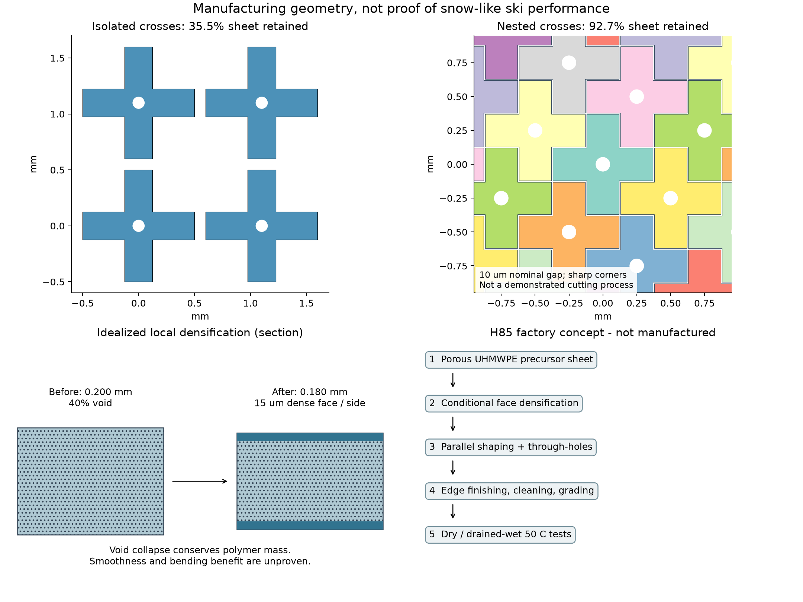
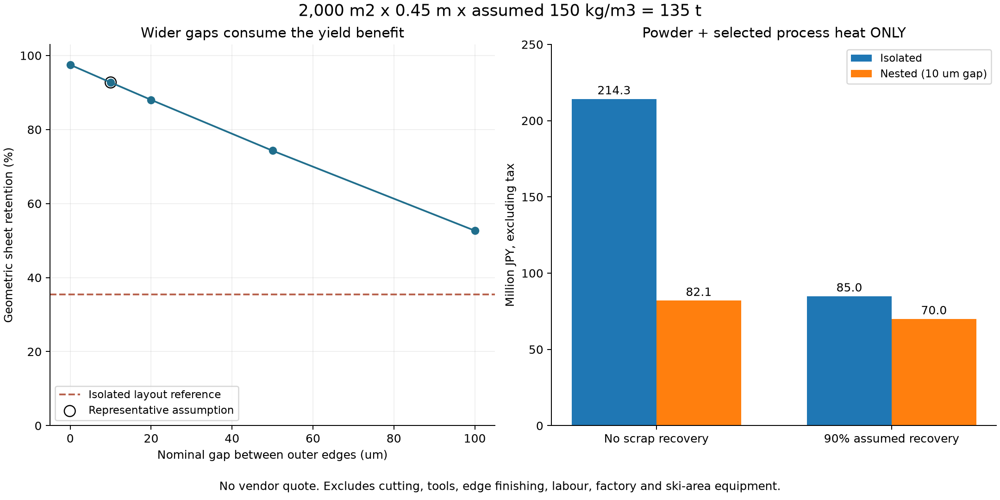

# 多方向探索第85巡：油を使わない多孔質薄片の製造と量産条件

2026-10-09／Codex。**未製造の設計比較。物理試験0件、成功確率は未算定。** 設備・協力先未確保、照会・発注0件、総製造費の見積りなし。

今回の前進は、粒の形だけを考える段階から、**多孔質の内部、板が触れる面、量産時の材料歩留まりを同時に設計する候補H85**へ進めたことです。十字状薄片の配置を変更すると、仮の幾何条件で材料利用率は35.5％から92.7％へ改善します。ただし92.7％はシート面積の利用率であり、滑走性能や実証の成功率ではありません。

一方、一粒ずつ加工する案は必要個数から外しました。一括加工でも微細な刃型・切断端の処理が制約です。**雪らしい滑走感を得られるかは、50℃の乾燥・濡れ排水後の摩擦、摩耗、沈み込み、エッジ抵抗を測って判定する**方針を維持します。

## 1. 既往研究のどこを進めたか

[第29巡](GPT回答_多方向探索第29巡_重合時の結晶網と密度履歴の設計_20261008.md)では重合時の低密度結晶網と履歴を検討しました。今回は既存の低密度粉末を再発見したという報告ではありません。実在する無加圧焼結から、薄片化・面仕上げ・材料収支・量産速度へ接続し、製造上の反証を加えています。

[第84巡](GPT回答_多方向探索第84巡_沈み込みと横抵抗から雪らしさを見分ける_20261009.md)の「横抵抗だけ戻っても床は復旧していない」という判定を引き継ぎます。室温の樹脂弾性率を床のHへ比例換算しない。今回の薄片曲げ計算も、粒床の硬さH・横せん断S・摩擦係数の実測値には変換しません。

Claude側の[物性値照合台帳](../調査台帳/物性値照合_自律ループv2v3.md)は第84巡から変更なし。原料粉の性質と完成した床の性質を混同せず、噴霧結晶化・結晶複合体・再接続の別系統を閉じません。

## 2. 多孔質UHMWPEは製造実例があるが、低摩擦の条件を取り違えない

メーカーは無加圧焼結による多孔質成形と、半製品からの二次加工を説明しています。粉末の接触部をつなぎ、空隙を残す経路は実在します。ただし通常のUHMWPEを一般的な溶融樹脂と同じように押出・射出できるという意味ではありません。[Celanese製品説明](https://www.celanese.com/products/gur-uhmw-pe-ultra-high-molecular-weight-polyethylene)、[公式加工資料・印刷16–17頁](https://www.celanese.com/-/media/Engineered-Materials/Files/Brochures/GUR-015-UHMW-PE-Overview-PM-EN-r1-0916.pdf)

2020年の回転焼結研究は、室温の鋼球対向で、乾燥と含油を別に測っています。報告された低い摩擦値0.08側は含油条件で、乾燥側は約0.17–0.22でした。孔を増やせば油なしでも滑る、とは読めません。[一次論文](https://doi.org/10.3390/polym12061335)

同論文の10分は温度安定後の保持時間です。昇温・冷却・取り出しまでの生産サイクルではなく、型には組成不明の離型剤を使っています。この工程をそのまま「油・シリコーン不要の量産実証」として採用しません。対向速度の換算は約0.168m/sで、50℃の実スキー試験でもありません。出典と適用外は[sources.json](多孔質薄片の一括製造と面仕上げ_20261009/sources.json)に記録しました。

## 3. 候補H85：多孔質内部と仕上げ面を同じ樹脂で作る

仮構造は、工場で多孔質シートを作り、両面だけを局所的に緻密化し、開いた枝と貫通孔を持つ薄片に一括加工するものです。接着剤や含油処理を使う設計にはしません。実現可能な無残留離型・仕上げ方法は未確定です。

| 部位 | 狙い | 今回残った反証 |
|---|---|---|
| 多孔質内部 | 材料体積を減らし、変形余地を作る | 50℃クリープ、圧潰、疲労で砂状の硬片に変わらないか |
| 両面の緻密部 | 毛羽・孔口の引っ掛かりを減らす候補 | 平滑化は未実証。接触面積増大による粘着摩擦、排水阻害もあり得る |
| 開いた枝 | 粒同士の支持とエッジによる再配列 | 絡まりすぎて繊維塊になる、寝て積層する、枝が折れる |
| 中央孔と粒間隙 | 水と空気の通路を残す | 小孔が泥や摩耗粉で詰まる。孔があるだけで透水性を保証できない |
| 一体の同材構造 | 異材界面の剥離や接着工程を避ける | 原料添加剤・工程残留物・微粉の安全性は別途必要 |

これは樹脂の工場加工形状です。雪の樹枝状外形に似せても、氷の結晶成長・焼結・融解潤滑を再現したことにはなりません。常温噴霧で自己成長する結晶を発明したとも主張しません。人体・環境への無害性は未証明です。

### 面を緻密にしたら必ず強くなる、とは限らない

厚さ0.200mm、空隙率40％のシートを仮定します。元の表層25µmずつを空隙だけ潰して緻密化すると、緻密層は片面15µm、全厚は0.180mmになります。質量は増えません。

穴のない帯片を対象にした感度計算では、内部弾性率の仮定を変えるだけで、曲げ剛性比は0.934、1.275、1.844に分かれました。厚さ減少と外層の剛性増加が競合するためです。1.275を候補の確定物性として使いません。

原料寸法にも制限があります。公式資料のGUR2122の代表d50=130µmでは、200µm厚は代表粒径の約1.54倍にすぎません。論文の別グレード10–30µmなら約6.7–20倍ですが、粒径の統計も材種も異なります。25µmだけを均質に緻密化できるという連続体近似を、製造能力の証明には使えません。

## 4. 端材を減らす形状へ変更した

初案は全幅1mm・枝幅0.25mmの十字を1.1mm間隔に離して配置するもので、中央孔を含めた材料利用率は35.51％でした。これでは端材が多すぎます。

改良案は一辺0.25mmの正方形5個でできる十字を、格子上に敷き詰める形です。中心座標を整数i,jで表し、(i+2j) mod 5 = 0とすると、元の正方形は重複なく覆えます。これは幾何学的な配置で、特許性を主張するものではありません。

代表案は輪郭を片側5µmずつ内側へ置き、名目の隙間を10µmにします。全幅0.740mm、枝幅0.240mm、中央孔径0.100mmです。角の丸めや実際の加工損傷は未算入です。

| 名目の隙間 | 幾何学的な材料利用率 | 品質合格率90％を別に仮定した総歩留まり |
|---:|---:|---:|
| 0µm | 97.49％ | 87.74％ |
| 10µm | 92.72％ | 83.45％ |
| 20µm | 88.01％ | 79.21％ |
| 50µm | 74.29％ | 66.86％ |
| 100µm | 52.69％ | 47.42％ |

10µmは達成済みの切断幅ではありません。加工余裕や端の丸めを大きくすると歩留まりが低下します。したがって「大きく丸めても92.7％」とは説明しません。

## 5. 物量・量産速度・部分費用

以下は比較用の仮定です。2,000㎡、機能層450mm、床かさ密度150kg/m³なら完成材料135t。床密度150kg/m³は未達成で、粉末のかさ密度から保証していません。20,000㎡なら各物量は10倍です。

工場稼働は180日×16時間×稼働率80％=2,304時間。粉体500円/kg、電力25円/kWh、熱効率40％を仮定しました。価格は税抜きの仮単価で、メーカー見積りではありません。

| 2,000㎡分の比較 | 離して切る初案 | 10µm隙間の敷き詰め案 |
|---|---:|---:|
| 完成質量 | 135t | 135t |
| 工程を通すシート総質量 | 422.44t | 161.78t |
| 完成薄片の計算個数 | 約2.816兆個 | 約4.175兆個 |
| 幅1mの必要シート速度 | 27.38m/分 | 10.49m/分 |
| 10分保持に相当する熱処理経路 | 273.82m | 104.86m |
| 端材回収なし：粉体＋選定加熱費 | 約2億1,430万円 | 約8,207万円 |
| 廃却分の90％を再投入できる仮定：同部分費 | 約8,495万円 | 約7,002万円 |

ここでの「加熱」は樹脂の選定顕熱・融解熱を効率で割ったモデルです。型・搬送設備の加熱、冷却、切断、刃型、端面処理、検査、労務、工場、輸送、補充、研究費を含みません。総製造費は未取得で、安価に製造できることは未証明です。

再投入率90％は材料性能を保てるという意味ではありません。循環させても、工程を通過する総量と加熱負担は消えません。敷き詰め案でも20,000㎡の同部分費は約7.00億円（再投入仮定）です。面積・層厚・密度の負担を隠しません。

**2億円上限は整地設備・限定的な土木の検討枠として分離します。** 全面材料、工場、開発費まで含めて2億円で完成するという見積りではありません。450mmの機能深さを薄い表面マットに置き換えて費用だけ合わせることもしません。

### 個別切断を外す根拠

改良案の約4.175兆個を1個10msで扱っても、約1,160万機械時間です。必要な良品生産量は約58.6kg/時ですが、極小粒の個数が膨大です。

切断長を一本の線の走査に換算すると、名目の共有境界の参考値で約1,015m/s、各薄片の全輪郭を別々に切る場合は約1,831m/s相当になります。前者は隙間の二重境界を省いた参考値で、保証された下限でも実機速度でもありません。これを「高速レーザー1台で可能」とは扱いません。

並列の刃型・ロール加工・多数個同時成形を比較する必要があります。共通境界を一度で切る工程と、10µmの隙間を確保した角ばった輪郭は、そのまま同一の工具軌跡ではありません。

## 6. 一方向で行き詰まらないための製造分岐

| 経路 | H85から転用するもの | 次の採否条件 |
|---|---|---|
| 多孔質シート＋並列切断 | 面と内部を分ける構造、配置の歩留まり計算 | 熱履歴込みの良品kg/時、刃寿命、孔抜き、微粉回収、端部品質 |
| 多数個を同時に型内焼結 | 同じ樹脂・空隙・枝形状 | 切断端材を減らす代わりに、充填・脱型・空孔・金型費を含む総工程が有利か |
| 連続的な溝・スリットから分割 | 一個ずつ扱わない工程原則 | 開いた枝が保てるか、長繊維塊や固定マットにならないか。UHMWPEの通常溶融加工性を仮定しない |
| 重合時の結晶網／温暖時の噴霧結晶化 | 原料からの枝形成、界面の構造制御 | 触媒・溶媒・添加物の残留、50℃構造保持、乾燥摩擦、全工程費を独立に検証 |
| 可逆接続する粒・結晶複合体 | 第84巡のH/S復旧の観測 | 雨で糊状になる、油膜を作る、連続散水が必要になる候補は目的を満たさない |

切断費や表面仕上げで利点がなくなれば、最初の経路だけを深掘りしません。形状の発明と製造方式の発明を同時に入れ替えます。新規性・特許性の調査は未完了です。

## 7. 夏・冬・雨後の合否を製造から切り離さない

- 夏：気温30℃以上・表面約50℃で、摩擦だけでなく初動、加減速、沈み込み、エッジの支持と抜け、振動、摩耗を測る。平板の低摩擦だけで新雪圧雪に合格させない。
- 冬：粒間と下層に排水経路を残す。雪とのせん断接続、界面滞水、凍結融解、地面対照の融雪を確認する。緻密な表面や平積み薄片が連続した滑り面を作らないかを含める。
- 雨・台風後：回収して上へ運べる質量だけでなく、粒径分布、枝の残存率、微粉・泥の混入、密度、透水性、H/S、滑走摩擦が戻るかを判定する。形状が破壊された粒は整地ローラーだけで元に戻ったとしない。
- 構造・運用：450mm機能層、300mmの掘れ、R39保持構造を掘れ深さと余裕より下に置く条件を維持。9–17時の使用、4–5時間ごとの整地、閉鎖約60分は別の設備検証事項。工場の焼結時間と現場の整地時間は混ぜない。
- 安全・環境：原料の一般的な用途だけで認定しない。完成粒・工程残留物・摩耗粉・浸出物・流出経路を評価する。油・塩・フッ素・シリコーンによる潤滑、現地冷却、強酸、連続散水に依存しない。

## 8. 次に物理的に確かめる最小単位とClaudeへの依頼

[製造・試験仕様](多孔質薄片の一括製造と面仕上げ_20261009/manufacturing_protocol.md)では、最初に「薄い多孔質材を、未知の潤滑残留物なしで作れるか」を確認します。工程が成立した後、4構造×乾燥／一度濡らして排水後×独立3バッチの24割付を使う診断案です。24件は未実施で、90％成功率を示す統計試験でもありません。

[Claudeへの受け渡し](多孔質薄片の一括製造と面仕上げ_20261009/claude_handoff.md)には、敷き詰め配置の独立再計算、微細切断を避ける製法の反証、孔・緻密面・冬の界面を含む代案を依頼しました。GitHubに掲載する共有文であり、Claudeの受領・返答・稼働は未確認です。

再現用に[入力](多孔質薄片の一括製造と面仕上げ_20261009/inputs.json)、[計算コード](多孔質薄片の一括製造と面仕上げ_20261009/reproduce.py)、[模型と限界](多孔質薄片の一括製造と面仕上げ_20261009/model.md)、[数値照合](多孔質薄片の一括製造と面仕上げ_20261009/checks.json)を保存。21照合、117計算行、2図です。計算行や図の数は、成功試行の数ではありません。
