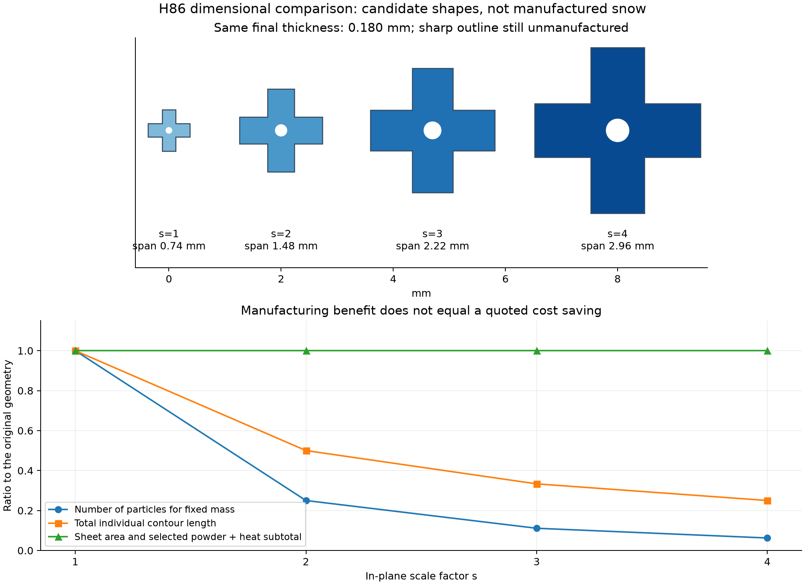
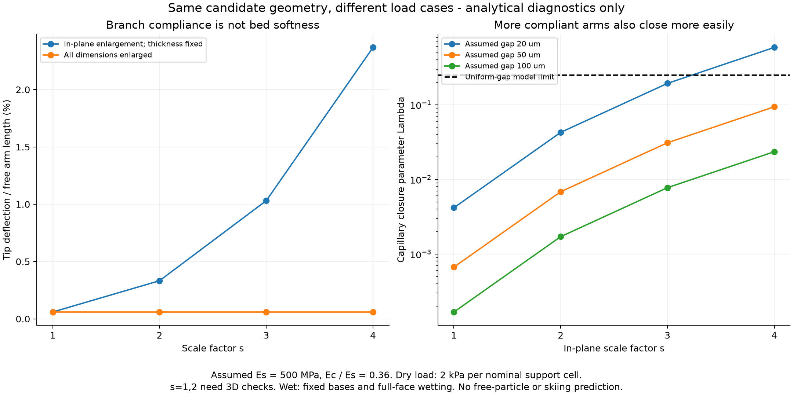

# 多方向探索第86巡：枝の柔らかさと雨後復帰を保つ寸法設計

2026-10-09／Codex。基準main：82b04cb42ca7b243c8adc70604f2c3dc99340b46。**物理試験0件、成功確率は未算定。** 設備・協力先未確保、照会・発注0件。

今回の変更は、前回の材料歩留まりが良い形状を、そのまま滑走用の形状として固定せず、**同じ寸法で枝の変形・濡れによる閉鎖・加工負荷を照合したこと**です。厚さを含めて相似拡大する案と、厚さを保って平面だけ拡大する案を分けました。

後者では、平面3倍で同じ完成質量の粒数が1/9、切断輪郭の総長さが1/3になります。枝の相対変形も増やせますが、濡れて寄り合う傾向も強まります。**H86の1.48／2.22／2.96mmを比較する候補へ進め、最大寸法を自動採用しません。** まだ雪の滑走感を達成した形状はありません。

## 1. 前回案には「製造しやすさ」と「枝が曲がること」の未接続があった

[第85巡](GPT回答_多方向探索第85巡_油を使わない多孔質薄片の製造と量産条件_20261009.md)の敷き詰め十字は、全幅0.740mm、枝幅0.240mm、緻密化後厚さ0.180mmです。中央の四角い部分から突き出る枝の自由長を単純化すると0.250mmで、厚さ／自由長=0.72です。

この形状を細長い雪の枝と同様の梁として扱うのは不適切です。前回の曲げ剛性比1.275は、穴のない帯片についての相対比較であり、この十字粒の絶対変位や粒床の柔らかさを保証していませんでした。

今回は曲げだけでなく横せん断を加え、太い・短い形状と大変位域には再解析のフラグを付けました。基本式とせん断エネルギーの扱いを一次資料で照合しています。積層材への展開は今回の理想化です。[Krastev・梁理論の原著](https://stumejournals.com/journals/mm/2021/4/120)

また、粒群の剛性には充填状態と作製履歴も関わります。枝一本の計算から床の硬さHやエッジ抵抗Sを決めません。[Götzら・原著要旨](https://doi.org/10.1103/PhysRevResearch.6.013061)

## 2. 厚さを変えずに平面寸法を広げるH86

| 平面倍率 | 全幅 | 枝の自由長 | 枝幅 | 仕上がり厚さ | 中央孔径 |
|---:|---:|---:|---:|---:|---:|
| 1（H85の対照） | 0.74mm | 0.25mm | 0.24mm | 0.18mm | 0.10mm |
| 2 | 1.48mm | 0.50mm | 0.48mm | 0.18mm | 0.20mm |
| 3 | 2.22mm | 0.75mm | 0.72mm | 0.18mm | 0.30mm |
| 4 | 2.96mm | 1.00mm | 0.96mm | 0.18mm | 0.40mm |

元シート厚0.20mm、元の空隙率40％、表層25µmずつを空隙だけ潰す仮定を維持します。孔・切り抜き隙間も平面倍率に合わせるため、幾何歩留まり92.72％は同じです。角の丸め・ばり除去・成形損傷を含む実歩留まりではありません。図の角ばった形状は、製造済み・安全認定済みの粒を表しません。

狙いは、さらに薄い粉体シートの製造を前提にせず、枝を長くして変形余地を増やすこと。ただし大きくした平坦面が積層すれば、濡れ固着や板の引っ掛かりが増える可能性があります。粒の全幅をそのまま表面粗さと同一視せず、完成床の配向・突出高さ・接触を測る必要があります。

工場成形した樹脂の枝形状です。雪の結晶成長や、30℃以上で自己成長する噴霧結晶化を達成したものではありません。温暖晶析、結晶複合体、可逆接続、立体骨格は独立候補として維持します。

## 3. どれだけ曲がるか：同じ圧力でも粒への荷重配分は未測定

代表計算では、緻密樹脂部の弾性率500MPa、内部はその0.36倍、ポアソン比0.4を仮定しました。**これらは50℃の実測値ではありません。**

名目圧力2kPaを「敷き詰め一セルの面積」に掛け、一つの枝が担う仮の比較荷重とします。工場の配置面積が実際の床の支持点密度になるとは確認されていません。支持点が仮定の1/10になる場合も別に計算しました。

| 平面倍率 | 曲げ変位 | せん断変位 | 合計／自由長 | 注意 |
|---:|---:|---:|---:|---|
| 1 | 0.089µm | 0.061µm | 0.060％ | 短く太い。三次元解析が必要 |
| 2 | 1.418µm | 0.246µm | 0.333％ | 今回の厚さ比フラグを超える |
| 3 | 7.181µm | 0.553µm | 1.031％ | 線形選別模型の範囲。性能保証ではない |
| 4 | 22.694µm | 0.983µm | 2.368％ | 濡れ・集中荷重・疲労も確認する |

厚さ／自由長0.3、変位／自由長0.1というフラグは、今回の解析を見直すための便宜的な目安です。規格の合否値でも、雪の滑走感の目標値でもありません。フラグがないことを実物の合格にしません。

平面倍率s、同じ厚さ・断面構成・仮の支持面密度則では、曲げ変位はs⁴、せん断変位はs²で変わります。枝長で割るとそれぞれs³とsです。一方、厚さまでs倍する完全相似では、同じ圧力に対する相対変形は変わりません。**単に大きい粒にすれば柔らかくなる、という説明は誤りです。**

代表4倍案でも、支持点が1/10になれば変位／自由長の線形推定は約23.7％となり、大変位フラグを超えます。この値を実際の変位予測として採用せず、接触を含む非線形解析へ切り替えます。弾性率100／500／1,000MPa、圧力2／20kPaの比較も保存しました。

## 4. 曲がりやすくした枝が、雨で閉じる反例

[第75巡](GPT回答_多方向探索第75巡_雪の通気構造との比較と濡れ固着を減らす薄片粒_20261009.md)は毛管閉鎖、[第76巡](GPT回答_多方向探索第76巡_濡れた粒を壊さずほぐす条件と60分復旧_20261009.md)は水橋の解離を検討済みです。今回は同じH85/H86断面の曲げ・せん断剛性を使い、乾燥時の柔らかさと濡れ時の閉鎖を別寸法で計算しないようにしました。

仮の二枚の枝の基点を固定し、対向面全体に水を挟み、最小隙間の毛管圧を一様に掛ける模型です。50℃純水の表面張力約67.94mN/mは公式式から計算しました。雨水や実粒の接触角は未測定です。[IAPWS公式リリース](https://iapws.org/technical-guidance/release/Surf-H2O)

閉鎖率yはこの近似で y(1−y)=Λ を満たし、Λ>0.25では小変位側の平衡がなくなります。弾性率500MPa・完全ぬれの場合：

| 平面倍率 | 初期間隙20µmのΛ | この近似の状態 | 限界に相当する初期間隙 |
|---:|---:|---|---:|
| 1 | 0.00417 | 平衡枝あり。ただし短太い形状 | 約2.58µm |
| 2 | 0.04271 | 平衡枝あり。ただし厚さ比注意 | 約8.27µm |
| 3 | 0.19367 | 平衡枝あり、閉鎖約26.3％ | 約17.60µm |
| 4 | 0.58716 | 小変位側の平衡なし | 約30.65µm |

4倍案でも初期間隙50µmならΛ≈0.09395となります。しかし、自由粒を混ぜた床で間隙50µm以上を保てるという証拠はありません。3倍案でも弾性率100MPaなら20µm間隙でΛ≈0.968となり、同じ近似の平衡を失います。

これらの「限界間隙」は製品の安全寸法ではありません。接触線の力、任意配向、粒全体の並進・転動、複数水橋、泥、粘性、乾燥過程を含みません。固定基点のモデルで閉じなくても、自由粒同士が集まる可能性があります。**平衡あり＝雨後にほぐれる、とは判定しません。**

## 5. 製造上は粒数と切断長を減らせるが、原料費は減らない

比較規模は前回と同じ2,000㎡×450mm×仮かさ密度150kg/m³＝135t。品質歩留まり90％、廃却分再投入90％、稼働2,304時間などは未実証の仮定です。

| 平面倍率 | 良品個数 | 全輪郭を個別に走査した場合の換算速度 | 処理するシート面積 |
|---:|---:|---:|---:|
| 1 | 約4.175兆個 | 約1,831m/s相当 | 約145万㎡ |
| 2 | 約1.044兆個 | 約916m/s相当 | 同じ |
| 3 | 約4,639億個 | 約610m/s相当 | 同じ |
| 4 | 約2,609億個 | 約458m/s相当 | 同じ |

換算速度は実機速度ではありません。並列加工なら機械の移動速度と総切断長は異なります。4倍でも一粒ずつ扱う案には戻さず、一括の刃型・多数個成形・連続分割を比較します。孔や隙間の寸法が大きくなる利点も、実際の不良率・工具寿命で確認する必要があります。

完成質量と仮歩留まりが同じなので、原料＋選定加熱費は前回と同じ約7,002万円・税別です。3倍案だからその費用も1/9になる、とは算定しません。切断・仕上げの値下がり額、金型、検査、工場、輸送、補充、総製造費は未取得です。20,000㎡ではこの部分費だけでも約7.00億円になります。

厚さも拡大する別案では、同じ質量のシート面積は減ります。しかし同じ熱拡散率なら厚さ方向の拡散時間尺度は厚さの2乗です。4倍厚で保持時間を据え置けば熱処理経路を1/4と計算できても、時間尺度を16倍とする診断では経路は4倍になります。どちらも実焼結時間の予測ではなく、**厚いほど工場が小さくなると先に決めないための比較**です。

整地設備・限定土木の税込2億円枠と、全材料・工場・開発費は分離します。機能深さ450mmを薄いマットに替えて採算を合わせません。

## 6. 次の候補をどう選ぶか

今回、H86-S3（全幅2.22mm・厚さ0.18mm）を中間の比較候補に加えます。S2/S4も比較対象とし、最適解や採用確定とはしません。

| 確認結果 | 次の設計変更 |
|---|---|
| 枝が硬すぎ、粒床も砂状に流れるだけ | 薄肉化、長い根元、立体的な開放骨格・可逆接続へ比較を広げる。原料粉径と薄肉製造限界を再照合 |
| 雨で広い面が張り付く | 第75巡の不連続な接点や局所支持を融合し、向きが変わっても機能するか確認。間隙の固定を仮定で済ませない |
| 大きな粒で板の振動・引っ掛かりが増す | 全幅拡大を止める。丸め・分散接点・短い変形部を同時に比較 |
| 加工は安いが繰返しで枝が折れる | 生産費だけで採らず、50℃疲労・回収損傷・年間補充費で比較し直す |
| 整地後に厚さだけ戻り、H/Sや透水性が戻らない | 既存の分流再生・交換経路へ移す。ローラーの圧力や振動を強めれば解決としない |

[寸法比較の試験仕様](枝寸法と量産性の同時設計_20261009/size_test_protocol.md)は4寸法×乾燥／一度濡らして排水後×独立3バッチの未実施24割付です。前回の24構造割付をそのまま足して、48件が必要・予算確定としたものではありません。まず少量の製造能力を確認し、同じ対照を共有できるか受託側と整理する段階です。

同じ床について摩擦、始動・停止、エッジの支持と抜け、沈み込み、振動、摩耗、再整地後を測る必要があります。室温の樹脂弾性率を床のHへ比例換算しない。天然の新雪圧雪の対照を測るまで、上表の変位割合を合格目標にしません。

冬は雪との界面せん断・排水・凍結融解・地盤対照の融雪を確認し、平積み薄片の弱面を検出します。夏の気温30℃以上・表面約50℃、約30°斜面、450mm機能層、300mm掘れ、R39保持構造、9–17時利用、4–5時間ごとの整地、閉鎖約60分の条件を維持します。油・塩・フッ素・シリコーン潤滑、現地冷却、強酸、連続散水には依存しません。人体・環境への無害性は未証明です。

## 7. Claudeへの共有と再現資料

公開Claude台帳は開始時に第85巡から変更なしでした。[Claudeへの反証依頼](枝寸法と量産性の同時設計_20261009/claude_handoff.md)では、接触密度と三次元形状の反証、実際の枝剛性、平積み・自由粒凝集、寸法と切断費の独立比較を求めています。受領・返答・稼働は未確認です。

[入力](枝寸法と量産性の同時設計_20261009/inputs.json)、[計算コード](枝寸法と量産性の同時設計_20261009/reproduce.py)、[式と除外事項](枝寸法と量産性の同時設計_20261009/model.md)、[出典](枝寸法と量産性の同時設計_20261009/sources.json)を保存。23数式・単位・積分等照合、267計算行、2図。これらは実験結果・90％超の開発成功率を示す件数ではありません。
