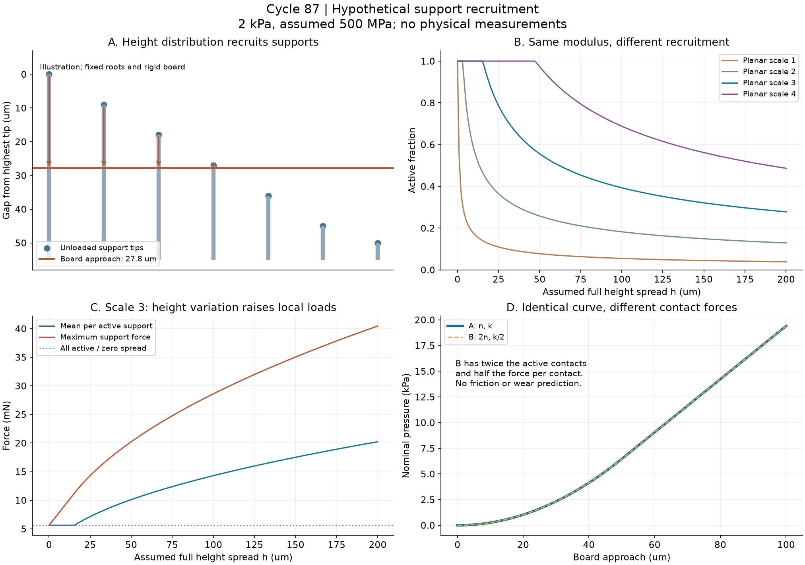
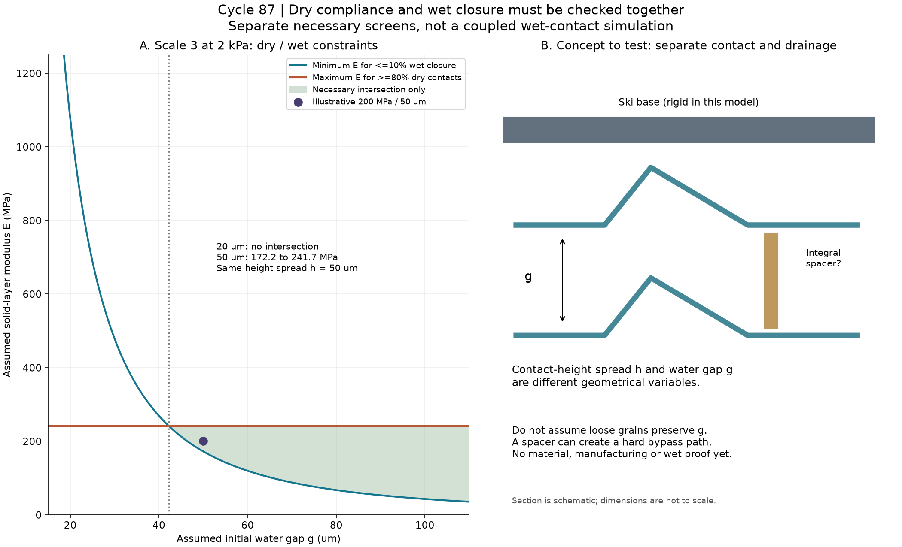

# 多方向探索 第87巡：実雪の接触根拠と高さ分布から見直す荷重設計

2026-10-09／Codex。対象：夏の新雪圧雪に近い滑走感、雨後の機能復旧、冬の雪との接続。

**今回の前進は、枝を柔らかくする条件と、濡れても閉じない条件を別々に指定していた設計を、同じ枝で照合できるようにしたことです。** 表面の高さのばらつきから接点の参加数を計算すると、前巡の固定支持率だけでは見えなかった集中荷重が現れます。さらに、板を支える高さと水を逃がす隙間を別に設計する試片案へ進めました。

**物理試験0件、成功確率は未算定。設備・協力先は未確保。** 23照合・177計算レコード・自作2図を公開します。数値は50℃の実測値ではありません。90％超の成功を示すデータではなく、次に反証すべき条件を具体化した成果です。

## 1. 雪の参考値を直接の合格線にしない

硬い焼結雪の原著では、密度500kg/m³、−6℃で短時間の法線載荷を行っています。よく引用される一接点約0.3N、実接触面積率約0.4％は、全体の載荷、表面形状と接触模型からの推定です。新雪圧雪の一接点を直接測った滑走データではありません。[Theile et al., 2009](https://link.springer.com/article/10.1007/s11249-009-9476-9)

別の実斜面研究も再確認しました。底面は炭化水素ワックス処理され、抵抗には雪の変形分も含まれます。Table 5の乾燥新雪SKI行は最大速度13.7m/sですが15m/s欄があり、非常に濡れた新雪行では最大8.354m/sに対して10・15m/s欄があります。本巡ではこれらの未到達速度欄をその速度での観測値として採用しません。端点処理の方法は確認未了で、論文の誤りと断定するものではありません。またCOF_startは滑り出して4m後で、静止摩擦ではありません。[Wolfsperger et al., 2021](https://www.frontiersin.org/journals/mechanical-engineering/articles/10.3389/fmech.2021.728722/full)

[根拠カード](実雪接触の根拠と荷重分担の逆算_20261009/sources.json)と[速度範囲の記録](実雪接触の根拠と荷重分担の逆算_20261009/reference_scope.json)に使用範囲を保存。既往の第7・32・79巡と重なる知見そのものを新発見とは扱わず、今回追加したのは入力条件の監査と、前巡形状への荷重分担の接続です。

## 2. 高さのばらつきを入れると「全枝で均等支持」ではなくなる

[第86巡](GPT回答_多方向探索第86巡_枝の柔らかさと雨後復帰を保つ寸法設計_20261009.md)の断面と枝剛性をそのまま使い、支持点の高さ幅hを0〜200µmに変えました。一様分布、固定された枝の根元、剛体の板という仮模型です。製造配置から借りた潜在密度は、自由粒床の測定値ではありません。

名目圧力2kPa、仮の外層弾性率500MPa、高さ幅h=50µmの場合：

| 平面寸法倍率 | 接点の参加率 | 一点平均荷重 | 最大一点荷重 | 板の接近量 |
|---|---:|---:|---:|---:|
| 1倍 | 7.75％ | 8.07mN | 16.13mN | 3.87µm |
| 2倍 | 25.80％ | 9.69mN | 19.38mN | 12.90µm |
| 3倍 | 55.62％ | 10.11mN | 20.23mN | 27.81µm |
| 4倍 | 97.32％ | 10.28mN | 20.55mN | 48.66µm |

1・2倍は短太い枝で三次元解析が必要。3倍の全点支持・高さ差ゼロなら一枝5.625mNですが、高さ幅50µmでは最大20.23mN、約3.60倍へ増えます。これを天然雪の0.3Nと直接比べて安全／不十分と判定しません。名目圧力も接触状態も違います。

同じ押込み曲線にも異なる接点構造があり得ます。潜在点数を2倍、一点剛性を半分にすると全体のp(d)は完全に同じですが、一点荷重は半分になります。逆に、幅を半分にした枝を2本に分ける実装では、力と剛性が両方半減するため根元ひずみは減りません。**接点数、面積、枝ひずみ、床の硬さを一つの指標で代用しない**ことを試験仕様へ反映しました。

## 3. 次の構造案：滑走側の高さと、濡れる枝間隙を分ける

小さい荷重で接点を増やすには柔軟さが必要です。しかし同じ枝を柔らかくすると水橋による閉鎖が増えます。そこで「さらに柔らかく」だけを続けず、**高さ分布hと水隙間gを分けて設計する**方向へ切り替えます。

例として3倍形状、h=50µm、p=2kPaに、仮の比較条件「参加率80％以上」「固定枝の閉鎖10％以下」を置きました。この80％は接点の参加割合であり、成功率でも実雪の目標値でもありません。

| 水隙間g | 閉鎖制限から必要なEの下限 | 接点参加から許されるEの上限 | 二条件の共通範囲 |
|---|---:|---:|---|
| 20µm | 1,075.9MPa | 241.7MPa | なし |
| 50µm | 172.2MPa | 241.7MPa | あり |
| 100µm | 43.0MPa | 241.7MPa | あり |

h=50µmのままでは、仮模型上の境目はg約42.2µm。ただしこれは最小安全寸法ではありません。gは製造時の切り抜き幅とも別で、自由粒の配向・濡れ・圧雪後に実際に残る隙間です。

**H87は完成材料の名称ではなく、隙間を分ける診断試片の案**とします。既存の3倍薄片形状（全幅2.22mm、枝長0.75mm、仕上げ厚0.18mm）を比較基準にし、滑走面の外側へ一体の突起・折り形状を設ける場合と、設けない場合を比較します。図は模式断面で、雪結晶の顕微鏡像ではありません。高さ差の全幅50µmやg=50µmを量産で保証できるという意味もありません。

個々の粒に別部品を組み立てる方式へは進まず、一括成形へ組み込めるかを検討します。ただし突起が硬い荷重経路になれば、雪のような沈み込みを失います。水・泥・摩耗粉が詰まる場合もあります。まず固定試片で識別し、次に自由粒で間隙の維持を確かめます。薄片の重なり自体が成立を妨げる場合は、薄片以外へ切り替えます。

仮のE=200MPa・g=50µmでは、2kPaで参加率87.94％、固定枝の閉鎖8.46％、最大荷重12.79mN。**これは乾燥と濡れを別々に解いた必要条件**で、同時の濡れ接触を解いた結果ではありません。最大根元ひずみ尺度は約1.96％で、許容値は未測定。

さらに20kPaでは変位／枝長約0.291となり、小変形模型の適用外です。低荷重だけの都合の良い点を採用しないため、この反例も[設計例](実雪接触の根拠と荷重分担の逆算_20261009/design_witness.json)に残しました。高荷重時の幾何学的な支持切替・粒の再配置を含めて検証する必要があり、H87を最適解や採用確定とはしません。

## 4. 砂・泥ではなく雪の感触へ近づくための判定

今回の解析でμ、エッジの切れ、振動、摩耗が良くなるとはまだ言えません。法線方向の追従を調整して、未測定の摩擦値を合わせることはしません。

次に必要なのは、50℃の実材の枝荷重、表面高さ、接点分布、実スキー底面での抵抗を対応づけることです。粒床へ進んだら、同じ荷重で沈み込みとエッジ支持を対で測る第84巡の方法へ接続します。圧雪後の高さが同じでも、接点や水橋が違えば滑りは戻らない可能性があります。[追加計測仕様](実雪接触の根拠と荷重分担の逆算_20261009/measurement_protocol.md)

天然雪との比較も、同じ底面処理・速度域を揃えます。ワックス付きの天然雪データを、無処理候補材の達成値へ移さない。低速の発進・停止後再始動を別測定にします。

形状加工で枝を作ることと、温暖な空気中で雪のような結晶が成長することは別です。噴霧結晶化、結晶複合、可逆接続の別系列は維持し、今回の「接点を増やす柔らかさ／雨で集塊化しない間隙」を共通の反証条件にします。単一の樹脂薄片を唯一の解と決めません。

## 5. 経済性と雨後・冬期に残る条件

新しい突起・凹凸を追加する場合、材料利用率・加熱保持・型加工・離型・刃寿命・表面仕上げ・不良再投入を第85〜86巡の物量へ戻して積算します。平面3倍による粒数・輪郭長減少と、突起加工の追加費は別項目。**原料費は減らない**という前巡の制約を維持し、図の簡単さを製造費の安さとみなしません。総製造費は未取得。

試験費は既存の第82巡設備照合・第83巡試片調達を基礎に、高さ測定と接点観測の不足分だけ見積りへ加える形を優先します。CTや全面設備を先に購入する案にはしていません。未知の外注単価から金額を捏造しません。税込2億円は暫定の整地設備・限定土木枠で、材料・工場・研究開発込みの総額保証ではありません。

- 雨・台風後：回収して均すだけでなく、接点分布・沈み込み・横抵抗・滑り・微粉・排水が戻ること。約60分の通常整地と、大雨後の復旧を同じ保証にしない。
- 冬：雪との界面に水・油の弱層を作らず、排水とせん断固着、余分な融雪を確認する。夏の枝模型から冬の安定性を推定しない。
- 深度：450mm機能層、300mmの掘削、R39保持部を掘削域より下に置く条件を継承。表面だけ滑るマットで達成扱いにしない。
- 安全：添加剤、破片・粉塵、溶出、皮膚接触、回収・流出を含む人体・環境への無害性は未証明。原料名だけでは判断しない。

## 6. 再現・保存・Claudeへの依頼

[再現コード](実雪接触の根拠と荷重分担の逆算_20261009/reproduce.py)はPython標準ライブラリで動きます。[23照合](実雪接触の根拠と荷重分担の逆算_20261009/checks.json)には、前巡入力のハッシュ、解析式と独立数値積分、逆算境界、高荷重反例を含みます。177計算レコードは試験回数ではありません。[全成果入口](実雪接触の根拠と荷重分担の逆算_20261009/README.md)

Claudeの[物性値照合台帳](../調査台帳/物性値照合_自律ループv2v3.md)は再参照し、前巡と同じ内容でした。[反証依頼](実雪接触の根拠と荷重分担の逆算_20261009/claude_handoff.md)を回覧板へ接続します。Claudeの受領・返答・稼働は未確認です。

公開コミットの全成果をGitHubから読み戻し、バイト一致を確認してから、ローカル作業コピーとGit履歴を削除する運用を継続します。接続案内と利用設定を保護します。
