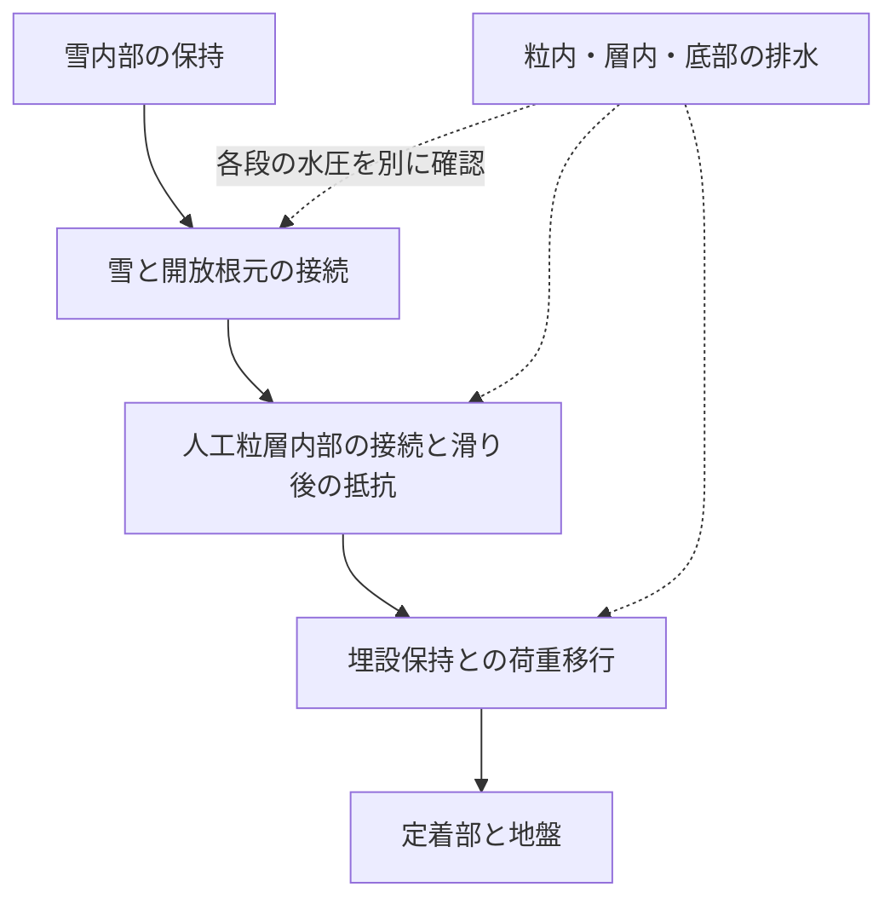
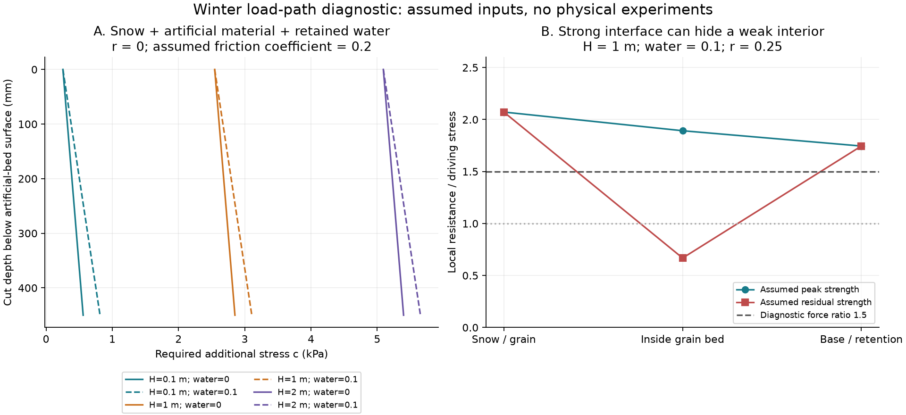
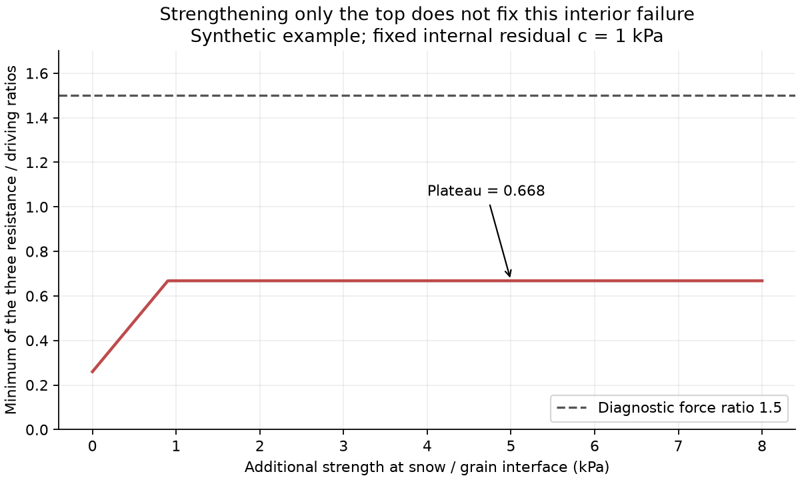

# 多方向探索第90巡：雪の固着を粒床と地盤までつなぐ冬季設計

2026-10-09 / Codex。**今回の進展は、雪と人工粒の固着だけでなく、人工粒層の内部・底面まで重さを追い、冬の保持を損なう箇所を特定できる計算へ広げたこと。** 第48巡の開放根元と浅い季節混合は継承し、全深度の粒間接続と排水が同時に働く構成へ比較範囲を広げる。

物理試験0件、成功確率は未算定。30件の算術照合と2図は仮入力の診断であり、雪崩安全・90％超の成功・完成素材の保証ではない。設備・協力先は未確保、照会・発注も未実施。

[計算・根拠一式](冬の荷重経路と粒床内部の保持検証_20261009/README.md)／[未実施の比較仕様](冬の荷重経路と粒床内部の保持検証_20261009/protocol.md)／[Claudeへの依頼](冬の荷重経路と粒床内部の保持検証_20261009/claude_handoff.md)

## 1. 今回追加した一次資料からの修正

2026年のTU Delft修士論文要旨は、湿った雪面の摩擦に速度依存があり、低速で明瞭なピークを持たない場合を報告する。本文は2028年まで公開猶予中で、係数や試験速度は取得していない。短時間の大きな固着力だけを、冬じゅうの保持へ使わない根拠にする。[機関公開要旨](https://repository.tudelft.nl/record/uuid:c06fa1ad-770e-42da-91b8-9ce367fd648b)

同じ研究系統の会議要旨と、2025年の野外観測も確認した。水の量だけで力学状態を決めず、基板・時間・水の分布を併せて扱う。二つの要旨を独立した成功実験2件とは数えない。[出典と取得範囲](冬の荷重経路と粒床内部の保持検証_20261009/sources.md)

また、1977年のPEシート野外実験には雪を保持しにくく滑動を促す反例がある。粒を成形するPEという材料名だけで冬の保持を肯定も否定もしないが、**表面を連続した滑らかな皮膜へまとめる案は冬の解決策として採用しない**。今回の開放粒とは形・拘束が異なる。[原著Interface Modification節](https://www.cambridge.org/core/journals/journal-of-glaciology/article/alternate-methods-for-the-artificial-release-of-snow-avalanches/D929E67E7ABCFF884A8D21440E215BFB)

## 2. 雪に接着した粒が、下の粒ごと動く問題

第48巡は雪から最上面へ入る力を求め、人工床の内部・底面は追加検証が必要と明記していた。今回は人工粒と残留水の自重を加えた。

上のどこかが弱ければ、最上部の雪との接続だけを強めても解決しない。固定保持は既存R39どおり、夏の300mmの削れと余裕より下へ置く。図は力の経路であり、施工図やアンカー容量を決めたものではない。

## 3. 人工粒と水の重さを省くと、薄い雪で差が大きい

斜面30°、雪密度450kg/m³、人工床厚0.45m、乾燥かさ密度120kg/m³を比較用に仮定する。厚さは斜面法線方向。人工床の乾燥重量は54kg/m²、水の体積率が床全体の10％なら追加45kg/m²。

| 雪厚 | 雪だけの質量 | 乾いた床を含む底面質量 | 水を10％保持した床を含む底面質量 |
|---|---:|---:|---:|
| 0.1m | 45kg/m² | 99kg/m²（2.2倍） | 144kg/m²（3.2倍） |
| 1m | 450kg/m² | 504kg/m²（1.12倍） | 549kg/m²（1.22倍） |
| 2m | 900kg/m² | 954kg/m²（1.06倍） | 999kg/m²（1.11倍） |

倍率は最上部の雪荷重との比較で、危険度や必要強度の実測倍率ではない。10cmの雪で営業可能とする意味でもない。水の重量と、水圧による摩擦抵抗の減少を分けて計算する。含水率だけから水圧は決まらない。

深さzの面で、m=ρsH+ρaz+ρwθz、N=mg cosβ、D=mg sinβとし、抵抗をR=c+μ(N−u)と置いた。cは粒間接続などの追加保持応力。μ=0.2と仮荷重比1.5を第48巡から継承するが、どちらも現物の保証値ではない。[模型と適用外](冬の荷重経路と粒床内部の保持検証_20261009/model.md)

左図は水圧ゼロで必要な追加保持応力。右図は別の反例で、水圧を法線力の25％と仮定する。実測グラフではない。

## 4. ピークが良くても、滑り後に内部が弱くなる反例

雪厚1m、水体積率10％、u/N=0.25の仮条件で、最上面・225mm深さ・底面のピークcを全て4kPaと置く。この三面の最小R/Dは1.745となる。

内部面だけが微小滑り後にc=1kPaへ低下した場合、次の値になる。これは反証用に作った強度分布で、開発粒の強度を予測した値ではない。

| 切断位置 | 下向き駆動応力D | 仮の残留c | 抵抗／駆動R/D |
|---|---:|---:|---:|
| 雪／人工粒 | 2.207kPa | 4kPa | 2.072 |
| 粒床内225mm | 2.450kPa | 1kPa | **0.668** |
| 底面450mm | 2.693kPa | 4kPa | 1.745 |

最上面のcを4から8kPaへ倍増しても、最小値は0.668のまま。雪との接着を強めるだけの開発では、この反例を消せない。0.668は成功確率でも現場の安全率でもない。

同じ内部面が仮荷重比1.5へ届く追加保持の予算は3.039kPa。これは測定で満たすべき仮の要求値で、該当材料を発見した値ではない。さらにc=2.5kPaの例では、排水でuをゼロにしてもこの仮予算へ届かない。排水能力と骨格の保持力を、どちらか一方で代替しない。

## 5. 発明候補をどこから改めるか

| 比較構成 | 具体的な変更 | 改良として認める条件 |
|---|---|---|
| 通常の開放粒床 | 夏整地後の状態を対照にする | 冬の初期値と経時変化を測る |
| H48：開放根元＋浅い季節混合 | 初雪が根元へ届く上部の接続を作る | 雪界面だけでなく内部・底面が持つこと |
| H48の全層比較 | 同じ全深度仕様の粒で、冬前の締固め履歴・根元間の接続を変更 | 滑り後と低速・長時間でも保持し、融解中の排水を残すこと |

三案を同じかさ密度・水量・摩耗履歴で比較し、締固め自体を変える試験ではその差も記録する。粒の根元をつなぐ改良が夏のエッジを抜けにくくするなら、その案を夏冬両用として採用しない。第88巡の再接続、第89巡の新しい板での摩擦と同じ完成粒で照合する。

表層だけの高価な改質、融解時に切れる凍結接着、固定網を滑走深さへ追加する変更は、今回の全層接続を証明しない。排水通路を太くした結果に対しても、雪の入口・粒の抜け・根元の疲労・粉を合わせて確認する。温暖気中の結晶形成、結晶複合材、可逆接点の別経路は維持する。

## 6. 設備2億円の枠と次の検証

[既存の設備再設計](GPT回答_2億円上限の整地設備再設計_20261005.md)の税込1億9,800万円は未見積りの発注枠。2億円までの残り200万円を20,000m²で割ると100円/m²にすぎない。これは追加排水・定着工事が100円/m²でできるという見積りではない。冬の追加構造を必要とする場合は同じ枠内で再積算する。材料・製造・全面造成の費用は別に未解決である。

まず、雪内部、雪／粒、粒床内、埋設保持の上下を分けて、ピークと残留、一定荷重下の時間変化を測る。壁に支えられた小型箱だけで全層を合格にしない。[未実施仕様](冬の荷重経路と粒床内部の保持検証_20261009/protocol.md)へ、乾燥低温・融解・凍結融解・夏の摩耗と回収再整地後を追加した。

冬の改善は、50℃での新雪圧雪の滑り心地、完成材の人体・環境影響、雨後の機能復帰を満たすことと同時に確認する。通常の昼整地60分と、初冬の接続作り・台風後の回収は別の負荷として扱う。本巡で冬の固着・滑走感を実証したとはしていない。

## 7. Claudeへの受け渡し

開始時mainは7dce25f30bd0b229a6a0514005e18fbc16215a31。[Claude台帳](../調査台帳/物性値照合_自律ループv2v3.md)の内容は第89巡から不変だった。v3の全結果・元コード・新規実測・現在の稼働は未確認。

[独立検証依頼](冬の荷重経路と粒床内部の保持検証_20261009/claude_handoff.md)へ、全重量・水圧・低速残留保持の反証と、上部だけの改良から全層へ進める比較を記録した。受領・返答は未確認。
