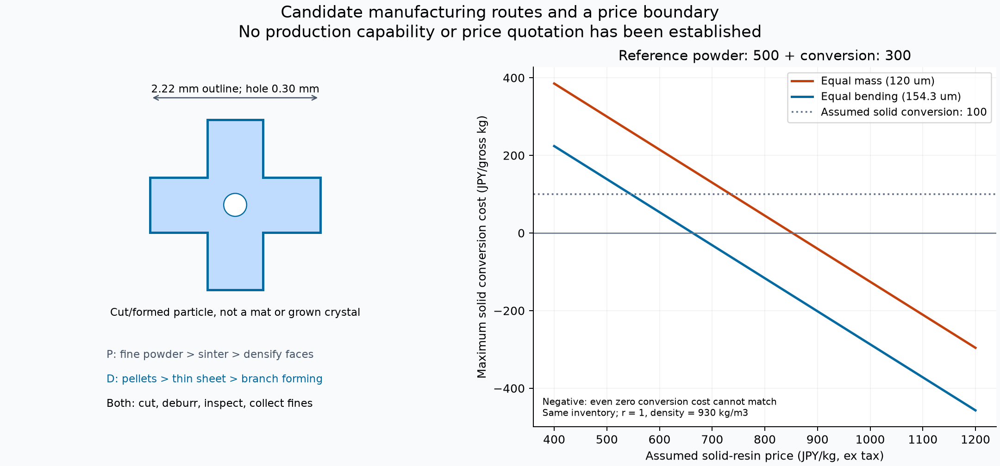
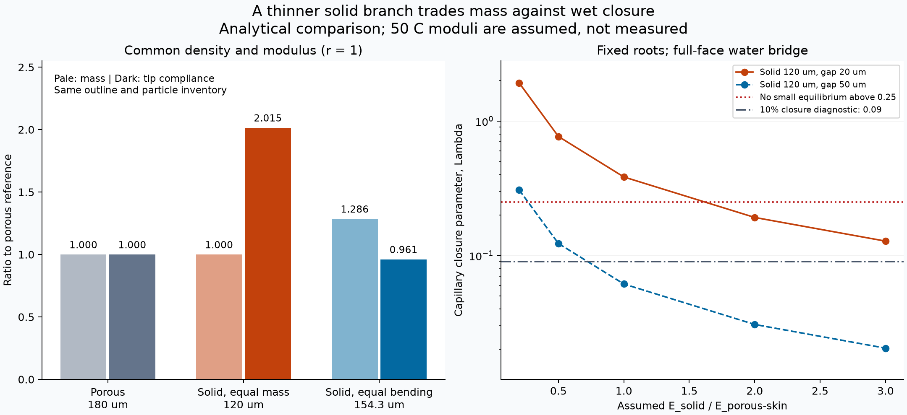

# 多方向探索第91巡：内部孔に頼らない薄枝と製造費の両立

2026-10-09 / Codex / 設計比較と一次資料監査。**物理試験0件、成功確率は未算定。**

今回の成果は、既存の「多孔質の芯＋緻密な面」という案から離れ、**押出可能な樹脂を薄い枝として成形する案を、重量・雨・価格で採否判断できる条件にしたこと**です。ただ薄くすればよいわけではなく、雨で張り付く反例と、厚くした場合の材料費増を両方計算しました。多孔質焼結の候補も残し、どちらか一方を採用した扱いにはしていません。

[再現パッケージ](多孔質焼結と緻密薄枝の製法比較_20261009/README.md)には入力・計算・35算術照合・31断面比較・93濡れ条件・270費用条件・図2枚・未実施試験仕様を収納しています。これらの条件数や計算合格数は、実証成功率を表しません。

## 1. 今回、前提を変えた点

[第85巡](GPT回答_多方向探索第85巡_油を使わない多孔質薄片の製造と量産条件_20261009.md)・[第86巡](GPT回答_多方向探索第86巡_枝の柔らかさと雨後復帰を保つ寸法設計_20261009.md)の多孔質薄片には、粉末を薄く均一に敷き、焼結し、面だけを緻密化する製造課題がありました。

一方、LUBMERは[10月7日の報告](GPT回答_開放微細粒の再接続構造と経済最適化_20261007.md)ですでに候補に挙がっています。今回の新規性は銘柄の発見ではなく、**その押出可能性を、現在の2.22mm枝の多孔質案と同じ質量・同じ曲げ剛性で比較し直したこと**です。発明の新規性・特許性を確認したという意味ではありません。

Claudeの[物性監査台帳](../調査台帳/物性値照合_自律ループv2v3.md)も再参照しました。公開内容の更新は前巡から確認されず、ステロール芯や二層案などの検討記録を保持しています。台帳自身も未確認の乾燥摩擦値や、雪の硬さ帯の読み替えを区別しています。今回も、原料の公称値をそのまま雪の感触や50℃のスキー摩擦に置き換えません。Claudeの受領・返答・現在の稼働は未確認です。

## 2. 実在材料から確認できたこと

### 粉末側：微粉化しても、面の均一性は別問題

メーカー資料の平均粒径はXM-220が30µm、XM-221Uが25µm、PM-200が10µmです。PM-200は当該資料で開発品表記です。現在の供給、価格、品質保証値は未確認です。[三井化学 MIPELON資料・5〜6頁](https://tw.mitsuichemicals.com/rwd1438/store/F3/MIPELON_EN.pdf)

| 粉末 | 初期200µm厚／平均粒径 | 緻密化前の片面25µm／平均粒径 |
|---|---:|---:|
| XM-220 | 6.67 | 0.83 |
| XM-221U | 8.00 | 1.00 |
| PM-200（資料上は開発品） | 20.00 | 2.50 |

これは厚さと粒径の比であり、実際の均一な積層数ではありません。微粉化で母材を薄く作りやすくなる可能性はありますが、仕上がり15µmの表層が一様にできる証拠にはなりません。粉末径分布、空隙、焼結ネック、切断端からの粉落ちを実断面で調べます。

### 緻密材側：押出対応と、実際に滑ることを分ける

LUBMERは分子量非開示の特殊PEで、メーカーは射出・押出対応を公表し、用途資料にはL3000、L8100-R2の押出用途があります。**必要な薄膜や枝を必要線速で製造できるとの公表ではありません。** 掲載された摩擦試験は23℃・S45C鋼相手で、50℃のスキー底面相手ではありません。[用途資料](https://jp.mitsuichemicals.com/en/special/uhmw-pe/application/)、[製品特性と試験条件](https://jp.mitsuichemicals.com/en/special/uhmw-pe/features/lubmer/)

| 銘柄 | 密度 kg/m³ | 引張弾性率 MPa | 引張破断伸度 % | 1.8MPa時の熱変形温度 ℃ |
|---|---:|---:|---:|---:|
| L3000 | 969 | 1450 | 10 | 50 |
| L8100-R2 | 963 | 992 | 290 | 48 |

メーカー表の参考値です。英語表は密度の単位と数字が不整合なので、kg/m³と明記した日本語表を採用しました。親ページの脚注にも表との対応が曖昧な箇所があり、試験法を推測で補正していません。熱変形温度は荷重依存の試験指標で、50℃の長期使用可否や枝のクリープを保証しません。L8100-R2は伸びが大きい一方、同表の比摩耗量欄はL3000より大きく、伸びだけで選べません。[メーカー日本語物性表](https://jp.mitsuichemicals.com/jp/special/uhmw-pe/assets/image/technical_data/table_lubmer01.png)

PEベースという表示だけでは、全添加剤・色材・離型剤・摩耗粉の人体／環境影響は確認できません。無油・無フッ素・無シリコーン等は最終処方、製造残留物、摩耗物まで確認する必要があります。

## 3. 具体案：内部孔を使う粒と、薄枝で変形する粒

共通の比較輪郭は、外幅2.22mm、枝幅0.72mm、自由枝長0.75mm、中央孔0.30mmです。これは切り出す枝状粒の構図です。氷の六方結晶が夏の空気中で成長する仕組みではありません。樹脂の結晶化度、枝の外形、雪らしい滑走感の三つを区別します。粒を450mmの機能層として使う構想を維持し、薄い固定マットへの置換ではありません。

| 案 | 作り方 | 解決したい製造課題 | 新たに残る課題 |
|---|---|---|---|
| P91 | 微細UHMWPE粉末→薄層焼結→両面緻密化→輪郭加工 | 原料実在性と微粉での薄層形成 | 15µm表層の連続性、粉落ち、保持工程、量産速度 |
| D91-flat | 特殊PEペレット→緻密薄シート→輪郭加工 | 内部孔と両面だけの緻密化工程を不要にする | 柔らか過ぎ・面の積層、反り、バリ、50℃摩耗 |
| D91-3D | D91に、交互の枝端を上下へ成形する工程を追加 | 平板同士の広い接触を減らす仮説 | 重なり方で隙間消失、クリープ、接点過熱、型と切断の整合 |

D91-3Dは、まず枝端の高さ±60µmを仮の加工条件として、平らな対照と比較する案です。高さ120µmが常に水隙間になるとは扱いません。立体成形後の実剛性・充填・摩擦は本巡の平らな梁計算の範囲外です。[第70巡の捲縮と濡れ積層](GPT回答_多方向探索第70巡_連続捲縮成形と濡れて固まる積層の反証_20261009.md)の知見を応用する設計仮説であり、PEでの連続成形実績はまだありません。

図左は比較用の平面輪郭です。立体成形前の状態を描いています。図右は後述の仮単価による逆算で、製造業者の見積ではありません。

## 4. 「薄ければ雪らしい」とはならない

まず密度を共通930kg/m³、表面／緻密材の弾性率を共通500MPaとした仮比較です。多孔質芯の弾性率は表面の0.36倍。50℃での実測値ではありません。

| 同じ輪郭・同じ粒在庫での比較 | 多孔質基準 | 緻密・同質量 | 緻密・同曲げ剛性 |
|---|---:|---:|---:|
| 仕上がり厚さ µm | 180 | 120 | 154.28 |
| 質量比 | 1.000 | 1.000 | 1.286 |
| 曲げ剛性比 | 1.000 | 0.471 | 1.000 |
| 曲げ＋せん断の先端変位 µm | 7.734 | 15.587 | 7.436 |
| 20µm水隙間での小変位側の釣合い | あり | **なし** | あり |
| 50µm水隙間での閉鎖割合 | 3.20% | 6.58% | 3.04% |

荷重は一枝5.625mNという比較条件です。最後の二行は根元固定の対向二枝の模型です。自由に動く粒床や台風後の結果を予言するものではありません。「釣合いあり」も、実用合格の意味ではありません。

薄枝案は同質量で約2.015倍たわみますが、面全体が濡れたときの張り付きに弱くなる反例が出ました。閉鎖を仮に10％以内にする初期隙間は、基準29.34µmに対し、同質量薄枝では41.31µm以上です。この10％は比較診断値で、天然雪の合格基準ではありません。

柔らかさを失わず雨を受け流すには、弾性率だけでなく粒の接点数・立体形・排水を同時に測る必要があります。エッジが切り込む抵抗や板の滑走感は、この一枝のたわみから確定できません。

## 5. 材料を選ぶための逆算条件

同じ材料量と曲げ剛性を両立する条件は、基準密度ρ0に対して、

**緻密材の弾性率／多孔質案の表面材の弾性率 ≥ 2.125×(緻密材密度／ρ0)³**

です。同じ剛性に合わせるなら等号。剛性を上げ過ぎると雪らしい変形を失うため、この不等式だけで採用しません。

| 緻密材密度の比較値 | 同質量厚さ µm | 必要な弾性率比 |
|---|---:|---:|
| 共通密度930 | 120.00 | 2.125 |
| 963（L8100-R2の表値） | 115.89 | 2.359 |
| 969（L3000の表値） | 115.17 | 2.404 |

この条件は銘柄の合格表ではありません。例えば基準表面が50℃で500MPaなら、969のケースは緻密材に約1,202MPaを要求します。基準の500MPa自体も仮値なので、メーカーの室温弾性率から合否を出さず、両方の実シートの50℃曲げ応答を測ります。

これにより次の探索は「高価でも柔らかい樹脂を探す」から、**50℃での比剛性、表面摩擦、加工単価を同時に満たす樹脂・形状を探す**課題へ具体化しました。機械的な条件を満たしても、雪の滑り心地・摩耗・人体影響が解決したことにはなりません。

## 6. 原料費増を、どこまで工程削減で取り返せるか

面積2,000m²、厚さ450mm、基準床密度150kg/m³で135tを出発点にしました。同じ粒数なら、同曲げ剛性の緻密案は約173.56tになります。新案の床密度を150のまま固定して、この増量を消すことはしていません。実際の嵩密度は未測定です。

仮に粉末500円/kg、粉末案の全加工枠300円/加工通過kgと置くと、基準の原料＋加工枠は**税別約1億1,737万円**。全加工枠には熱・電力・労務・工具・成形・切断・検査・設備配賦を含める想定ですが、これは価格調査結果ではありません。

| 仮条件 | 緻密・同質量 | 緻密・同曲げ剛性 |
|---|---:|---:|
| 緻密樹脂800円/kgの場合、同額に収める加工費上限 | 44.69円/加工通過kg | **−116.50円/加工通過kg** |
| 緻密案の加工費100円/加工通過kgなら、樹脂単価上限 | 735.01円/kg | 545.60円/kg |

負の上限は、加工費ゼロでも原料代だけで基準案を超える意味です。押出可能というだけで安いとは結論できません。加工枠・再投入歩留まり・原料価格を見積で入れ替えれば、そのまま採否を計算できます。

第85巡の約7,002万円は「原料＋選択した加熱分」で、今回の仮の全加工枠とは範囲が違います。どちらも事業総費用ではありません。2億円は整地設備・限定した土木の従来検討枠であり、原料135t、試作、工場、保守交換まで含めて2億円に収まったという報告ではありません。

同じ粒在庫では必要なシート面積が変わらず、仮の生産日程で要求される線速は約10.49m/minのままです。焼結保持を省く可能性があっても、薄膜押出・輪郭加工・立体成形の能力をそれぞれ確かめます。

## 7. 次の試作を、判断できる形にする

[未実施試験仕様](多孔質焼結と緻密薄枝の製法比較_20261009/test_protocol.md)に、P91の粉末2種とD91の緻密材2種を比較する24調製条件を用意しました。最初は実際に作れた断面と50℃の保持変形を確認し、製法が成立しない候補へ滑走試験費を使わない順序です。設備・協力先・試片は未確保で、照会・発注はしていません。

その後、実スキー底面の乾湿摩擦と摩耗を[第89巡の素材／板の四履歴](GPT回答_多方向探索第89巡_慣らした板だけに依存しない滑走接点_20261009.md)で確認します。滑走中に粒が壊れて細粉になる場合も、床の見た目が保たれるだけでは採用しません。

雨後は回収質量・整地高さに加え、粒の積層、残留水、硬さH、横抵抗S、滑走抵抗、排出粒を整地前後で測ります。60分で元に戻せることは未実証です。熱や劣化で永久に平たくなった枝を、ローラーだけで元の立体形へ戻せるとは扱いません。

冬は[第90巡の全層保持](GPT回答_多方向探索第90巡_雪の固着を粒床と地盤までつなぐ冬季設計_20261009.md)へ実密度・残留水・せん断値を戻します。雪の表面固着だけで、450mm粒床内部や地盤側の弱い面を解決したことにはしません。固定保持構造は300mmの掘れ込みと余裕より下に置く従来条件を維持します。

本巡の薄枝案と並行して、常温噴霧結晶化、結晶を含む複合構造、可逆な粒間接点の探索も残します。今回の計算は、目的に近づくための材料・加工条件の絞り込みであり、90％超の成功確率や完成材料の発明を宣言するものではありません。

[Claudeへの独立検証依頼](多孔質焼結と緻密薄枝の製法比較_20261009/claude_handoff.md)を同じGitHubに保存します。メーカー物性の温度条件、薄膜加工可能性、雨の反例、価格の逆算を独立に検証するための内容です。
