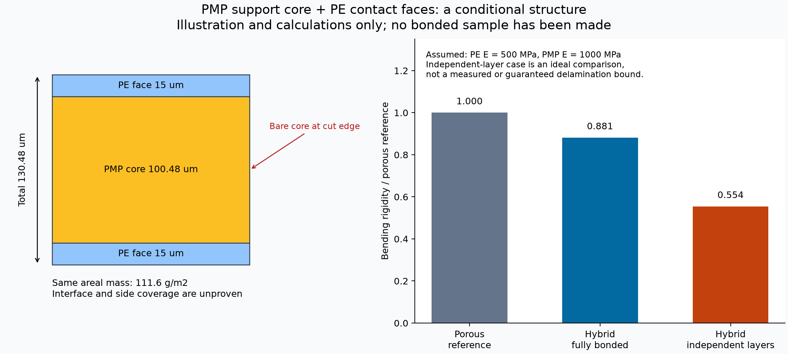
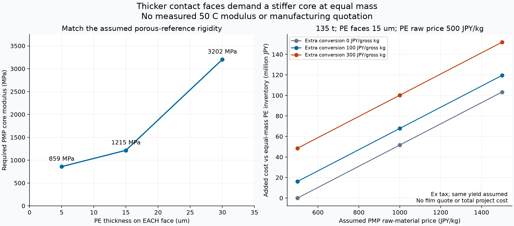

# 多方向探索第92巡：離型性と滑走性を分けたPMP複合枝の検証

2026-10-09 / Codex / 一次資料の追加と条件付き構造の比較。**物理試験0件、成功確率未算定。**

今回はPEだけの延長から離れ、PMP（ポリメチルペンテン）を調べました。成果は、**離型性の高い樹脂をそのまま「滑る雪」と見なす誤りを一次資料で避け、PMPを軽い支持芯、PEを接触面として使う構造の必要条件を数値化したこと**です。完成材料の採用や、90％超の実証成功を宣言する段階ではありません。

[計算・図・試験仕様](PMP候補と支持芯表面分離の検証_20261009/README.md)と[Claudeへの独立検証依頼](PMP候補と支持芯表面分離の検証_20261009/claude_handoff.md)を共有します。前巡は製法比較まで進んだ「進捗あり」の状態です。GitHubを再取得し、Claudeの[物性監査台帳](../調査台帳/物性値照合_自律ループv2v3.md)は前巡と同じ内容であることを確認しました。Claudeの現在の稼働・読了・返信は未確認です。

## 1. 新しい候補を選ぶ根拠と、採用を止める根拠

PMPのRT18/DX845はメーカー表で密度833kg/m³。軽量な支持構造を考える根拠になります。Tダイ製膜についてDX845は推奨、RT18は適用可能と記載されています。ただし23℃の射出成形片の物性を、50℃の微細な枝へ直接移せません。[メーカー物性表・2025年2月改訂](https://jp.mitsuichemicals.com/cn/special/tpx/pdf/1109_Physical_Properties_List.pdf)

市販フィルムの入口として、オピュランX-88BとX-88BMT4（50µm、後者は両面エンボス）を確認しました。公表の軟化温度52℃は「引張弾性率が300MPaになる温度」です。融点や高温工程で使えることと、荷重を受けて形を保つことは別です。120µmの多層品もありますが、内部組成をPMP単独と仮定しません。[三井化学ICTマテリアの製品表](https://www.mcictm.com/product/industry/tpx.html)

さらに、メーカーのPMP系樹脂特許には、未改質のA1で動摩擦係数0.51、改良配合の実施例1で0.35という測定値があります。相手はS45C鋼、環境23℃、0.75MPa、0.5m/s、0.9kmです。**A1は特許で合成された樹脂であり、RT18・DX845・オピュランの実測値ではありません。** 出願人の測定で、独立追試でもありません。[JP7088689B2・試験方法と表1](https://patents.google.com/patent/JP7088689B2/ja)

この結果はPMPの全銘柄が滑らない証明ではありません。しかし「離型性がよいからスキーも低摩擦」という選定理由は使えません。鋼の摩擦熱も測定されており、環境23℃を接触部の一定温度と扱えません。表の一部の比較配合には合計と記載の不整合があるため、その列を補正して配合設計には使っていません。

**次の方向は二つです。** 市販膜を剛い支持台に固定して、実スキー底面に対する表面だけの性質を先に測る。一方、支持構造にはPMPを残し、接触面をPEで担う案を条件付きで検討する。PMPとPEを混ぜれば両方の良さがそのまま出る、という計算はしません。

## 2. 結晶構造と滑走性の関係を確認した

PMPの溶液成長したラメラ結晶では、局所摩擦が走査方向に依存することが報告されています。これは結晶表面の構造が摩擦へ影響する研究上の根拠です。ただし確認できたのは研究機関掲載の要旨で、今回、全文や数値データは取得していません。[Pearce・Vancsoの研究機関記録](https://research.utwente.nl/en/publications/frictional-anisotropy-and-sectorization-in-poly4-methyl-1-pentene-2/)

樹脂のラメラ結晶、成形する枝状外形、氷の結晶、雪の圧雪バーンでの感覚は別です。局所摩擦の異方性から、向きが変わる粒床でどの方向にも同じように滑るとは言えません。常温で雪と同じ結晶が自然成長することや、50℃で再結合することを今回発見したわけではありません。常温噴霧結晶化・結晶複合材・可逆接点の探索も継続候補として残します。

## 3. 同じ重量で作る、支持芯と接触面を分けた枝

比較輪郭は前巡と同じ外幅2.22mm、枝幅0.72mm、自由枝長0.75mm、孔0.30mm。450mmの粒床に使う枝状粒の構想であり、固定マットへの置換ではありません。

仮のPE表面密度930kg/m³、PMP芯833kg/m³、前巡と同じ面密度111.6g/m²にそろえます。基準断面は[第91巡](GPT回答_多方向探索第91巡_内部孔に頼らない薄枝と製造費の両立_20261009.md)の多孔質180µm、表面弾性率500MPa・芯0.36倍という仮定です。

| 片面のPE厚 | PMP芯厚 | 全厚 | 基準と同じ曲げ剛性に必要な芯弾性率 |
|---|---:|---:|---:|
| 5µm | 122.81µm | 132.81µm | 859MPa |
| 15µm | 100.48µm | 130.48µm | 1,215MPa |
| 30µm | 66.99µm | 126.99µm | 3,202MPa |

**必要値は50℃で実測して確認すべき値であり、PMPが達成すると確認した値ではありません。** PE面を厚くして摩耗に備えるほど、同じ重量では芯が薄くなり、必要な芯剛性が上がります。5µm面を耐摩耗性の解決と扱うこともできません。

PE面のない一層PMPなら同重量で133.97µm、同曲げの必要弾性率は約764MPaです。しかしこれは表面の摩擦問題を解決しません。逆に表面だけPEにしても、PEとスキーの摩擦が目的を満たすと確認できたわけではありません。

図は完全接合を仮定した断面です。**切断した側面にはPMPが露出します。** エッジがそこへ荷重をかけるため、上下面だけを被覆して「接触はすべてPE」と数えることはできません。

## 4. 層を貼るだけでは成立しない

片面PE15µm、芯弾性率を仮に1,000MPaとすると、曲げ剛性は基準の0.881倍、先端変位は仮荷重下で8.31µmです。界面が力を伝えず各層が別々の中立軸で曲がる理想比較では、曲げ剛性は完全接合時の約62.9％になります。これは実際の剥離後の保証下限ではなく、層を重ねただけでは同じ設計にならないことを示す比較です。

同条件・公称2kPa・支持参加率1の線形模型で、接合面に約25.1kPaのせん断が生じます。荷重を増やすと大変形域へ入るため、その外挿値を必要接着強度や安全率には採用しません。剥離、摩耗端からの割れ、雨水の界面侵入、50℃での保持、凍結融解は別に調べます。

製法の候補は、連続積層後の輪郭加工と、面材を穴・縁へ回して機械的に保持する構成です。どちらも微細粒の量産方法として未確認です。低い表面エネルギーは接着にも不利になり得るため、接着剤の強さを仮定して成立させません。接合処方や残留物が未確認のまま屋外へ使う案ではありません。

また、50µm膜・弾性率300MPaという診断条件で同じ枝を計算すると、線形計算の変位が枝長の約47％に達します。**線形模型の範囲を外れるため、実際の変位予測には使えません。** 市販膜の存在は、膜をそのまま長い枝に切れば支持粒ができるという証拠にはなりません。ここでの300MPaは50℃実測値でもありません。

## 5. 摩擦と裂け方を、都合よく平均しない

メーカーのRT18・100µm膜の例では、MD/TDの引張弾性率は1.1/1.1GPaですが、引裂強度は33/195N/cmです。弾性率が等しくても、裂け方には約5.91倍の方向差があります。この表の試験温度は明示されていないため、50℃の値とは扱いません。[メーカーの薄膜参考値](https://jp.mitsuichemicals.com/en/special/tpx/pfas/index.htm)

枝の向き、切り欠き、加工方向を変えた摩耗試験が必要です。最も強い方向だけを採用して、粒全体が丈夫と判定しません。

表面が摩耗して芯が出る場合には、[第67巡の法線荷重分担](GPT回答_多方向探索第67巡_低摩擦相を微小接点へ行き渡らせる材料設計_20261009.md)へ戻します。仮にPE面の摩擦0.06、露出芯0.20、他の抵抗0、比較用上限0.08なら、芯が受け持てる法線荷重は全体の14.3％以下です。**これは露出面積14.3％という意味ではありません。** 特許の鋼相手の係数をスキーの計算へ移してもいません。板との実測が先であり、粒床変形の抵抗も別途加わります。

## 6. 軽い芯でも、経済的とは限らない

2,000m²、450mm、基準床密度150kg/m³の135tを同じ重量で比べます。粒床の嵩密度や充填体積が新案でも同じになる保証はなく、実際の必要量は敷き詰め試験で更新します。片面PE15µm案では芯が質量の75％です。

PE原料500円/kg、PMP原料1,000円/kgという仮条件なら、第91巡と同じ仮歩留まりの下で原料差額は税別約5,163万円。さらに接合等に100円/加工通過kgが加われば、追加分は計約6,781万円です。**原料と追加工程の感度計算で、業者見積ではありません。** 500円/kgを市販薄膜の購入価格と扱ってもいません。

PMPで軽くできることと、原料・積層・分別・交換を含めて安くなることは分けて評価します。2億円の整地設備・限定土木の検討枠に、この材料費を収納できたという結論ではありません。試作段階は既製膜を使った接触試験から入り、不確かな低摩擦を前提とする量産設備の設計を先に進めない順序にしました。

## 7. 次に何を測れば、この案を進められるか

[試験仕様](PMP候補と支持芯表面分離の検証_20261009/test_protocol.md)には、実スキー底面と50℃で比較する未実施18組を用意しました。既製膜2種とPE対照、MD/TD、独立試片対3組の初期比較です。既製膜のロット・価格・調達可能量、設備、協力先は未確保です。試験を実施したり、メーカーへ連絡したりした状態ではありません。

- 表面が低摩擦でなければ、PMPを滑走接点として採用しない。支持芯として残すかは、PE面の性能と接合費を含めて判断する。
- 50℃の実剛性が表の必要値に届かない、界面が滑る、繰返しで面が欠ける場合は、厚さや材種を再設計する。原料の室温カタログ値で埋め合わせない。
- 雨後の回収・60分整地では、回収質量だけでなくH/S、滑走抵抗、残留水、粒形、排出粉を確認する。剥離した複合粒がローラーだけで再接着するとは仮定しない。
- 冬は[第90巡](GPT回答_多方向探索第90巡_雪の固着を粒床と地盤までつなぐ冬季設計_20261009.md)の雪・床内部・下層までの保持へ接続する。雪下の連続した水層・油層を作らず、固定保持部は300mmの掘れ込みと余裕より下に置く従来条件を維持する。
- 完成品・摩耗粉・添加剤・界面処方まで評価する。メーカーの「可塑剤・シリコーン不使用」という製品説明だけで、人体や環境への無影響を認定しない。[メーカーの説明範囲](https://us.mitsuichemicals.com/service/product/opulent/index.htm)

今回の34算術照合は計算の内部整合を確認したものです。雪らしさ、安全、冬の定着、寿命、採算の同時達成は未実証で、成功確率はnullのままです。新たな一次資料と、次に棄却・改良する条件をGitHubに残して研究を進めます。
