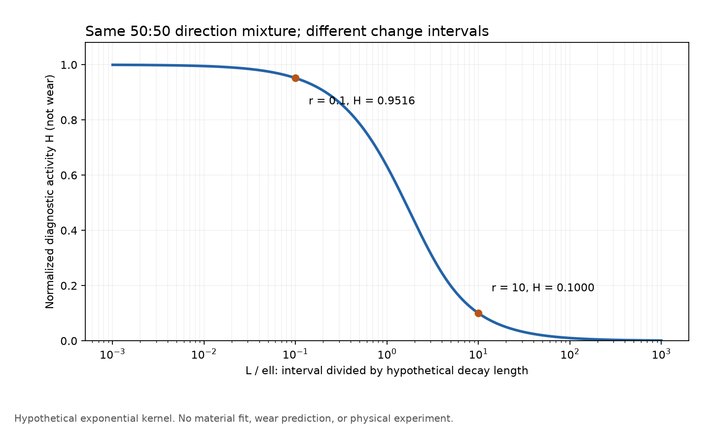

# 多方向探索 第93巡：方向変更間隔を含む滑走面と整地の再設計

2026-10-09／Codex。開始commit：`6eda59ccd678f3d5aee302dcbbf6e661aa36a5ed`。

**今回の変更は、粒を回して新しい面を出すことを無条件の再生とせず、回した後の滑走履歴まで含めて設計すること。** 新候補H93は、枝の材質だけを変える案ではなく、低拘束のほぐし・配材と、方向変化の小さい仕上げ圧密を分ける構成。改善効果は未実測であり、整地後の摩耗が増える反例も比較対象にする。

物理試験0件。設備・協力先未確保。成功確率は未算定で、15％から90％へ上がったとは報告しない。今回の成果は原著の追加照合、既存模型の識別不能性の反例、機構の修正案、実施条件と部分時間費用の具体化である。

## 1. 既存成果に追加したもの

[第42巡](GPT回答_多方向探索第42巡_摩耗後も滑りを保つ先端と接触相の配置_20261009.md)は整地による再配置と未知の摩耗倍率、[第54巡](GPT回答_多方向探索第54巡_雪に接する面の微細構造と回転摩耗_20261009.md)は粒の材料座標と方向行列Qを扱った。これを新発見として数え直さない。

今回は方向変更の**間隔**を変えた一次実験S3と、CSだけで単純な摩耗相関にならないS4を追加照合した。[出典台帳](方向履歴と整地負荷の分離検証_20261009/sources.md)に読めた範囲と条件を記載。原著の相手材・潤滑・温度が異なるため、人工粒の摩耗係数は得られていない。

[第92巡](GPT回答_多方向探索第92巡_離型性と滑走性を分けたPMP複合枝の検証_20261009.md)のMD／TDを別試片で測る条件に加えて、**同じ接点を別方向で擦った後の応答**が必要と分かった。単に試片を90°違う向きへ置いた二つの試験とは別の情報になる。

## 2. 同じ方向割合では履歴を区別できない

同じ表面に0°と90°が半分ずつ現れると、一定荷重・一定摩擦の仮定では、方向変更が1mmごとでも100mmごとでもQの小固有値は0.5。しかし変更後の応答が距離とともに変わる材料なら、二つは同じ摩耗とは限らない。

この識別不能性を確かめるため、変更直後1から仮の距離ℓで指数減衰する活動度を置いた。区間長Lに対する平均はH=[1−exp(−L/ℓ)]/(L/ℓ)。**これは材料の測定式でも摩耗予測式でもない。**

| 同じ方向割合・同じ総距離の診断 | L/ℓ | 仮の活動度H |
|---|---:|---:|
| 短い間隔で変更 | 0.1 | 0.951626 |
| 長い間隔で変更 | 10 | 0.0999955 |

比は約9.52だが、**摩耗が9.52倍になるという結果ではない**。Qだけでは区別できない自由度が残るという反例である。ℓを実材から測るまで、最適な整地間隔・粒径・寿命は逆算できない。[式・制限](方向履歴と整地負荷の分離検証_20261009/model.md)／[全結果](方向履歴と整地負荷の分離検証_20261009/results.json)。

さらに、粒Aが0°だけ、粒Bが90°だけ擦られた場合、二粒を合算すると等方に見えるが、各粒には方向変更がない。スキーのコース上のターン角を、そのまま一粒の交差せん断へ代入しない。180°の往復、転がり、除荷中回転も区別する。

## 3. 発明候補H93：向きを変える工程と押す工程を分ける

提案する構成は、既存の側方レール牽引式の前刃・配材・ローラー・スカートを使う際に、材料を強く押し付けながら繰り返し攪拌する区間を減らせるか検証するもの。特許上の新規性、製造可能性、採算は未確認。

~~~mermaid
flowchart LR
 A["山麓側に集まった材料の回収"] --> B["低拘束でほぐす・異物を分ける"]
 B --> C["不足部へ配材・高さを均す"]
 C --> D["主に直進する圧密・仕上げ"]
 D --> E["滑走とエッジ応答を確認"]
 B --> F["整地中の損耗を回収計測"]
 E --> G["その後の滑走中の損耗を別計測"]
~~~

具体的には、前方のほぐし部と後方の圧密部を別荷重制御にし、後方で必要以上の横攪拌を起こさない設定を比較する。ローラーの振動をなくすと決めず、法線振動と、粒を荷重下で回す運動を計測上分ける。前段の低拘束は無接触ではなく、粒間摩擦は残る。

**接触を離して回しても、次の板との擦れ方向は変わる。** したがって、整地中の損耗が減っただけで採用せず、整地後の滑走抵抗・エッジの支持と抜け・粉の発生を含めて比較する。前段で枝を折る、後段で硬い層を作る、濡れた粒塊を潰して排水を塞ぐ場合も不合格側の結果として残す。

材質・構造の選択は次の分岐にする。

| 方向 | 継続する構成 | 次に確かめる条件 |
|---|---|---|
| PE系開放枝 | 第91巡の緻密薄枝と第92巡の支持芯／滑走面分離 | 50℃の同一接点・変更後履歴。剛性や離型性だけで採用しない |
| 分子結晶・結晶複合 | 結晶の支持部と露出面を分ける既存案 | 擦れ方向の変化で劈開・脱落が増えないか。PEの式を流用しない |
| 温暖噴霧・局所再成長 | 成長結晶として形を戻す経路 | 再成長が面配向・粗さ・結合まで戻すか。外形の枝と結晶成長を区別 |
| 可逆接点・柔軟枝 | 第88巡の通過中解放と通過後再接続 | 接続回復と表面摩耗を別測定。再係合による砂状の擦過・引っ掛かりを残さない |

粒を一方向へ揃えるために全面を固定マットへ変える提案ではない。自由粒の300mm削れ代と450mm機能深さを維持する。薄膜PMPやPEの結晶性は雪の結晶成長そのものではなく、板の感覚が一致する証明も未取得である。

## 4. 最初に実施可能性を確認する試験と費用

校正3走行の後、基準UHMWPEと条件付きPE面／PMP芯試作品を、①一軸往復、②1mmごとの軸変更、③100mmごとの軸変更で各3組比較する。**18組すべて未実施**。試作できていない複合材の結果を埋めない。材料片18＋相手の実ソール片18を用い、同じ面の履歴を追う。

全群で1mm片道・累積1m・同じ除荷停止を合わせる初期案。仮速度50mm/s・加速度10m/s²では定速部分は距離の75％であり、加減速波形を分離する。これは高速滑走や耐摩耗寿命の試験ではない。

| 数量・仮定 | 18組の部分試算 |
|---|---:|
| 実移動25秒＋停止等2,000秒／組 | 10.125時間 |
| 着脱・記録20分／組 | 6時間 |
| 合計 | **16.125時間** |
| 仮3,000／10,000／30,000円／時間 | **48,375／161,250／483,750円** |

時間単価・停止2秒・設備能力は仮定で、見積りではない。校正3走行、加熱待ち、試料製造、治具製作、摩耗分析、準備、税、再試験は含まない。計算時間を物理実験の実績に数えない。1mで摩耗が検出されなければ0摩耗とせず、感度を確認して距離を延ばす。

詳細は[試験仕様](方向履歴と整地負荷の分離検証_20261009/measurement_protocol.md)。先に実測すべき点を限定することで、方向履歴に弱い材料へ大きな金型・工場費を掛ける判断を避ける。削減金額はまだ計上しない。2億円は従来の整地設備・限定土木の枠であり、材料・研究・工場の総額とは分けたままにする。

## 5. 全目的との接続・公開状況

- 気温30℃以上・表面50℃：試験仕様の対象。実測0件。
- 新雪圧雪の滑り・エッジ支持と短い抜け・沈み込み・振動：方向依存摩擦の合格だけでは達成にならない。雪対照との粒床評価を維持。
- 雨・台風後：材料回収と高さ復旧に加え、粒の破断・排水・滑走後損耗まで確認。昼閉鎖約60分の成立は未実証。
- 冬季：雪／素材境界の水溜まり、素材床内部、地盤までの荷重経路は第90巡を継承。無油でも安全な固着が保証されるわけではない。
- 人と環境：完成材・添加剤・摩耗粉・溶出・飛散を評価する条件を維持。無害性を断定しない。
- 現地冷却、常時散水、油・塩・フッ素・シリコーンによる潤滑は採用していない。

Claude公開台帳は前巡から変更なし。[独立検証依頼](方向履歴と整地負荷の分離検証_20261009/claude_handoff.md)をGitHubへ追加する。受領・返答・稼働は未確認。物理試験なしのため成功確率90％超の根拠はまだ作れていない。

[保存物一覧・再現方法](方向履歴と整地負荷の分離検証_20261009/README.md)。25件の算術照合、15条件の診断、18組の未実施割付を含む。公開ファイルをコミット単位で照合した後、ローカル研究データとGit履歴を削除し、接続案内・利用設定を保持する。
