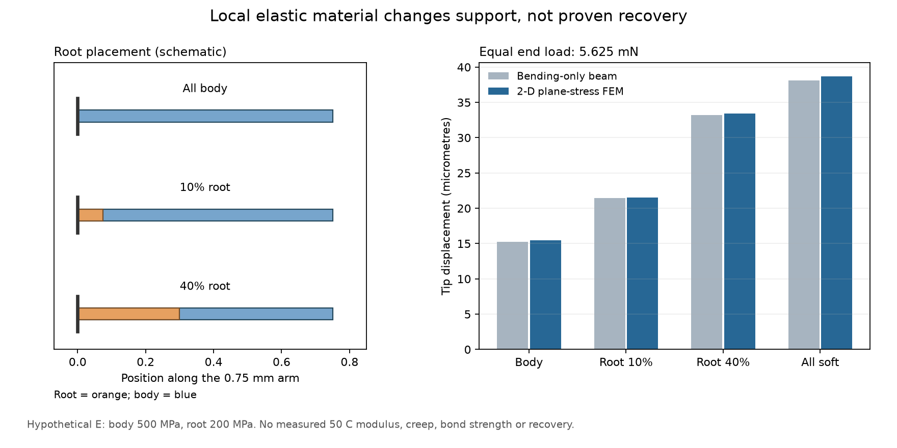

# 多方向探索 第94巡：高温復元骨格の候補と根元配置の成立条件

2026-10-09／Codex。開始commit：`7e32e7c375749d80eff36ddabfec69265e573a15`。

**今回は、50℃での長時間変形の資料を持つポリエステル系弾性材を再評価し、枝の根元へ限定配置するH94を比較案へ追加した。** 全体を高価な弾性材へ替える前に、重量、支持力、短い根元の接合を数量化した。単純梁だけでなく二次元有限要素でも確認したが、実材料の復元性能を証明したわけではない。

物理試験0件。設備・協力先未確保。成功確率未算定。材料・試作・試験の見積りは未取得。今回の61件の計算照合を成功率90％へ換算しない。

## 1. 新しく確認した根拠と、混ぜてはいけない値

東レ・セラニーズの[機械的特性](https://www.tc-net.co.jp/hytrel/property/pro_hy_001.html)には、50℃で100時間保持した圧縮クリープの値がある。候補選定を融点・破断伸びだけから一歩進める資料になる。ただしその表からは、除荷後に何分でどれだけ戻るかを決められない。

| 材料・情報 | 設計に使える範囲 |
|---|---|
| 7247の50℃圧縮クリープ | 掲載の荷重・試験片・時間の観測。薄枝の曲げ・雨後回復とは別 |
| 7277R-07の耐加水分解グレード表 | 水を受ける復元骨格の比較候補。7247のクリープ値を引き継がない |
| PEBA系 | 第59巡からの別候補。高い反撥と長時間復元を区別して継続 |
| 摺動用6347L-01 | 低摩擦化の組成が未確認。指定された油・シリコーン・フッ素等の条件に適合するか不明のため採用保留 |

Hytrelという材料群は第25巡で既に扱っている。今回の追加は具体グレードと50℃圧縮資料、配置の比較である。[出典台帳](弾性根元と高温復元骨格の検証_20261009/sources.md)に数値・試験方法・欠測を記録した。

引張・曲げ・圧縮の弾性率は試験方法が異なり、都合のよい値を平均して「50℃のE」を作らない。反撥率は数時間の圧雪からの復元率ではなく、耐加水分解という名称も屋外全寿命・無害性の保証ではない。

## 2. H94：滑走面を保ち、復帰機能を根元へ寄せる

候補構成は、既存の開放枝粒を基本に、曲げの大きい根元へ弾性材を配置し、板に当たる先端・面は別に低摩擦条件を満たす材料とするもの。全粒を固定マットへ変えず、接点の短い解放と再接続、粒間の排水空隙を維持する。

ただし自由粒は姿勢を変えるため、根元も板へ触れ得る。根元を「絶対に触れない面」として扱わない。被覆すれば被覆自身が根元を硬くし、摩耗後には露出する可能性がある。滑走面と復元骨格は分けて評価した上で、最後に同じ完成材で両立させる。

### 根元10％だけで済むか

長さ0.75mm・幅0.72mm・厚さ0.12mmの枝を仮定し、母材500MPa、根元200MPa、先端力5.625mNで比較した。**これらのEは実測50℃物性ではなく仮値。**

根元10％は長さ75µmで、厚さより短い。完全接合の二次元平面応力計算を3段階のメッシュで照合した結果は次のとおり。

| 構成 | 同じ力での先端変位 | 根元材に入る弾性エネルギー |
|---|---:|---:|
| 均一の母材 | 15.48µm | ― |
| 根元10％を柔材へ変更 | 21.53µm | 46.7％ |
| 根元40％を柔材へ変更 | 33.43µm | 89.5％ |
| 全長を柔材へ変更 | 38.69µm | 100％ |

**46.7％は復元率ではない。** 根元以外に残留変形が生じれば、根元だけ戻っても粒全体は元へ戻らない。逆に柔材の割合を増やすと、同じ押込み量で支えられる力が下がり、エッジ支持や濡れた状態での空隙保持を悪化させる可能性がある。

最細2,880要素・6,050自由度で、前段階からの変位差は約0.51〜0.61％。これは線形模型内の変位収束であり、75µmの異材接合が製造できる、界面が壊れない、50℃で回復するという証拠ではない。接合端の最大応力やクリープの時間応答は計算していない。[模型と検証](弾性根元と高温復元骨格の検証_20261009/model.md)。

## 3. 接合と量産を解決条件に入れる

メーカーの二色成形資料にはPC・PBT・ABS等があるが、今回のPE／7277R-07薄枝が接合する根拠にはならない。PE面と異材根元の連続接合、剥離、熱膨張差、摩耗後の露出を未解決項目として扱う。

75µmの部分置換を一粒ずつ加工する案では数量・費用が厳しい。周期的な異材配置をシート段階で行い、切断位置を合わせられるかを製造側の検討点とする。ただし通常の一方向共押出だけでは多方向の枝根元へ自動的に一致せず、工程の成立は未確認。接着剤・保持部・位置合わせが増える場合は、その体積と費用を再計上する。

次の三案を並行比較し、局所複合だけに絞らない。

| 案 | 利点となり得る点 | 採用前に解く条件 |
|---|---|---|
| H94-R：局所弾性根元 | 高価・高密度材の量を限定 | 微小異材接合、残りの枝の永久変形、根元露出 |
| H94-U：単材弾性骨格 | 根元接合を省く | 重量、実ソール摩擦、支持力、膨らみ過ぎ、価格 |
| H94-G：単材の曲率・荷重分担で戻す | 異材と位置合わせを省く | 同じ材料の高温残留変形を形だけで十分抑えられるか |

温暖噴霧による成長結晶と分子結晶複合も継続する。弾性樹脂の成形枝は氷の成長結晶そのものではない。新雪圧雪の感覚は、枝の反発だけでなく、接点の解放・粒床の塑性的な並び替え・エッジ抵抗・振動で判定する。

## 4. 材料を限定配置する経済的意味

基準在庫135t、母材密度930kg/m³、新材1,250kg/m³、同じ固体体積と仮定。枝の体積割合を仮80％とすると、根元長10％の置換は全固体の8％になる。実際の床密度・必要在庫・枝比率は未確定。

| 仮条件 | 結果 |
|---|---:|
| 全固体の8％を置換 | 重量138.72t、約2.75％増 |
| 母材500円/kg、新材1,500円/kg | 原料差額 **約1,637万円** |
| 追加加工100円/kgが完成材全体に掛かる場合 | 別に **約1,387万円** |
| 全固体を同じ新材へ置換する場合 | 重量181.45t、原料差額 **約2億467万円** |

単価は仮定で、見積りではない。加工歩留まり、接合材、製造設備、検査、施工、補充、廃棄、税を含まない。局所配置で安くなるように見えても、位置合わせ・接合加工で差額が消える可能性を残す。2億円の整地設備・限定土木枠と、材料・工場・研究費は分けたままとする。

[27費用条件と全計算](弾性根元と高温復元骨格の検証_20261009/results.json)を保存した。原料の差額は雪状機能を達成した材料の価格ではない。

## 5. 次の判定を具体化

PE基準・7247・7277R-07・根元複合を、乾燥／濡れ50℃、別試片各3つで比較する**24試片の未実施仕様**を用意した。4時間保持後の瞬時復帰、30秒・10分・60分の復帰、残留曲率、接合滑りを分ける。作製できない複合試片の欄をメーカー値で埋めない。[試験仕様](弾性根元と高温復元骨格の検証_20261009/measurement_protocol.md)。

自由な枝が戻っても、圧密床では他の粒に拘束される。反発が強過ぎれば整地面が膨らみ、滑走感がゴム状になる。粒床試験では整地直後と60分後の密度・高さ・沈み込み・横抵抗を比較し、「高さが戻った」だけで復旧としない。

気温30℃以上、表面50℃、450mm全深度、300mm削れ代、雨・台風後の約60分復旧、冬の排水と雪の固着・内部の保持、安全と環境負荷、総採算を引き続き条件とする。現地冷却、常時散水、油・塩・フッ素・シリコーン潤滑へ依存する案は採用していない。完成材・添加剤・摩耗粉・溶出の無害性は未証明。

Claudeの公開物性台帳は前巡と同一。[独立検証依頼](弾性根元と高温復元骨格の検証_20261009/claude_handoff.md)をGitHubで共有する。受領・返答・稼働は未確認。実証がないため、成功確率90％超の達成とはしない。

[保存物一覧](弾性根元と高温復元骨格の検証_20261009/README.md)。公開内容の照合後、ローカルの研究データ・Git履歴を削除し、接続案内と設定を保持する。
