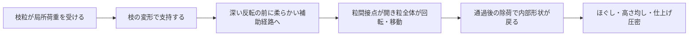
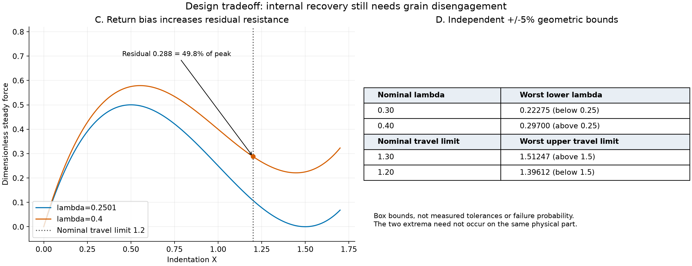
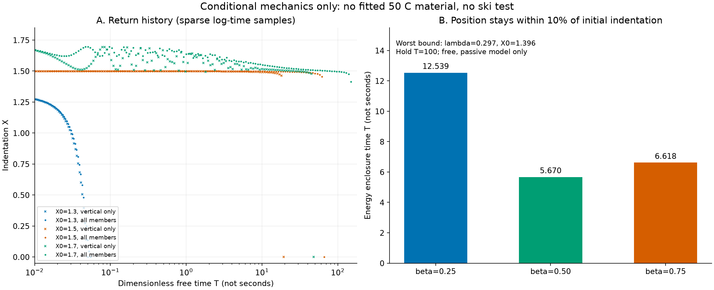

# 多方向探索第96巡：長時間荷重でも戻る粒形状と製造ばらつきの条件

調査開始：2026-10-09、最終照合：2026-10-10／Codex。物理試験0件、成功確率未算定。設備・協力先なし。

**今回の前進は、戻りを速く見積もる原因を二つ除き、試すべき形状条件と、その代償を数値で明確にしたこと。** 一部の部位だけを粘弾性とする模型では、一体材料の復帰を過大評価し得る。また「元の位置を一瞬通過」は、揺り戻しが収まることを意味しない。いずれも雪の滑走感・安全・90％超の実証成功率を達成したという結果ではない。

## 1. 今回調べた穴

[第95巡](GPT回答_多方向探索第95巡_一体架橋枝の50℃根拠と端材回収の経済性_20261009.md)の一体PE枝と架橋前端材回収は、接着点と端材損失を減らす工程候補だった。残る問題は、50℃で長く潰した枝が戻るか、戻してもエッジ抵抗が続かないか。材料のクリープ値だけでは決まらない。

Gomezらの粘弾性トラス模型は、第7巡で既に紹介した。本巡はその式を数値実装し、斜材にも同じ粘弾性を入れて比較した。さらに、形状の小欠陥が復帰遅延を変えるLiuらのドーム研究を参照した。両者は異なる材料・構造であり、文献の復帰時間をPEへ転用していない。[一次資料と適用範囲](保持履歴と全枝緩和の復帰検証_20261009/sources.md)

## 2. 全部位の緩和を入れると結論が変わる

以下はλ=0.2501、β=0.5、De=100、保持T=10という仮条件。同じ押込みから自由にした後、X=0を最初に検出する無次元時間。秒ではない。

| 初期押込みX | 垂直部だけ緩和する原型 | 斜材も緩和する拡張 |
|---|---:|---:|
| 1.3 | 0.05039 | 0.05452 |
| 1.5 | 19.35073 | 66.25073 |
| 1.7 | 48.07000 | T=150まで通過なし |

静的には戻るはずの形状でも、寸法や押込み履歴によって長く潰れた位置に留まり得る。T=150まで通過しない結果を「永遠に戻らない」とは扱わない。逆に、実材の緩和時間を測らずにこれを数秒・60分へ変換することもできない。[式・初期条件・限界](保持履歴と全枝緩和の復帰検証_20261009/model.md)

原型と全材拡張を72条件で比較。後述の候補6条件、寸法誤差12条件を追加した。原型と拡張の独立解法4組、報告するゼロ通過4例の刻み幅縮小を確認した。いずれも実験回数ではない。

## 3. H96：戻る形状の余裕＋内部変形を深くしすぎない構造

候補は、一体の枝粒の内部に戻り側の弾性経路を残し、深い反転へ入る前に柔らかな別の荷重経路へ移す構造。粒全体の回転・接触の開離は残し、床全体を硬いストッパーで支えない。製造時に同一材で形成し、未架橋端材を先に回収するH95と組み合わせる。接点が外れた後の再捕捉を抑えるH88、除荷してほぐしてから仕上げるH93を合わせて評価する。

これは機能の構図であり、実寸部品図・製造承認図ではない。粒間開離と補助経路の接触は今回の自由復帰ODEには入っていない。組み合わせれば必ず成立するとはしていない。

本模型のλ=0.25が静的分岐境界。寸法ごとの±5％を仮定すると、名目λ=0.30は下限0.22275へ落ちる。名目0.40なら下限0.29700。押込み上限を名目1.30にしても最大1.51247となるため、名目1.20、最大1.39612を比較候補にした。面積も±5％という仮定であり、直径公差や実測の工程能力とは違う。二つの最悪値は独立に評価した箱型境界で、同じ個体で同時に実現するとは限らない。

**代償は残留抵抗。** 名目λ=0.40では定常力の最大0.57889に対して、X=1.20でも0.288、約49.8％が残る。戻りだけを優先して硬くすると「雪を切る」代わりに抵抗が残る。ここは粒全体の回転・開離で力を落とす設計と一緒に試す必要がある。

## 4. 復元の判定を原点通過から修正

上記寸法境界のλ=0.296996、X=1.396122、保持T=100を用い、解放後の残存エネルギーも計算した。

| 仮の緩和割合β | 最初の原点通過T | 以後の変位が初期押込みの±10％以内に収まるエネルギー条件のT |
|---|---:|---:|
| 0.25 | 0.04520 | 12.53858 |
| 0.50 | 0.05469 | 5.67038 |
| 0.75 | 数値ゼロ付近の検出につき時間として不採用 | 6.61808 |

β=0.50では原点通過の約104倍の時間尺度まで揺り戻し余裕が残る。後列は自由・受動的な模型に限った位置の保証で、完全な応力緩和や繰返し荷重下の復元ではない。±10％は仮の変位許容帯であり成功率90％ではない。別解法で6条件を照合し最大相対差は約8.8×10⁻⁸。物性を合わせていないため実材の復帰時間として使用しない。

左図は対数時間で間引いた変位標本。高周波振動の周期を読み取る図ではない。右図は上表の有限範囲判定。

## 5. 結晶・滑走・雨・冬・費用との接続

| 目的 | 今回進めた部分 | 残る実証 |
|---|---|---|
| 雪状構造 | 開いた枝形状の潰れ残りを避ける条件 | 成形枝は雪の結晶成長ではない。PE内部の結晶性とも区別。結晶系の候補探索は継続比較する |
| 50℃・新雪圧雪の滑走感 | 形状復帰と残留抵抗の競合を定量化 | 実板の摩擦・摩耗、沈み込み、エッジ解放、振動は未測定 |
| 雨・台風後 | 質量・高さに加え、枝の復帰と横抵抗を復旧判定へ | 濡れで閉じる隙間、微粉混入、流出、引上げ時の破損を含む実験 |
| 冬の固着 | 油等の滑り層を追加しない構成を維持 | 雪／粒、粒内部、地盤の排水と残留せん断。枝が戻るだけで雪崩防止とはしない |
| 人体・環境 | 文献樹脂の使用例を安全証明にしない | 完成材・添加剤・架橋副生成物・摩耗粉・溶出・熱時接触の評価 |

30℃以上の外気・約50℃表面、約30°斜面、450mm機能層、300mm掘削、4〜5時間ごとの整地と約60分閉鎖を維持する。保持部を掘削範囲へ露出させない。回収ローラーの振動で形状が戻るという前提もまだ置けない。

完成材料135tの比較基準では、形状追加加工が税抜50/150/300円/kgなら追加675万/2,025万/4,050万円。仮単価の感度であり見積りではない。第95巡の端材回収節減と相殺できるかは歩留まり・加工速度・寿命を揃えて判断する。**2億円は従来の整地設備と限定土木の予算枠であり、今回の材料・研究・工場の総額保証ではない。** 個別組立部品は増やさず、一体形成を第一比較案に残す。

## 6. 次の判別とClaudeへの依頼

[50℃・乾湿・1秒/4時間保持の24個の未実施割付](保持履歴と全枝緩和の復帰検証_20261009/test_plan.md)を準備した。試す順番は、長時間保持で戻るか、粒群でエッジ抵抗が切れるか、摩擦・摩耗・雨後の再整地で同じ応答になるか。設備・協力先未確保のため測定値は空欄である。

[Claudeへの検証依頼](保持履歴と全枝緩和の復帰検証_20261009/claude_handoff.md)では、全材緩和の式、幾何公差の依存、粒内復帰と粒間開離の両立、結晶系の別案から取り込める機能の反証を求める。公開回覧板で共有する。受領・返答・稼働は未確認。Claudeの物性台帳は保存時点で変更を認めず、内容を上書きしていない。

[再計算入口](保持履歴と全枝緩和の復帰検証_20261009/README.md)／[状態](保持履歴と全枝緩和の復帰検証_20261009/research_state.json)／[数値検証](保持履歴と全枝緩和の復帰検証_20261009/validation.json)／[文書監査](保持履歴と全枝緩和の復帰検証_20261009/document_audit.json)。今回の結論は試作候補の条件整理であり、発明完成・特許新規性・90％超成功を宣言するものではない。
