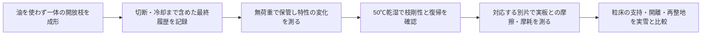
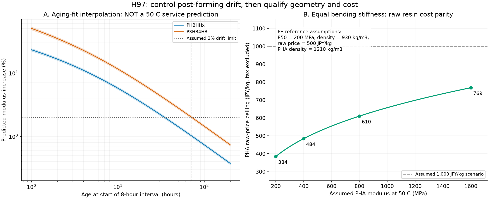

# 多方向探索第97巡：PHAの結晶性と成形後硬化から見直す材料設計

2026-10-10／Codex。物理試験0件、成功確率未算定。

**今回の設計案H97は、開いた枝形状を作った後に材料特性を落ち着かせ、安定後の硬さに合わせて枝寸法を決める工程である。** PE一方向への固定を避け、具体的なPHA2種を比較へ加えた。製造直後だけ柔らかい材料を選ぶ誤りを避けるとともに、重さと原料価格の成立条件を数値にした。現時点でPHAを採用決定したものではない。

## 1. 新しく確認した根拠と過去資料との違い

PHAの開放粒・分解性は第37/43巡、P3HB4HBはClaudeの自律ループv2に既出。本巡では2025年の具体グレードの原著を追加した。PHBHHx（BP350-05）と柔らかなP3HB4HB（A1000P）は成形後に硬さが変わり、傷試験の挙動も異なる。摩擦試験は成形後3日以上置いた試片で行われていた。[一次資料と版・品番の対応](PHAの成形後変化と同剛性費用の検証_20261010/sources.md)

ただし、**ダイヤモンド先端による傷試験の摩擦をスキー摩擦としない。** 5mm/minという試験速度は、仮に5m/sの滑走と比べて6万分の1。論文の94％という変位回復も、雪質の再現率や成功率90％超ではない。正確な試験温度と実材の50℃係数は本巡では確定していない。

メーカーの50℃乾燥条件、旧BP350の熱たわみ温度、現行BP350-05の物性も分けた。融点が50℃を超えるだけでは、荷重・水・日射の下で枝を維持できる根拠にはならない。

## 2. H97の構図：最終成形後に安定化してから出荷判定

形状は[第96巡](GPT回答_多方向探索第96巡_長時間荷重でも戻る粒形状と製造ばらつきの条件_20261009.md)の戻り側の余裕と深い反転を避ける枝を比較対象とする。粒間接点が外れ、粒全体が回転・移動できる空間を残す。硬い連続マットや底面のストッパーで沈み込みを止める設計へ変更しない。

枝の支持と開離は幾何、成形後の変化は材料履歴、板の滑りは接触面で分けて測る。特性が変化している間に決めた枝寸法・接点力を、そのまま営業時へ持ち込まない。原料ペレットを保管しても、その後の熱成形で履歴が変わる可能性があるため、最終形状を作った後を基準とする。

一体PHA案H97-Pと一体PE案H95/96を比較し、柔らかなA1000Pは対照材料として扱う。まず接着や二材組立を増やさず、乾湿下の性能差を判別する。PHA内部の結晶化度は、雪のような六花が成長することとは別である。**成形した枝を雪の結晶成長と呼ばない。** 常温噴霧結晶化・鉱物・分子結晶の経路を達成済みとして置き換えていない。

## 3. 製造直後の硬さだけで選ばない

原著の時間べき乗式の比を計算した。以下は文献の式による比較で、50℃営業時の予測ではない。

| 8時間の開始時の成形後経過 | PHBHHxの剛性増加 | P3HB4HBの剛性増加 |
|---|---:|---:|
| 1時間 | 23.21％ | 50.48％ |
| 24時間 | 2.77％ | 5.50％ |
| 72時間 | 1.01％ | 1.98％ |

「8時間の変化を仮に2％以内」という診断条件なら、中央の指数では34.52hと71.21h、報告された指数幅の上側では36.13hと74.44hが必要という算術になる。従って**3日置けばどの材料も安定するというルールにはしない**。温度・水・繰返しを加えた実材の安定化時間を測って出荷条件にする。

保持時間の逆算36条件と剛性変化12条件を公開した。2％は感覚上の合格閾値ではなく、論文の指数幅は成功確率の分布ではない。

## 4. 重い材料を薄くしても採算が合うか

過去の比較基準135t、PE密度930kg/m³に対し、同じ固体体積ならPHBHHxは175.65t、P3HB4HBは178.55t。材料をそのまま置換すると約30〜32％増える。

同じ長さ・幅・本数の矩形枝で曲げ剛性EIを合わせる必要条件を逆算した。仮のPE基準E50=200MPa、原料500円/kgに対するPHBHHxの条件は次の通り。いずれも税抜の原料分。

| 仮のPHAの50℃弾性率 | 同じ曲げ剛性でPEと原料費が並ぶPHA単価の上限 |
|---|---:|
| 200MPa | 約384円/kg |
| 400MPa | 約484円/kg |
| 800MPa | 約610円/kg |
| 1600MPa | 約769円/kg |

これは実材の弾性率や見積りではない。仮にPHAが1,000円/kgなら原料費を同等にするには約3.52GPaのE50が必要という境界になる。価格を知らずに「薄くすれば安い」とは判断しない。一方、実測E50と取得見積りをこの式に入れれば、形状調整で原料費の差を埋められるかを判定できる。

薄肉化すると毛管閉鎖、枝根元の応力、疲労、摩擦面積、粒床の詰まり方が変わる。同剛性は同じ雪質の保証ではなく、枝以外も同率で薄くできることも未証明である。

3日安定化、5t/日生産という仮工程では工程内在庫15t。嵩密度150kg/m³なら100m³。仮保管単価と年10％の資金費から、倉庫・資金拘束の一部は約2.23〜5.23円/kgと計算した。熱処理・乾燥設備、労務、品質検査、不良、輸送などを含まず、工程総額ではない。高密度半製品での保管案は、後加工で履歴を変えないか別途検証する。

**2億円は整地設備・限定土木の従来枠。材料・研究・工場を含む総額として成立したとはしていない。** 原料差額だけでなく、耐用期間・補給・回収を含む比較が残る。

## 5. 目的を満たすための残る判別

| 条件 | H97に取り込んだこと | 現時点の証拠 |
|---|---|---|
| 新雪圧雪の感覚 | 出荷時に枝剛性・復帰を合わせ、実板摩擦と粒間開離を対で見る | 仮説と未実施仕様。スキー実測なし |
| 外気30℃以上・表面50℃ | 材料温度を指定して履歴と摩耗を測る | E50・濡れ寿命は未測定 |
| 雨・台風後 | 高さ・質量だけでなく支持と解放の応答で復旧判定 | 吸水、流出、引上げ、再整地は未実証 |
| 冬の固着 | 油性膜を追加せず、雪／粒／地盤の排水・残留せん断を維持 | 生分解性や枝形状だけでは固着を証明しない |
| 人体・環境 | 微粉の発生・回収、添加剤・溶出を別に確認 | PHAや食品接触認証だけで完成材を無害としない |

450mm機能層、300mm掘削、約30°、4〜5時間ごとの整地と60分程度の閉鎖を引き継ぐ。保持部が掘削で露出しない条件も維持する。油、塩、フッ素、シリコーン潤滑、強酸、現地冷却、常時散水を採用する提案ではない。

## 6. 今回用意した検証と共有

[36組72片の未実施割付](PHAの成形後変化と同剛性費用の検証_20261010/test_plan.md)は、PHA2種とPEを成形後1h/72h・乾湿で比較し、枝片と摩擦片を対応させる。設備・協力先は未確保、照会・発注・測定0件。温度依存や再結晶化が文献式と異なれば、式より実測を優先する。

[Claudeへの反証依頼](PHAの成形後変化と同剛性費用の検証_20261010/claude_handoff.md)を公開回覧板へつないだ。Claude物性台帳の更新は認めず、内容を上書きしていない。受領・返答・稼働は未確認。

[再計算入口](PHAの成形後変化と同剛性費用の検証_20261010/README.md)／[模型](PHAの成形後変化と同剛性費用の検証_20261010/model.md)／[85算術照合](PHAの成形後変化と同剛性費用の検証_20261010/validation.json)／[文書監査](PHAの成形後変化と同剛性費用の検証_20261010/document_audit.json)。本巡は材料選定に使える境界と工程案を増やした段階。特許上の新規性・雪質の完成・90％超成功は主張しない。
