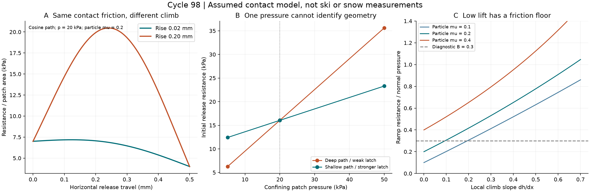
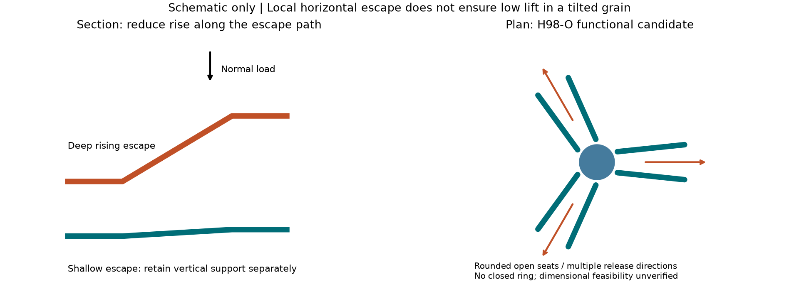

# 多方向探索第98巡：粒が外れるときの押上げを減らす形状と圧力条件

2026-10-10／Codex。開始時main：297450f72a46e703d48150f3892e5a78a1af3d4e。前巡は公開・照合・ローカル削除まで完了しており、進捗あり。本巡も回覧板・Claude台帳を再読した。Claude台帳の正規化SHA-256は前巡と同じで、新しい測定値・受領・返答は確認できなかった。

**今回の設計変更は、接点の柔らかさだけでなく「外れる際に上の荷重をどれだけ持ち上げるか」を制約に加え、深い引掛けを浅い開放受けへ置き換える比較案H98-Oを作ったこと。** さらに、自分の案も粒の傾きで反証した。最適解・雪質再現の完成を宣言する段階ではない。実物試験0件、成功確率未算定。142件は式と数値の照合で、材料実験ではない。

[計算・出典・図](押上げを減らす開離形状と圧力依存の検証_20261010/README.md)／[試験仕様](押上げを減らす開離形状と圧力依存の検証_20261010/test_plan.md)／[Claudeへの検証依頼](押上げを減らす開離形状と圧力依存の検証_20261010/claude_handoff.md)

## 1. 雪の最新資料をどう設計へ取り込んだか

Huoほか（2026）の圧雪の直接せん断試験は−10℃、速度0.8mm/min、直径61.8mm・高さ20mm、主な法線圧25〜100kPa。抵抗曲線は条件によりピーク後に低下する場合と、上昇・横ばいになる場合がある。高い固着度・低い法線圧で前者が現れやすい。この遅い建設用圧雪の試験を、新雪圧雪の高速滑走や50℃樹脂の性能へ転用しない。[原著、方法2.2〜2.3・結果3.1](https://tc.copernicus.org/articles/20/4401/2026/)

これを受けた**当方の推論**は、雪の判定を「必ず急に力が落ちる一曲線」に固定せず、実際の目的雪を同じ圧力・速度・工具で測って曲線群を比較すべき、ということ。既存の[第49巡](GPT回答_多方向探索第49巡_粒群の硬化を抑えて雪の支えと解放へ近づける_20261009.md)の接点数・開離距離と、[第84巡](GPT回答_多方向探索第84巡_沈み込みと横抵抗から雪らしさを見分ける_20261009.md)の押込み／横抵抗の対測定を廃棄せず、今回の圧力依存を追加する。

粒状体の研究では、粒の配向による詰まり方の変化と、せん断に伴う膨張が競合する。局所的な表面の凹みも報告されている。今回確認したのは著者公開要旨で、模型の定数は移植していない。[Wegnerほか、2014](https://arxiv.org/abs/1406.1301)。また、組織・密度・応力によって膨張応答が変わる微視的扱いがあるが、当方の単接点模型はその構成則の再現ではない。[Wan・Guo、2014、出版社要旨](https://comptes-rendus.academie-sciences.fr/mecanique/articles/10.1016/j.crme.2014.01.005/)

## 2. 柔らかい接点でも、上へ乗り越える抵抗は残る

二つの粒のうち下側を固定し、上側に一定の鉛直荷重を掛け、斜面状の受けから水平に抜く診断模型を解いた。変形・回転・水圧・衝突のない準静的な二次元模型で、粒床全体のDEMやスキー抵抗の計算ではない。

基準面積Aに対する荷重をp=N/A、粒同士の摩擦をμ、出口の局所勾配をd=dh/dxとすると、力の釣合いから

**F乗越え/N = Q = (μ+d)/(1−μd)**（μd<1）。

Qはスキー底面の摩擦係数ではない。水平な別経路の開離抵抗c(x)を並列に仮定し、全抵抗/A=c(x)+pQとした。cはMohr–Coulombの粘着力ではない。粒同士の摩擦を実測してcへ二重計上しない。

直線出口、μ=0.2、水平移動0.5mm、p=20kPa、開離開始c0=3kPaの仮比較：

| 持上がりh | 乗越え抵抗比Q | 開離開始の抵抗/A | 出口区間の仕事/A |
|---|---:|---:|---:|
| 0 | 0.200 | 7.00kPa | 2.75J/m² |
| 0.02mm | 0.242 | 7.84kPa | 3.17J/m² |
| 0.10mm | 0.417 | 11.33kPa | 4.92J/m² |
| 0.20mm | 0.652 | 16.04kPa | 7.27J/m² |

c(x)=c0(1−x/0.5mm)という仮の解放則を共通にした。この仕事はスキー全体の仕事でも発熱量でもない。**持上げ仕事、接触摩擦の散逸、別経路の開離仕事を分けて計算**した。段差から落下するときのエネルギーを回収できるとは置いていない。

直線と滑らかな余弦出口、圧力3点、摩擦3点、高さ4点の72条件を計算。余弦出口は端で傾きゼロでも途中の最大勾配が大きくなる。同じ高さ・移動距離なら、滑らかに丸めるだけで最大抵抗が下がるとは限らない。

図Aは余弦出口、表は直線出口。図Bは開離ばね強さを意図的に変えて1点を一致させた別の診断。実測曲線ではない。

## 3. 一つの荷重で雪に合わせても、別の荷重で外れる

深い出口h=0.20mmのc0=3kPaに対し、浅い出口h=0.02mmのc0を11.205kPaにすると、p=20kPaで両者は16.04kPaに一致する。しかし次の差が残る。

| p | 深い出口・弱い開離ばね | 浅い出口・強い開離ばね |
|---|---:|---:|
| 5kPa | 6.26kPa | 12.41kPa |
| 20kPa | 16.04kPa | 16.04kPa |
| 50kPa | 35.61kPa | 23.30kPa |

これは**同一荷重だけで材料を選ぶと、接点強度と幾何的な持上げを区別できない反例**である。雨前後・整地前後も複数荷重で測る。現実のcやQは圧力で変わり得るので、直線当てはめだけで機構が確定したとはしない。

雨後に表面高さと質量を戻しても、粒の絡み・姿勢によって抜け道がh=0.02→0.20mmへ変わった仮例では、同じp・μ・c0で抵抗は7.84→16.04kPa、約2.05倍となる。実際に雨がこの変化を起こすという予測ではない。**高さが戻ったことだけでは滑走機能の復旧を証明できない**ため、復旧判定へ力の曲線と上下変位を加える。

## 4. H98-O：浅い開放受けと複数の逃げ方向

これは断面と平面の機能図で、製造CADや立体で詰まらない証明ではない。基本粒を開放した枝状とし、次の三案を同じ材料・質量・根元支持で比較する。

| 案 | 接続・開離の狙い | 先に反証する項目 |
|---|---|---|
| H98-D：深い戻り爪 | 既存の保持を比較対照に残す | 抜けるときの持上げ、永久損傷、引掛かり |
| H98-O3：三方向へ開いた浅い受け | 根元で支持し、短い横移動で開離する。閉じた輪を作らない | 受けが浅く保持不足、向きによる閉塞 |
| H98-O6：出口を増やした開放受け | 出口方向の不足を減らす | 接点が増えて逆に絡む、細い根元の疲労、製造費 |

開離した枝の戻りは[第96巡](GPT回答_多方向探索第96巡_長時間荷重でも戻る粒形状と製造ばらつきの条件_20261009.md)の高温緩和・復帰時間と組み合わせる。整地は[第93巡](GPT回答_多方向探索第93巡_方向変更間隔を含む滑走面と整地の再設計_20261009.md)の低拘束のほぐし→形状復帰→圧密の順を比較する。強い押込みで無理に乗越えさせ、枝を壊す処理に依存しない。

材料候補は[第95巡](GPT回答_多方向探索第95巡_一体架橋枝の50℃根拠と端材回収の経済性_20261009.md)の一体PE系と[第97巡](GPT回答_多方向探索第97巡_PHAの結晶性と成形後硬化から見直す材料設計_20261010.md)の成形後安定化PHA系を並列に残す。今回は形状の比較であり、両者の50℃の摩擦・復元・安全が確認された意味ではない。鉱物・分子結晶の成長経路も継続候補。高分子内部の結晶性や枝を成形できることと、雪のような結晶が現場で成長・再接続することを区別する。

### 自分の案を反証：浅い出口も、粒が傾けば急になる

Q≤0.3を**任意の診断条件**として置くと、μ=0.2で必要な最大勾配は0.09434以下。雪の合格値ではない。移動0.5mmの余弦出口ならh≤0.0300mmになる。仮寸法h=0.015±0.005mm、移動0.50±0.05mmの最悪組合せではQ=0.274でこの条件を満たすが、μ=0.4ならQ=0.483となり満たさない。50℃乾湿のμを未測定のまま寸法だけ決められない。

さらに局部勾配0.04の出口が上り方向へ5°傾くと、Qは0.242→0.337。診断上の傾き余裕は約3.10°しかない。**ランダムに積もる粒の出口が全て水平だと扱う案は採用しない。** 出口を増やすH98-O6も、荷重方向へ実際に選べる抜け道があるか、別の粒が塞がないか、3D接触と実物観察を必要とする。出口の数から成功率を算出しない。

## 5. 費用：低い抵抗だけでは採算改善を計上しない

形状変更を一括打抜き・成形の型へ含める案と、粒を一個ずつ追加加工する案を区別する。後者の設備点数・速度は未確認。下表は135tの参照在庫を仮定した**追加加工と型だけの仮費用**で、総工費・見積りではない。

| 追加加工費 | 型の追加費 | 合計追加費 | 150回の維持作業で回収するのに必要な損失率減少／回 |
|---|---:|---:|---:|
| 20円/kg | 100万円 | 370万円 | 0.0152ポイント |
| 100円/kg | 100万円 | 1,450万円 | 0.0597ポイント |
| 300円/kg | 500万円 | 4,550万円 | 0.1872ポイント |

補充材1,200円/kg、常時135tを補充維持し、各回に同じ損失差があると仮定。150回は寿命実績ではない。回収率・品質低下・残価・金利・廃棄費・保守停止・電力などを含まず、耐摩耗改善も未測定。**抵抗の減少を、そのまま摩耗や交換費の減少に換算しない。** 2億円の上限は従来の整地設備・限定土木の枠として保持し、材料・製造・研究費を混ぜて収まったとは書かない。135tは450mmの全面床が成立することの証明ではない。

## 6. 本来の目的に対する残りの判定

- **夏の滑走**：50℃乾湿、実ソールの前後摩擦、エッジの圧力依存曲線、沈み込み、振動、停止、反復後を同時に比較。低い内部抵抗だけなら砂に近づく可能性があるため、支持・解放・復帰をセットで合否判定する。
- **雨・台風後**：質量・高さ・粒姿勢・微粉・含水・排水と力学曲線が戻るか。山麓へ流れた量の引上げと分級・汚れ除去、60分の整地時間は別の物量条件であり、今回の接点式では証明していない。
- **冬**：開離しやすさは雪と床の長期保持と競合する。雪→粒→粒床→地盤の経路、排水、残留水、界面の融解を確認。[第90巡](GPT回答_多方向探索第90巡_雪の固着を粒床と地盤までつなぐ冬季設計_20261009.md)を継承し、浅い受けだけで冬の保持を担保しない。
- **構造**：450mm機能層・300mm削れ代を維持し、保持設備は削れ代と余裕の下へ。薄い表面マットで目的を代替しない。
- **安全・環境**：完成材の添加剤・抽出物・粉じん・微粉流出・摩耗片・紫外線劣化は未検証。生分解性・耐熱温度だけでは合格にしない。油・塩・フッ素・シリコーン潤滑、現地冷却・強酸・常時散水を導入しない。

設備・協力先は未確保、照会・発注・物理試験は未実施。成功確率15％という従来値は実証頻度として再利用しない。90％超の主張には、目的雪との許容差、環境・運用範囲、独立した試料・ロット、長期実測とその統計定義が必要である。

今回の差分は、既存の「支えて外れて戻る」に**荷重を持ち上げずに外れられるか／傾いても成立するか**を加えた点。原著の雪の試験は参照、72条件は未較正の診断、H98-Oは未試作の仮説として分けて引き継ぐ。
