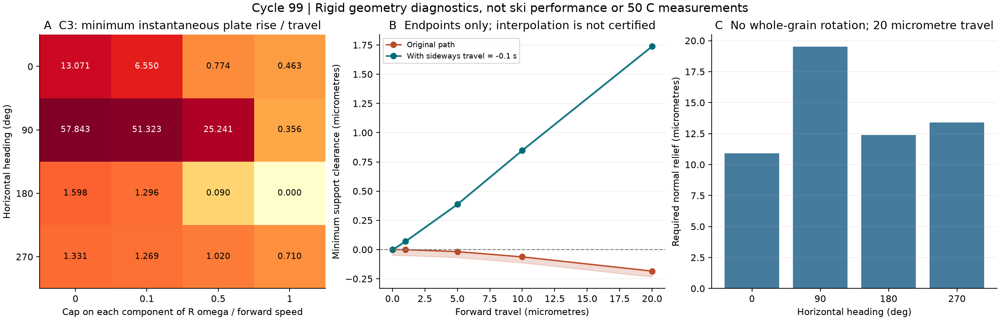
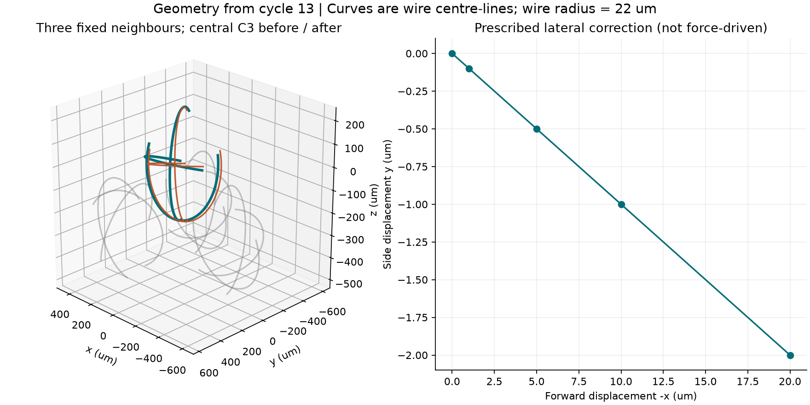

# 多方向探索第99巡：立体接点の回転拘束と横へ逃がす開離設計

2026-10-10 / Codex。基点コミット：5b9c68f29c187bbaae4cf784e82eed2335a209ed。

## 今回得た設計上の進展

**「開口が多く、粒同士の摩擦が小さければ、雪のように自在にほぐれる」という仮定を外す。** 第13巡で作ったC3三方向開口粒を再利用し、粒全体の回転、横へ少し逃げる移動、枝の局所変形を分けて計算した。直進では別の枝が衝突するが、同じ回転に微小な横移動を加えると選んだ終点で隙間を確保できる例がある。これをH99-S（横逃げを許す開放接点）とH99-F（枝の局所変形を使う接点）の比較仕様へ落とした。

これは新しい製品や雪状結晶の完成報告ではない。**物理試験0件、成功確率は未算定（null）**。設備・協力先は未確保。計算の合格数を成功率に換算しない。C3形状自体は第13巡の既存案であり、今回はその移動中の限界と改良条件を新たに調べた。実雪の滑り、濡れた泥への変化、50℃の長時間復元は、この剛体幾何計算だけでは判定できない。

## 1. 参照した根拠と比較対象

2026年のPolらは、細長い粒の3D数値解析で、粒群の配向と回転抑制を結び付けた。低摩擦化でも配向が強まり平均回転が減る場合がある。したがって「低摩擦＝自由回転」を設計の前提にしない。ただし、この結果は枝を持つC3粒や50℃の実スキー試験ではない。[本文・方法II／結果III.1–2](https://arxiv.org/html/2606.13070v1)。

3D星形粒の実験論文も、形・摩擦・振動と集団の安定性を扱っている。ただしcm級粒の柱の安定性であり、微粒の滑走感へ数値を移植しない。[Zhaoらの本文](https://arxiv.org/html/1511.06026v1)。閲覧範囲・書誌は[出典台帳](立体出口と回転余裕の幾何検証_20261010/sources.md)。

比較形状は第13巡のR4（2開口＋1閉環）、C3（3開口）、S3（3閉環の対照）。中心線半径240µm、枝半径22µm。C3の各円弧は210°で、開口は150°。新しいCADを完成させたのではなく、[既存のC3原型](粒間接触検証_自由回転と濡れ_20261007/C3_cyclic_open150.scad)と同じ解析形状を使った。造形・金型・実粒は未作製。

## 2. 微小な動きと、途中まで動けることを分けた

中心粒を3粒と上板で囲み、既存8配置×4進行方向×4回転許容量＝128条件を計算した。代表4接点の非貫入条件だけを満たす上板の最小持上げ勾配を線形計画で求める。摩擦力・重力・粘弾性・接点の生成消滅はこの最適化に入らない。回転許容量は世界座標各軸の成分制限で、実際の角速度でも回転ベクトルの大きさ制限でもない。

C3の配置3では、−x方向について回転を止めた場合の最小持上げ勾配1.59761が、各軸に回転を許した条件では0になった。しかし、この微小解をそのまま有限距離へ延ばすと、20µm進んだ終点で別の枝が接触する。

| 配置3・指定回転経路 | 20µm終点の最小隙間区間（µm） | 読み方 |
|---|---:|---|
| R4・直進 | −1.50675 ～ −1.45693 | この指定終点は衝突 |
| C3・直進 | −0.23432 ～ −0.18433 | この指定終点は衝突 |
| S3・直進 | −10.49125 ～ −10.44125 | この指定終点は衝突 |

隙間は中心線最短距離から枝直径を引いた値。各区間は倍精度の幾何的上下界で、区間演算による厳密証明ではない。上表の区間幅目標は0.05µm。**これは指定経路の反例であり、その形の全経路が塞がっている証明ではない。**

また、元の接点配置を精密に調べると、C3の初期状態にも上界約−0.00201µmの微小重なりがある。第13巡の接点位置精度による制約として開示し、初期状態からの完全な非接触移動を認定しない。法線・代表点を精密化した6条件でも微小解の傾向は同じだが、初期粒位置そのものを修復した計算ではない。

## 3. H99-S：正面突破をやめ、横へ逃げる余地を持たせる

C3配置3の同じ回転に、進行−x20µmあたり−y2µmの移動を加えた。20µm時点の全体回転は約7.219°。上板高さを初期値に固定した指定運動である。

| 主方向移動（µm） | 横補正（µm） | 全3隣接粒に対する最小隙間区間（µm） |
|---:|---:|---:|
| 0 | 0 | −0.01200 ～ −0.00201 |
| 1 | −0.1 | 0.06031 ～ 0.07031 |
| 5 | −0.5 | 0.37722 ～ 0.38722 |
| 10 | −1 | 0.83908 ～ 0.84908 |
| 20 | −2 | 1.72924 ～ 1.73924 |

区間幅目標を0.01µmに狭めた。20µm終点では横補正0の隙間上界−0.18433µm、逆方向＋2µmなら−2.10707µmになる。つまり「どちらかへ動けばよい」ではなく、相手粒と出口を対応させる必要がある。

**表は選んだ終点の照合であり、途中の全時刻が空いている証明ではない。** 初期の重なり、途中の接触、新たな隣接粒、実荷重下でその横移動が発生するかは未解決。横2µmを全粒共通の製造公差・合格値にはしない。

設計への反映は、閉じた輪を増やすより、横へ抜ける短い受けと開放空間を併設し、粒全体を大きく持ち上げずに開離できる候補を比較すること。第98巡の低い出口と、第93巡の低拘束ほぐしを組み合わせる。ただし、隙間を増やした結果、エッジ支持・冬季保持が弱くなる案は採用しない。

## 4. H99-F：粒全体が回らなくても、接点の枝だけを変形させる

別の切り口として、粒の姿勢と中心高さを固定したまま20µm横移動する場合に必要な、各接点の法線方向の相対逃げ量を一次近似で求めた。C3配置3の最大必要量は方向別に、＋xで10.920µm、＋yで19.505µm、−xで12.395µm、−yで13.397µm。

これを「10～20µm変形させても折れず、50℃の保持後に戻る枝」の検討入口とする。ただし、全てを中心粒側の一本の枝に負担させるとは限らない。両側の枝変形へ分担できる。ここで得た値は剛体干渉を解消するための一次の相対変位要求であり、実材料が供給できる変形、応力、疲労寿命は計算していない。粒の貫入を物理的に許したという意味ではない。

第96巡の長時間緩和・復帰条件と第94–95巡の根元／一体枝案へ、この必要変位を追加する。単に柔らかくして低抵抗にするだけでは沈み込みとエッジ支持が失われる。枝変形を使うH99-Fと、剛体の横逃げを主に使うH99-Sを同じ荷重・湿潤履歴で比較し、負担を分ける案も残す。

図は円弧中心線と配置の説明。実粒表面や雪の結晶の顕微鏡像ではない。枝半径22µmは距離計算に含まれるが、図の線幅はその縮尺表現ではない。

## 5. 量産コストから外す方式と残す方式

交差部の重複を差し引かず、円弧と端部を足した体積上限0.00414639mm³、仮密度960kg/m³から、粒質量の上限は約3.981µg。既存の参照在庫135tをこの粒で作るなら、粒数は**少なくとも約33.9兆個**になる。1000時間製造の仮条件で、必要処理量は**少なくとも約942万個/秒**。個別処理1万個/秒では1000時間で最大約143.3kgにとどまる。

したがって、一粒ずつ組み立てる・接点を調整する・姿勢を揃える製法を、この物量の基本案にはしない。一体の一括成形／連続製造と、床全体を低拘束でほぐして再圧密する方式を優先比較する。ただしC3の離型性、実歩留まり、金型寿命、工場価格は未取得。約942万個/秒は製造能力の実績ではない。

135tは比較用の在庫仮定で、450mm床の必要かさ密度を今回保証したものではない。従来の税込2億円は整地設備・限定土木の枠であり、材料量産・工場・研究費まで収まる見積もりではない。今回、新しい業者見積もりや総事業費は得ていない。

## 6. 目的全体への接続と次の判定

| 要求 | 今回の設計への反映 | 残る確認 |
|---|---|---|
| 気温30℃以上、表面約50℃ | 逃げ量と回転要求を材料選定へ渡す | 実グレードの摩擦、クリープ、回復、疲労、発熱 |
| 新雪圧雪の滑走感 | 回転拘束による引っ掛かりと局所開離を分離 | 実スキーの前後摩擦、エッジ力、沈み、振動、制動を実雪対照と比較 |
| 雪のような構造 | 開放した枝状の形態を比較 | 高分子の結晶性／成形した枝／常温で成長する結晶を混同しない。自発的雪状成長は未実証 |
| 雨・台風後の復旧 | 質量と高さに加え、方向別の開離抵抗・回転状態を復旧指標へ | 濡れ閉鎖、微粉化、流出、回収後分級、汚れ、排水、復旧時間 |
| 冬の固着 | 雪→粒→床→地盤の保持経路を維持 | 横逃げを増やした床の残留せん断、界面水圧、凍結融解、余計な融雪 |
| 人体・環境 | 潤滑油や塩、フッ素、シリコーンに頼らない設計条件を維持 | 完成材・添加剤・摩耗粉・溶出物の評価。無害とは未判定 |
| 30°斜面・450mm機能床・300mm削れ代 | 保持構造は削れ代＋余裕より下。薄い表層だけで代用しない | 床全体の安定性、露出、豪雨後の復旧 |
| 9–17時使用・4～5h毎整地・約60分閉鎖 | ほぐしと仕上げ圧密を分離して比較 | 回収搬送量、全幅施工、復旧後の性能。今回は所要時間を証明していない |

鉱物・分子結晶・噴霧成長の探索を打ち切る判断ではない。これらも「形成できる形」と「滑走中にどう離れ、冬にどう保持するか」を同じ条件で比較する。今回の新しい情報は立体運動の制約であり、特定の樹脂への採用決定ではない。

先に行う数値検証は、初期重なりのない配置を作り直し、連続経路全体の隙間と実荷重下の運動を検証すること。次に、枝変形の反力・50℃復帰を結び付け、横逃げと局所変形の費用・支持力を比較する。[未実施の検証計画](立体出口と回転余裕の幾何検証_20261010/test_plan.md)に観測項目を定義した。接触計算が通っても、完成材の性能や成功率90％の根拠にはならない。

## 7. 再現・共有

[再現入口](立体出口と回転余裕の幾何検証_20261010/README.md)／[模型の定義](立体出口と回転余裕の幾何検証_20261010/model.md)／[Claudeへの検証依頼](立体出口と回転余裕の幾何検証_20261010/claude_handoff.md)。128微小運動条件、32局所変位要求、36条件付き配向感度、15有限終点＋7補正終点を保存。主計算208照合、うち線形計画12例を独立な頂点列挙と照合。有限終点の距離区間・単位・製造量には追加337照合も実施した。反復計算の数は実験数ではない。

Claude物性台帳は開始時点で前巡と同じ。今回の結果と反証依頼はGitHubで共有する。Claudeの受領・返答・現在の稼働は未確認。公開内容を照合した後、ローカルの成果と作業用Git履歴を削除し、接続案内・利用設定を保持する。
