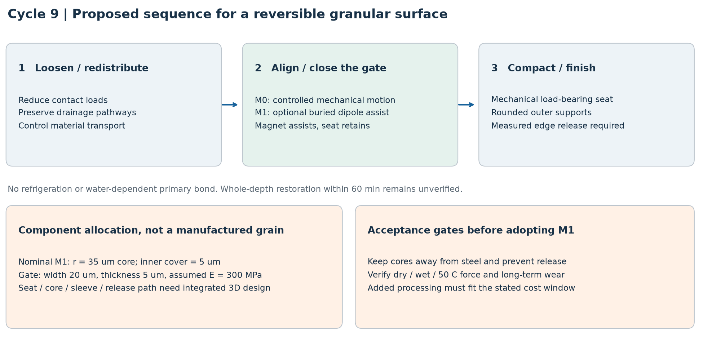
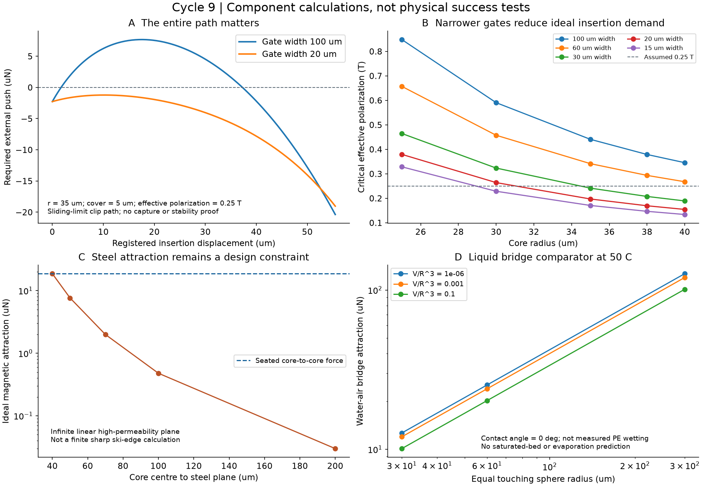
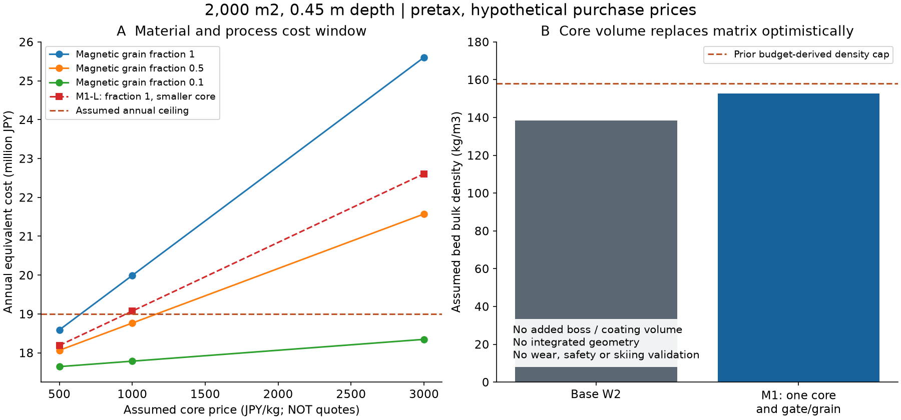

# 多方向探索 第9巡：磁力による接点誘導と液橋の比較

2026-10-07 / Codex / 独立研究報告。正本への採用・量産決定ではない。

参照開始点は main の [9565960](https://github.com/serimu-yamamoto/jinkoukousetu-docs/commit/9565960ab919415f20cdf2e29c73b8c0ff367c4a)。[第8巡](GPT回答_多方向探索第8巡_曲がる接点の非線形着脱と保持力の限界_20261007.md)の接点計算を引き継ぎ、今回は別原理である磁力と水の液橋を比較した。物理試験は0件、実物の成功確率は未算定。300条件や公差128条件の計算を成功率へ換算しない。

## 1. 今回の成果と進め方

**「入口を柔らかくする」「接点の向きを誘導する」「荷重を支える」「エッジで解放する」を分けた候補を、力と費用の両面で具体化した。** 磁力は保持座の代わりにせず、整地中の再接続を助ける選択肢として扱う。低い荷重で粒を動かせる工程を先に置き、最後に締め固める。

新しい候補は、開放粒の内部に小さな磁性部を埋め、薄い入口へ誘導する **M1**。比較用に磁性部をさらに小さくした **M1-L** も計算した。

| 今回明らかにしたこと | 計算による結果 | 設計への反映 |
|---|---|---|
| 接続完了時の磁力だけを比べると途中の抵抗を見落とす | 幅100µmの入口では、途中に最大7.668µNの追加押込みが必要 | 力を挿入経路の全161点で比較 |
| 入口を狭くすると必要な力を下げられる | M1の幅20µmでは、理想経路上の追加押込みが全標本で非正 | 自動接続の証明ではなく、条件付きの力の余裕 |
| 寸法・硬さのばらつきで余裕がなくなる | M1の調べた公差端では最大3.903µNの追加押込み | 磁力に任せず機械で挿入する工程を残す |
| 接点を締めてから磁力で回すのは不利 | 仮の摩擦抵抗に対し、0.9mN接触荷重でも最大磁気トルクは約1/54 | ほぐす→低荷重で再配置→押込み→仕上げ |
| 小型化は安くなるが、接続の余裕を減らす | M1-Lは仮かさ密度147.37kg/m³、必要磁化尺度0.2287T | M1の152.61kg/m³・0.1971Tと対比 |
| 液橋もµN級の補助力を作る | 50℃・完全ぬれ・半径30µmの接触球で約10.1〜12.7µN | 常時散水や全天候の主結合には採用しない |

**開発の基準は磁石なしの機械的再接続 M0 とし、M1/M1-Lが本当に再整地負担を減らすかを比較する。** 磁石を追加すれば改善するとは決めない。弱い接続の利点を残し、強い支持は内部の受けに担当させるという融合案である。

雪の結晶と同じ物質・結晶格子ができたという結果ではない。狙うのは、軽い開放骨格、接点の解放と再形成、適度な散逸と排水を組み合わせた雪状の応答。滑走抵抗・エッジの入りと抜け・残留溝はまだ実測されていない。

## 2. 別原理を選んだ根拠

弱い磁気相互作用が、粒の並びと締固まり方を変える一次実験がある。Coxらの円板実験は、磁気引力約0.05Nが強い圧縮力約2Nより小さくても、緩んだ状態の構造形成へ影響し得ることを示す。今回へ移すのは「軽い荷重での組織化」と「締固め後の荷重支持」を分ける考え方だけである。12.7/15.9mmの2次元円板系であり、当方の微細な3次元床の性能・配合率・滑走感を保証しない。[著者論文：Self-organized magnetic particles](https://arxiv.org/abs/1511.02219)

磁性材料の比較尺度には、Arnoldの樹脂結合Srフェライト2039の公式資料を使った。23℃のBrは0.277〜0.307T、Brの可逆温度係数は−0.20%/℃、密度は3,800kg/m³。線形補正では50℃のBrは約0.262〜0.290Tとなる。ただし、これを実際の70µm部品の有効磁化や空隙磁束へ読み替えない。2010年改訂の参考物性であり、微小部品の製造保証・購入見積りではない。[メーカー資料](https://www.arnoldmagnetics.com/wp-content/uploads/2017/11/Plastiform-2039-Magnetic-Material-Datasheet.pdf)

本計算は50℃での有効磁化尺度を独立に仮定する。接点のE=300MPaも仮定で、50℃の吸水・クリープ・繰返し疲労を保証する値ではない。磁性部を柔らかいばねそのものには使わず、柔らかい入口と別部位に配置する。

## 3. M1の構成と接続経路



この図は**機能の配置と工程の案**。全粒の製造図ではない。第6巡W2の丸い支点、内部の荷重受け、開放通路を基礎に、次を追加する。

| 部位 | M1 基準案 | M1-L 小型対案 |
|---|---:|---:|
| 磁性部の等価球半径 | 35µm | 30µm |
| 接続相手側の被覆厚さ | 仮5µm | 仮5µm |
| 入口の幅 / 厚さ | 20 / 5µm | 15 / 5µm |
| 入口の曲率半径 | 第8巡と同じ50µm | 同左 |
| 入口の仮E / 接触摩擦係数 | 300MPa / 0.2 | 同左 |
| 有効磁化尺度 J_eff | 仮0.25T | 仮0.25T |
| 接続終端の磁性部中心間隔 | 80µm | 70µm |

磁性部はソール側へ露出させず、粒の内側で働かせる。ただし「内側にある」だけで鋼製エッジから十分離れるとは限らない。W2の全方向保護余裕を新形状へそのまま引き継ぐことはできない。磁性部・被覆・荷重受け・解放経路を同時に組み込んだ3D設計は未完了。

今回の力モデルは、固定磁気モーメントを持つ2つの点双極子。球体積からモーメントを配分し、最も都合のよい軸上の引合いを比較する。

```text
m = (J_eff / μ0) × (4πr³ / 3)          [A m²]
Fmag(d) = 3 μ0 m² / (2π d⁴)           [N]
Umag(d) = − μ0 m² / (2π d³)           [J]

d(u) = 2(r + cover) + u_end − u
Fclip(u) = Fref(u) × (width/100µm)
                    × (E/300MPa) × (thickness/5µm)³
Fexternal(u) = Fclip(u) − Fmag(d(u))
```

uは第8巡のクリップ挿入座標。磁性部もこの座標に沿って同じ距離だけ近づくという仮定を置く。実際の粒の回転・偏心・反磁界・磁区・接触点移動・磁性部変形は入っていない。

終端のM1引力は18.700µN。一方、幅100µmの入口では、まだ磁性部が離れている途中に抵抗が勝る。幅を下げた結果は次のとおり。

| 入口幅 | 全標本で正の追加押込みを不要にするJ_effのしきい値 | J_eff=0.25Tでの最大追加押込み |
|---:|---:|---:|
| 100µm | 0.4407T | ＋7.668µN |
| 60µm | 0.3414T | ＋3.065µN |
| 30µm | 0.2414T | −0.228µN |
| 20µm | 0.1971T | −1.225µN |
| 15µm | 0.1707T | −1.673µN |

負の値はこの理想経路の標本上で外から正の押込みを加える必要がない、という意味に限る。自由な粒がその姿勢に入り、安定して動き、最後まで接続する確率を表さない。第8巡から引き継いだすべり限界経路であり、静止摩擦からの遷移、面外ねじれ、動的安定性も未計算である。

公差端の比較では、M1のr=34µm、被覆7µm、幅22µm、厚さ6µm、E=400MPaでしきい値が0.3535Tまで上がった。J_eff=0.20Tなら最大3.903µNの押込みを要する。小型M1-Lは公差端でしきい値0.4238T、最大3.473µN。**小型化で価格は下がるが、磁力だけに頼る余裕は小さくなる。** 全ての中間公差・姿勢を保証した計算ではない。



## 4. 磁力を利用できる工程と、利用できない荷重

M1の引力は、中心間80µmで18.700µN、150µmで1.513µN、300µmで0.0946µN、450µmで0.0187µN。離れると急減する。遠くの粒を集める機能や、山麓へ流れた材料を山側へ戻す機能にはならない。

一方の磁気モーメントを中心線と同方向に固定し、他方をθだけ傾けると、半径方向の引力はcosθに比例する。90°を越える向きでは反発側になる。全ての接触を引力として足し合わせることはできない。磁性部の埋込み向き、粒の形、接続相手の組合せが必要である。

M1の接続終端で得る最大磁気トルクは約4.99×10⁻¹⁰N·m。仮の回転抵抗を μNR、μ=0.1、R=0.3mmと置くと、これに並ぶ荷重は約0.0166mNにすぎない。第7巡等で比較した0.9〜72mNの接触荷重では、磁気トルクは仮抵抗の約1/54〜1/4,332。この摩擦式は実測の転がり抵抗ではなく、方向を変える余裕の比較尺度である。

したがって工程案は次の順番になる。

1. 前部で材料を戻し、局所の強い拘束を解く。大量搬送と薄層仕上げは分ける。
2. 低い荷重で再配置し、入口へ接続相手が入る機会をつくる。M0は機械的な動きだけ、M1は磁力も補助に使う。
3. ローラーで入口を越えさせ、内部の受けへ荷重を移す。
4. 後部で高さと空隙を整える。強く締めればよいとはせず、エッジ解放と残留溝も判定する。

第8巡の仮10kPa尺度では1接点4.934mNの保持が必要だった。M1の18.700µNはその約1/264であり、磁力を主保持へ置き換えない。この4.934mN自体も、雪感を保証する基準ではない。

### 鋼製エッジへの吸着

理想的な無限平面・高透磁率・線形材料に対して、平面に垂直な双極子を中心高さzに置く像法比較は、

```text
Fsteel = 3 μ0 m² / (32π z⁴)
Fsteel / Fpair(d) = (d / (2z))⁴
```

となる。[像法の導出を参照した著者教材・問題10](https://knzhou.github.io/handouts/E8Sol.pdf)

M1でz=40/70/100/200µmなら約18.700/1.994/0.479/0.0299µN。薄い被覆だけでは、粒同士と同程度の引力を鋼へ生じ得る。実際の有限で尖ったエッジの磁化・飽和・接触摩擦は未計算であり、この平面値をあらゆるエッジの厳密上限にもしない。非磁性の厚い外側保護は有効な方向だが、全方向距離と重量・通路を再設計する必要がある。

## 5. 液橋を同じ尺度で比較した結果

純水の表面張力はIAPWS式から50℃で0.0679439N/mとなる。[IAPWS Surface Tension of Ordinary Water Substance](https://iapws.org/technical-guidance/release/Surf-H2O)

```text
τ = 1 − T[K]/647.096
γ = 0.2358 τ^1.256 (1 − 0.625τ)  [N/m]
```

Bagheriらの式24を用い、接している同半径球、接触角0°、独立した水‐空気液橋について比較した。[2024年論文・式24](https://link.springer.com/article/10.1007/s40571-024-00772-5)

```text
Fcap = 2π γ R × {1 − 0.3823 (V/R³)^0.2586}
今回のV/R³ = 10⁻⁶, 10⁻³, 10⁻¹
```

| 50℃の比較半径R | V/R³=10⁻⁶ | 10⁻³ | 10⁻¹ |
|---:|---:|---:|---:|
| 30µm | 12.67µN | 11.99µN | 10.11µN |
| 60µm | 25.34µN | 23.97µN | 20.22µN |
| 300µm | 126.70µN | 119.87µN | 101.08µN |

小さな接点に働く補助力としては磁力と同じ桁になる。ただし、この比較は既に触れている球の完全ぬれ条件であり、PE表面の実接触角や入口までの捕捉力を証明しない。2πγRをあらゆる形状の毛管力の上限とも呼ばない。

乾燥すると液量は変わり、強雨時は気液界面や橋の形が変わる。この式を、完全に水で満たされた床や含水率だけへ直接適用できない。独立した液橋の体積合計が小さくても、狙った全接点へ水が分配されるとは限らない。**液橋は比較用の補助原理に残し、乾燥・豪雨を共通に支える主結合へ採用しない。** 常時散水、油、塩、フッ素系・シリコーン系の潤滑剤を追加した設計でもない。

## 6. 材料費と小型化の限界

全て未見積りの条件計算。2,000m²、厚さ0.45m、10年・割引率8%、材料以外の初期費2,000万円・年費400万円、年補充2%、年間換算の仮上限1,900万円を用いる。装置全体2億円の見積りとは別の**材料比較用小規模モデル**であり、材料以外の2,000万円が本設コースの機械・土木一式を賄うとは置いていない。

基礎W2の仮かさ密度138.28kg/m³と粒数密度約2.7025×10¹⁰個/m³を継承する。これは実測の充填性ではない。各粒へ1個の磁性部と1組の入口を配賦し、磁性部の体積分だけ既存樹脂を置き換えられるという楽観的な物量計算である。支持用の膨らみ・追加被覆・型の変更による体積増はまだ入っていない。

非磁性部分へ500円/kgを仮配賦し、磁性部だけを500/1,000/3,000円/kgで変えた。いずれも市場価格ではなく、基礎成形費や追加工程の割付け自体を見積りで確認する必要がある。磁性部の封入・磁化・保護・検査による追加費は、表の余裕から支払う。

| 全粒に1個ずつ配賦 | M1 基準案 | M1-L 小型対案 |
|---|---:|---:|
| 磁性部半径 / 入口幅 | 35 / 20µm | 30 / 15µm |
| 仮かさ密度 | 152.61kg/m³ | 147.37kg/m³ |
| 中央条件の接続しきい値 J_eff | 0.1971T | 0.2287T |
| 磁性部500円/kg時の材料購入額 | 約6,867万円 | 約6,632万円 |
| 同・年換算費用 | 約1,859万円 | 約1,819万円 |
| 磁性部1,000円/kg時の年換算費用 | 約1,999万円 | 約1,907万円 |
| 磁性部3,000円/kg時の年換算費用 | 約2,560万円 | 約2,261万円 |
| 磁性部＋追加加工等に割ける換算単価上限 | 約647円/磁性部kg | 約958円/磁性部kg |
| 磁性部500円/kg時の追加工程等の購入時予算余地 | 約243万円 | 約479万円 |

最後の2行は**購入・実現できる値ではなく予算からの逆算**。M1の完成粒全量に対する仮価格上限は約518円/kgであり、磁性部の647円/kgと混同しない。

M1では磁性部約16.6t、完成粒全体約137.3t、粒数は約24.3兆個。500円/kgの仮磁性部を置いても追加費余地は1粒当たり約10⁻⁷円なので、個々の粒に後から部品を組み付ける工程を費用成立と扱う根拠はない。一括成形・一括磁化であっても製造会社の数量見積りが必要になる。

磁性粒を半分へ減らすと費用は下がる。しかし無作為混合・独立接触という単純模型でも磁性粒同士の組合せはf²で、f=0.5なら25%、0.1なら1%。これは接続成功率やネットワーク成立率ではない。少量添加で全面の再接続効果を維持できるとは仮定しない。



年換算式は、CRF=0.1490295として次の通り。

```text
EAC = Iother × CRF + Oother + (CRF + 年補充率) × 材料購入額
```

年補充2%は購入費の仮定であり、環境へ2%流出してよいという条件ではない。

### 外部磁場だけを整地時に使う対抗案 M2

永久磁性部の代わりに軟磁性部を使い、整地時だけ外部磁場を加える案も残す。運用中の残留磁化を小さくできれば鋼への影響を減らす方向だが、材質・残留磁化・誘導力は未設計で、M1のフェライト物性を流用しない。

幅20m・処理長0.4m・理想空隙0.45mで、NI≈Bg/μ0と磁場エネルギーB²V/(2μ0)だけを比較すると、0.03/0.05/0.1Tで約1.07/1.79/3.58万Aターン、約1.29/3.58/14.32kJ。これは消費電力、コイル重量、冷却量、機械価格ではない。漏れ磁場、磁路、巻線発熱と全深さへの到達を計算するまで、2億円以内の設備として採用しない。

## 7. 雪感・雨・冬・人体と環境への判定

| 目的 | 今回寄与する部分 | まだ必要な証拠 |
|---|---|---|
| 30℃以上の外気・約50℃表面 | 冷却・氷の存在を前提にせず接点誘導を比較 | 50℃の実磁化、ぬれた入口の剛性、疲労・クリープ |
| 新雪の圧雪バーンの滑走感 | 支持と解放を別機能にし、入口を柔らかくする | 雪と同条件での実ソール抵抗、エッジ横力、解放と残留溝。磁気引力から摩擦係数は出せない |
| 雨後に泥にならず戻る | 液橋を主結合にせず、固体の開放骨格と機械接続を残す | 微粉、異物、摩耗による通路閉塞、湿潤時の接点詰まりと排水 |
| 冬の雪との固着 | 内部の空隙と機械的食込みを維持する方針 | 雪・氷との界面せん断、滞水、凍結融解、春先の排水。磁力は雪自体を接着しない |
| 豪雨・台風後の復旧 | 低荷重の再配置を含む復旧手順を提示 | 材料回収率、山側への運搬量、配合分離、異物除去、全深さの回復時間 |
| 60分の昼整地 | 工程順序を明確化 | 0.45m全深さを処理する能力と30cmの削れ復旧。既存の走行時間へ無根拠に追加工程を押し込まない |
| 人体・環境 | 内部に閉じ込める設計方針 | 粉化・被覆摩耗・部品脱落、原材料と溶出物、皮膚・眼・吸入経路。無害と断定できる資料は未取得 |

閉鎖時80m/sへの保持、約30°斜面全体の安定、透水、300mmの削れ代は従来の未解決条件を継承する。磁力の追加で合格にはしない。マット・シート・メッシュ・ブラシ・ジオセルへ置き換える案でもない。

## 8. 検証の範囲と再現資料

今回実施したのは、独立計算と一次資料の照合である。

- 第8巡の161点の力経路を参照し、元JSONのLF正規化SHA-256を照合。
- 半径5種×幅5種×磁化4種×被覆3種の300条件。
- M1とM1-Lそれぞれ6パラメータの端点組合せ64条件、計128条件。
- 液橋27条件、材料費の配合率・仮単価比較、外部磁場の3条件。
- エネルギー勾配と力、距離の4乗・磁化の2乗則、像法の一致、IAPWSの50℃表値、材料収支と価格逆算など12項目の数式・実装検証。
- 原著図の転載はせず、計算から3図を作成し表示確認。

[再現手順・ファイル一覧](接点誘導検証_磁力と液橋_20261007/README.md)、
[計算コード](接点誘導検証_磁力と液橋_20261007/calculate.py)、
[入力](接点誘導検証_磁力と液橋_20261007/inputs.json)、
[全結果](接点誘導検証_磁力と液橋_20261007/results.json)、
[出典と転用限界](接点誘導検証_磁力と液橋_20261007/sources.md)、
[探索台帳](接点誘導検証_磁力と液橋_20261007/探索台帳.md)、
[検証記録](接点誘導検証_磁力と液橋_20261007/検証記録.md)。

12項目の通過は実装の整合性を示すだけで、自然界での成功、材料安全、雪感の実証ではない。仮定を変えずに計算回数を増やしても、目標の成功率90%超を認定する証拠にはならない。

## 9. Claudeへの具体的な受け渡し

**参照開始時点で、第8巡保存後のClaude更新は取得されていない。以下はGitHub上での検証依頼であり、受領・同意・実行を確認したという意味ではない。** 最新の保存前確認は回覧板の記録を参照する。

1. 第8巡の161点の経路と本稿のd(u)の対応を独立確認する。内部磁性部を実配置したとき、その経路に沿って引力が働くかを検証する。完了時の引力と入口の最大力だけで判定しない。
2. M0、M1、M1-Lを同じ3D形状・荷重・50℃材料条件で比較する。磁力ありの計算でだけ摩擦や姿勢を有利に変えない。
3. 元の保持座と回転解放に、70µmまたは60µmの磁性部が本当に組み込めるかを調べる。全方向のエッジ距離、型抜き、追加体積、内側通路、ねじれを同時に判定する。
4. 入口を越すときだけ必要な荷重と、再配置時に許される小さな荷重を両立する機械工程を検討する。45cm全層・60分を保てなければ、局所補助への限定またはM0へ戻す。
5. 仮価格500円/kgでの比較を市場価格と扱わず、一括成形・磁化・検査を含む価格条件と歩留まりを確認する。M1の磁性部＋追加費換算上限約647円/kg、小型案約958円/kgを越える場合は費用成立としない。
6. 液橋は乾燥・雨天で変わる比較条件として扱い、含水率から低摩擦・高強度を自動付与しない。前の鉱物／析出接点案との比較にも同じ規則を適用する。
7. 異なる原理の案を出す場合も、支持・解放・再接続・外面摩擦・排水を個別に示す。今回の磁力へ固定せず、追加材料なしで再接続機会を増やせる形状・工程と比較する。

次の開発判断は、**弱い誘導を足すための重量・加工・エッジ影響が、磁石なしの再配置工程より小さいか**で行う。今回の成果は、機能分担を具体化し、採否に必要な力・公差・費用の範囲を追試できる形にしたことである。
