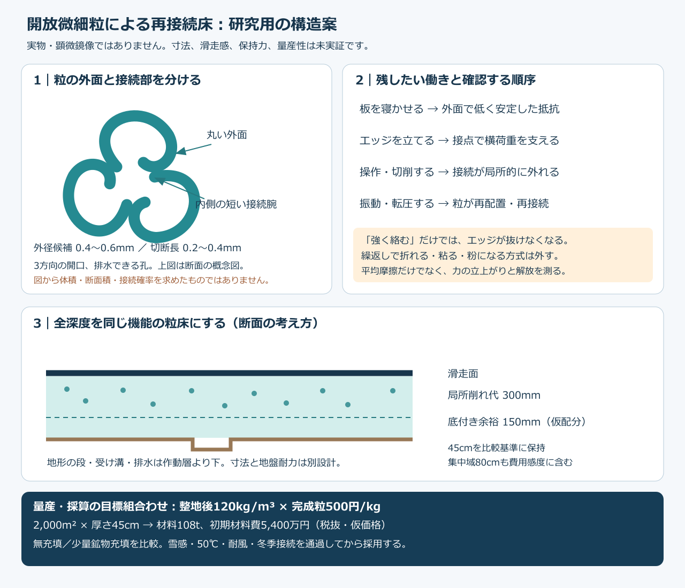

# 発明設計の次段階：開放微細粒の再接続構造と経済最適化

作成：Codex／2026-10-07（日本時間）。依頼者・Claudeへの受け渡し用本文。参照開始時のmainは 023bcc4ba0ea0e262537c0191f494bd988fd9f89。最新版のREADME・回覧板・正本v36・VT13・10月6日の原点監査を照合した。開始時点では、その原点監査以降の新しいコミットはなかった。

**今回の提案は、硬い鉱物砂を主役にする構造から、丸い外面と内側の再接続部を持つ、軽い開放微細粒へ開発の重点を移すこと。** 粒が壊れて粉になることで雪らしさを作らず、粒同士の接続が局所的に外れ、転圧で再びつながる構造を検討する。板との滑りと粒間の支持・解放を、同じ「摩擦係数」で済ませない。

実証された新素材という報告ではない。今回進めたのは、**粒の形状案、既存製造法との距離、単粒の力の桁、風と浮力の負担、維持更新込みの購入価格上限を一つの設計にまとめたこと**である。目標の全要件を満たすまで「完璧」「最適解確定」としない。

研究用の有力な目標組合わせは、整地後かさ密度120kg/m³、完成粒の配送・検査込み500円/kg、年間新品補充2%以下。ただし三つとも未測定・未見積りの開発目標であり、結果に合わせた合格認定ではない。2,000m²・厚さ45cmなら材料108t、初期材料費5,400万円。既存研究の収益・非材料費の仮定の下では、年間換算約1,611万円となる。施工や需要の確認前に、事業成立が確定したと扱わない。

## 1. 目的と制約を減らさずに進める

| 維持する条件 | 今回の扱い |
|---|---|
| 気温30℃以上、材料表面約50℃ | 溶融しないことだけでなく、荷重、滑走発熱、クリープ、停止再始動を判定 |
| 新雪を圧雪した滑走感 | 直進抵抗、貫入、横支持、エッジの解放、振動、繰返しを雪対照と比較 |
| 300mmの局所削れ代、全作動深度で機能 | 薄い表層にして安く見せない。45cmは従来の比較断面で、下部余裕15cmも未認定 |
| 30°の斜面、閉鎖時80m/sの保持 | 粒単体の流出、表層剥離、床全体の移動、地盤接続を別々に扱う |
| 敷設ネット・シート・ブラシ・ジオセル・剛性パッド等を使わない | 粒の接続と地形・排水を検討。隠した固定マットへ目的を置き換えない |
| 油・塩類・フッ素・シリコーン潤滑に依存しない | 原料・添加剤・再生原料も同じ基準。メーカーの「自己潤滑」という語だけでは適合判定しない |
| 冬に天然雪が定着し、自然地面より余分に融かさない | 雪―粒、粒―粒、粒―地盤と水の滞留を分ける。疎水性の樹脂だから合格とはしない |
| 4〜5時間ごとの保守、昼閉鎖約60分 | 再接続の待ち時間短縮を狙う。所要時間をゼロと仮定しない |
| 台風後の回収・復旧、10年の維持更新 | 粒の健全回収、加工再生、微粉、廃棄、場外流出を別会計 |

正本v36のR39・R40等を引き継ぐ。回覧板には、Claudeが記録した「溶けても再び結晶にできればよい」という検討枝もある。ただし、冬の界面に油や水を溜めず、50℃で使い、費用が成立する条件を同時に外したものではない。

VT11の集中域80cmは未校正ながら検討履歴に残っている。本報告の45cmを、新たに確定した施工厚と読み替えない。厚さ60／80cmの費用も第7章に示す。

## 2. 材料名ではなく、解決する働きで候補を選ぶ

| 枝 | 得られる可能性 | 今回の判断 |
|---|---|---|
| 寒水石＋PVA／析出接点 | 安価な骨格、粒間結合 | 砂状の対照として維持。既存の低摩擦・雪感を追認しない |
| 通常のPE・PP丸ペレット | 成形しやすい、鉱物より軽い | 量産と滑りの対照。転がり・斜面保持・雪の切れ方を自動的には解決しない |
| **丸い外面と内側の接続部を持つ開放微細粒** | 軽さ、粒の再配置、局所解放、再整地を形状で調整 | **今回の設計を進める枝**。滑り、湿潤保持、量産費の三つを優先判定 |
| 発泡PE／PP・発泡ガラス | 低密度、安価な既存発泡工程の可能性 | 比較枝。独立気泡の浮力、破砕、反発、表面摩耗、再接続の不足を評価 |
| 多孔PVA／セルロース | 水と接点を調整できる可能性 | 湿乾の粘着・寸法変化・寿命が未確認。前回提案を撤回せず比較を残す |
| パラフィン等を融かして再噴霧 | 形を再生成できる可能性 | 単価に加え、融液の回収、熱、冬の界面を閉じる必要。今回は先行しない |
| 磁性粒 | 再接続を磁力で調整 | 先行特許あり。材料費・重量・鋼エッジへの吸着等を別に解く必要。主案へ加算しない |

カネカの発泡PE、JSPの発泡PPは既存製品として存在する。ただし包装・緩衝等の資料は、スキーの刃で切削する床の耐久証拠ではない。[カネカ](https://www.kaneka.co.jp/business/qualityoflife/foa_001.html)、[JSP ARPRO](https://www.arpro.com/product/technical-resources)

## 3. 新構造：内側でつながる微細粒

### 3.1 粒の提案仕様

研究名を「開放微細粒の再接続床」とする。雪と同じ氷結晶を常温で作ったという意味ではなく、**空隙と接点を持つ雪の働きを、別の材料の構造で近づける案**である。

| 項目 | 最初に比較する範囲 | 理由・未確定事項 |
|---|---|---|
| 外径 | 0.4〜0.6mm | 以前の1mm・6mm粒へ戻さない。0.3mm以下は形状公差と微粉を別評価 |
| 軸方向長さ | 0.2〜0.4mm | 長い繊維にせず、再配置しやすい短い粒を狙う |
| 断面 | 3方向の開口・折返し腕を持つ一体断面 | 一つのC形だけでは鎖状に偏る恐れ。複数方向への接続を比較 |
| 外周 | 丸みのある連続面 | 板や皮膚に露出する鋭い返しを避ける設計意図。安全の証明ではない |
| 接続部 | 外周より内側の短い弾性腕・開口 | 接続して支え、局所変形で外れることを狙う。相互に入り込めるかは未確認 |
| 腕の厚さ | 20〜50µmを机上比較 | 厚さの三乗で力が変わるため、成形ばらつきを重視 |
| 空隙 | 水・空気の抜け道を持つ開放構造 | 閉じた気泡を軽量化の主手段にしない。水が自然に侵入・排出するかは別試験 |
| 材料 | HDPE等の成形可能なPEを基準、摺動性特殊PEを比較 | 無充填を先に、必要なら少量鉱物充填も比較。配合確定ではない |
| かさ密度 | 100／120／180／300kg/m³を比較 | **整地・繰返し後**の密度。袋の中でふわっとしている密度を使わない |

無充填の真密度960kg/m³でかさ密度120kg/m³なら、樹脂実体の体積率は12.5%、残り87.5%は空隙になる。外径0.6mmの円包絡と樹脂断面積0.07mm²を仮定すると、粒内の実体比率は約24.8%、包絡の充填率約50.5%でこの密度になる計算である。これは幾何の収支が矛盾しないことの確認であり、繰返し整地後もその空隙を保てる証拠ではない。

図は形状の考え方で、製造図面ではない。図の線から断面積・接続確率を計算していない。0.07mm²の樹脂断面積は製造速度を検討する独立の仮定であり、精密CADと形状収支が次に必要になる。

### 3.2 接続の狙い

1. 広い板下面には丸い外面が当たり、安定した抵抗で進む。
2. 粒同士は内側の腕・開口で接続して空隙を維持する。
3. エッジ付近で腕が弾性変形し、接点が順番に外れて粒が再配置する。
4. 整地の振動・軽い圧密で、新しい隣接粒と接続し直す。

この四段階が連続して起きるという**設計仮説**であり、実物で確認された挙動ではない。外側が滑りすぎると内部まで崩れ、接続が強すぎるとエッジが抜けない。弾性反発が強ければスポンジの感触になる。永久破断で粉を出すなら、この案の再生原理に反する。

三次元のフック付き粒が外部容器なしでつながり、解放・再使用できる研究例はある。ただし原論文の本体長は29mm、今回の0.6mmの約48倍。研究で示す「滑りからロックへの移行」は、スキーが求める解放と一致するとは限らない。小型化・成形費・雪感への適合は独立の開発課題である。[Liuら、2026、図1・要旨](https://pubmed.ncbi.nlm.nih.gov/41961926/)

## 4. 50℃での材料選びと接点力の設計

### 4.1 PEだから滑る、とはしない

三井化学のLUBMERには射出・押出可能な摺動性特殊PEがある。したがって、一般UHMWPEの加工上の制約をそのまま全PEへ適用せず、加工できる品種を比較できる。ただし掲載された摩擦試験は23℃、相手材S45C、速度30m/min等の条件。これは実ソール、50℃、2〜10m/sの試験ではない。[メーカーの製法・試験条件](https://jp.mitsuichemicals.com/en/special/uhmw-pe/features/lubmer/)

候補ごとに50℃の弾性率、降伏、4〜5時間のクリープ、疲労、屋外劣化を取得する。融点や室温の硬さだけで採用しない。摩耗粉を発生させずに寿命を延ばせるかを、完成粒と実際の板の組合せで測る。高価な摺動樹脂を全量使うか、安価なPEで足りるかはこの比較で決める。現時点で層間剥離のある二重被覆や、未知の添加剤を量産案へ固定しない。

### 4.2 接続腕の桁を計算した

矩形の片持ち梁へ単純化すると、先端力F、たわみδ、根元曲げ応力σは次式になる。

    F = E b t³ δ / (4 L³)
    σ = 6 F L / (b t²)

仮置き：50℃のE=300MPa、幅b=0.30mm、厚さt=0.030mm、長さL=0.15mm、変位δ=0.010mm。

結果は **F=1.8mN、σ=6MPa、δ/L≈0.067**。小たわみの一次評価であり、曲がった腕、接触摩擦、スナップ、切断縁、成形残留応力を含む完成粒の有限要素解析ではない。6MPaが可逆かどうかも未測定。

Eを100／300／800MPa、厚さを20／30／40／50µm、長さを0.12／0.15／0.20mm、変位を5／10／15µmとした108条件を計算した。各値は探索用の仮定で、製品物性の分布ではない。大たわみ側は小たわみ式の範囲外として印を付けた。厚さ2倍で力8倍、長さ2倍で力1/8になる関係も検算した。

実床の粘着力cや雪の横支持Sfへこの力を直接換算しない。接続した割合、向き、接点数、粒間摩擦、圧密履歴を同定しなければ、1.8mNから床の合否は決まらない。

## 5. 軽量化と台風保持を同時に解く

### 5.1 粒単体と床全体を分ける

80m/s、空気密度1.225kg/m³なら速度圧は3,920Pa。外径0.6mmの円投影、空力係数1を仮定した露出粒の空力荷重は約1.11mN。荷重倍率3の探索値では約3.33mNになる。

先の接続腕2本分の1.8×2=3.6mNはこの桁に近いが、**2本が同時に均等負担することや、80m/sに耐えることを証明していない**。疲労、濡れ、負圧変動、表面粒の接続欠落、転圧後の弱点を残す。

かさ密度180kg/m³、厚さ45cm、30°斜面では法線方向の自重は約688Pa。床全体の正味吸上げ係数を0.2／0.5／1と仮定すると、自重を引いた上向き荷重は約96／1,272／3,232Pa。係数は現地未測定で、屋根の係数を流用したものではない。

**粒同士がつながっても、軽い床全体の浮上は防げない。** 設計には地盤への荷重経路が必要である。敷設ネット等の禁止を迂回せず、作動層より下の地形の段・受け溝に同じ接続粒がかみ合う方式を検討する。受け溝があるだけで引抜き耐力があるとはしない。地盤の崩れ、排水、局所剥離の伝播を含む地盤設計・試験が成立しない場合、この粒床案はその場所では採用しない。

30°斜面の乾燥・飽和・完全融解後のせん断保持も別判定。上の風荷重計算を斜面安定計算の代用にはしない。

### 5.2 浮力を小さくする比較枝

PEの骨格真密度を960kg/m³と仮置きすると、空気を全て排出しても水より軽い。開放孔を設けるだけでは、この固体自体の浮力はなくならない。

方解石2,710kg/m³との理想的な質量混合では、真密度1,000／1,050／1,100kg/m³へ上げるために約6.2／13.3／19.7質量%の方解石を要する。式は次のとおり。

    1/ρ混合 = (1−w)/ρPE + w/ρ方解石

これは**骨格の密度**であり、粒床のかさ密度ではない。配合時の収縮・空隙を無視した計算である。無充填と約13〜20%充填を比較すれば、十分に濡れた状態の固体浮力を減らす方向は具体化できる。

ただし充填は、表面に鉱物が露出する摩耗、刃の傷、接続腕の疲労、成形詰まりを増やす可能性がある。完成品で比較し、密度だけを理由に採用しない。捕捉空気・表面張力・流水の抗力が残るため、真密度1,050でも流出しない保証ではない。

## 6. 製造費を決めるのは微細形状を残す速度

### 6.1 既存製法を使える範囲

MAAG/Galaは500〜600µmのPE微小ペレットを最大1.5t/hで製造する稼働例を掲載している。これは、サブミリPE粒の大量製造自体が空想ではないという根拠である。[メーカー資料](https://maag.com/wp-content/uploads/Micropellet_Gala_2S_EN_s.pdf)

**その速度は今回の内側接続部付き粒の製造能力ではない。** 水中切断では形状が丸まる可能性があり、開口が閉じれば発明の機能が失われる。主たる加工候補は、異形断面の微細押出→冷却して断面を固定→短く切断→検査・分級。乾式ストランド切断も既存工法だが、この寸法・形状を保てるかはメーカー確認が必要。[MAAG：乾式切断](https://maag.com/categories/dry-cut/)

3Dプリントは形状比較や治具の手段に留め、全量を1粒ずつ造形する費用モデルを採らない。1個を1回ずつ射出成形する前提にも置かない。

### 6.2 幾何から計算した生産量

仮置き：粒の樹脂断面積0.07mm²、切断長0.30mm、真密度960kg/m³、有効押出孔1,000、良品歩留り80%。

    粗生産kg/h = 孔数 × 送りm/s × 樹脂断面積m² × 真密度kg/m³ × 3,600
    良品kg/h = 粗生産 × 良品歩留り
    1本の必要切断頻度Hz = 送り速度 / 切断長

| 送り速度 | 良品生産量 | 1本の切断頻度 | 加工費（ライン1.5万円/hを仮置き） |
|---|---:|---:|---:|
| 0.05m/s | 9.68kg/h | 167Hz | 約1,550円/kg |
| 0.10m/s | 19.35kg/h | 333Hz | 約775円/kg |
| 0.50m/s | 96.77kg/h | 1,667Hz | 約155円/kg |

孔数は実在の専用金型の保証値ではない。切断頻度は刃が横断する回数で、モーター回転数と同じではない。表には成形停止を含まないため、実際の平均良品量は低くなり得る。複雑な断面の1,000孔金型、切断縁、寸法ばらつき、詰まり、歩留りを確認する。

上の粒質量は約0.020mg。162tなら約8.04兆個に相当する。粒数が大きいため、製造公差・欠損検査と一括工程が本質的である。0.10m/sなら162tの良品生産だけで約8,371時間、0.50m/sなら約1,674時間。型製作・立上げ・休日・保守は別である。

### 6.3 500円/kgへ入れる製造条件

以下は**見積りではなく、メーカー照会時の採算条件**である。

    完成粒単価 = 原料単価/歩留り + ライン時間費/良品kg/h + 物流・検査等

ライン1.5万円/h、歩留り80%、物流・検査50円/kgと仮置きする。この時間費が設備・金型償却、労務、エネルギー、保守を含むかは見積りで照合する。未回収スクラップ代を控除していない。

| 原料単価の仮定 | 完成粒500円/kgのために必要な平均良品量 |
|---|---:|
| 200円/kg | 75kg/h以上 |
| 300円/kg | 200kg/h以上 |
| 600円/kg | 原料費だけで枠を超えるため、この配分では到達しない |

これらは原料の市場価格を調査して確認した数字ではない。特殊PEを使うなら原料費上昇があり得るため、まず無充填HDPE等の低費用候補と実滑走抵抗を比較する。高価な品種を使わずに目標を満たせることが最大の原価改善になる。原料300円/kg、上記0.50m/sの例なら完成粒は約580円/kgで、500円目標は超えるが第7章の密度120・補充2%の上限658円/kgには入る。設備・土木の追加費によってこの余裕は消える。

### 6.4 高価な接続粒だけを必要量使う場合

後段の費用削減枝として、簡易な開放粒Bと接続腕付き粒Cを混ぜる方法も比較できる。例えば完成B=300円/kg、C=1,000円/kgという仮価格で混合平均500円/kgにするには、Cの質量割合は約28.6%以下になる。式は P混合=(1−f)P_B+fP_C。混合・選別・追加検査費は別途加える。

ただし、これを必要接続粒率としない。床をつなぐのに必要な割合f_minを実験・形状を校正した模型で求め、費用からの上限以下に入るかを確認する。従来VTの「柔らかい粒20%」という未校正の規則も流用しない。粒数割合と質量割合、粒の密度、雨や整地による分級を分ける。Bが転がる丸玉へ戻ったり、混ぜると保持が失われたりするなら採用しない。まず同一形状床の原理を確認し、混合による費用削減はその後とする。

## 7. 10年間の採算から価格上限を逆算する

### 7.1 比較条件と会計範囲

従来の正本の2,000m²・厚さ45cm・10年・割引率8%を比較基準にする。営業100日、100人/日、1人当たり料金3,500円−変動費1,000円、固定費600万円から、年間収益枠B=1,900万円とする。需要・料金はいずれも未検証。

非材料初期費I=2,000万円、追加年額O=400万円も、以前からの仮置き。**土地、造成、排水、地盤保持、設備、設計、許認可、研究、処分、休業等の実費がこの枠に収まると確認した値ではない。** 費用が追加されればIまたはOへ足す。固定費600万円とOの重複・漏れも見積りで照合する。今回は税抜基準を統一し、融資費・残存価値・税務処理を別とする。

Af=(1−1.08⁻¹⁰)/0.08=6.710081。M=A h ρ。

    年間換算費 = (I + M P)/Af + O + λ M P
    購入価格上限Pmax = {(B−O)Af−I}/{M(1+λAf)}

λは年間新品購入補充率であり、環境へ流してよい割合ではない。回収粒を何度も戻す回数でもない。内部回収の量を新規購入費から二重に引かない。

### 7.2 完成粒の上限単価（税抜円/kg）

| 整地後かさ密度kg/m³ | 2,000m²での材料t | 年補充2% | 年補充5% | 年補充10% |
|---|---:|---:|---:|---:|
| 100 | 90.0 | 790 | 671 | 536 |
| 120 | 108.0 | 658 | 559 | 447 |
| 180 | 162.0 | 439 | 373 | 298 |
| 300 | 270.0 | 263 | 224 | 179 |
| 1,674 | 1506.6 | 47 | 40 | 32 |

1,674kg/m³・補充10%では、以前の上限32.0357円/kgが再現できた。密度を下げると、同じ体積を用意するのに使えるkg単価は上がる。ただし軽さのために保持・回収設備が高くなれば、この改善を相殺する。

密度120・500円/kg・補充2%の例では、初期材料5,400万円、非材料を含む初期7,400万円、年補充108万円、年間換算約1,611万円。収益枠との差は年約289万円しかなく、未計上費や客数低下への余裕は大きくない。これは投資推奨や実見積りではなく、設計を絞る条件付き算術である。

### 7.3 厚さを増す場合

同じ密度120・単価500・補充2%、全域を同じ厚さとした場合。

| 厚さ | 材料量 | 初期材料費 | 年間換算（I・Oは同じ仮定） |
|---|---:|---:|---:|
| 45cm | 108t | 5,400万円 | 約1,611万円 |
| 60cm | 144t | 7,200万円 | 約1,915万円 |
| 80cm | 192t | 9,600万円 | 約2,321万円 |

集中部分だけ厚くするなら区画ごとのA×h×ρを足す。厚さは採算を合わせるために減らさず、必要な削れ代と底付きを満たす実測から決める。80cm必要なら、低密度・安価・高寿命だけでなく客数・面積を含む事業条件も見直す。

### 7.4 2億円の整地設備と、材料費は別

以前の設備上限1.98億円（税込）は1.8億円（税抜）に相当する。これだけの年金換算は約2,683万円/年で、**2,000m²モデルの収益枠1,900万円を単独で超える**。小規模の初期導入では既存機・委託・小型試験機を比較し、1km用のレール設備をそのまま入れない。

1km×20m=20,000m²へ拡張すると、45cm・密度100・単価600円/kgでも材料5.4億円（税抜）。設備1.8億円を加えると7.2億円（税抜）、さらに土木等が必要。これは高額設備案へ戻す提案ではなく、**長いコース全体を厚い材料で埋める数量を隠さないための表示**である。2,000m²の需要を10倍して売上を作らない。

最も大きい費用削減は、必要機能を保った低い完成かさ密度、原料より形状加工の高速化、粒を壊さない再整地による新品補充抑制、既存地形・排水・機械の活用である。面積を段階的に増やすと初期投資は減るが、1m²の性能や原価が改善したとは数えない。

### 7.5 非材料費が上がった場合の価格上限

密度120・年補充2%・45cmを保ち、IとOを変えた9条件も計算した。代表例は以下。

| 非材料初期費I | 追加年額O | 材料の上限単価 |
|---|---:|---:|
| 2,000万円 | 400万円/年 | 約658円/kg |
| 5,000万円 | 400万円/年 | 約414円/kg |
| 2,000万円 | 800万円/年 | 約439円/kg |
| 5,000万円 | 800万円/年 | 約194円/kg |

目標の500円/kg・120kg/m³・補充2%を採る場合、O=400万円/年、B=1,900万円/年のままなら非材料初期費の上限は約3,940万円となる。既存の地形・排水・機械を活用する経済効果は、この枠と実際の地盤・排水設計費の比較で判定する。表の枠へ合わせるために必要工事を省略しない。需要が変わればBも入れ替える。計算上の価格上限が負になる条件は、材料を無料にしてもその費用配分では収益枠に入らないという意味である。

## 8. 雨後復旧と冬季接続を設計へ入れる

### 8.1 軽い粒でも、運ぶ体積は減らない

20,000m²・45cmの床は9,000m³。1%が山麓等へ移動すると90m³。実効40m³/hという未検証の処理量を置いても、取扱いだけで2.25時間かかる。経路移動、選別、再敷設、接続の品質確認は別。2,000m²なら同じ割合で9m³、13.5分だが、同様に全復旧時間ではない。

計算では0.1／1／5%移動、20／40／80m³/h、2面積の18条件を比較した。質量の例は密度180を使う。回収設備が体積で詰まる場合、密度を下げた分だけ時間も短くなるとは限らない。山麓まで落ちてから全量を上げるより、斜面外の近傍で捕捉し、管理道から戻す配置を比較する。

雨量100mm/hが鉛直に降る場合、30°の斜面実面積2,000／20,000m²への水量は約173／1,732m³/h。上流からの流入や風による吹込みは含めていない。小さい回収槽だけで全量を受けられると仮定しない。敷設ネットを使わず、排水先の設備内で健全粒と微粉を段階的に回収する方式は検討できるが、目詰まり、越流、下流排出を現地設計する必要がある。

密度180の例で1%移動量を99.9%回収しても、2,000m²で1.62kg、20,000m²で16.2kgが残る。これは許容値ではなく、99.9%という見かけの高い率でも「流亡なし」にならないことを示す。摩耗粉と材料収支を独立に測り、場外流出を補充費で隠さない。

### 8.2 冬の雪に接続する孔と、水を溜めない孔は同時に検証する

開放した形なら雪や氷が粒の間・開口へ入り、幾何的にかみ合う可能性がある。一方、疎水的な微細孔は水が入りにくいこともある。接触角110°を**仮定**した円筒孔の入口圧の桁は、半径25／50／100µmで約1,970／985／493Pa、水頭約20／10／5cm。

    入口圧Δp ≈ −2γ cosθ / r

γ=0.072N/m。実際の粒は円筒孔でなく、濡れの履歴も異なる。これは「孔があるから自動的に水が通り、雪が固着する」という推論を止める確認であり、透水係数の予測ではない。

50℃乾燥・雨後・凍結融解の各状態で、粒床内の排水、孔の濡れ、捕捉空気、界面せん断を比較する。油を使わなくても平滑な樹脂面が滑り面になる可能性は残る。雪が素材へ付くことと、積雪内部の安定性は別である。冬の保冷効果は、現地自然地面との同条件熱収支で確認するまで利益へ算入しない。

### 8.3 60分整備への接続

以前の1km・1台案の仮定（0.6m/s、実効75%、諸工程12分、回復待ち10分）なら計算上約59分。新粒が機械接続で回復できれば乾燥・炭酸化待ちを減らせる可能性があるが、今回は実回復時間を計測していない。振動の強さを上げれば接続が進むとも決まらず、逆に外れる・沈みすぎる・腕が折れる可能性を調べる。

同じ体積を運ぶ前刃容量、ローラー荷重、仕上げスカートの抵抗を新粒へ合わせて再計算する。通常整備と豪雨による大量復旧を同じ60分で保証しない。

## 9. 発明としての差分と先行技術

特許記載は、実物の性能証明や現在の権利状態の判定ではない。今回の初期調査で次の先例を確認した。

| 資料 | 重なる内容 | 今回の扱い |
|---|---|---|
| [US3731923A](https://patents.google.com/patent/US3731923A/en) | 人工芝内へプラスチック粒を保持 | 樹脂粒だけを新規発明と言わない。今回の禁止される敷設構造とは区別 |
| [WO2007003067A1](https://patents.google.com/patent/WO2007003067A1/en) | 樹脂粒と固体潤滑材等による人工雪 | 潤滑材の選択と既存の樹脂粒案を照合。油分等の制約を迂回しない |
| [EP2889353B1](https://data.epo.org/publication-server/rest/v1.2/patents/EP2889353NWB1/document.pdf) | 磁性粒による集合と分散を用いた常温人工雪 | 磁力による再接続も先例あり。新規性とスキー性能を主張しない |
| [Liuら2026](https://pubmed.ncbi.nlm.nih.gov/41961926/) | フック付き粒の可逆接続と再使用 | 機械的接続原理の先例。小型化しただけで特許性があるとはしない |

検証すべき差分は、「0.4〜0.6mm級」「外面より内側の接続部」「板の滑りと横方向の支持・解放の両立」「50℃・湿乾・冬季接続」「連続成形できる断面」「粒を壊さない整地と質量回収」の組合せである。これが新規・進歩的・非侵害かは未判定。公開保存の指定に従っているため、出願前に公開された内容として扱う。ここでは法的な出願可能性を断定しない。

## 10. 次の開発を具体化する仕様

物理試験は未実施。見積り依頼や発注も送っていない。まず既存データと計算で形状を絞り、測らなければ決まらない点へ試作費を集中する。

### 10.1 形状・材料の比較セット

- 形状A：同じ材料の丸ペレット。滑りと量産費の対照。
- 形状B：接続腕を持たない開放粒。空隙・軽量化そのものの効果を分離。
- 形状C：内側の接続腕を持つ提案粒。接続機能の有無だけを比較できる形にする。
- 材料：無充填HDPE等と摺動性特殊PEを比較。浮力が支配的なら約13〜20%鉱物充填も追加する。
- 雪の対照：目標に合う新雪圧雪。既存HBG-5／HBG-6・裸の寒水石も、前回監査との比較を保つ。

必要な量は、まず寸法検査・接続・摩擦を行える小試料から決める。単純な試片で失格した組合せを大量粒へ進めない。初回の滑りが良いだけでコース面積を増やさない。

### 10.2 次に埋める入力と判定順

| 優先 | 具体的な出力 | 採否を変える理由 |
|---|---|---|
| 1 | 精密CAD、真の断面積、開口・腕の公差、3次元で二粒が接続・解放する経路 | 図だけで相互接続できると決めない。粉砕を伴わず外れること |
| 2 | 50℃の材料曲線を用いた接触・大変形解析、製法の実現性と平均良品kg/h | 今回の梁模型では扱えないスナップ・切断縁・クリープを含める |
| 3 | 実ソール、乾燥・湿潤・乾燥途中、停止と2／5／10m/sの抵抗波形 | μを任意に小さく設定するVT13型の成功判定を繰り返さない |
| 4 | 圧密後密度、横力の立上がり・ピーク・解放、粒の損傷と再接続時間 | 砂、スポンジ、粘着床との違いを雪対照で判定 |
| 5 | 雨・風・30°・凍結融解の局所保持と全層保持、地盤への荷重経路 | 裸粒が飛ぶ問題を平均密度や接点力で隠さない |
| 6 | 冬の界面せん断・排水・追加融雪、人体・用具・環境評価 | 低摩擦と冬季定着を同じ疎水性で説明しない |
| 7 | 連続成形の良品量、原料・成形・検査・輸送・処分を含む見積り | 500円/kg目標と価格上限表へ実値を入れて判断 |

単粒試験の合格を床全体へ外挿しない。人を乗せる前に無人試験で、皮膚・衣服への絡み、傷、発熱、粉塵・溶出・流出を判定する。食品接触に適合する原料でも、この利用条件の安全証明にはならない。

## 11. Claudeへ依頼する独立検証

1. 本文の制約継承を確認する。削れ代300mm、ネット等禁止、50℃、冬季自然地面対照、昼60分を費用都合で下げていないか。
2. 三方向開口の形で接続と解放の経路が本当に存在するか、CADで反証する。接続確率や摩擦を成功値に置かない。
3. 片持ち梁108条件と、80m/sの粒単体・全層の荷重を独立計算する。接点力をcやSfに直接置換しない。
4. 真密度と完成かさ密度、捕捉空気、鉱物充填13〜20%の副作用を区別する。
5. 500円/kgの量産目標を、原料・平均良品kg/h・歩留り・物流・金型から検証する。通常の微小ペレット1.5t/hを異形粒へ転用しない。
6. 2,000m²と20,000m²、税抜と税込、設備と材料、年補充と場外流出を混同せず、同じ式でPmaxを再計算する。45／60／80cmの違いも保持する。
7. 既存案より優れる点と不足点、どの追加入力で採否が変わるかを、出典・計算を添えてGitHubへ返す。今回の案を完成品として正本へ昇格させない。

## 12. 再現方法・確認範囲・保存物

- [入力](発明設計_開放微細粒_20261007/inputs.json)、[計算コード](発明設計_開放微細粒_20261007/calculate.py)、[全結果](発明設計_開放微細粒_20261007/results.json)
- [構造図SVG](発明設計_開放微細粒_20261007/構造案.svg)、[PNG](発明設計_開放微細粒_20261007/構造案.png)、[検算記録](発明設計_開放微細粒_20261007/validation.json)
- 実行：同じフォルダで python calculate.py。Python標準ライブラリのみ。乱数を使わないため、回数を増やして実証確率を作る計算ではない。

確認した範囲は梁の一次評価108条件、費用60条件、価格上限15条件、回収体積18条件等。Pmaxの逆算を15条件で独立に代入検算し、旧条件32.0357円/kgも再現した。有限要素解析・DEM・物理試験・メーカー見積りは未実施。図は目視確認した構想図で、設計承認図面ではない。

**今回の前進は、材料性能をまだ保証しないまま設備だけを進める流れから、粒の構造・保持・量産・採算が同時に成立する領域を探す設計へ移したこと。** 機械的な再接続で寿命を延ばし、低密度と高速成形で体積当たり費用を下げるという、次に検証できる発明案まで具体化した。
