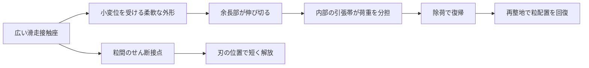

# H69：成形する力と、滑走中に支える力を分ける

未試作の構造候補。これ自体を温暖噴霧による雪状結晶の発明完了とは扱わない。温暖噴霧のH68-A、内部結晶のH68-B、機械粒の対照を残す。

## 候補の切り分け

| 候補 | 使う物理 | 今巡の判断 |
|---|---|---|
| H69-C 結晶化する復帰材 | 引張りで結晶を形成し、き裂抵抗を増やす | S1/S2で55℃の根拠がある。ただし大きな伸長と温度依存があり、粒全体の第一候補にはしない。内部の長寿命な復帰部として比較する |
| H69-F 収縮差で成形 | 平面の硬軟配置から工場で立体形を作る | S3/S4の機構が候補。乾燥成形の成功と使用中の力学・雨耐久を分ける |
| H69-P 遅れて働く支持 | 小変形では余長を残し、所定の変位で引張帯が働く | 前巡の二段支持仕様に対する新しい幾何候補。模型の二点一致を実測としない |
| H69-M 予成形の対照 | 成形金型・熱成形等で同じ外形を作る | 多段の化学成形より安く同じ機能が出るならこちらを優先。現地加熱は不要とするが、工場条件は未確定 |

H69-Fを使う場合でも、成形収縮がH69-Pの帯をすべて引き伸ばしてしまうと、初めから硬くなる。外形を作る硬部/形状保持部と、余長を持つ支持帯を別領域に配置する。形状が固定できた後に残留張力を緩める工程、あるいは支持帯を最後に形成する工程を比較する。2つの工程を設ければ加工回数・歩留まり・界面損傷が増えるため、その追加費を無料にしない。

## 観察用の具体寸法候補

セル外形幅500µm、高さ577.35µm。中央の支持部の両端間隔200µm、半帯の自然長109.25µm、上下可動範囲は仮に86.60µm。帯に持たせる自然長の余りは全長で18.50µm。出発時の直線配置にこの長さを押し込めるのではなく、湾曲/波形の余長部として収納する。摩擦による折れ癖、層同士の貼付きがないことが必要。

係数20MPaを仮の要求値とした場合、並列帯の合計断面は4527µm²。例えば80µm幅の3本へ分けると厚さ約18.86µmに相当する。これは寸法の配分例で、20MPaを50℃乾湿疲労後に保つ材料を発見した意味ではない。400µm幅内に3本と2個の80µm開口を配置する例なら、周囲500µm幅に枠の余地を残せるが、枠・中央座の断面と座屈は別途設計が必要。

1.35MPaの参考膜では必要断面が約14.8倍になるため、同じ3本配置を薄く保てない。単に実験論文の柔らかい膜を縮小すればよい、という案は採らない。

図は機能分担であり、力が伝わる全経路を解いた有限要素モデルではない。45µmより小さい変位の力を外形が分担すると、[支持模型](model.md)の逆算値は再調整が必要。単粒の上下応答だけではエッジ支持を証明できず、第66巡の方向別接続・再整地の課題も残る。

## 成形と運用の分離

工場成形では、平面膜の処理面積・液の交換・乾燥・打抜き・余長の検査を算入する。現地では溶媒、未反応モノマー、強酸、塩、油等を散布しない。化学成形の残留物や破片を含む完成材を評価する。元材料に使ったPTFEスペーサなどの製造用部材と、コースへ敷く成分を区別し、持ち越しは分析で確認する。

通常の昼60分の整地では支持帯を化学再成形するのではなく、配材・機械接点の復帰・損傷粒の少量交換を検討する。これは60分復旧の実証ではない。雨後に余長や係数が変わっていれば、粒を山頂側へ戻しても支持曲線は戻らない。粒径・密度・厚さを揃えた後、力学と滑りを測り直す。

冬は開口・粒間空隙が雪を受け入れ、水を抜く構造を保持する。膜を全面につなぐ防水シートや固定マットへ置き換えない。残留物による融雪、氷膜、層間すべり、熱伝導の変化を自然地盤対照で確認する。450mm床の300mm削れ後にも同じ素材機能が残り、その下のR39保持層が露出しない設計を継承する。

## 採用を止める具体的な反例

- 50℃の保持で力が減り、長さをロックしても復帰しない。
- 吸水・乾燥で自然長が変わり、最初から硬くなる、または支持開始が遅れすぎる。
- 波形帯が濡れて貼り付き、始動だけ大きな力が必要になる。
- 小粒化の切断端から膜が裂け、微粉・薄片になる。
- 滑走座を硬くして摩擦だけ下げると、刃が入らない、騒音やソール損傷が増える。
- 形は戻るが力曲線・接点方向・排水が戻らない。

失敗した項目だけを対策し、結晶化度や形状精度の数字で帳消しにしない。温暖噴霧で実際の雪状結晶を得る枝も、この構造案の成否とは別に評価を続ける。
