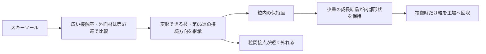
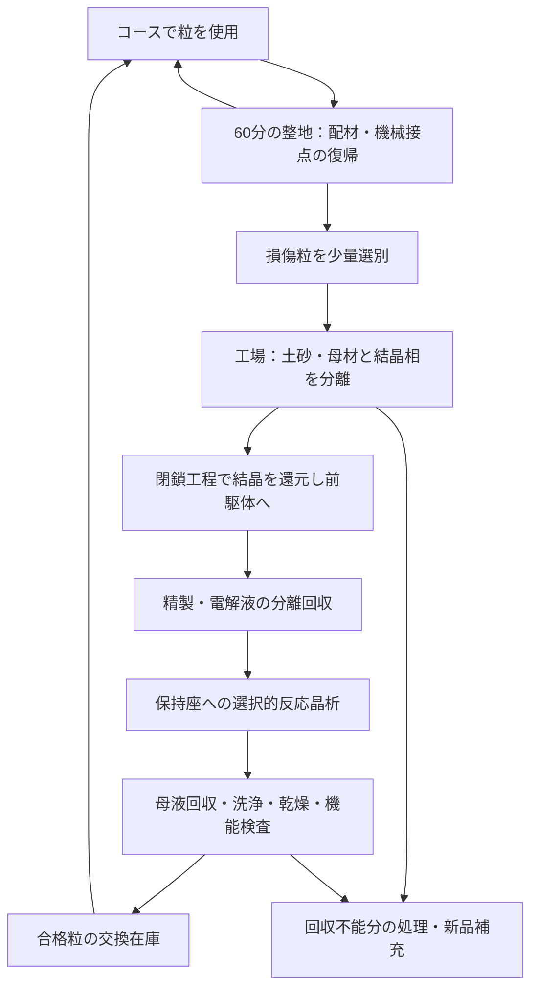

# H68：温暖反応晶析を、雪状の構造と循環へつなぐ

これは未試作の設計仮説。特許の新規性・製造可能性・雪同等の性能を認定した発明ではない。

## 構造の狙い

雪らしさを判定する単位は六角形の1個の粒ではなく、空隙の多い粒群が荷重を支え、刃の進入で短く解放し、圧密で再び支持を作る過程である。H68は、結晶を裸の粉として敷く案と、柔らかい粒の内部に少量の結晶を成長させる案を比較する。

### H68-A：温暖噴霧反応晶析（独立の探索枝）

水に溶けるシステインから難溶性のシスチンを作る。前駆体が溶けるため、難溶性シスチンそのものを高濃度に溶かす制約を回避できる。これは冷却以外の結晶形成の切り口である。

ただし、暖かい溶液中で結晶ができる証拠と、噴霧中に乾いた枝状粒ができる証拠は別。液滴の酸素供給、滞留時間、蒸発冷却、乾燥の殻化、凝集、回収率、微細粉の発生を測る必要がある。瞬時に六角形を得ても、厚板へ育つ・互いに接続しない・ソールに引っ掛かるなら目的に不適合。

次の設計分岐は『供給濃度を上げる』だけでなく、薄い液膜を種晶に供給して余剰液を回収する方法と、閉鎖された暖気中の噴霧を比較すること。前者は現地噴霧製造の達成ではない。高濃度の供給能力を酸素収支で評価し、速度と晶癖は未測定のまま残す。

### H68-B：粒内の保持座で結晶を育てる

候補粒の外側は、空隙を確保する柔軟な枝と広い接触座。内側に、結晶の成長を受け止める小さい保持座を設ける。結晶は座の中で母材に引張りを与え、粒の支持形状を保持する役割を狙う。刃が来るたびに結晶を粉砕する仕組みにはせず、粒間の機械接点が短く解放する。局所結晶が損傷した粒を選別して工場へ戻す。

図は機能配置であり、応力解析済みの構造図ではない。結晶とネットの成長による張力はS1から得た着想。乾いた母材で同じ効果が出る証拠はない。シスチンの板状結晶にチロシンの棒形状・弾性率を移さない。

- **B-T：チロシンを成長させた網**。S1の作用を切り分ける機構対照。水分依存と再生不能の問題があるため、全コース材の第一候補にはしない。
- **B-C：シスチンを保持座で成長させた粒**。酸化還元による供給・回収を使う候補。まず『座から抜けない』『乾いても支持形状が残る』を確認する。シスチンだから低摩擦・安全という推定はしない。
- **B-M：結晶を使わない同形状の粒**。既存の機械接点を比較対照にする。結晶を加えて寿命・重量・費用が悪化するならB-Mを優先する。

観察用には保持座を拡大した試片を使うが、その成功を450 µm級の粒の量産成功へ換算しない。小粒化は別試験。保持網の隙間を小さくしても、破壊時に生じるさらに小さい粉まで捕集できるとは限らない。開放排水と破片保持を同時に測る。粒全体を地面へ固定するマット案へ置き換えない。

### H68-C：化学原料を回収して形を作り直す

S4から、回収した難溶性シスチンを全部いったん純水に溶かす必要のない還元工程が候補になる。S3の酸化と組み合わせる発想は未実証。両研究の電解液・触媒・不純物の条件は異なり、直接配管でつなげば完成するものではない。

酸処理槽へ母材ごと投入する前提は置かない。母材の耐薬品性、結晶だけを取り出す方法、洗浄による寸法変化・種晶脱落は未解決。ここが解けなければ『内部結晶を育てるB』と『原料再生C』は融合できず、独立候補に戻す。

## 雪の目的に戻して採否を決める

| 要求 | H68が改善し得る点 | 残る反証・失敗した場合の分岐 |
|---|---|---|
| 50℃の乾いた滑走 | 外面と内部支持を分けられる | 結晶面・保持座がソールを引っかくなら結晶を外面へ出さない。第67巡のソール対試験は省略しない |
| 雪のような刃の切れ | 機械解放部の位置を制御し、結晶粉砕を毎回要求しない | 母材がゴム状に長く引きずるなら不適合。内部材を増やす前に機械対照へ戻る |
| 再整地 | 化学反応待ちを通常の昼整地から外せる | 交換・配材・確認が60分に入らなければ必要在庫か設備を再計算 |
| 雨・台風 | 生きた粒と損傷粒を分け、化学再生は回収施設内 | 砂・有機物で座や反応装置が詰まる。山麓の粒を上げるだけでは合格にしない |
| 冬の雪の定着 | 開放空隙と無油の形状を保つ | 残留電解質による融雪、氷膜・水溜まり、層間すべりを対照雪床で測る |
| 人体・環境 | 外面への裸の微結晶を減らす余地 | 化学同定・粒径別摩耗量・吸入/皮膚/溶出の評価は未実施。アミノ酸名だけで安全としない |
| 経済性 | 少量結晶相だけを再生する余地 | 検査・選別・母材分離・在庫が支配すると専用工場は不利。共用・委託・新品と比較 |

450 mmの使用床・300 mmの削れ代・その下のR39保持層は維持する。浅い表面だけ合格させて全層を雪相当としない。2億円枠は整地設備等の従来範囲のまま、化学設備の価格は未見積。
